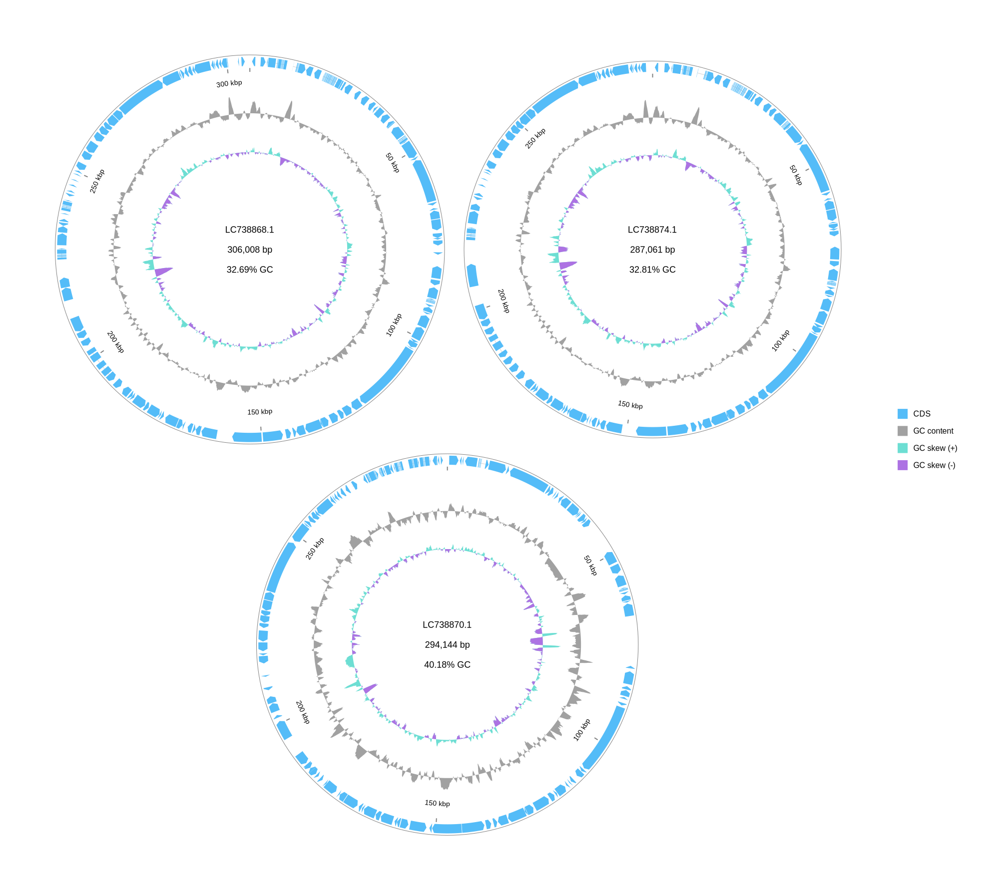
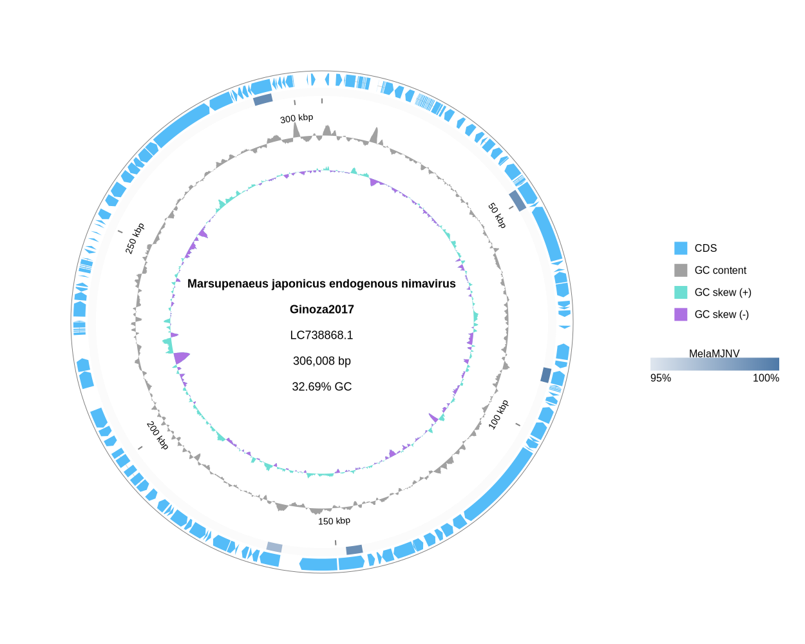
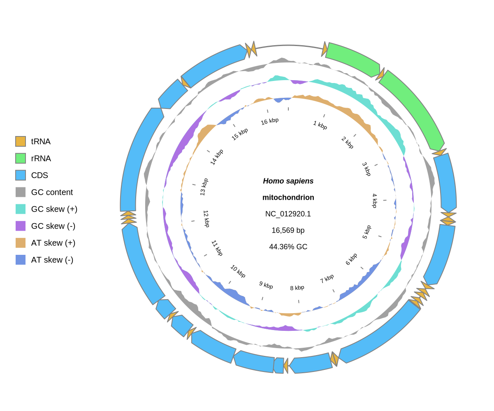

[Home](../DOCS.md) | [Installation](../INSTALL.md) | [Quickstart](../QUICKSTART.md) | [Tutorials](./TUTORIALS.md) | [Recipes](../RECIPES.md) | [CLI Reference](../CLI_Reference.md) | [Gallery](../GALLERY.md) | [FAQ](../FAQ.md) | [About](../ABOUT.md)

[< Back to the guide index](./TUTORIALS.md)
[< Previous: Draw protein matches from CDS features](./4_Protein_Comparisons.md) | [Next: Plot read depth and numeric tracks >](./6_Depth_Quantitative_Tracks.md)

# Use TSV manifests for CLI inputs

Use TSV manifests when each input row needs its own path, label, selector, crop, or orientation.

Save tables as UTF-8 with real tab characters. Files with or without a UTF-8 byte order mark (BOM) are accepted. Relative paths resolve against the table file, not against the shell's current directory.

## 1. Prepare example GenBank files

```bash
wget "https://eutils.ncbi.nlm.nih.gov/entrez/eutils/efetch.fcgi?db=nuccore&id=LC738868.1&rettype=gbwithparts&retmode=text" -O MjeNMV.gb
wget "https://eutils.ncbi.nlm.nih.gov/entrez/eutils/efetch.fcgi?db=nuccore&id=LC738874.1&rettype=gbwithparts&retmode=text" -O MelaMJNV.gb
wget "https://eutils.ncbi.nlm.nih.gov/entrez/eutils/efetch.fcgi?db=nuccore&id=LC738870.1&rettype=gbwithparts&retmode=text" -O PemoMJNVA.gb
wget "https://eutils.ncbi.nlm.nih.gov/entrez/eutils/efetch.fcgi?db=nuccore&id=NC_012920.1&rettype=gbwithparts&retmode=text" -O HmmtDNA.gbk
```

In a source checkout, the majanivirus files are also available under `examples/`, and `HmmtDNA.gbk` is available under `tests/test_inputs/`.

## 2. Linear `--records_table` for GenBank rows

Create `linear_records.tsv`:

```tsv
gbk	record_label	record_subtitle	record_id	region	reverse_complement	order
MjeNMV.gb	Marsupenaeus japonicus endogenous nimavirus	Ginoza2017	LC738868.1		0	1
MelaMJNV.gb	Melicertus latisulcatus majanivirus	Okinawa2016	LC738874.1	1-160000	0	2
PemoMJNVA.gb	Penaeus monodon majanivirus A	Mikawa2016	LC738870.1	1-160000	1	3
```

Then run:

```bash
gbdraw linear \
  --records_table linear_records.tsv \
  -o majani_records_table \
  -f svg
```

This writes `majani_records_table.svg`.


`--records_table` replaces `--gbk`, `--gff`, and `--fasta`. In linear mode, put per-record labels, subtitles, selectors, crops, and orientation in the table instead of combining `--records_table` with `--record_label`, `--record_subtitle`, `--record_id`, `--region`, or `--reverse_complement`.

Each `region` cell is scoped to its own row. Use only coordinates such as `1000-9000`, `1000..9000`, or `1000-9000:rc`; do not prefix them with a record ID, `#` index, or file selector. When `order` is present, explicit positive integers sort first in numeric order. Blank `order` cells follow and preserve their table row order; equal explicit values also preserve table row order.

## 3. Linear `--records_table` for GFF3 + FASTA rows

Create a small pair of GFF3 + FASTA inputs:

```bash
cat > toy_a.fna <<'EOF'
>toyA
ATGAAACCCGGGTTTAAATTTCCCGGGAAATTTCCCGGGAAATTTCCCGGGAAATTTCCCGGGAAATTTCCCGGGAAATTTCCCTAA
EOF

cat > toy_a.gff3 <<'EOF'
##gff-version 3
toyA	gbdraw	CDS	1	87	.	+	0	ID=toyA_cds1;product=toy protein A
EOF

cat > toy_b.fna <<'EOF'
>toyB
ATGAAACCCGGGTTTAAATTTCCCGGGAAATTTCCCGGGAAATTTCCCGGGAAATTTCCCGGGAAATTTCCCGGGAAATTTCCCTAA
EOF

cat > toy_b.gff3 <<'EOF'
##gff-version 3
toyB	gbdraw	CDS	1	87	.	+	0	ID=toyB_cds1;product=toy protein B
EOF
```

Create `gff_records.tsv`:

```tsv
gff	fasta	record_label	record_id	region	reverse_complement	order
toy_a.gff3	toy_a.fna	Toy A	toyA		0	1
toy_b.gff3	toy_b.fna	Toy B	toyB	1-87	0	2
```

```bash
gbdraw linear \
  --records_table gff_records.tsv \
  -o toy_gff_records_table \
  -f svg
```

This writes `toy_gff_records_table.svg`.

A table must use either all GenBank rows or all GFF3/FASTA rows. Do not mix `gbk` with `gff`/`fasta` in the same table.

## 4. Circular multi-record placement

The majanivirus records are annotated as linear. Sections 4 and 5 intentionally reuse them to keep the setup compact, so gbdraw prints a topology warning when drawing the circular examples.

Create `circular_records.tsv`:

```tsv
gbk	record_id	order	row	column
MjeNMV.gb	LC738868.1	1	1	1
MelaMJNV.gb	LC738874.1	2	1	2
PemoMJNVA.gb	LC738870.1	3	2	1
```

```bash
gbdraw circular \
  --records_table circular_records.tsv \
  --multi_record_canvas \
  --multi_record_size_mode auto \
  -o majani_circular_grid \
  -f svg
```

This writes `majani_circular_grid.svg`.



When a records table provides `row` and `column`, do not also use `--multi_record_position`.

## 5. Circular BLAST similarity rings with `--conservation_table`

Use the precomputed BLAST outfmt 7 table maintained in `examples/`. From a source checkout, copy it into the tutorial working directory:

```bash
cp examples/MjeNMV.MelaMJNV.tblastx.out .
```

You can also download [the same existing BLAST table](../../examples/MjeNMV.MelaMJNV.tblastx.out) directly.

Create `conservation.tsv`:

```tsv
blast	label	color
MjeNMV.MelaMJNV.tblastx.out	MelaMJNV	#4E79A7
```

Use the table like this:

```bash
gbdraw circular \
  --gbk MjeNMV.gb \
  --conservation_table conservation.tsv \
  --conservation_reference query \
  --identity 95 \
  --alignment_length 1000 \
  -o MjeNMV_conservation_table \
  -f svg
```

This writes `MjeNMV_conservation_table.svg`.



The ring shows retained HSP spans from the BLAST table. It does not infer evolutionary conservation.

`--conservation_table` cannot be combined with `--conservation_blast`, `--conservation_labels`, or `--conservation_colors`.

## 6. Circular track slots with `--circular_track_table`

Create `circular_tracks.tsv`:

```tsv
id	renderer	side	r	w	params
features	features	axis
gc_content	dinucleotide_content	inside		0.1	nt=GC
gc_skew	dinucleotide_skew	inside		0.1	nt=GC
at_skew	dinucleotide_skew	inside		0.1	nt=AT,positive_color=#deaf6e,negative_color=#7294e3,legend_label=AT skew
ticks	ticks	inside			tick_label_layout=label_in_tick_out
```

```bash
gbdraw circular \
  --gbk HmmtDNA.gbk \
  --circular_track_table circular_tracks.tsv \
  --track_type middle \
  --window 500 \
  --step 50 \
  --species '<i>Homo sapiens</i>' \
  -l left \
  -o tutorial-circular-track-table \
  -f svg
```

This writes `tutorial-circular-track-table.svg`. The result places GC content, GC skew, and the added AT skew ring inside the mitochondrial feature ring.



`--circular_track_table` cannot be combined with inline circular track slot options such as `--circular_track_order`, `--circular_track_slot`, or `--circular_track_axis_index`.

Keep slot structure in the dedicated columns: `id`, `renderer`, `side`, `r`, `w`, `spacing`, `inner_gap_px`, `outer_gap_px`, and `z`. Do not repeat these settings or their aliases in `params`, and do not put `lane_direction` or `lanes` in a feature row. Use `params` only for renderer-specific settings such as `nt`, `positive_color`, `negative_color`, `legend_label`, and `tick_label_layout`.

## 7. Region annotation tables

`--annotation_table` is shared by Circular and Linear mode. Each row belongs to an annotation set and must define exactly one coordinate target or one feature target.

Create `annotations.tsv`:

```tsv
set_id	id	mark	record	start	end	coordinate_space	wraps_origin	out_of_bounds	feature_selector	envelope	circular_path	label	lane	legend_label	stroke	stroke_width	fill	fill_opacity	hatch_angle	hatch_spacing	hatch_color
regions	control	band	NC_012920.1	1	576	source	false	clip				Control region		Mitochondrial regions	#9a3412	1.5	#fdba74	0.3	45	5	#9a3412
genes	cox1	bracket	NC_012920.1						gene=COX1	outer_bounds	shortest	COX1	0		#1d4ed8	2					
```

Render both sets as separate circular rows:

```bash
gbdraw circular \
  --gbk HmmtDNA.gbk \
  --annotation_table annotations.tsv \
  --circular_track_slot regions:annotations@set_id=regions,side=outside,w=28px \
  --circular_track_slot genes:annotations@set_id=genes,side=outside,w=24px \
  --circular_track_slot features:features@side=overlay \
  --circular_track_slot ticks:ticks@side=inside \
  -o HmmtDNA_annotations \
  -f svg
```

Required columns are `set_id`, `id`, and `mark`. `mark` accepts `line`, `bracket`, or `band`.

For a coordinate target, provide `start` and `end`. Optional coordinate fields are `record`, `coordinate_space` (`source` or `local`), `wraps_origin`, and `out_of_bounds` (`clip`, `skip`, or `error`). Coordinates are 1-based and inclusive. `record` accepts a record ID or a quoted `#index` selector.

For a feature target, provide `feature_selector`. Separate multiple selectors with semicolons, for example `locus_tag=ABC_001;gene=repA`. `envelope` accepts `outer_bounds` or `segments`; `circular_path` accepts `shortest`, `forward`, or `reverse`.

Optional presentation columns are `label`, `lane`, `legend_label`, `stroke`, `stroke_width`, `stroke_dasharray`, `line_cap`, `fill`, `fill_opacity`, `hatch_angle`, `hatch_spacing`, `hatch_color`, `hatch_width`, `hatch_cross`, `label_color`, `label_font_size`, `label_orientation`, `label_position`, and `label_offset`.

`legend_label` is the only value that adds an annotation entry to the shared diagram legend. A normal bracket label does not create a duplicate legend entry.

[< Back to the guide index](./TUTORIALS.md)
[< Previous: Draw protein matches from CDS features](./4_Protein_Comparisons.md) | [Next: Plot read depth and numeric tracks >](./6_Depth_Quantitative_Tracks.md)

[Home](../DOCS.md) | [Installation](../INSTALL.md) | [Quickstart](../QUICKSTART.md) | [Tutorials](./TUTORIALS.md) | [Recipes](../RECIPES.md) | [CLI Reference](../CLI_Reference.md) | [Gallery](../GALLERY.md) | [FAQ](../FAQ.md) | [About](../ABOUT.md)
