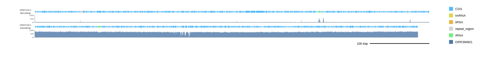
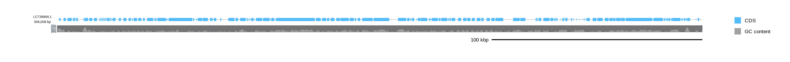
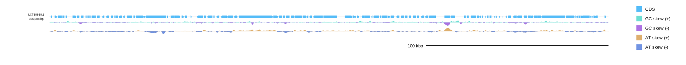

[Home](../DOCS.md) | [Installation](../INSTALL.md) | [Quickstart](../QUICKSTART.md) | [Tutorials](./TUTORIALS.md) | [Recipes](../RECIPES.md) | [CLI Reference](../CLI_Reference.md) | [Gallery](../GALLERY.md) | [FAQ](../FAQ.md) | [About](../ABOUT.md)

[< Back to the guide index](./TUTORIALS.md)
[< Previous: Use TSV manifests](./5_Table_Driven_Inputs.md) | [Next: Arrange linear tracks and labels >](./7_Linear_Layout.md)

# Plot read depth and other numeric tracks

Add per-base read depth tracks, GC content (%) tracks, and numeric axes to circular and linear diagrams.

## 1. Prepare inputs

Sections 2 through 4 use Hepatoplasmataceae genomes and matching per-base depth files. In a source checkout, the files are available under [`tests/test_inputs`](../../tests/test_inputs/):

| Record | GenBank | Depth TSV | Sequencing run | Tutorial use |
|---|---|---|---|---|
| AP027078.1 | `AP027078.gb` | `AP027078.DRR394944.depth.tsv` | DRR394944 | Section 4 |
| AP027131.1 | `AP027131.gb` | `AP027131.DRR394921.depth.tsv` | DRR394921 | Section 3 |
| AP027133.1 | `AP027133.gb` | `AP027133.DRR394922.depth.tsv` | DRR394922 | Section 2 |
| AP027132.1 | `AP027132.gb` | `AP027132.DRR394921.depth.tsv` | DRR394921 | Section 3 |

Run the depth examples from the repository root so the `tests/test_inputs/` paths resolve. If you copy the relevant GenBank and TSV files to another working directory, remove that prefix from the commands.

Depth TSV files use the first three columns of `samtools depth` output: `reference`, 1-based `position`, and non-negative `depth`. A header is optional; gbdraw normalizes these columns to `reference_name`, `position`, and `depth`. The supplied files are headerless and contain one row per base. The examples plot mean depth in non-overlapping 100 nt windows, retaining local variation without producing oversized SVG files.

Create the input from a coordinate-sorted, indexed BAM file with `-aa` so bases with zero coverage are retained:

```bash
samtools depth -aa input.bam > sample.depth.tsv
```

Keep the reference names identical across the GenBank record, the BAM header, and the first TSV column. A mismatch such as `NC_000001.1` versus `chr1` leaves that record without plotted values. Rows missing from the TSV are unknown rather than implicitly zero; use `-aa` when zero coverage must be represented. For several displayed records, one depth file may contain rows for every record, or `--depth_track` may receive one file per record in the same order as `--gbk`.

Per-base input preserves the source measurement. `--depth_window` controls how many bases are summarized into each plotted mean, while `--depth_step` controls the distance between consecutive windows. Equal values produce non-overlapping windows; a smaller step produces overlapping windows and a larger SVG. Use per-base plotting (`--depth_window 1 --depth_step 1`) only when individual positions matter.

Sections 5 and 6 use the MjeNMV GenBank record:

```bash
wget "https://eutils.ncbi.nlm.nih.gov/entrez/eutils/efetch.fcgi?db=nuccore&id=LC738868.1&rettype=gbwithparts&retmode=text" -O MjeNMV.gb
```

In a source checkout, this file is also available as `examples/MjeNMV.gb`.

## 2. Add one depth track

Use `--depth` when you need one depth track.

```bash
gbdraw circular \
  --gbk tests/test_inputs/AP027133.gb \
  --depth tests/test_inputs/AP027133.DRR394922.depth.tsv \
  --depth_width 45 \
  --depth_window 100 \
  --depth_step 100 \
  --depth_max 150 \
  --show_depth_axis \
  --show_depth_ticks \
  --depth_large_tick_interval 50 \
  --depth_small_tick_interval 25 \
  -o tutorial-6-depth-circular \
  -f svg
```

This writes `tutorial-6-depth-circular.svg`. Circular mode uses `--depth_width` for the radial thickness of the depth track. The 150× maximum does not clip the observed mean depth in 100 nt windows and produces evenly spaced 50× tick labels.


## 3. Compare depth across records

Use one `--depth_track` group with one matching file per displayed record. AP027131.1 and AP027132.1 both use reads from DRR394921, so their coverage can be compared on one shared axis.

```bash
gbdraw linear \
  --gbk tests/test_inputs/AP027131.gb tests/test_inputs/AP027132.gb \
  --depth_track tests/test_inputs/AP027131.DRR394921.depth.tsv tests/test_inputs/AP027132.DRR394921.depth.tsv \
  --depth_track_label "DRR394921" \
  --depth_track_color "#4E79A7" \
  --depth_height 36 \
  --depth_window 100 \
  --depth_step 100 \
  --depth_min 0 \
  --depth_max 1000 \
  --depth_large_tick_interval 500 \
  --depth_small_tick_interval 250 \
  --show_depth_axis \
  --show_depth_ticks \
  --share_depth_axis \
  -o tutorial-6-depth-tracks \
  -f svg
```

This writes `tutorial-6-depth-tracks.svg`. The common 0× to 1,000× scale makes the lower AP027131.1 depth and higher AP027132.1 depth directly comparable.



Each repeated `--depth_track` group is one logical depth series. The series does not need a file for every displayed record. Use a quoted empty argument in the missing record's position:

```bash
gbdraw linear \
  --gbk tests/test_inputs/AP027131.gb tests/test_inputs/AP027132.gb \
  --depth_track tests/test_inputs/AP027131.DRR394921.depth.tsv '' \
  --depth_track '' tests/test_inputs/AP027132.DRR394921.depth.tsv \
  --depth_track_label "AP027131 depth" "AP027132 depth" \
  --depth_track_color "#4E79A7" "#E15759" \
  --show_depth_axis \
  --share_depth_axis \
  -o tutorial-6-sparse-depth-tracks \
  -f svg
```

This writes `tutorial-6-sparse-depth-tracks.svg`. The first repeated group is logical track 0 and has data only for AP027131.1; the second is logical track 1 and has data only for AP027132.1. A missing cell draws no depth area, axis, or ticks for that record. It is not converted to zero coverage. The Linear planner measures each record separately but retains the missing logical slot's reserved band, so that cell does not compact or renumber its record's stack. Every `--depth_track` group must contain at least one file.

For multiple samples, repeat `--depth_track`, and give each group a matching `--depth_track_label` and `--depth_track_color`. Within every group, list files or empty placeholders in displayed-record order. Do not substitute an unrelated file for a missing measurement.

Linear mode uses `--depth_height` for the vertical height of depth tracks. `--share_depth_axis` uses the same y-axis range across records for each depth track. `--depth` and `--depth_track` are alternatives and cannot be used in the same command.

Use `--depth_track_height` when each depth track needs its own height. Track-specific axis overrides are also available:

- `--depth_track_large_tick_interval`
- `--depth_track_small_tick_interval`
- `--depth_track_tick_font_size`

## 4. Control scaling

Log scaling is useful when a few high-depth bins would otherwise flatten the rest of the track.

```bash
gbdraw linear \
  --gbk tests/test_inputs/AP027078.gb \
  --depth tests/test_inputs/AP027078.DRR394944.depth.tsv \
  --depth_height 40 \
  --depth_window 100 \
  --depth_step 100 \
  --depth_log_scale \
  --depth_min 1 \
  --depth_max 250000 \
  --show_depth_axis \
  --show_depth_ticks \
  -o tutorial-depth-log-axis \
  -f svg
```

This writes `tutorial-depth-log-axis.svg`, with a log-scaled depth axis spanning the requested 1× to 250,000× range. AP027078.1 contains a high local depth peak, and log scaling keeps the background depth visible without clipping the mean values from the 100 nt windows.


Use `--no_depth_log_scale` to force linear scaling when a config file or saved session enables log scaling.

## 5. Plot GC content as a percentage

The default GC content track shows deviation from the mean. Use `--gc_content_mode percent` when the y-axis should show GC content (%).

```bash
gbdraw linear \
  --gbk MjeNMV.gb \
  --show_gc \
  --gc_content_mode percent \
  --gc_content_min_percent 25 \
  --gc_content_max_percent 75 \
  --gc_content_large_tick_interval 10 \
  --gc_content_small_tick_interval 5 \
  --show_gc_content_axis \
  --show_gc_content_ticks \
  -o MjeNMV_gc_percent \
  -f svg
```

This writes `MjeNMV_gc_percent.svg`.



The same `percent` mode options are available in circular mode, together with circular track geometry such as `--gc_content_width` and `--gc_content_radius`.

## 6. Add another skew track

Custom track slots can add a second skew track with a different dinucleotide. This example keeps the standard GC skew and adds AT skew below it:

```bash
gbdraw linear \
  --gbk MjeNMV.gb \
  --show_skew \
  --linear_track_slot 'features:features@side=overlay' \
  --linear_track_slot 'gc_skew:gc_skew@side=below,h=24px,spacing=8px' \
  --linear_track_slot 'at_skew:dinucleotide_skew@side=below,h=24px,spacing=8px,nt=AT,positive_color=#deaf6e,negative_color=#7294e3' \
  --linear_track_axis_index 0 \
  -o MjeNMV_two_skew_tracks \
  -f svg
```

This writes `MjeNMV_two_skew_tracks.svg`.



Use the same `nt=AT` pattern in circular track tables or circular track slots when you need an additional circular skew ring.

[< Back to the guide index](./TUTORIALS.md)
[< Previous: Use TSV manifests](./5_Table_Driven_Inputs.md) | [Next: Arrange linear tracks and labels >](./7_Linear_Layout.md)

[Home](../DOCS.md) | [Installation](../INSTALL.md) | [Quickstart](../QUICKSTART.md) | [Tutorials](./TUTORIALS.md) | [Recipes](../RECIPES.md) | [CLI Reference](../CLI_Reference.md) | [Gallery](../GALLERY.md) | [FAQ](../FAQ.md) | [About](../ABOUT.md)
