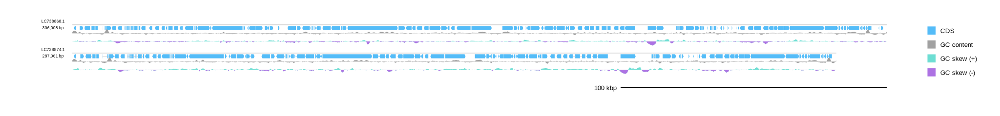
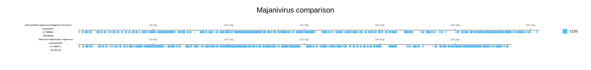
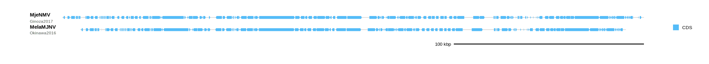
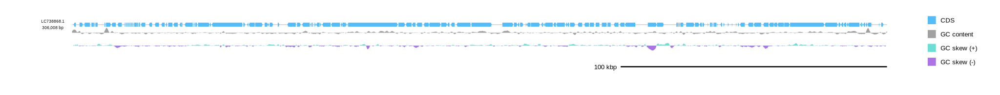

[Home](../DOCS.md) | [Installation](../INSTALL.md) | [Quickstart](../QUICKSTART.md) | [Tutorials](./TUTORIALS.md) | [Recipes](../RECIPES.md) | [CLI Reference](../CLI_Reference.md) | [Gallery](../GALLERY.md) | [FAQ](../FAQ.md) | [About](../ABOUT.md)

[< Back to the guide index](./TUTORIALS.md)
[< Previous: Plot read depth and numeric tracks](./6_Depth_Quantitative_Tracks.md) | [Next: Create interactive SVGs >](./8_Interactive_SVG_Sessions.md)

# Arrange linear tracks, record labels, and rulers

Customize linear diagrams with track placement, rulers, record labels, titles, and custom track slots.

## 1. Prepare inputs

```bash
wget "https://eutils.ncbi.nlm.nih.gov/entrez/eutils/efetch.fcgi?db=nuccore&id=LC738868.1&rettype=gbwithparts&retmode=text" -O MjeNMV.gb
wget "https://eutils.ncbi.nlm.nih.gov/entrez/eutils/efetch.fcgi?db=nuccore&id=LC738874.1&rettype=gbwithparts&retmode=text" -O MelaMJNV.gb
```

If you are working from a source checkout, the same files are available under `examples/`.

## 2. Place tracks above, middle, or below

`--track_layout above`, `middle`, and `below` control where the feature track sits relative to the record axis.

```bash
gbdraw linear \
  --gbk MjeNMV.gb MelaMJNV.gb \
  --track_layout below \
  --track_axis_gap auto \
  --show_gc \
  --show_skew \
  -o majani_tracks_below \
  -f svg
```

This writes `majani_tracks_below.svg`. Use `--track_axis_gap 12` when you want an explicit pixel gap instead of automatic spacing.



## 3. Use a ruler on the axis

`--ruler_on_axis` is effective when `--scale_style ruler` is used with `--track_layout above` or `below`.

```bash
gbdraw linear \
  --gbk MjeNMV.gb MelaMJNV.gb \
  --track_layout below \
  --scale_style ruler \
  --ruler_on_axis \
  --scale_interval 50000 \
  -o majani_axis_ruler \
  -f svg
```

## 4. Combine the ruler with record text and a plot title

`--record_label` and `--record_subtitle` are repeatable and order-sensitive. Their order follows the input records unless you use `--records_table`, where labels and subtitles belong in table columns.

```bash
gbdraw linear \
  --gbk MjeNMV.gb MelaMJNV.gb \
  --track_layout below \
  --scale_style ruler \
  --ruler_on_axis \
  --scale_interval 50000 \
  --record_label "Marsupenaeus japonicus endogenous nimavirus" \
  --record_label "Melicertus latisulcatus majanivirus" \
  --record_subtitle "Ginoza2017" \
  --record_subtitle "Okinawa2016" \
  --plot_title "Majanivirus comparison" \
  --plot_title_position top \
  -o tutorial-7-linear-layout \
  -f svg
```

The result combines per-record axis rulers, ordered record-label lines, and a shared title:



## 5. Format the record-label block

Use the definition-line options when a publication figure needs compact record labels.

```bash
gbdraw linear \
  --gbk MjeNMV.gb MelaMJNV.gb \
  --record_label "MjeNMV" \
  --record_label "MelaMJNV" \
  --record_subtitle "Ginoza2017" \
  --record_subtitle "Okinawa2016" \
  --align_center \
  --hide_accession \
  --hide_length \
  --keep_definition_left_aligned \
  --definition_line_style name:weight=bold,size=18 \
  --definition_line_style 'subtitle:size=14,color=#555555' \
  -o majani_definition_lines \
  -f svg
```

`--keep_definition_left_aligned` keeps the record-label column fixed while `--align_center` moves the record axes. `--hide_accession` and `--hide_length` remove the default metadata lines. `--show_replicon` adds a line only when a source feature supplies a `chromosome` or `plasmid` qualifier.



## 6. Customize linear track slots

For simple ordering, use `--linear_track_order`:

```bash
gbdraw linear \
  --gbk MjeNMV.gb \
  --show_gc \
  --show_skew \
  --linear_track_order gc_skew,gc_content,features \
  -o MjeNMV_linear_track_order \
  -f svg
```

Keep `--show_gc`, `--show_skew`, or `--show_depth` when the order includes the corresponding numeric track; disabled tracks are skipped.

Use `--linear_track_slot` when a track needs explicit height, spacing, side, or renderer parameters:

```bash
gbdraw linear \
  --gbk MjeNMV.gb \
  --show_gc \
  --show_skew \
  --linear_track_slot features:features@side=overlay,h=60px \
  --linear_track_slot gc_content:gc_content@h=24px,spacing=8px \
  --linear_track_slot gc_skew:gc_skew@h=24px,spacing=8px \
  --linear_track_axis_index 0 \
  -o MjeNMV_linear_slots \
  -f svg
```

The axis index is the boundary in the slot list. Here the feature slot overlays boundary `0`, and the two later slots are placed below it.



Add a reusable annotation row with the same table used in Circular mode:

```bash
gbdraw linear \
  --gbk MjeNMV.gb \
  --annotation_table annotations.tsv \
  --linear_track_slot notes:annotations@set_id=regions,side=above,h=28px,spacing=6px \
  --linear_track_slot features:features@side=overlay \
  --linear_track_axis_index 1 \
  -o MjeNMV_annotated \
  -f svg
```

Leave `h` out to size the row from its lanes and labels. For an overlay, set `side=overlay`, `anchor_slot=<slot_id>`, and `layer=underlay` or `foreground`. An underlay slot must have a lower `z` value than its anchor; a foreground slot must have a higher value. `overflow=error`, `compress`, or `clip` controls what happens when an explicit height is too small.

## 7. Select records, regions, and orientation

Use these repeatable options when a file contains several records or when only part of a record belongs in the figure:

- `--record_id`: select a record by its ID or a quoted `'#index'` value;
- `--region`: crop with `record_id:start-end[:rc]`;
- `--reverse_complement`: provide one Boolean value per input file.

```bash
gbdraw linear \
  --gbk tests/test_inputs/AP027078.gb tests/test_inputs/AP027131.gb \
  --region AP027078.1:1-300000 \
  --region AP027131.1:1-300000:rc \
  --reverse_complement false \
  --reverse_complement true \
  -o selected_regions \
  -f svg
```

Do not reuse full-record BLAST coordinates after cropping or reversing inputs unless the comparison data were generated for the displayed coordinate system. For larger sets, put selectors, regions, orientation, and order in a [`--records_table`](./5_Table_Driven_Inputs.md#2-linear---records_table-for-genbank-rows).

[< Back to the guide index](./TUTORIALS.md)
[< Previous: Plot read depth and numeric tracks](./6_Depth_Quantitative_Tracks.md) | [Next: Create interactive SVGs >](./8_Interactive_SVG_Sessions.md)

[Home](../DOCS.md) | [Installation](../INSTALL.md) | [Quickstart](../QUICKSTART.md) | [Tutorials](./TUTORIALS.md) | [Recipes](../RECIPES.md) | [CLI Reference](../CLI_Reference.md) | [Gallery](../GALLERY.md) | [FAQ](../FAQ.md) | [About](../ABOUT.md)
