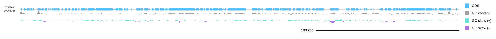

[Home](../DOCS.md) | [Installation](../INSTALL.md) | [Quickstart](../QUICKSTART.md) | [Tutorials](./README.md) | [Recipes](../RECIPES.md) | [CLI Reference](../CLI_Reference.md) | [Gallery](../GALLERY.md) | [FAQ](../FAQ.md) | [About](../ABOUT.md)

[< Back to the guide index](./README.md)
[< Previous: Plot read depth and numeric tracks](./6_Depth_Quantitative_Tracks.md) | [Next: Create interactive SVGs >](./8_Interactive_SVG_Sessions.md)

# Arrange linear tracks, record labels, and rulers

Customize linear diagrams with track placement, rulers, record labels, titles, and custom track slots.

## 1. Prepare inputs

```bash
wget "https://eutils.ncbi.nlm.nih.gov/entrez/eutils/efetch.fcgi?db=nuccore&id=LC738868.1&rettype=gbwithparts&retmode=text" -O MjeNMV.gb
wget "https://eutils.ncbi.nlm.nih.gov/entrez/eutils/efetch.fcgi?db=nuccore&id=LC738874.1&rettype=gbwithparts&retmode=text" -O MelaMJNV.gb
```

The worked examples retain the same comparison and styling context while the
layout setting changes. They also use a
[precomputed MjeNMV-MelaMJNV TBLASTX table](../../examples/MjeNMV.MelaMJNV.tblastx.out),
[majanivirus color rules](../../tests/test_inputs/majani_custom_color_table.tsv),
and [default color overrides](../../examples/modified_default_colors.tsv).
Download those three files into the same directory as the GenBank files. From
a source checkout, create a working directory from the repository root:

```bash
mkdir -p tutorial-7-work
cp examples/MjeNMV.gb examples/MelaMJNV.gb tutorial-7-work/
cp examples/MjeNMV.MelaMJNV.tblastx.out tutorial-7-work/
cp tests/test_inputs/majani_custom_color_table.tsv tutorial-7-work/
cp examples/modified_default_colors.tsv tutorial-7-work/
cd tutorial-7-work
```

## 2. Place tracks above, middle, or below

`--track_layout above`, `middle`, and `below` control where the feature track sits relative to the record axis.

```bash
gbdraw linear \
  --gbk MjeNMV.gb MelaMJNV.gb \
  --blast MjeNMV.MelaMJNV.tblastx.out \
  -t majani_custom_color_table.tsv \
  -d modified_default_colors.tsv \
  --block_stroke_color gray \
  --block_stroke_width 1 \
  --line_stroke_color lightgray \
  --line_stroke_width 2 \
  --track_layout below \
  --track_axis_gap auto \
  --gc \
  --skew \
  --pairwise_match_style curve \
  --show_labels first \
  --label_rendering embedded_only \
  --record_label "Marsupenaeus japonicus endogenous nimavirus" \
  --record_label "Melicertus latisulcatus majanivirus" \
  --record_subtitle "Ginoza2017" \
  --record_subtitle "Okinawa2016" \
  -o tutorial-7-track-layout-below \
  -f svg
```

This writes `tutorial-7-track-layout-below.svg`. The embedded labels, feature
colors, GC tracks, and TBLASTX ribbons remain fixed so the track placement is
the visible change. Use `--track_axis_gap 12` when you want an explicit pixel
gap instead of automatic spacing.

Add `--resolve_overlaps` when overlapping genomic features should use additional lanes. gbdraw measures the resulting feature lanes and labels for each record, then moves GC, skew, Depth, and other non-overlay tracks outward only when they need more clearance. Records with different feature occupancy can therefore use different vertical track positions. In the web app, the `middle` choice is labeled **Features on axis**.

In a comparison diagram, ribbons attach directly to the outer edges of the two records' painted exclusion bands. Empty reservations, including missing Depth cells, do not move those endpoints. `--comparison_height` is the minimum clear corridor between the painted edges. Automatic row spacing evaluates the body, active comparison corridor, and definition text as separate horizontal collision bands, then uses the largest applicable clearance. It does not add all three reservations together. A comparison corridor is reserved only at a row boundary that an actual comparison crosses; left-column definition text does not enlarge plot spacing when their horizontal ranges do not overlap.


## 3. Choose, place, or hide the coordinate scale

`--scale_style` selects a bottom `bar` or `ruler`. With a visible ruler,
`--ruler_on_axis` moves its ticks and coordinate labels onto each record axis
when `--track_layout above` or `below` is used.

```bash
gbdraw linear \
  --gbk MjeNMV.gb MelaMJNV.gb \
  --track_layout below \
  --scale_style ruler \
  --ruler_on_axis \
  --scale_interval 50000 \
  -o majani_axis_ruler \
  -f svg
```

Use `--hide_scale` when the figure needs record axes but no genome-coordinate
scale:

```bash
gbdraw linear \
  --gbk MjeNMV.gb MelaMJNV.gb \
  --track_layout below \
  --hide_scale \
  -o majani_without_scale \
  -f svg
```

This removes the bottom bar or ruler and suppresses coordinate ticks and labels
on record axes without reserving an empty scale band. Each record's main axis
line remains. `--ruler_on_axis` is ignored with a warning when
`--hide_scale` is set.

In the web app, clear **Show Coordinate Scale** in **Axis & Scale**. Scale
style, interval, line, label, and ruler-on-axis controls are disabled while the
scale is hidden; axis color and width remain available. Stored scale choices
become effective again when the checkbox is selected.

## 4. Combine the ruler with record text and a plot title

`--record_label` and `--record_subtitle` are repeatable and order-sensitive. Their order follows the input records unless you use `--records_table`, where labels and subtitles belong in table columns.

```bash
gbdraw linear \
  --gbk MjeNMV.gb MelaMJNV.gb \
  --blast MjeNMV.MelaMJNV.tblastx.out \
  -t majani_custom_color_table.tsv \
  -d modified_default_colors.tsv \
  --block_stroke_color gray \
  --block_stroke_width 1 \
  --line_stroke_color lightgray \
  --line_stroke_width 2 \
  --gc \
  --skew \
  --pairwise_match_style curve \
  --show_labels first \
  --label_rendering embedded_only \
  --scale_style ruler \
  --scale_interval 50000 \
  --record_label "Marsupenaeus japonicus endogenous nimavirus" \
  --record_label "Melicertus latisulcatus majanivirus" \
  --record_subtitle "Ginoza2017" \
  --record_subtitle "Okinawa2016" \
  --plot_title "Majanivirus comparison" \
  --plot_title_position top \
  -o tutorial-7-linear-layout \
  -f svg
```

The result keeps the on-axis feature colors, feature lines, embedded labels,
quantitative tracks, and comparison ribbons, then adds a bottom ruler and a
shared title:


## 5. Format the record-label block

Use the definition-line options when a publication figure needs compact record labels.

```bash
gbdraw linear \
  --gbk MjeNMV.gb MelaMJNV.gb \
  --blast MjeNMV.MelaMJNV.tblastx.out \
  -t majani_custom_color_table.tsv \
  -d modified_default_colors.tsv \
  --block_stroke_color gray \
  --block_stroke_width 1 \
  --line_stroke_color lightgray \
  --line_stroke_width 2 \
  --gc \
  --skew \
  --pairwise_match_style curve \
  --show_labels first \
  --label_rendering embedded_only \
  --record_label "MjeNMV" \
  --record_label "MelaMJNV" \
  --record_subtitle "Ginoza2017" \
  --record_subtitle "Okinawa2016" \
  --align_center \
  --hide_accession \
  --hide_length \
  --keep_definition_left_aligned \
  --definition_line_style name:weight=bold,size=18 \
  --definition_line_style 'subtitle:size=14,color=#555555' \
  -o tutorial-7-definition-lines \
  -f svg
```

`--keep_definition_left_aligned` keeps the record-label column fixed while `--align_center` moves the record axes. `--hide_accession` and `--hide_length` remove the default metadata lines. `--show_replicon` adds a line only when a source feature supplies a `chromosome` or `plasmid` qualifier.

The `Length / Coord.` definition line is independent of
`--hide_scale`. Use `--hide_length`, or clear **Show Length / Coordinates** in
the web app, when that text should also be removed.


## 6. Customize linear track slots

For simple ordering, use `--linear_track_order`:

```bash
gbdraw linear \
  --gbk MjeNMV.gb \
  --gc \
  --skew \
  --linear_track_order gc_skew,gc_content,features \
  -o MjeNMV_linear_track_order \
  -f svg
```

Keep `--gc` or `--skew` when the order includes the corresponding GC track, and provide at least one `--depth_track` group when it includes Depth; disabled or data-less tracks are skipped.

Use `--linear_track_slot` when a track needs explicit height, spacing, side, or renderer parameters:

```bash
gbdraw linear \
  --gbk MjeNMV.gb \
  --gc \
  --skew \
  --linear_track_slot features:features@side=overlay,h=60px \
  --linear_track_slot gc_content:gc_content@h=24px,spacing=8px \
  --linear_track_slot gc_skew:gc_skew@h=24px,spacing=8px \
  --linear_track_axis_index 0 \
  -o MjeNMV_linear_slots \
  -f svg
```

The axis index is the boundary in the slot list. Here the feature slot overlays boundary `0`, and the two later slots are placed below it.

For a feature slot, `h` is the minimum reserved height, not the feature glyph thickness. The actual reservation is the larger of the measured feature-and-label band and the configured `h`; use `--feature_height` to change the glyph thickness itself. Feature-slot `spacing` is the clearance between that reserved band and the adjacent track farther from the axis. With `h` left automatic, the measured reservation and resulting track positions are record-specific.

For a Depth slot, `track_index=0` selects the first repeated `--depth_track` group, `track_index=1` selects the second, and so on. It must be a zero-based non-negative integer for a logical Depth series that exists somewhere in the diagram; negative, fractional, nonnumeric, and globally out-of-range values are rejected. Moving the slot above or below the axis changes its vertical position without changing the selected depth series. If that series has no file for one record, gbdraw omits the depth area, axis, and ticks and reserves no vertical geometry for that cell. Later numeric tracks compact without renumbering the logical series. See [Plot read depth and other numeric tracks](./6_Depth_Quantitative_Tracks.md#3-compare-depth-across-records) for an empty-placeholder example.

When a custom stack is active, its enabled Depth slots are authoritative for the legend. Entries follow slot order, `legend_label` overrides the selected logical series title, and series without an enabled slot are omitted. A selected sparse series is still listed when its data exists only in a later record.



Add a reusable annotation row with the same table used in Circular mode:

```bash
gbdraw linear \
  --gbk MjeNMV.gb \
  --annotation_table annotations.tsv \
  --linear_track_slot notes:annotations@set_id=regions,side=above,h=28px,spacing=6px \
  --linear_track_slot features:features@side=overlay \
  --linear_track_axis_index 1 \
  -o MjeNMV_annotated \
  -f svg
```

Leave `h` out to size the row from its lanes and labels. For an overlay, set `side=overlay`, `anchor_slot=<slot_id>`, and `layer=underlay` or `foreground`. The anchor must be an enabled drawable, non-annotation slot in the complete stack; unknown IDs, non-drawing slots, and annotation-to-annotation anchor chains are rejected. An underlay slot must have a lower `z` value than its anchor; a foreground slot must have a higher value. `overflow=error`, `compress`, or `clip` controls what happens when an explicit height is too small.

In the web app, opening or closing **Custom Track Slots** only shows or hides the editor. Select **Use custom stack** to use the saved stack for rendering; disabling and re-enabling it preserves the slots and axis position. **Reset** is the only action that rebuilds the custom stack from the simple Track Layout, GC, skew, and Depth controls. Those simple controls are disabled while the custom stack is active.

## 7. Select records, regions, and orientation

Use these repeatable options when a file contains several records or when only part of a record belongs in the figure:

- `--record_id`: select a record by its ID or a quoted `'#index'` value;
- `--region`: crop with `record_id:start-end[:rc]`;
- `--reverse_complement`: provide one Boolean value per input file.

```bash
gbdraw linear \
  --gbk tests/test_inputs/AP027078.gb tests/test_inputs/AP027131.gb \
  --region AP027078.1:1-300000 \
  --region AP027131.1:1-300000:rc \
  --reverse_complement false \
  --reverse_complement true \
  -o selected_regions \
  -f svg
```

Do not reuse full-record BLAST coordinates after cropping or reversing inputs unless the comparison data were generated for the displayed coordinate system. For larger sets, put selectors, regions, orientation, and order in a [`--records_table`](./5_Table_Driven_Inputs.md#2-linear---records_table-for-genbank-rows).

## 8. Place several records on one row

Assign every displayed record to a row with `--multi_record_position`. Input order determines the left-to-right order within a row:

```bash
gbdraw linear \
  --gbk MjeNMV.gb PemoMJNVA.gb MelaMJNV.gb PeseMJNV.gb \
  --multi_record_position '#1@1' \
  --multi_record_position '#2@1' \
  --multi_record_position '#3@2' \
  --multi_record_position '#4@2' \
  --linear_record_gap 28 \
  --scale_style ruler \
  --ruler_on_axis \
  -o linear_multi_rows \
  -f svg
```

The solver uses one common bp/px scale for every record. A ruler starts from zero on each record, while `--linear_record_gap` is a fixed pixel gap that does not change with sequence length. `--normalize_length` is rejected because it would assign incompatible per-record widths.

For stable left-to-right ordering and per-record labels, prefer `row` and `column` in a [`--records_table`](./5_Table_Driven_Inputs.md#2-linear---records_table-for-genbank-rows). Add selected cross-row BLAST edges with [`--comparisons_table`](./2_Comparative_Genomics.md#6-compare-selected-pairs-across-multi-record-rows).

In the web app, **Arrange in rows** changes placement only. It does not enable
or disable comparisons and is not required for editing **Selected pairs**.
Choose **No comparison**, an adjacent LOSAT or upload plan, or explicit selected
edges independently. For a multi-row layout, the adjacent actions use zipped
positions between neighboring rows; **All adjacent-row pairs** creates the
cross-product as explicit selected edges.

### Two strains with multiple replicons

In a source checkout, the checked-in [`vibrio-nigripulchritudo-linear-records.tsv`](../../examples/vibrio-nigripulchritudo-linear-records.tsv) reads `tests/test_inputs/GCF_015097735.1_ASM1509773v1_genomic.gbff` and `tests/test_inputs/GCF_000801275.2_ASM80127v1_genomic.gbff`. It selects all six replicons from *Vibrio nigripulchritudo* TUMSAT-TG-2018 and both chromosomes from strain SFn1, places one strain on each row, and orders its replicons by `column`. Run the command from the repository root.

```bash
gbdraw linear \
  --records_table examples/vibrio-nigripulchritudo-linear-records.tsv \
  --linear_record_gap 48 \
  --track_layout above \
  --scale_style ruler \
  --ruler_on_axis \
  --scale_interval 750000 \
  --separate_strands \
  --gc \
  --hide_accession \
  --hide_length \
  --definition_font_size 8 \
  --keep_definition_left_aligned \
  --protein_blastp_mode collinear \
  --collinear_search_scope all \
  --protein_blastp_candidate_limit 5 \
  --collinear_min_anchors 3 \
  --collinear_max_unit_gap 2 \
  --collinear_max_diagonal_drift 2 \
  --collinear_color_mode orientation_identity \
  --pairwise_match_style curve \
  --losatp_threads 8 \
  --plot_title "Vibrio nigripulchritudo replicons: LOSATP collinear blocks" \
  --plot_title_position top \
  -o vibrio-nigripulchritudo-multi-record \
  -f svg
```


The first row contains two chromosomes and four plasmids; the second contains two chromosomes. Every record uses the same bp/px scale, so the short plasmids remain visibly smaller than the chromosomes.

The `above` track layout keeps the feature tracks above their axis rulers. With `--keep_definition_left_aligned`, each row's leading `record_label` and `record_subtitle` are placed together in the left definition column; labels for later chromosomes and plasmids remain above their records. Record-local labels are drawn in front of comparison ribbons, so they do not create an empty band between the ribbons and feature tracks.

`--collinear_search_scope all` makes LOSATP search every record pair. In a multi-record layout, gbdraw omits same-row ribbons and renders accepted blocks only between adjacent rows. This example therefore searches all 6 × 2 cross-strain replicon pairs.

With the documented three-anchor threshold, the checked-in SVG contains 100 blocks across five endpoint pairs, including TUMSAT-TG-2018 chromosome 2 to SFn1 chromosome 1. The bundled LOSATP runtime is selected automatically; `--losatp_threads` controls its worker count.

For a larger five-species workflow, open the [<i>Vibrio</i> Harveyi group Gallery tutorial](https://gbdraw.app/gallery/#vibrio-harveyi-group-collinear). It keeps all 11 replicons from five RefSeq assemblies, uses one species per row, and documents every web setting used for the collinear figure.

[< Back to the guide index](./README.md)
[< Previous: Plot read depth and numeric tracks](./6_Depth_Quantitative_Tracks.md) | [Next: Create interactive SVGs >](./8_Interactive_SVG_Sessions.md)

[Home](../DOCS.md) | [Installation](../INSTALL.md) | [Quickstart](../QUICKSTART.md) | [Tutorials](./README.md) | [Recipes](../RECIPES.md) | [CLI Reference](../CLI_Reference.md) | [Gallery](../GALLERY.md) | [FAQ](../FAQ.md) | [About](../ABOUT.md)
