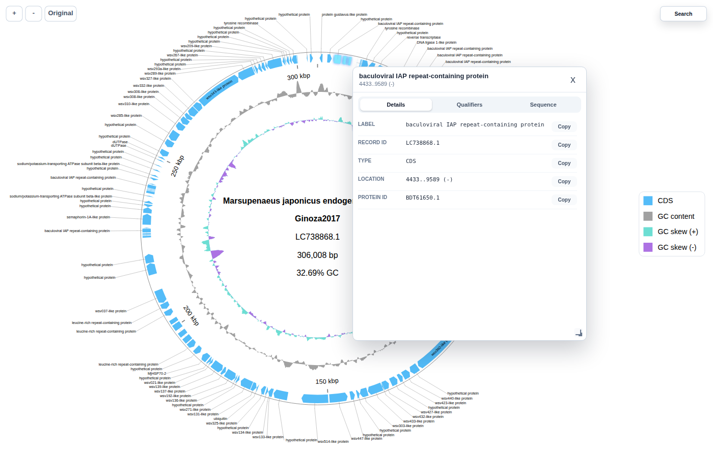
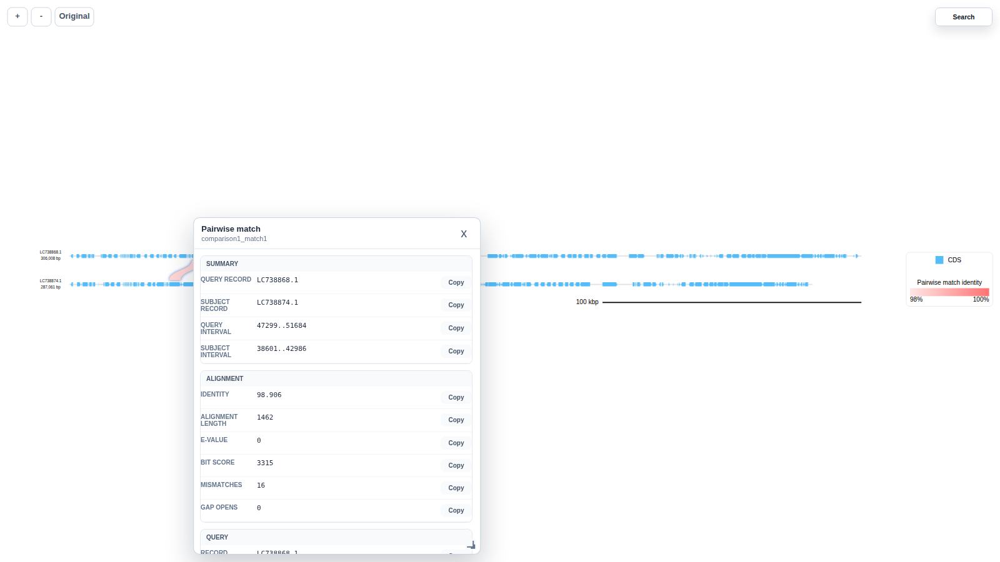
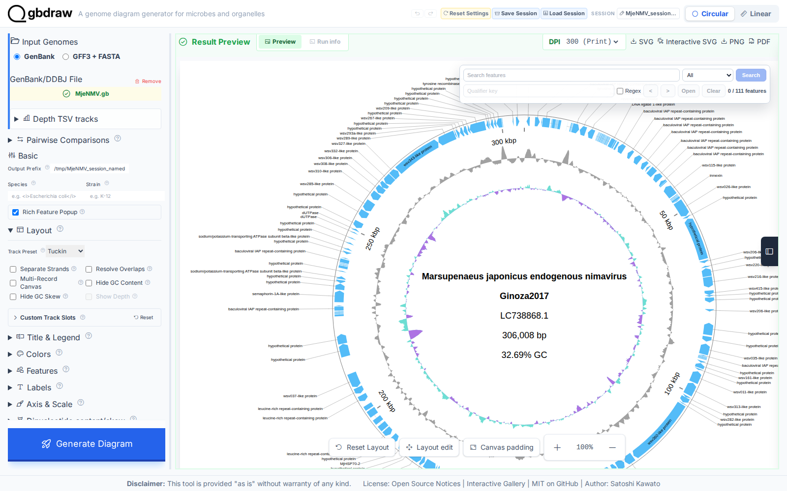

[Home](../DOCS.md) | [Installation](../INSTALL.md) | [Quickstart](../QUICKSTART.md) | [Tutorials](./TUTORIALS.md) | [Recipes](../RECIPES.md) | [CLI Reference](../CLI_Reference.md) | [Gallery](../GALLERY.md) | [FAQ](../FAQ.md) | [About](../ABOUT.md)

[< Back to the guide index](./TUTORIALS.md)
[< Previous: Arrange linear tracks and labels](./7_Linear_Layout.md) | [Next: Control feature visibility and shapes >](./9_Feature_Visibility_Shapes.md)

# Create interactive SVGs and restore saved sessions

Write interactive SVG files, save GUI sessions, and regenerate diagrams from saved sessions.

## 1. Prepare inputs

```bash
wget "https://eutils.ncbi.nlm.nih.gov/entrez/eutils/efetch.fcgi?db=nuccore&id=LC738868.1&rettype=gbwithparts&retmode=text" -O MjeNMV.gb
wget "https://eutils.ncbi.nlm.nih.gov/entrez/eutils/efetch.fcgi?db=nuccore&id=LC738874.1&rettype=gbwithparts&retmode=text" -O MelaMJNV.gb
```

If you are working from a source checkout, the same files are available under `examples/`.

## 2. Export standalone interactive SVG

The format name is `interactive_svg`:

```bash
gbdraw circular \
  --gbk MjeNMV.gb \
  --labels \
  -o MjeNMV_interactive \
  -f interactive_svg
```

Expected outputs:

- `MjeNMV_interactive.svg`
- `MjeNMV_interactive.interactive.svg`

Interactive SVG output does not require CairoSVG. Open the `.interactive.svg` file in a browser; some desktop SVG viewers block embedded scripts.

Hover over a feature for a compact summary, or click it to open the **Details**, **Qualifiers**, and **Sequence** tabs. The **+**, **-**, **Original**, and **Search** controls are another quick way to distinguish the interactive file from the static SVG.



## 3. What the interactive SVG contains

Interactive SVG embeds feature metadata for rendered features. Linear comparison plots can also include pairwise match metadata. Reuse the precomputed BLAST outfmt 7 table maintained in `examples/`:

```bash
cp examples/MjeNMV.MelaMJNV.tblastx.out .
```

You can also download [the same existing BLAST table](../../examples/MjeNMV.MelaMJNV.tblastx.out) directly.

```bash
gbdraw linear \
  --gbk MjeNMV.gb MelaMJNV.gb \
  --blast MjeNMV.MelaMJNV.tblastx.out \
  --identity 98 \
  --alignment_length 1400 \
  --pairwise_match_style curve \
  -o MjeNMV_MelaMJNV_interactive \
  -f interactive_svg
```

The thresholds leave one retained ribbon. Click it in `MjeNMV_MelaMJNV_interactive.interactive.svg` to inspect its match metadata:



Comparisons generated with gbdraw's `orthogroup` mode also include gbdraw similarity-group metadata. Complete the runtime setup in [Draw protein matches from annotated CDS features](./4_Protein_Comparisons.md) before using `--protein_blastp_mode orthogroup`.

## 4. Save a GUI session sidecar

`--save_session` writes a GUI-loadable `.gbdraw-session.json` next to the diagram.

```bash
gbdraw circular \
  --gbk MjeNMV.gb \
  --labels \
  --save_session \
  -o MjeNMV_session_demo \
  -f interactive_svg
```

Expected session output:

- `MjeNMV_session_demo.gbdraw-session.json`

As in Step 2, this command also writes `MjeNMV_session_demo.svg` and `MjeNMV_session_demo.interactive.svg` because the requested format is `interactive_svg`.

Use `--session_output` when you want an explicit session path:

```bash
gbdraw circular \
  --gbk MjeNMV.gb \
  --labels \
  --session_output roundtrip.gbdraw-session.json \
  -o MjeNMV_session_named \
  -f svg
```

## 5. Regenerate from a session

Use `--session` with the same diagram subcommand that created the session. Alongside `--session`, the CLI accepts output and format overrides plus optional `--save_session` or `--session_output`; other diagram options are rejected.

```bash
gbdraw circular \
  --session roundtrip.gbdraw-session.json \
  -o MjeNMV_regenerated \
  -f svg
```

This writes `MjeNMV_regenerated.svg` without requiring the original GenBank file next to the session.

## 6. Open the local web UI

Launch the browser UI from an installed environment:

```bash
gbdraw gui
```

Click **Load Session**, then choose the `.gbdraw-session.json` file to restore its embedded inputs, settings, and saved result. Load the JSON sidecar, not the `.interactive.svg` file.



[< Back to the guide index](./TUTORIALS.md)
[< Previous: Arrange linear tracks and labels](./7_Linear_Layout.md) | [Next: Control feature visibility and shapes >](./9_Feature_Visibility_Shapes.md)

[Home](../DOCS.md) | [Installation](../INSTALL.md) | [Quickstart](../QUICKSTART.md) | [Tutorials](./TUTORIALS.md) | [Recipes](../RECIPES.md) | [CLI Reference](../CLI_Reference.md) | [Gallery](../GALLERY.md) | [FAQ](../FAQ.md) | [About](../ABOUT.md)
