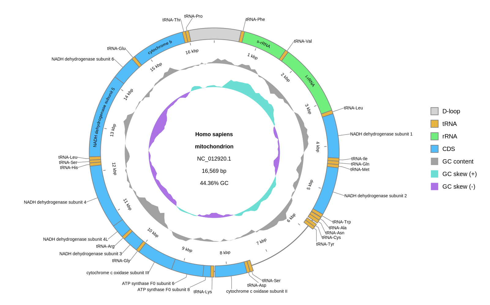

[Home](../DOCS.md) | [Installation](../INSTALL.md) | [Quickstart](../QUICKSTART.md) | [Tutorials](./TUTORIALS.md) | [Recipes](../RECIPES.md) | [CLI Reference](../CLI_Reference.md) | [Gallery](../GALLERY.md) | [FAQ](../FAQ.md) | [About](../ABOUT.md)

[< Back to the guide index](./TUTORIALS.md)
[< Previous: Create interactive SVGs and restore saved sessions](./8_Interactive_SVG_Sessions.md)

# Control feature visibility and shapes

Control which annotated features are drawn or included in gbdraw's protein searches, and change feature shapes without editing the input annotation.

## 1. Prepare an input

```bash
wget "https://eutils.ncbi.nlm.nih.gov/entrez/eutils/efetch.fcgi?db=nuccore&id=NC_012920.1&rettype=gbwithparts&retmode=text" -O HmmtDNA.gbk
```

If you are working from a source checkout, the same record is available as `tests/test_inputs/HmmtDNA.gbk`.

## 2. Override feature shapes

`--feature_shape TYPE=SHAPE` is repeatable. Supported shapes are `arrow` and `rectangle`.

```bash
gbdraw circular \
  --gbk HmmtDNA.gbk \
  -k CDS,rRNA,tRNA \
  --feature_shape CDS=rectangle \
  --feature_shape rRNA=rectangle \
  --feature_shape tRNA=rectangle \
  --labels out \
  --track_type middle \
  -o tutorial-9-feature-shapes \
  -f svg
```

Shape overrides apply by feature type. In this result, the CDS, rRNA, and tRNA features are all rectangles, while their colors continue to distinguish the feature types. Shape overrides do not change colors, labels, or feature selection by themselves.


## 3. Create a feature visibility table

Create `feature_visibility.tsv`:

```tsv
record_id	feature_type	qualifier	value	action
NC_012920.1	D-loop	location	^0\.\.16569$	show
NC_012920.1	CDS	product	^cytochrome c oxidase subunit I$	off
*	CDS	product	^ATP synthase F0 subunit 6$	exclude_matching
```

Columns:

- `record_id`: exact record ID, or `*` for any record
- `feature_type`: feature type such as `CDS`, or `*`
- `qualifier`: qualifier key, or special selectors `hash`, `location`, or `record_location`
- `value`: case-insensitive Python regular expression
- `action`: `show`, `off`, or `exclude_matching`

Rules are checked from top to bottom, and the first matching row wins.

## 4. Apply visibility rules

```bash
gbdraw circular \
  --gbk HmmtDNA.gbk \
  -k CDS,rRNA,tRNA \
  --feature_visibility_table feature_visibility.tsv \
  --feature_shape CDS=rectangle \
  --feature_shape rRNA=rectangle \
  --feature_shape tRNA=rectangle \
  --feature_shape D-loop=rectangle \
  --labels out \
  --track_type middle \
  -o tutorial-9-feature-visibility \
  -f svg
```

The baseline selects the usual CDS, rRNA, and tRNA features. The table adds the origin-spanning D-loop, hides cytochrome c oxidase subunit I, and leaves every other selected feature visible. The shape overrides render all four visible feature types as rectangles:



Actions:

- `show` draws matching features even when the baseline `-k/--features` list would not include them.
- `off` hides matching features and removes them from protein search inputs.
- `exclude_matching` keeps the feature's current visibility but removes it from protein search inputs. In the example, ATP synthase F0 subunit 6 therefore remains visible.

## 5. Combine with feature type, color, and label controls

`-k/--features` sets the baseline feature types. Color tables and label tables still act on the features that remain visible.

```bash
gbdraw linear \
  --gbk HmmtDNA.gbk \
  -k CDS,rRNA,tRNA \
  --feature_visibility_table feature_visibility.tsv \
  --feature_shape CDS=rectangle \
  --feature_shape rRNA=rectangle \
  --feature_shape tRNA=rectangle \
  --feature_shape D-loop=rectangle \
  --show_labels all \
  --label_blacklist NADH \
  -o human-mt-visibility-linear \
  -f svg
```

For precise targeting, constrain each row with `record_id` and `feature_type`, then match a stable qualifier such as `protein_id` or `locus_tag`. The special qualifier keys `hash`, `location`, and `record_location` are also supported. Use broad product regexes only when the annotation text is consistent across records.

[< Back to the guide index](./TUTORIALS.md)
[< Previous: Create interactive SVGs and restore saved sessions](./8_Interactive_SVG_Sessions.md)

[Home](../DOCS.md) | [Installation](../INSTALL.md) | [Quickstart](../QUICKSTART.md) | [Tutorials](./TUTORIALS.md) | [Recipes](../RECIPES.md) | [CLI Reference](../CLI_Reference.md) | [Gallery](../GALLERY.md) | [FAQ](../FAQ.md) | [About](../ABOUT.md)
