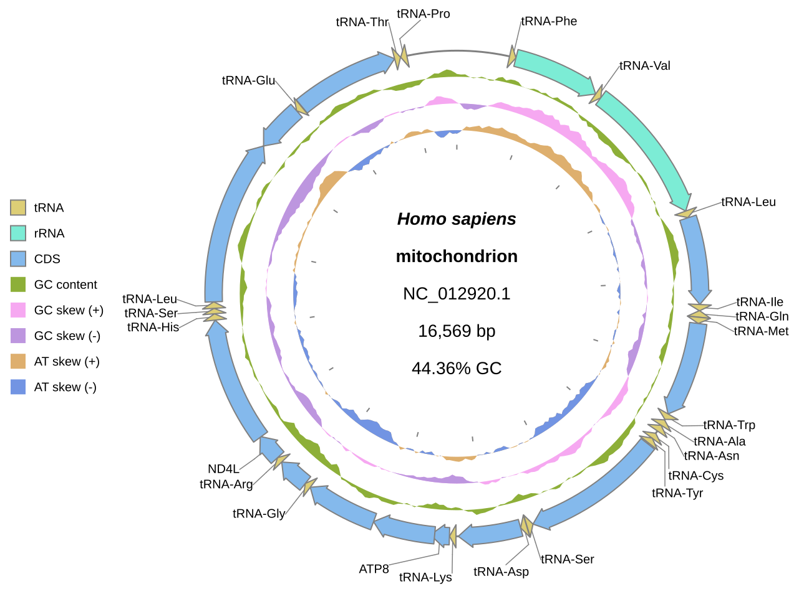
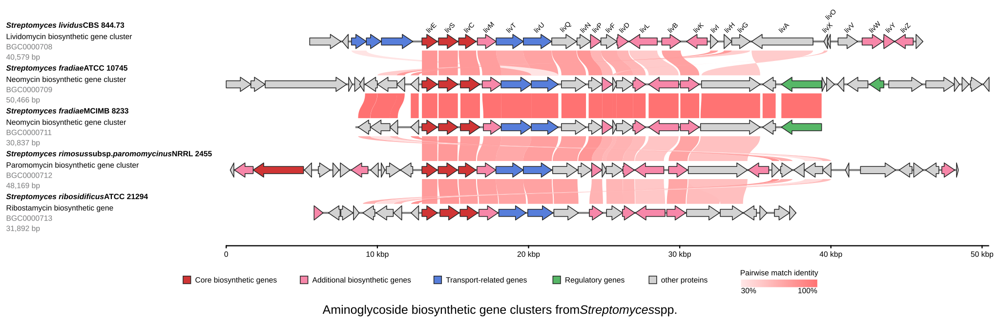
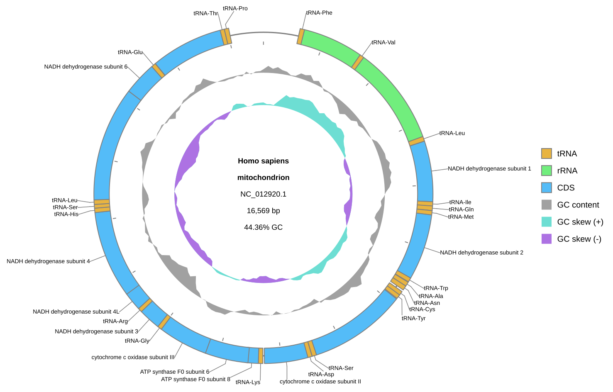
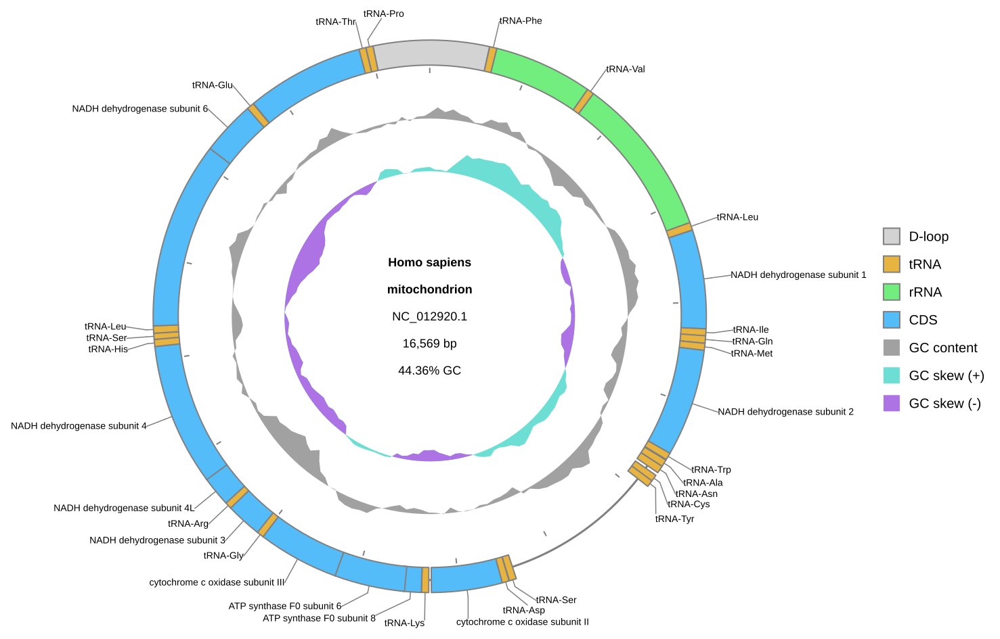

[Home](../DOCS.md) | [Installation](../INSTALL.md) | [Quickstart](../QUICKSTART.md) | [Tutorials](./README.md) | [Recipes](../RECIPES.md) | [CLI Reference](../CLI_Reference.md) | [Gallery](../GALLERY.md) | [FAQ](../FAQ.md) | [About](../ABOUT.md)

[< Back to the guide index](./README.md)
[< Previous: Create interactive SVGs and restore saved sessions](./8_Interactive_SVG_Sessions.md)

# Control feature visibility and shapes

Control which annotated features are drawn or included in gbdraw's protein searches, and change feature shapes without editing the input annotation.

## 1. Prepare an input

```bash
wget "https://eutils.ncbi.nlm.nih.gov/entrez/eutils/efetch.fcgi?db=nuccore&id=NC_012920.1&rettype=gbwithparts&retmode=text" -O HmmtDNA.gbk
```

If you are working from a source checkout, the same record is available as `tests/test_inputs/HmmtDNA.gbk`.

## 2. Override feature shapes

`--feature_shape TYPE=SHAPE` is repeatable and accepts three rendering values:

| Value | Result |
| --- | --- |
| `arrow` | Directional glyph using the global arrow geometry settings |
| `rectangle` | Nondirectional foreground block |
| `underlay` | Full-band highlight behind foreground features |

The default assignments do not change: CDS and RNA feature types use `arrow`,
`repeat_region` uses `underlay`, and other feature types use `rectangle`.

The two examples below start from the saved sessions in the Interactive SVG
Gallery. Loading each session preserves its inputs, tracks, labels, colors, and
layout while you change only the global arrow geometry.

### Recreate the Circular Gallery figure

1. Open the [Human mitochondrial genome (AT skew) Gallery entry](https://gbdraw.app/gallery/HmmtDNA_ATskew). Click **Session** above the preview to download `HmmtDNA_ATskew.gbdraw-session.json`.
2. Open the [web app](https://gbdraw.app/). For a local GUI, run `gbdraw gui` and use the browser page it opens.
3. Click **Load Session** and choose the downloaded session file.
4. Open **Features**. Under **Arrow Geometry**, leave **Head Length Ratio** empty so that the field shows `Auto`, then set **Shaft Width Ratio** to `0.75`. Keep the feature-type renderings unchanged.
5. Click **Generate Diagram**. When **Result Preview** appears, click **SVG** to save the figure.

The Circular figure starts from the Gallery's `HmmtDNA_ATskew` session. CDS,
rRNA, and tRNA features retain the `arrow` rendering and share the
three-quarter-width setting; short tRNAs remain triangles. The GC content, GC
skew, and AT skew tracks, tick layout, labels, center definition, and legend
remain unchanged.



### Recreate the Linear Gallery figure

1. Open the [five aminoglycoside biosynthetic gene clusters Gallery entry](https://gbdraw.app/gallery/BGC0000708-BGC0000713). Click **Session** above the preview to download `BGC0000708-BGC0000713.gbdraw-session.json`.
2. Open the [web app](https://gbdraw.app/), or run `gbdraw gui` for the local GUI.
3. Click **Load Session** and choose the downloaded session file.
4. Open **Features**. Under **Arrow Geometry**, leave **Head Length Ratio** empty so that the field shows `Auto`, then set **Shaft Width Ratio** to `0.5`. Keep the feature-type renderings unchanged.
5. Click **Generate Diagram**, then click **SVG** in **Result Preview**.

The Linear figure starts from the Gallery's five-record aminoglycoside BGC
session. It retains the curved protein-similarity matches, antiSMASH category
colors, rotated first-record gene labels, record definitions, ruler, title, and
bottom legend. Only the global arrow geometry changes. Auto lengthens the heads
to match the half-width shafts.



### Apply the setting to another CLI figure

The `HmmtDNA.gbk` file prepared in Section 1 is enough for a
copy-pasteable CLI example:

```bash
gbdraw circular \
  --gbk HmmtDNA.gbk \
  -k CDS,rRNA,tRNA \
  --track_type middle \
  --labels out \
  --arrow_head_length_ratio auto \
  --arrow_shaft_width_ratio 0.75 \
  -o tutorial-9-narrow-arrows \
  -f svg
```

This writes `tutorial-9-narrow-arrows.svg`. Replace `HmmtDNA.gbk` and the
output prefix to use the same geometry in another Circular figure. Use a shaft
ratio such as `0.5` for a narrower body. Geometry settings do not change
colors, labels, tracks, comparisons, or feature visibility.

The CLI `--session` mode replays the request stored in the session and does not
accept `--arrow_head_length_ratio` or `--arrow_shaft_width_ratio` overrides.
Use the web app or local GUI workflow above when you need to preserve every
Gallery-session setting.

A numeric head ratio must be positive and finite. The arrow shaft ratio must be
in `(0, 1]`; `1` preserves the legacy full-width outline and smaller values
produce a centered, narrower shaft for every feature type rendered as `arrow`.
With Auto head length, narrowing the shaft also lengthens the head by the
thickness removed from the shaft. Numeric head ratios remain explicit and do
not depend on shaft width.

A short arrow becomes a triangle when the terminal block has no positive-length
shaft. Multipart arrows draw nonterminal blocks at shaft width and keep their
connectors on the feature center line.

To compare the foreground shapes with rectangles, render every selected type as
a block:

```bash
gbdraw circular \
  --gbk HmmtDNA.gbk \
  -k CDS,rRNA,tRNA \
  --feature_shape CDS=rectangle \
  --feature_shape rRNA=rectangle \
  --feature_shape tRNA=rectangle \
  --labels out \
  --track_type middle \
  -o tutorial-9-feature-shapes \
  -f svg
```

Shape overrides apply by feature type. In this result, the CDS, rRNA, and tRNA features are all rectangles, while their colors continue to distinguish the feature types. Shape overrides do not change colors, labels, or feature selection by themselves.



In the web app or local GUI, open **Features**, choose **Arrow** for each feature
type that should be directional, then set **Head Length Ratio** and **Shaft
Width Ratio** in **Arrow Geometry**. Both geometry values apply globally and
are retained even when no feature type currently uses `arrow`.

## 3. Create a feature visibility table

Create `feature_visibility.tsv`:

```tsv
record_id	feature_type	qualifier	value	action
NC_012920.1	D-loop	location	^0\.\.16569$	show
NC_012920.1	CDS	product	^cytochrome c oxidase subunit I$	off
*	CDS	product	^ATP synthase F0 subunit 6$	exclude_matching
```

Columns:

- `record_id`: exact record ID, or `*` for any record
- `feature_type`: feature type such as `CDS`, or `*`
- `qualifier`: qualifier key, or special selectors `hash`, `location`, or `record_location`
- `value`: case-insensitive Python regular expression
- `action`: `show`, `off`, or `exclude_matching`

Rules are checked from top to bottom, and the first matching row wins.

## 4. Apply visibility rules

```bash
gbdraw circular \
  --gbk HmmtDNA.gbk \
  -k CDS,rRNA,tRNA \
  --feature_visibility_table feature_visibility.tsv \
  --feature_shape CDS=rectangle \
  --feature_shape rRNA=rectangle \
  --feature_shape tRNA=rectangle \
  --feature_shape D-loop=rectangle \
  --labels out \
  --track_type middle \
  -o tutorial-9-feature-visibility \
  -f svg
```

The baseline selects the usual CDS, rRNA, and tRNA features. The table adds the origin-spanning D-loop, hides cytochrome c oxidase subunit I, and leaves every other selected feature visible. The shape overrides render all four visible feature types as rectangles:



Actions:

- `show` draws matching features even when the baseline `-k/--features` list would not include them.
- `off` hides matching features and removes them from protein search inputs.
- `exclude_matching` keeps the feature's current visibility but removes it from protein search inputs. In the example, ATP synthase F0 subunit 6 therefore remains visible.

## 5. Combine with feature type, color, and label controls

`-k/--features` sets the baseline feature types. Color tables and label tables still act on the features that remain visible.

```bash
gbdraw linear \
  --gbk HmmtDNA.gbk \
  -k CDS,rRNA,tRNA \
  --feature_visibility_table feature_visibility.tsv \
  --feature_shape CDS=rectangle \
  --feature_shape rRNA=rectangle \
  --feature_shape tRNA=rectangle \
  --feature_shape D-loop=rectangle \
  --show_labels all \
  --label_blacklist NADH \
  -o human-mt-visibility-linear \
  -f svg
```

For precise targeting, constrain each row with `record_id` and `feature_type`, then match a stable qualifier such as `protein_id` or `locus_tag`. The special qualifier keys `hash`, `location`, and `record_location` are also supported. Use broad product regexes only when the annotation text is consistent across records.

[< Back to the guide index](./README.md)
[< Previous: Create interactive SVGs and restore saved sessions](./8_Interactive_SVG_Sessions.md)

[Home](../DOCS.md) | [Installation](../INSTALL.md) | [Quickstart](../QUICKSTART.md) | [Tutorials](./README.md) | [Recipes](../RECIPES.md) | [CLI Reference](../CLI_Reference.md) | [Gallery](../GALLERY.md) | [FAQ](../FAQ.md) | [About](../ABOUT.md)
