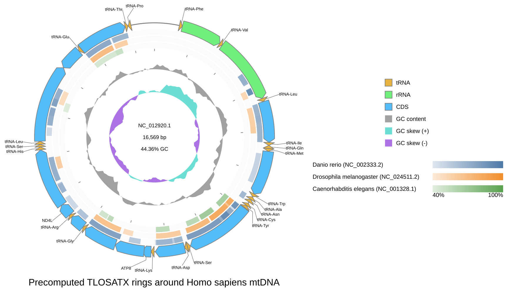

[Documentation home](../../DOCS.md) | [All Tutorials](../README.md) | [Get tutorial files](../../GETTING_TUTORIAL_DATA.md) | [Comparison reference](../../REFERENCE/comparison-programs-thresholds-and-results.md)

# Add precomputed circular comparison rings from the command line

## Choose how to build this figure

| GUI | CLI | Python API |
| --- | --- | --- |
| [Web app](../GUI/add-precomputed-circular-comparison-rings.md) | **Command line** | [Python API](../PYTHON/add-precomputed-circular-comparison-rings.md) |

This Tutorial places Danio, Drosophila, and Caenorhabditis comparison rings
inside the complete human mitochondrial reference.

## Files used in this Tutorial

| Kind | Filename | What to do |
| --- | --- | --- |
| Download | [`HmmtDNA.gbk`](https://eutils.ncbi.nlm.nih.gov/entrez/eutils/efetch.fcgi?db=nuccore&id=NC_012920.1&rettype=gbwithparts&retmode=text) | Download NCBI accession [`NC_012920.1`](https://www.ncbi.nlm.nih.gov/nuccore/NC_012920.1) in full GenBank format and save it as `HmmtDNA.gbk`. |
| Download | [`danio-human.tlosatx.tsv`](../../../gbdraw/web/tutorial-data/metazoan-mitochondria-comparison/danio-human.tlosatx.tsv) | Save this repository-hosted Danio comparison table with the exact filename. |
| Download | [`drosophila-human.tlosatx.tsv`](../../../gbdraw/web/tutorial-data/metazoan-mitochondria-comparison/drosophila-human.tlosatx.tsv) | Save this repository-hosted Drosophila comparison table with the exact filename. |
| Download | [`caenorhabditis-human.tlosatx.tsv`](../../../gbdraw/web/tutorial-data/metazoan-mitochondria-comparison/caenorhabditis-human.tlosatx.tsv) | Save this repository-hosted Caenorhabditis comparison table with the exact filename. |
| Download | [`NC_002333.2.fna`](https://eutils.ncbi.nlm.nih.gov/entrez/eutils/efetch.fcgi?db=nuccore&id=NC_002333.2&rettype=fasta&retmode=text) | Download NCBI accession [`NC_002333.2`](https://www.ncbi.nlm.nih.gov/nuccore/NC_002333.2) in FASTA format and save it as `NC_002333.2.fna`. |
| Download | [`NC_024511.2.fna`](https://eutils.ncbi.nlm.nih.gov/entrez/eutils/efetch.fcgi?db=nuccore&id=NC_024511.2&rettype=fasta&retmode=text) | Download NCBI accession [`NC_024511.2`](https://www.ncbi.nlm.nih.gov/nuccore/NC_024511.2) in FASTA format and save it as `NC_024511.2.fna`. |
| Download | [`NC_001328.1.fna`](https://eutils.ncbi.nlm.nih.gov/entrez/eutils/efetch.fcgi?db=nuccore&id=NC_001328.1&rettype=fasta&retmode=text) | Download NCBI accession [`NC_001328.1`](https://www.ncbi.nlm.nih.gov/nuccore/NC_001328.1) in FASTA format and save it as `NC_001328.1.fna`. |
| Download | [`cds_gene_qualifier_priority.tsv`](../../../gbdraw/web/tutorial-data/shared/cds_gene_qualifier_priority.tsv) | Save this repository-hosted label rule as `cds_gene_qualifier_priority.tsv`. |
| Generated | `precomputed_circular_rings.svg` | The command writes this SVG. |
| Reference result | [`precomputed_circular_rings.svg`](../../images/t-cli-09/precomputed_circular_rings.svg) | Compare your generated SVG with this versioned result. |

This Tutorial has no Create files. The three TLOSATX tables are frozen
comparison evidence; do not regenerate them for this recipe.

## Step 1: Prepare the working directory

Create and enter an empty directory:

```bash
mkdir gbdraw-cli-precomputed-rings
cd gbdraw-cli-precomputed-rings
```

The GenBank and FASTA links download accession-pinned sequences directly from
NCBI. The remaining links are repository-hosted support tables; select
**Download raw file** for those. Save every file with the exact name in the
table. See [Get the tutorial files](../../GETTING_TUTORIAL_DATA.md) for
browser, PowerShell, and identity-check instructions.

On macOS, Linux, or WSL, run:

```bash
ncbi_efetch="https://eutils.ncbi.nlm.nih.gov/entrez/eutils/efetch.fcgi"
gbdraw_data_base="https://raw.githubusercontent.com/satoshikawato/gbdraw/main/gbdraw/web/tutorial-data"
curl -L "${ncbi_efetch}?db=nuccore&id=NC_012920.1&rettype=gbwithparts&retmode=text" -o HmmtDNA.gbk
curl -L "$gbdraw_data_base/metazoan-mitochondria-comparison/danio-human.tlosatx.tsv" -o danio-human.tlosatx.tsv
curl -L "$gbdraw_data_base/metazoan-mitochondria-comparison/drosophila-human.tlosatx.tsv" -o drosophila-human.tlosatx.tsv
curl -L "$gbdraw_data_base/metazoan-mitochondria-comparison/caenorhabditis-human.tlosatx.tsv" -o caenorhabditis-human.tlosatx.tsv
curl -L "${ncbi_efetch}?db=nuccore&id=NC_002333.2&rettype=fasta&retmode=text" -o NC_002333.2.fna
curl -L "${ncbi_efetch}?db=nuccore&id=NC_024511.2&rettype=fasta&retmode=text" -o NC_024511.2.fna
curl -L "${ncbi_efetch}?db=nuccore&id=NC_001328.1&rettype=fasta&retmode=text" -o NC_001328.1.fna
curl -L "$gbdraw_data_base/shared/cds_gene_qualifier_priority.tsv" -o cds_gene_qualifier_priority.tsv
```

Confirm the GenBank version and the three FASTA headers:

```bash
grep '^VERSION' HmmtDNA.gbk
grep -H '^>' NC_002333.2.fna NC_024511.2.fna NC_001328.1.fna
```

Expect `NC_012920.1` in the GenBank result and one matching accession-version
in each FASTA header. The working directory should now contain:

```text
gbdraw-cli-precomputed-rings/
├── HmmtDNA.gbk
├── danio-human.tlosatx.tsv
├── drosophila-human.tlosatx.tsv
├── caenorhabditis-human.tlosatx.tsv
├── NC_002333.2.fna
├── NC_024511.2.fna
├── NC_001328.1.fna
└── cds_gene_qualifier_priority.tsv
```

## Step 2: Draw the three rings

<!-- executable:T-CLI-09:start -->
```bash
gbdraw circular \
  --gbk HmmtDNA.gbk \
  --conservation_blast danio-human.tlosatx.tsv drosophila-human.tlosatx.tsv caenorhabditis-human.tlosatx.tsv \
  --conservation_fasta NC_002333.2.fna NC_024511.2.fna NC_001328.1.fna \
  --conservation_reference subject \
  --conservation_labels 'Danio rerio (NC_002333.2)' 'Drosophila melanogaster (NC_024511.2)' 'Caenorhabditis elegans (NC_001328.1)' \
  --conservation_colors '#4E79A7' '#F28E2B' '#59A14F' \
  --bitscore 50 \
  --evalue 1e-5 \
  --identity 40 \
  --alignment_length 50 \
  --conservation_ring_width 18 \
  --conservation_ring_gap 4 \
  --species '<i>Homo sapiens</i>' \
  --qualifier_priority cds_gene_qualifier_priority.tsv \
  --track_type middle \
  --labels out \
  --definition_font_size 18 \
  --plot_title 'Precomputed TLOSATX rings around Homo sapiens mtDNA' \
  --plot_title_position bottom \
  --legend right \
  -o precomputed_circular_rings \
  -f svg
```
<!-- executable:T-CLI-09:end -->

Expected output: gbdraw writes the Generated `precomputed_circular_rings.svg`
in the working directory.

Open `precomputed_circular_rings.svg` and compare its ring order and labels
with the image below.



The image above is the Reference result. Verify the subject-reference
direction, the documented ring order and labels, and the comparison FASTA
identities. The finished SVG should retain 106 HSPs across the three rings.

## Next steps

- [Draw comparisons from other precomputed tables](../../HOW_TO/CLI/draw-precomputed-comparisons.md)
- [Review comparison result semantics](../../REFERENCE/comparison-programs-thresholds-and-results.md)
