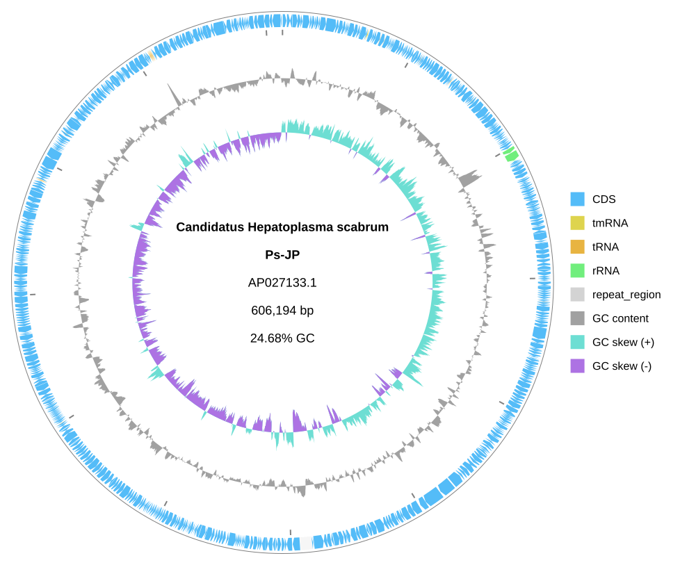
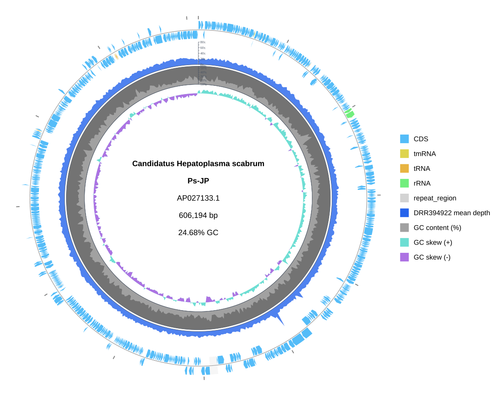

[Documentation home](../../DOCS.md) | [Tutorials](../README.md) | [CLI tutorials](README.md) | [Get tutorial files](../../GETTING_TUTORIAL_DATA.md) | [Track reference](../../REFERENCE/palettes-feature-rules-labels-shapes-and-tracks.md)

# Build a quantitative genome map with depth, GC content, and skew

## Choose how to build this figure

| GUI | CLI | Python API |
| --- | --- | --- |
| [Web-app workflow](../GUI/build-a-quantitative-genome-map.md) | **This page** | [Python workflow](../PYTHON/build-a-quantitative-genome-map.md) |

This project combines measured sequencing depth with two sequence-derived
tracks on the complete 606,194 bp circular `AP027133.1` record.

## What you will build

You will make a baseline annotated genome, then add a blue depth series, GC
content, and GC skew in three explicit inner slots. Depth and GC content have
labeled axes and ticks; GC skew is read around its zero baseline.

## Files used in this Tutorial

| Kind | Filename | What to do |
| --- | --- | --- |
| Download | [`AP027133.gb`](https://eutils.ncbi.nlm.nih.gov/entrez/eutils/efetch.fcgi?db=nuccore&id=AP027133.1&rettype=gbwithparts&retmode=text) | Download NCBI accession [`AP027133.1`](https://www.ncbi.nlm.nih.gov/nuccore/AP027133.1) in full GenBank format and save it as `AP027133.gb`. |
| Download | [`AP027133.DRR394922.depth-1kb.tsv`](../../../gbdraw/web/tutorial-data/depth-1kb/AP027133.DRR394922.depth-1kb.tsv) | Save this repository-hosted depth table with the exact filename. |
| Generated | `quantitative_genome_baseline.svg` | The first command writes this baseline SVG. |
| Generated | `quantitative_genome_map.svg` | The second command writes the finished SVG. |
| Reference result | [`quantitative_genome_baseline.svg`](../../images/t-cli-05/quantitative_genome_baseline.svg) | Compare the Generated baseline with this versioned result. |
| Reference result | [`quantitative_genome_map.svg`](../../images/t-cli-05/quantitative_genome_map.svg) | Compare the Generated final SVG with this versioned result. |

This Tutorial has no Create files. Install gbdraw with its standard plotting
dependencies.

The downloaded TSV contains 607 arithmetic means from consecutive 1 kbp bins.
Its first column is `AP027133.1`, its positions run from 1 through 606,001, and
its depth range is 12.446x to 74.546x.

## Step 1: Prepare the inputs and track settings

### Create the working directory and download the inputs

Create and enter an empty directory:

```bash
mkdir gbdraw-cli-quantitative-map
cd gbdraw-cli-quantitative-map
```

The sequence link downloads accession `AP027133.1` directly from NCBI in full
GenBank format. The depth link is a repository-hosted support table; select
**Download raw file** for it. Save both files with the exact names in the
table. See [Get the tutorial files](../../GETTING_TUTORIAL_DATA.md) for
browser, PowerShell, and identity-check instructions.

On macOS, Linux, or WSL, run:

```bash
ncbi_efetch="https://eutils.ncbi.nlm.nih.gov/entrez/eutils/efetch.fcgi"
gbdraw_data_base="https://raw.githubusercontent.com/satoshikawato/gbdraw/main/gbdraw/web/tutorial-data"
curl -L "${ncbi_efetch}?db=nuccore&id=AP027133.1&rettype=gbwithparts&retmode=text" -o AP027133.gb
curl -L "$gbdraw_data_base/depth-1kb/AP027133.DRR394922.depth-1kb.tsv" -o AP027133.DRR394922.depth-1kb.tsv
```

Confirm that the source record reports `VERSION     AP027133.1`:

```bash
grep '^VERSION' AP027133.gb
```

The working directory should now contain:

```text
gbdraw-cli-quantitative-map/
├── AP027133.gb
└── AP027133.DRR394922.depth-1kb.tsv
```

### Configure the depth axis

The depth file is already aggregated at 1 kbp. Therefore the finished command
uses `--depth_window 1 --depth_step 1000`; another averaging window would
summarize those means again. A linear 0x–80x axis makes the 20x major ticks
easy to compare.

### Add GC content and GC skew

`--window 1000 --step 1000` derives both sequence tracks at the same sampling
interval as the depth input. GC content uses a 10%–55% percent axis. GC skew
has positive and negative filled series around zero, so its direction changes
are meaningful even without a separate tick axis.

### Place the track stack explicitly

The slot declarations establish one owner for the feature axis, then put depth,
GC content, and GC skew inside it in that order. The feature slot deliberately
keeps gbdraw's default width; only the three quantitative series need explicit
widths.

## Step 2: Run both reproducible commands

<!-- executable:T-CLI-05:start -->
```bash
gbdraw circular \
  --gbk AP027133.gb \
  --labels none \
  --legend right \
  -o quantitative_genome_baseline \
  -f svg

gbdraw circular \
  --gbk AP027133.gb \
  --depth_track AP027133.DRR394922.depth-1kb.tsv \
  --depth_track_label 'DRR394922 mean depth' \
  --depth_track_color '#2563EB' \
  --depth_window 1 \
  --depth_step 1000 \
  --depth_min 0 \
  --depth_max 80 \
  --no_depth_log_scale \
  --show_depth_axis \
  --show_depth_ticks \
  --depth_large_tick_interval 20 \
  --depth_small_tick_interval 10 \
  --gc \
  --skew \
  --window 1000 \
  --step 1000 \
  --gc_content_mode percent \
  --gc_content_min_percent 10 \
  --gc_content_max_percent 55 \
  --show_gc_content_axis \
  --show_gc_content_ticks \
  --gc_content_large_tick_interval 10 \
  --gc_content_small_tick_interval 5 \
  --circular_track_slot 'ticks:ticks@side=outside,tick_label_layout=label_out_tick_in' \
  --circular_track_slot 'features:features@side=overlay,lane_direction=split' \
  --circular_track_slot 'depth_1:depth@track_index=0,side=inside,w=52px,legend_label=DRR394922 mean depth' \
  --circular_track_slot 'gc_content:dinucleotide_content@side=inside,w=42px,nt=GC,legend_label=GC content (%)' \
  --circular_track_slot 'gc_skew:dinucleotide_skew@side=inside,w=34px,nt=GC,legend_label=GC skew' \
  --separate_strands \
  --labels none \
  --legend right \
  -o quantitative_genome_map \
  -f svg
```
<!-- executable:T-CLI-05:end -->

## Step 3: Verify the two outputs

Expected output: the first command writes the Generated
`quantitative_genome_baseline.svg`, and the second writes the Generated
`quantitative_genome_map.svg`.

Open `quantitative_genome_baseline.svg`. Verify the `AP027133.1` identifier,
`606,194 bp` length, and absence of depth, GC-content, or skew rings.



Open `quantitative_genome_map.svg`. From outside to inside, the semantic slot
order is ticks, features, depth, GC content, and GC skew. Check the blue depth
ring, the 0x–80x depth ticks, the 10%–55% GC-content ticks, and the two signed
GC-skew fills.



Both images above are Reference results. Compare their record definition,
track order, axes, tick labels, colors, and legend with your two Generated
SVGs.

## Check the source record

The baseline and final figure use the same complete record. The second command
adds one measured table and two derived tracks; it does not change feature
coordinates or treat missing depth as zero.

## Next steps

- [Add depth, GC, and skew tracks](../../HOW_TO/CLI/add-depth-gc-and-skew-tracks.md)
- [Review depth TSV schemas](../../REFERENCE/input-formats-and-tsv-schemas.md)
