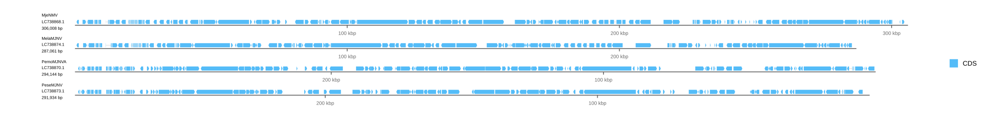
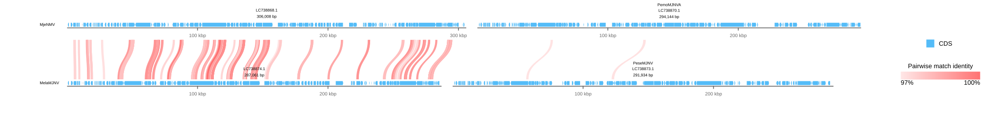

[Documentation home](../../DOCS.md) | [Tutorials](../README.md) | [CLI tutorials](README.md) | [TSV schemas](../../REFERENCE/input-formats-and-tsv-schemas.md)

# Build a multi-row genome comparison from TSV manifests

This project treats record placement and comparison endpoints as reviewable
data. Four complete majanivirus genomes form a two-by-two layout, while two
precomputed TBLASTX files connect only the declared vertical pairs.

## What you will build

You will first draw the four records without links. You will then add a
comparison manifest, filter its evidence, and produce a linked figure with
curved matches, record-local rulers, and one shared bp-per-pixel scale within
each row.

## Prerequisites and inputs

- Install gbdraw so that `gbdraw linear -h` succeeds.
- Download the eight files in the
  [`majanivirus-table-comparison`](../../../gbdraw/web/tutorial-data/majanivirus-table-comparison/records.tsv)
  fixture into one empty working directory: four `.gb` records, two
  `.tblastx.out` files, `records.tsv`, and `comparisons.tsv`.

The records are complete accessions `LC738868.1`, `LC738870.1`, `LC738874.1`,
and `LC738873.1` with lengths 306,008, 294,144, 287,061, and 291,934 bp.

## Step 1: Render the table-defined records

The first command below reads `records.tsv` but deliberately omits
`comparisons.tsv`.

## Step 2: Open the first result

Open `table_driven_comparison_baseline.svg`. Verify that MjeNMV and PemoMJNVA
occupy the first row and MelaMJNV and PeseMJNV occupy the second. There should
be no colored comparison layer.



## Step 3: Read the record manifest

The tracked `records.tsv` is:

```tsv
gbk	record_label	record_id	reverse_complement	order	row	column
MjeNMV.gb	MjeNMV	LC738868.1	false	1	1	1
PemoMJNVA.gb	PemoMJNVA	LC738870.1	true	2	1	2
MelaMJNV.gb	MelaMJNV	LC738874.1	false	3	2	1
PeseMJNV.gb	PeseMJNV	LC738873.1	true	4	2	2
```

`order` gives stable input identity. `row` and `column` place records, while
`reverse_complement` changes display orientation without rewriting a source
file.

## Step 4: Add explicit comparison endpoints

The tracked `comparisons.tsv` is:

```tsv
blast	query	subject
MjeNMV.MelaMJNV.tblastx.out	LC738868.1	LC738874.1
PemoMJNVA.PeseMJNV.tblastx.out	LC738870.1	LC738873.1
```

The endpoint IDs, not proximity in the grid, determine which records each
evidence table connects.

## Step 5: Run the baseline and finished recipes

The finished command keeps matches with at least 97% identity, alignment
length 500, and E-value at most `1e-5`. It uses curves so links crossing rows
remain legible.

<!-- executable:T-CLI-04:start -->
```bash
gbdraw linear \
  --records_table records.tsv \
  --show_labels none \
  --track_layout above \
  --comparison_height 100 \
  --scale_style ruler \
  --ruler_on_axis \
  --linear_record_gap 28 \
  --keep_definition_left_aligned \
  --legend right \
  -o table_driven_comparison_baseline \
  -f svg

gbdraw linear \
  --records_table records.tsv \
  --comparisons_table comparisons.tsv \
  --evalue 1e-5 \
  --identity 97 \
  --alignment_length 500 \
  --pairwise_match_style curve \
  --show_labels none \
  --track_layout above \
  --comparison_height 100 \
  --scale_style ruler \
  --ruler_on_axis \
  --linear_record_gap 28 \
  --keep_definition_left_aligned \
  --legend right \
  -o table_driven_comparison \
  -f svg
```
<!-- executable:T-CLI-04:end -->

## Step 6: Verify what changed

Open `table_driven_comparison.svg`. The first evidence layer should connect
`LC738868.1` to `LC738874.1` with 80 retained HSPs; the second connects
`LC738870.1` to `LC738873.1` with 2 retained HSPs. No horizontal or diagonal
record pair should be linked. All four rulers put the 100 kbp and 200 kbp
marks at identical local x-coordinates, demonstrating the shared scale.



## What changed

The records, grid, and orientations stayed fixed. Adding `comparisons.tsv` and
the three thresholds created the comparison layers; it did not imply links
between undeclared records.

## What you built

You built an auditable four-record comparison in which layout and evidence
mapping live in separate TSV manifests. Run
`python docs/recipes/run_cli_scenarios.py --scenario T-CLI-04` to validate both
figures and the two tables. Continue with the [input-table guide](../../HOW_TO/CLI/use-input-tables.md),
[precomputed comparison guide](../../HOW_TO/CLI/draw-precomputed-comparisons.md),
[linear layout guide](../../HOW_TO/CLI/arrange-linear-records-regions-orientation-labels-and-rulers.md),
or the [TSV schema reference](../../REFERENCE/input-formats-and-tsv-schemas.md).
