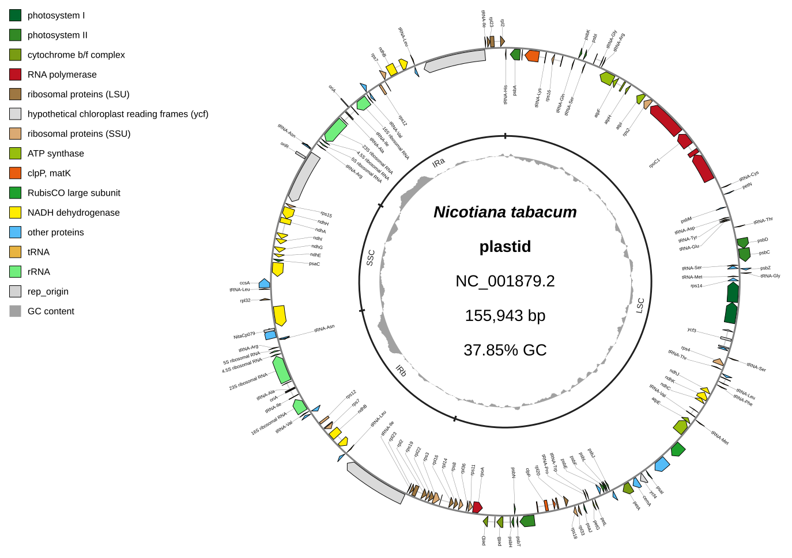

[Home](../../DOCS.md) | [Tutorials](../README.md) | [CLI reference](../../REFERENCE/command-line.md)

# Recreate the Gallery chloroplast map from the command line

## Choose how to build this figure

| GUI | CLI | Python API |
| --- | --- | --- |
| [Web-app workflow](../GUI/build-an-annotated-chloroplast-map.md) | **This page** | [Python workflow](../PYTHON/build-an-annotated-chloroplast-map.md) |

All three workflows use the same complete tobacco plastome, tables, visual
settings, and track geometry. Only the interface changes.

This command-line workflow reproduces the Interactive SVG Gallery chloroplast
map with functional gene colors, radial labels on both strands, one inner
LSC/IRb/SSC/IRa bracket lane, GC content, and an upper-left legend.

## What you'll need

Copy these files from
`gbdraw/web/tutorial-data/tobacco-plastome-regions/` into an empty working
directory:

- `NC_001879.gbk`
- `nicotiana-tabacum-regions.tsv`
- `chloroplast_specific_table.tsv`
- `qualifier_priority.tsv`

## Step 1: Run the documented command

<!-- executable:T-CLI-06:start -->
```bash
gbdraw circular \
  --gbk NC_001879.gbk \
  -t chloroplast_specific_table.tsv \
  -k CDS,rRNA,tRNA,tmRNA,ncRNA,misc_RNA,rep_origin \
  --species '<i>Nicotiana tabacum</i>' \
  --track_type tuckin \
  --separate_strands \
  --gc \
  --no-skew \
  --labels both \
  --label_placement radial \
  --outer_label_x_radius_offset 0.9 \
  --outer_label_y_radius_offset 0.9 \
  --inner_label_x_radius_offset 0.975 \
  --inner_label_y_radius_offset 0.975 \
  --qualifier_priority qualifier_priority.tsv \
  --annotation_table nicotiana-tabacum-regions.tsv \
  --circular_track_slot 'features:features@side=overlay,lane_direction=split' \
  --circular_track_slot 'plastome_regions:annotations@set_id=plastome_regions,side=inside,r=0.65,w=20px,inner_gap_px=1,outer_gap_px=1,show_labels=true,padding_px=1,overflow=compress' \
  --circular_track_slot 'gc_content:dinucleotide_content@side=inside,r=0.56,w=0.08,nt=GC,legend_label=GC content' \
  --block_stroke_color black \
  --block_stroke_width 1 \
  --line_stroke_width 2 \
  --axis_stroke_width 3 \
  --definition_font_size 28 \
  --legend upper_left \
  -o cli_annotated_chloroplast \
  -f svg
```
<!-- executable:T-CLI-06:end -->

The explicit slots are the same three-slot stack used by the GUI and Python
workflows. Because no tick or skew slot is declared, neither appears in the
finished figure.

## Step 2: Inspect the result

Open `cli_annotated_chloroplast.svg`. Confirm `NC_001879.2`, 147 logical
features, radial labels, all four structural-region brackets, GC content, and
the functional-color legend.



The recipe runner executes the literal command above in a clean directory and
checks the complete record, feature count, annotation identities, three-slot
order, labels, colors, and parity with the Python API rendering.

## What you built

You reproduced the shared Gallery chloroplast figure with one auditable CLI
command. Run
`python docs/recipes/run_cli_scenarios.py --scenario T-CLI-06` from a
repository checkout to regenerate it. See the
[track-slot and annotation how-to](../../HOW_TO/CLI/add-region-annotations-and-track-slots.md)
for schema details.
