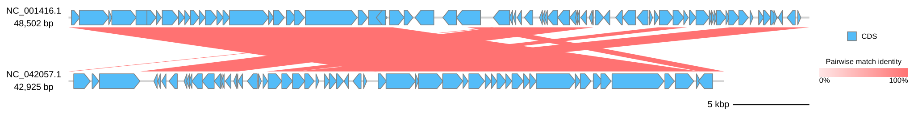

[Documentation home](../../DOCS.md) | [All Tutorials](../README.md) | [Command-line reference](../../REFERENCE/command-line.md)

# Compare Lambda and DE3 from the command line

## Choose how to build this figure

| GUI | CLI | Python API |
| --- | --- | --- |
| [Web app](../GUI/compare-genomes-losatn.md) | **Command line** | [Python API](../PYTHON/compare-genomes-losatn.md) |

This variant uses the six-row LOSATN result produced by the browser Tutorial.
It draws both complete phage records in the same order and keeps the 120 px
comparison band used by the GUI.

## Step 1: Prepare the inputs

Copy `NC_001416.gb`, `NC_042057.1.gb`, and `lambda-de3.losatn.tsv` into an empty
directory.

## Step 2: Draw the finished comparison

<!-- executable:T-CLI-07:start -->
```bash
gbdraw linear \
  --gbk NC_001416.gb NC_042057.1.gb \
  --record_id NC_001416.1 \
  --record_id NC_042057.1 \
  --blast lambda-de3.losatn.tsv \
  --bitscore 50 \
  --evalue 0.01 \
  --identity 0 \
  --alignment_length 0 \
  --comparison_height 120 \
  -o lambda-de3-losatn \
  -f svg
```
<!-- executable:T-CLI-07:end -->

Open `lambda-de3-losatn.svg`. It contains six ribbons between the complete
Lambda and DE3 records.



## Step 3: Verify the evidence

The recipe verifies both accessions, all six endpoint pairs and alignment
lengths, the 120 px comparison geometry, and standard-SVG safety:

```bash
python docs/recipes/run_cli_scenarios.py --scenario T-CLI-07 --check
```

## What you built

You reproduced the browser LOSATN result without rerunning a search. The TSV is
the fixed comparison evidence; the two GenBank files remain the source of
features and record lengths.
