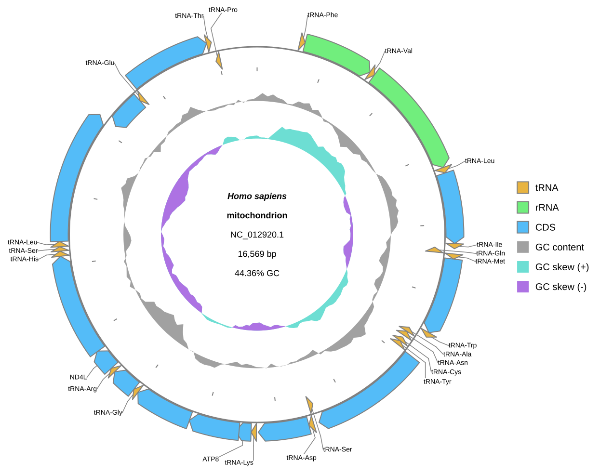

[Home](../../DOCS.md) | [Tutorials](../README.md) | [CLI sessions](../../HOW_TO/CLI/save-and-regenerate-sessions.md)

# Create an interactive figure and reproduce it from a CLI session

## Choose how to build this figure

| GUI | CLI | Python API |
| --- | --- | --- |
| [Web-app workflow](../GUI/create-and-resume-an-interactive-figure.md) | **This page** | [Python workflow](../PYTHON/create-and-resume-an-interactive-figure.md) |

Create the same human mitochondrial figure as the web tutorial, export its
self-contained Interactive SVG, save the request as a compressed session, and
replay the session under a new output name.

## What you'll need

- `HmmtDNA.gbk`;
- `cds_gene_qualifier_priority.tsv`;
- gbdraw installed; and
- an empty working directory.

Both inputs are bundled under `gbdraw/web/tutorial-data/`.

## Step 1: Export the figure and session

<!-- executable:T-CLI-11:start -->
```bash
gbdraw circular \
  --gbk HmmtDNA.gbk \
  --qualifier_priority cds_gene_qualifier_priority.tsv \
  --separate_strands \
  --track_type middle \
  --labels out \
  --species '<i>Homo sapiens</i>' \
  --legend right \
  --session_output interactive_handoff.gbdraw-session.json.gz \
  -o interactive_human_mitochondrion \
  -f svg,interactive_svg

gbdraw circular \
  --session interactive_handoff.gbdraw-session.json.gz \
  -o restored_interactive_figure \
  -f svg
```
<!-- executable:T-CLI-11:end -->

The first command writes the static master, the offline Interactive SVG, and
the compressed working session. The second command reads only the session and
writes the restored static SVG.

## Step 2: Verify the handoff

```bash
python docs/recipes/run_cli_scenarios.py --scenario T-CLI-11 --check
```

The validator checks the current session schema, embedded GenBank resource,
37 stable feature IDs, `COX1` search metadata, offline interactive controls,
and byte-identical static SVGs before and after replay.



## What you built

`interactive_human_mitochondrion.interactive.svg` is the reader-facing file.
`interactive_handoff.gbdraw-session.json.gz` is the editable handoff, and
`restored_interactive_figure.svg` proves that another CLI run can reproduce
the figure without the original input beside it.

## Next steps

- [Save and regenerate CLI sessions](../../HOW_TO/CLI/save-and-regenerate-sessions.md)
- [Export static and interactive formats](../../HOW_TO/CLI/export-static-and-interactive-outputs.md)
- [Review session compatibility](../../REFERENCE/session-and-request-compatibility.md)
