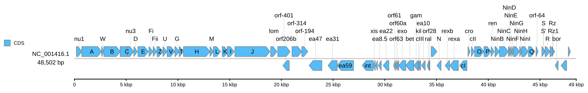

[Home](../../DOCS.md) | [Tutorials](../README.md) | [Get tutorial files](../../GETTING_TUTORIAL_DATA.md) | [CLI reference](../../REFERENCE/command-line.md) | [Export](../../REFERENCE/output-formats-and-export.md)

# Create a reproducible linear diagram from the command line

## Choose how to build this figure

| GUI | CLI | Python API |
| --- | --- | --- |
| [Web-app workflow](../GUI/first-linear-genome-diagram.md) | **This page** | [Python workflow](../PYTHON/first-linear-genome-diagram.md) |

You will draw the complete 48,502 bp Lambda reference genome with concise gene
labels and a ruler on the record axis. The result is one standard SVG containing
all 73 displayed CDS features.

## What you'll need

| Kind | Filename | What to do |
| --- | --- | --- |
| Download | [`NC_001416.gb`](https://eutils.ncbi.nlm.nih.gov/entrez/eutils/efetch.fcgi?db=nuccore&id=NC_001416.1&rettype=gbwithparts&retmode=text) | Download NCBI accession [`NC_001416.1`](https://www.ncbi.nlm.nih.gov/nuccore/NC_001416.1) in full GenBank format and save it as `NC_001416.gb`. |
| Download | [`cds_gene_qualifier_priority.tsv`](../../../gbdraw/web/tutorial-data/shared/cds_gene_qualifier_priority.tsv) | Save this repository-hosted label rule as `cds_gene_qualifier_priority.tsv`. |
| Generated | `lambda_linear.svg` | The command writes this SVG. |
| Reference result | [`lambda_linear.svg`](../../images/t-cli-02/lambda_linear.svg) | Compare your generated SVG with this versioned result. |

This Tutorial has no Create files. You need gbdraw installed so that
`gbdraw -h` succeeds and an empty working directory.

The label rule prefers short `gene` values over long product descriptions.
Verify the sequence input against the versioned NCBI accession shown above;
the repository-hosted TSV is support data, not a sequence source.

## Step 1: Prepare the working directory

Create and enter a new directory:

```bash
mkdir gbdraw-cli-linear
cd gbdraw-cli-linear
```

The sequence link downloads accession `NC_001416.1` directly from NCBI in full
GenBank format. For the repository-hosted label rule, select **Download raw
file**. Save both files with the exact names in the table. See [Get the
tutorial files](../../GETTING_TUTORIAL_DATA.md) for browser, PowerShell, and
identity-check instructions.

On macOS, Linux, or WSL, download both files with `curl`:

```bash
ncbi_efetch="https://eutils.ncbi.nlm.nih.gov/entrez/eutils/efetch.fcgi"
gbdraw_data_base="https://raw.githubusercontent.com/satoshikawato/gbdraw/main/gbdraw/web/tutorial-data"
curl -L "${ncbi_efetch}?db=nuccore&id=NC_001416.1&rettype=gbwithparts&retmode=text" -o NC_001416.gb
curl -L "$gbdraw_data_base/shared/cds_gene_qualifier_priority.tsv" -o cds_gene_qualifier_priority.tsv
```

Confirm that the source record reports `VERSION     NC_001416.1`:

```bash
grep '^VERSION' NC_001416.gb
```

Before running gbdraw, the working directory should contain:

```text
gbdraw-cli-linear/
├── NC_001416.gb
└── cds_gene_qualifier_priority.tsv
```

## Step 2: Generate the first diagram

Run this command from the working directory containing the two input files:

<!-- executable:T-CLI-02:start -->
```bash
gbdraw linear \
  --gbk NC_001416.gb \
  --qualifier_priority cds_gene_qualifier_priority.tsv \
  --show_labels all \
  --separate_strands \
  --scale_style ruler \
  --track_layout middle \
  --legend left \
  -o lambda_linear \
  -f svg
```
<!-- executable:T-CLI-02:end -->

Expected output: the command prints `Generated SVG: lambda_linear.svg` and
writes the Generated file in the current directory.

## Step 3: Inspect the SVG

Open the Generated `lambda_linear.svg`. The definition at the left identifies
`NC_001416.1` and `48,502 bp`. The centered ruler is marked every 5 kbp, and
short labels such as `A`, `B`, `J`, and `int` remain legible near their CDS
features.



The image above is the Reference result. Your SVG should show the same complete
record, labels, ruler, and legend.

The committed recipe checks the XML structure, record metadata, all 73 stable
feature IDs, representative gene labels, and ruler labels. It also rejects
active or external content in this standard SVG.

## If the command fails

- The ruler is missing: keep `--scale_style ruler` and `--track_layout middle`
  in the same command.
- `Output file already exists`: use a new empty directory or a new output
  prefix. gbdraw refuses to replace the existing SVG by default.
