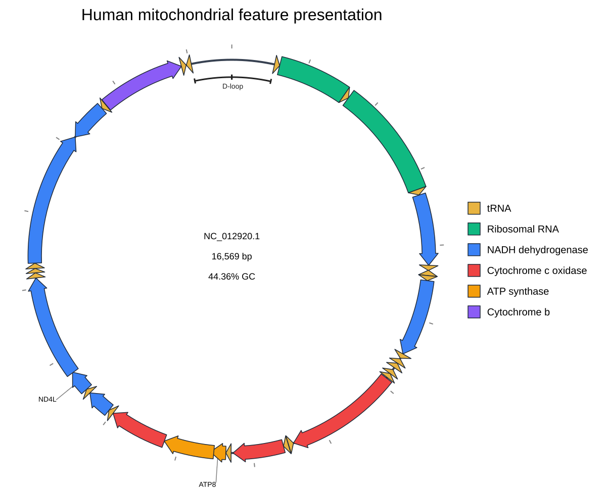

[Documentation home](../../DOCS.md) | [Tutorials](../README.md) | [CLI tutorials](README.md) | [CLI reference](../../REFERENCE/command-line.md)

# Highlight mitochondrial features without editing the GenBank file

This project starts with the complete 16,569 bp human mitochondrial reference
and turns it into a focused presentation without changing its GenBank
annotations.

## What you will build

You will make a baseline map, then a second SVG in which selected CDS and rRNA
features have deliberate colors and labels. A visibility table hides COX1,
keeps ATP6 visible but out of protein searches, and adds the D-loop as an
underlay. Feature shapes and strokes are presentation settings, not edits to
the biological record.

## Prerequisites and inputs

- Install gbdraw so that `gbdraw circular -h` succeeds.
- Start in an empty working directory and create a `tables` directory.
- Copy [`HmmtDNA.gbk`](../../../gbdraw/web/tutorial-data/human-mitochondrion/HmmtDNA.gbk),
  [`HmmtDNA_feature_visibility.tsv`](../../../gbdraw/web/tutorial-data/human-mitochondrion/HmmtDNA_feature_visibility.tsv),
  and [`cds_gene_qualifier_priority.tsv`](../../../gbdraw/web/tutorial-data/shared/cds_gene_qualifier_priority.tsv)
  into the working directory.

## Step 1: Render the unmodified presentation

The first command below reads only the GenBank record. Keep this plain output
so the later presentation changes are easy to review.

## Step 2: Open the first result

Open `mitochondrial_features_baseline.svg`. Verify that its definition names
`NC_012920.1`, reports `16,569 bp`, and shows the complete circular record.


## Step 3: Define color rules

Save this as `tables/presentation_colors.tsv`. Rows are evaluated in order;
the first matching feature-specific rule wins over the base palette.

```tsv
CDS	gene	^ND[1-6]$	#3B82F6	NADH dehydrogenase
CDS	gene	^COX[1-3]$	#EF4444	Cytochrome c oxidase
CDS	gene	^ATP[68]$	#F59E0B	ATP synthase
CDS	gene	^CYTB$	#8B5CF6	Cytochrome b
rRNA	gene	^RNR[12]$	#10B981	Ribosomal RNA
```

## Step 4: Select and rename labels

Save this whitelist as `tables/presentation_labels.tsv`:

```tsv
CDS	gene	^(ND1|COX2|ATP8|ATP6|COX3|CYTB)$
rRNA	gene	^RNR[12]$
```

Then save these resolved-label replacements as
`tables/presentation_label_overrides.tsv`:

```tsv
record_id	feature_type	qualifier	value	label_text
NC_012920.1	CDS	label	^ND1$	Complex I (ND1)
NC_012920.1	CDS	label	^COX2$	Oxidase II
NC_012920.1	rRNA	label	^s-rRNA$	12S rRNA
NC_012920.1	rRNA	label	^l-rRNA$	16S rRNA
```

The qualifier-priority file first selects `gene` for CDS labels. The whitelist
then limits which labels appear, and the override table renames selected
resolved labels.

## Step 5: Apply visibility and shapes

The tracked visibility table demonstrates all three actions: `show` can reveal
a feature outside the baseline type list, `off` removes a feature from the
diagram, and `exclude_matching` keeps a visible CDS out of protein-search
inputs. The finished command draws CDS and tRNA as arrows, rRNA as rectangles,
and the D-loop as an underlay.

## Step 6: Run both reproducible commands

Run the block from the directory containing the three inputs and the `tables`
directory.

<!-- executable:T-CLI-03:start -->
```bash
gbdraw circular \
  --gbk HmmtDNA.gbk \
  --labels none \
  --legend right \
  -o mitochondrial_features_baseline \
  -f svg

gbdraw circular \
  --gbk HmmtDNA.gbk \
  -k CDS,rRNA,tRNA \
  --palette colorblind \
  --table tables/presentation_colors.tsv \
  --qualifier_priority cds_gene_qualifier_priority.tsv \
  --label_whitelist tables/presentation_labels.tsv \
  --label_table tables/presentation_label_overrides.tsv \
  --feature_visibility_table HmmtDNA_feature_visibility.tsv \
  --feature_shape CDS=arrow \
  --feature_shape rRNA=rectangle \
  --feature_shape tRNA=arrow \
  --feature_shape D-loop=underlay \
  --arrow_head_length_ratio auto \
  --arrow_shaft_width_ratio 0.72 \
  --resolve_overlaps \
  --separate_strands \
  --track_type spreadout \
  --labels both \
  --label_rendering auto \
  --block_stroke_color '#1F2937' \
  --block_stroke_width 1.5 \
  --axis_stroke_color '#374151' \
  --axis_stroke_width 4 \
  --line_stroke_color '#9CA3AF' \
  --line_stroke_width 1.5 \
  --species '<i>Homo sapiens</i>' \
  --plot_title 'Human mitochondrial feature presentation' \
  --plot_title_position top \
  --legend right \
  -o mitochondrial_features_highlighted \
  -f svg
```
<!-- executable:T-CLI-03:end -->

## Step 7: Verify what changed

Open `mitochondrial_features_highlighted.svg`. Check for `Complex I (ND1)`,
`Oxidase II`, `12S rRNA`, and `16S rRNA`; COX1 must be absent. The blue,
red, amber, violet, and green rules should appear in the legend. rRNA blocks
are rectangular, directional features remain arrows, and the D-loop occupies
a full-band underlay.



## What changed

Only presentation inputs changed. `HmmtDNA.gbk` stayed byte-for-byte identical;
the SVG still contains the same complete `NC_012920.1` sequence context.

## What you built

You built a baseline and a semantically checked feature-highlighted map. Run
`python docs/recipes/run_cli_scenarios.py --scenario T-CLI-03` from a source
checkout to reproduce both SVGs. Continue with the focused guide to
[colors, labels, visibility, shapes, and strokes](../../HOW_TO/CLI/set-colors-labels-visibility-shapes-and-strokes.md),
the [presentation-table reference](../../REFERENCE/palettes-feature-rules-labels-shapes-and-tracks.md),
or the complete [CLI option reference](../../REFERENCE/command-line.md).
