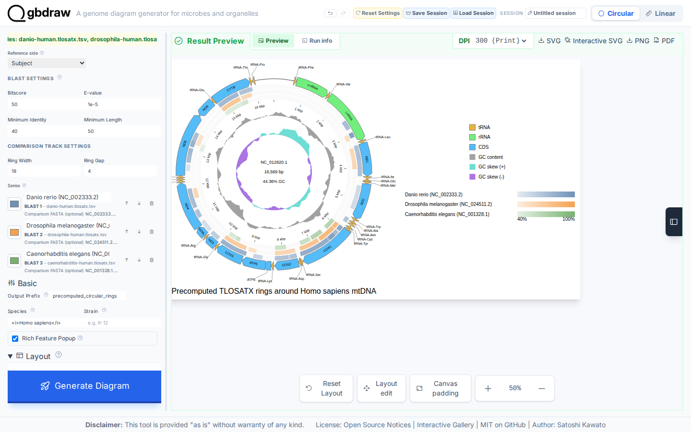
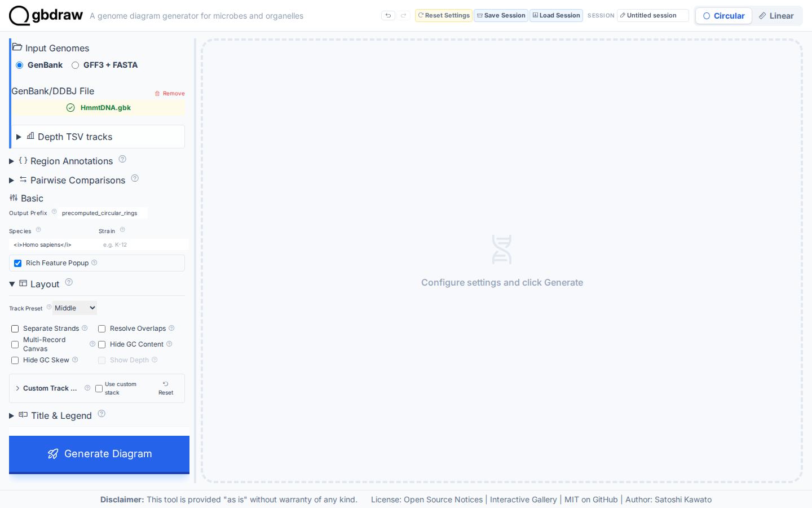
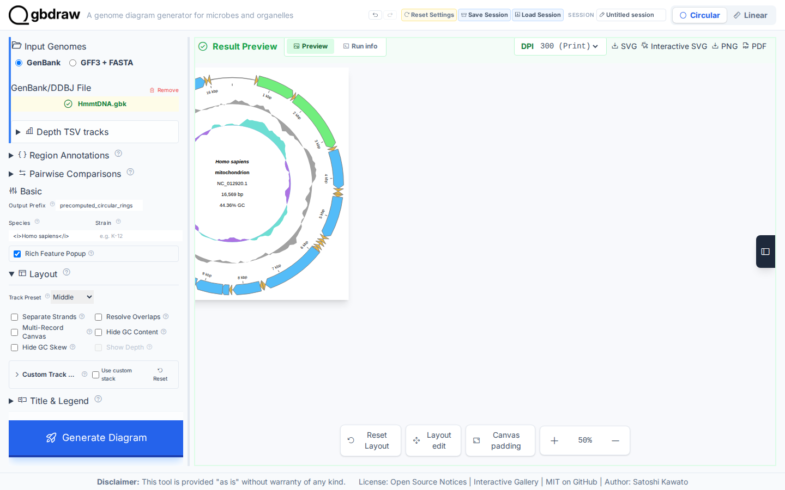
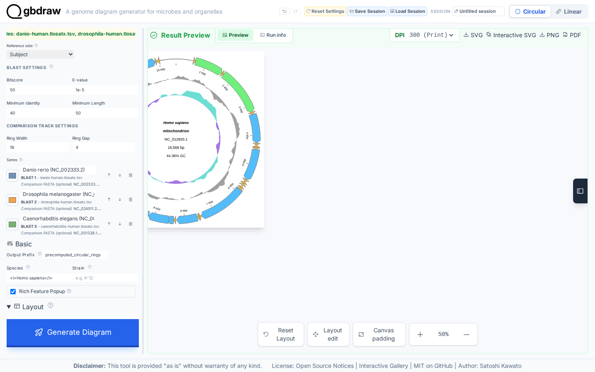
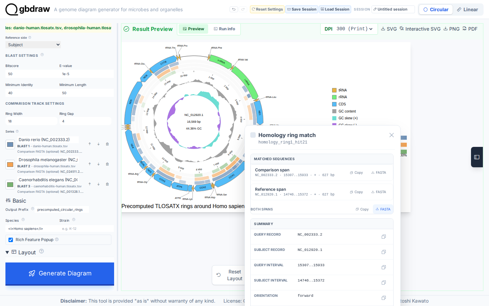

[Documentation home](../../DOCS.md) | [Tutorials](../README.md) | [Web app technical documentation](../../REFERENCE/web-app.md)

# Add circular comparison rings from precomputed results

## Choose how to build this figure

| GUI | CLI | Python API |
| --- | --- | --- |
| **This page** | [Command-line workflow](../CLI/add-precomputed-circular-comparison-rings.md) | [Python workflow](../PYTHON/add-precomputed-circular-comparison-rings.md) |

Add three translated-nucleotide comparison rings around the complete human
mitochondrial genome. The searches are already frozen as TLOSATX outfmt 6
tables, so this project focuses on reference direction, ring order, filtering,
inspection, and sequence export.

## What you'll need

Starting state: open a fresh gbdraw web app page with no session loaded and no
files selected.

Download the human reference and three comparison FASTAs from NCBI, then get
the repository-maintained label rule and three precomputed tables listed below.
See [Get the tutorial inputs](../../GETTING_TUTORIAL_DATA.md) for browser
download steps and the meaning of each file type.

| File | File type | Purpose |
| --- | --- | --- |
| [`HmmtDNA.gbk` — NCBI `NC_012920.1`](https://www.ncbi.nlm.nih.gov/nuccore/NC_012920.1) | Authoritative download | Complete human mitochondrial GenBank reference; save as `HmmtDNA.gbk` |
| [`cds_gene_qualifier_priority.tsv`](../../../gbdraw/web/tutorial-data/shared/cds_gene_qualifier_priority.tsv) | Support download | CDS `gene` label priority |

| Ring | Precomputed support input | Authoritative comparison FASTA | Ring label |
| ---: | --- | --- | --- |
| 1 | [`danio-human.tlosatx.tsv`](../../../gbdraw/web/tutorial-data/metazoan-mitochondria-comparison/danio-human.tlosatx.tsv) | [`NC_002333.2.fna` — NCBI `NC_002333.2`](https://www.ncbi.nlm.nih.gov/nuccore/NC_002333.2) | `Danio rerio (NC_002333.2)` |
| 2 | [`drosophila-human.tlosatx.tsv`](../../../gbdraw/web/tutorial-data/metazoan-mitochondria-comparison/drosophila-human.tlosatx.tsv) | [`NC_024511.2.fna` — NCBI `NC_024511.2`](https://www.ncbi.nlm.nih.gov/nuccore/NC_024511.2) | `Drosophila melanogaster (NC_024511.2)` |
| 3 | [`caenorhabditis-human.tlosatx.tsv`](../../../gbdraw/web/tutorial-data/metazoan-mitochondria-comparison/caenorhabditis-human.tlosatx.tsv) | [`NC_001328.1.fna` — NCBI `NC_001328.1`](https://www.ncbi.nlm.nih.gov/nuccore/NC_001328.1) | `Caenorhabditis elegans (NC_001328.1)` |

The TLOSATX tables are downloaded inputs generated before this Tutorial, not
results generated by the steps below. This workflow creates two new files:

| File | File type | Purpose |
| --- | --- | --- |
| `circular_hsp_spans.fasta` | Generated | Reference and comparison intervals exported in Step 5 |
| `precomputed_circular_rings.svg` | Generated | Finished static diagram saved in Step 5 |

## Step 1: Load the human reference

Select **Circular** and **GenBank**, choose `HmmtDNA.gbk`, and set:

| Control | Value |
| --- | --- |
| Output Prefix | `precomputed_circular_rings` |
| Species | `<i>Homo sapiens</i>` |
| Track Preset | Middle |
| Separate Strands | Off |

## Step 2: Generate the reference map

Select **Generate Diagram** before adding comparison evidence. The first result
identifies `NC_012920.1`, contains 37 feature elements, and has no comparison
rings.

## Step 3: Add the three precomputed comparisons

Open **Pairwise Comparisons**, select **Upload BLAST**, and choose all three TSV
files together. Set **Reference side** to **Subject**: every table uses a
comparison genome as query and human mtDNA as subject.

Attach the matching comparison FASTA to each table, then use:

| Control | Value |
| --- | ---: |
| Bitscore | 50 |
| E-value | `1e-5` |
| Minimum identity | 40 |
| Minimum length | 50 |
| Ring width | 18 |
| Ring gap | 4 |

Keep the ring order and enter the labels shown in the input table. Set **Label
Mode** to **Out** and load `cds_gene_qualifier_priority.tsv` as **Priority File
(TSV)**. Set the title to
`Precomputed TLOSATX rings around Homo sapiens mtDNA`, and the legend to the
right. Set **Plot Title Position** to **Bottom**.

## Step 4: Generate and read the rings

Select **Generate Diagram**. The filters retain 106 HSPs across the three
rings. Colors and legend order identify the comparison source; positions
around the circle are always coordinates on the human subject record.

## Step 5: Inspect an HSP and export its spans

Select a colored HSP. The popup shows its endpoints, identity, alignment
length, reference side, and source ring. Use **Both spans FASTA** to save the
reference and comparison intervals as `circular_hsp_spans.fasta`.

Select **SVG** to save `precomputed_circular_rings.svg`.

## Variant: run TLOSATX in the browser

To compute the three rings instead of uploading frozen tables, keep the same
displayed reference, comparison FASTA order, labels, and filters. Under
**Pairwise Comparisons**, select **Run LOSAT** and **TLOSATX**. Set the
reference gencode to `2`; use subject gencodes `2`, `5`, and `5` for zebrafish,
fruit fly, and nematode, respectively. The displayed human record is the
TLOSATX subject.

The 106-HSP check in Step 4 applies only to the precomputed tables. See
[filters and direction](../../REFERENCE/comparison-programs-thresholds-and-results.md#filters-and-direction)
for the live search contract.

## Next steps

- [Review Circular rings and uploaded comparison tables](../../REFERENCE/comparison-programs-thresholds-and-results.md)
- [Choose a genome-comparison method](../../FAQ.md#which-comparison-method-should-i-use)
