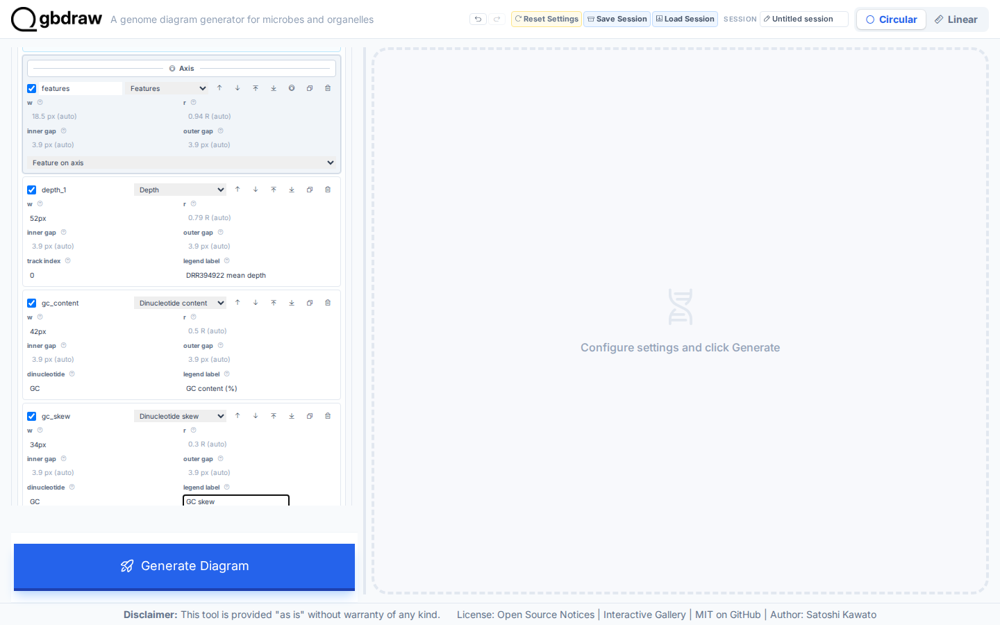
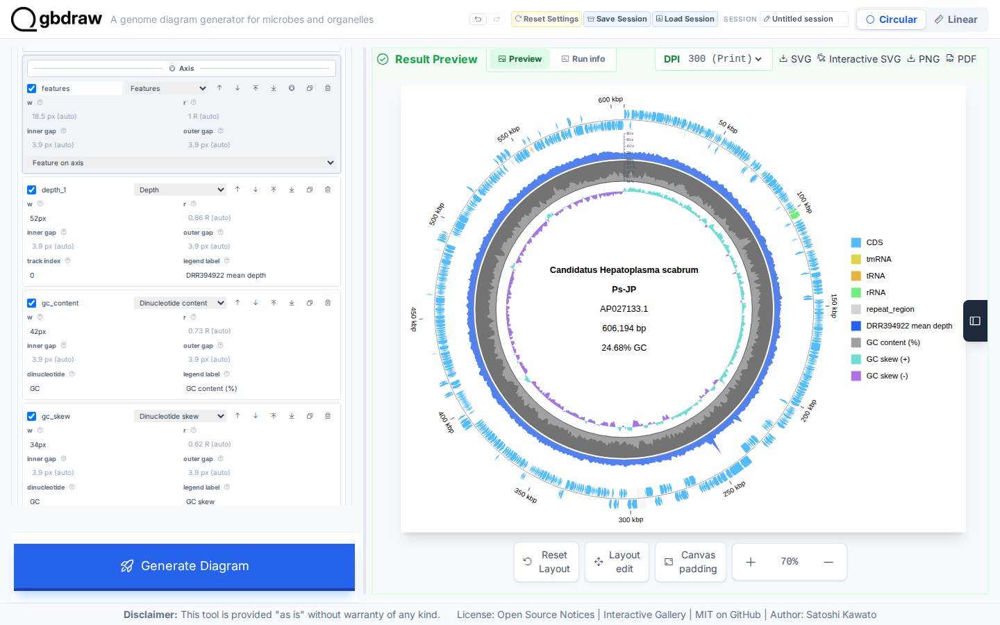

[Documentation home](../../DOCS.md) | [Tutorials](../README.md) | [Web app](../../HOW_TO/GUI/README.md)

# Build a quantitative genome map in the web app

## Choose how to build this figure

| GUI | CLI | Python API |
| --- | --- | --- |
| **This page** | [CLI workflow](../CLI/build-a-quantitative-genome-map.md) | [Python workflow](../PYTHON/build-a-quantitative-genome-map.md) |

Combine measured sequencing depth with GC content and GC skew on the complete
606,194 bp `AP027133.1` record.

## What you'll need

- [`AP027133.gb`](../../../gbdraw/web/tutorial-data/depth-1kb/AP027133.gb)
- [`AP027133.DRR394922.depth-1kb.tsv`](../../../gbdraw/web/tutorial-data/depth-1kb/AP027133.DRR394922.depth-1kb.tsv)

The depth table contains 607 consecutive 1 kbp means with values from 12.446x
to 74.546x.

## Step 1: Load the record and depth table

Select **Circular** and **GenBank**, then choose `AP027133.gb`. Set Output
Prefix to `quantitative_genome_map` and enable **Separate Strands**.

Open **Depth TSV tracks** and load
`AP027133.DRR394922.depth-1kb.tsv`. Configure the series as follows:

- Depth Window: `1`
- Depth Step: `1000`
- Depth Min and Max: `0` and `80`
- Log Scale: off
- Depth Axis and Depth Ticks: on
- Legend title: `DRR394922 mean depth`
- Color: `#2563EB`
- Large and Small Tick: `20` and `10`

Window `1` preserves the already aggregated 1 kbp means; Step `1000` maps
their recorded positions.

## Step 2: Configure GC content and skew

Open **Dinucleotide content/skew**. Set Window and Step to `1000`, select
**Percent** for GC Content Mode, and use a 10%–55% range. Enable Percent Axis
and Percent Ticks with large ticks every `10` and small ticks every `5`.

## Step 3: Fix the radial track order and generate

Open **Custom Track Slots** and enable **Use custom stack**. Arrange and size
the enabled rows as follows:

1. `ticks`, outside the axis, labels outside and ticks inside
2. `features`, on the axis
3. `depth_1`, inside, width `52px`, track index `0`
4. `gc_content`, inside, width `42px`, dinucleotide `GC`, legend label
   `GC content (%)`
5. `gc_skew`, inside, width `34px`, dinucleotide `GC`, legend label `GC skew`

Put the legend on the right.

Select **Generate Diagram**.

## Step 4: Verify

Read the rings from outside to inside: coordinate
ticks, features, blue depth, GC content, and GC skew. The depth axis runs from
0x to 80x. The GC-content axis shows 10%, 20%, 30%, 40%, 50%, and the 55%
upper bound.

Select **SVG** to save `quantitative_genome_map.svg`.

## Next steps

- [Add depth, GC, and skew tracks](../../HOW_TO/GUI/add-depth-gc-and-skew-tracks.md)
- [Understand tracks, axes, and layout](../../EXPLANATION/understand-tracks-axes-and-layout.md)
- [Review the depth TSV schema](../../REFERENCE/input-formats-and-tsv-schemas.md)
