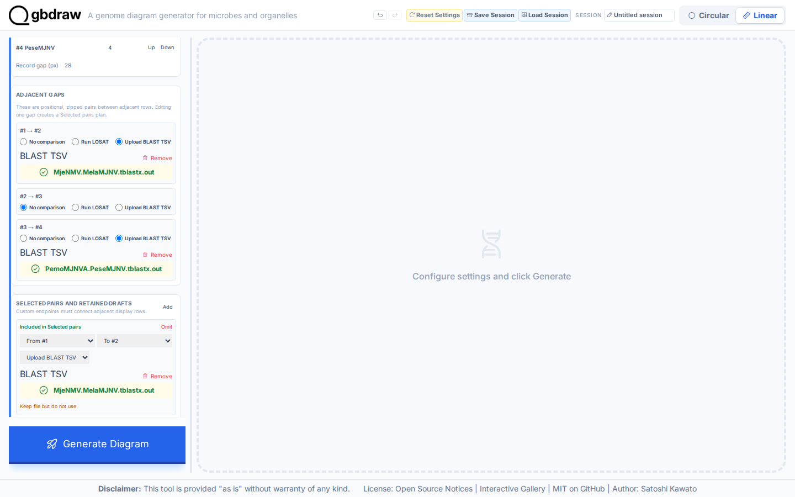
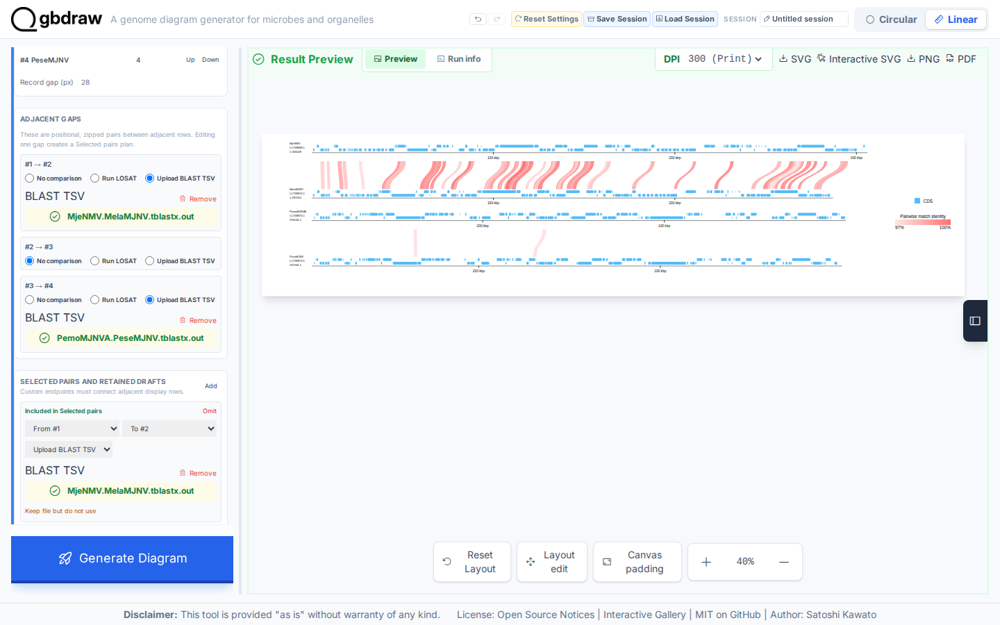

[Documentation home](../../DOCS.md) | [Tutorials](../README.md) | [Web app](../../HOW_TO/GUI/README.md)

# Compare two Majanivirus genome pairs in the web app

## Choose how to build this figure

| GUI | CLI | Python API |
| --- | --- | --- |
| **This page** | [CLI workflow](../CLI/build-a-table-driven-genome-comparison.md) | [Python workflow](../PYTHON/build-a-table-driven-genome-comparison.md) |

Build the four-record figure defined by the CLI manifests through visible web
controls. Two uploaded TBLASTX tables connect only the biological pairs named
by `comparisons.tsv`.

## What you'll need

Use these six files from the
[`majanivirus-table-comparison`](../../../gbdraw/web/tutorial-data/majanivirus-table-comparison/records.tsv)
fixture:

- `MjeNMV.gb`
- `MelaMJNV.gb`
- `PemoMJNVA.gb`
- `PeseMJNV.gb`
- `MjeNMV.MelaMJNV.tblastx.out`
- `PemoMJNVA.PeseMJNV.tblastx.out`

## Step 1: Load and name the four records

Select **Linear** and **GenBank**, add four sequence inputs, and load the files
in the order shown above. Set their definitions to `MjeNMV`, `MelaMJNV`,
`PemoMJNVA`, and `PeseMJNV`. Keep the first two in source orientation and
enable **Reverse complement** for the last two.

Each input covers its full record: `1..306008`, `1..287061`, `1..294144`, and
`1..291934`.

## Step 2: Reproduce the manifest layout

Enable **Arrange in rows**. Put records 1–4 in rows 1–4, respectively, and set
Record gap to `28` px. This matches the single-column layout in `records.tsv`.

Under **Adjacent gaps**:

- For `#1 → #2`, select **Upload BLAST TSV** and load
  `MjeNMV.MelaMJNV.tblastx.out`.
- For `#2 → #3`, select **No comparison**.
- For `#3 → #4`, select **Upload BLAST TSV** and load
  `PemoMJNVA.PeseMJNV.tblastx.out`.

The selected-pairs plan now has two edges and no link between the unrelated
middle records.

## Step 3: Filter, present, and generate

Open **Pairwise Match** and set:

- Pairwise Match Style: **Curve**
- Pairwise Match Height: `100`
- E-value: `1e-5`
- Minimum Identity: `97`
- Minimum Length: `500`

Use **Above** for Track Layout and enable **Lock Definition Column**. In
**Axis & Scale**, show the coordinate scale, select **Ruler**, and enable
**Ruler on Axis**. Leave feature labels off, place the legend on the right,
and set Output Prefix to `table_driven_comparison`.

Select **Generate Diagram**.

## Step 4: Verify

The first comparison contains 80 retained HSPs
from `LC738868.1` to `LC738874.1`; the second contains 2 from `LC738870.1` to
`LC738873.1`. No other endpoint pair should appear.

The 100 kbp and 200 kbp ruler intervals use the same bp-per-pixel scale on all
four records. The last two records run in reverse display orientation without
changing their source files.

Select **SVG** to save `table_driven_comparison.svg`.

## What you built

The GUI figure preserves the record order, orientations, endpoint pairs,
thresholds, curved links, and rulers from the CLI and Python variants. The
capture validator checks 706 feature elements and exactly 82 pairwise links.

## Next steps

- [Use uploaded BLAST results](../../HOW_TO/GUI/use-uploaded-blast-results.md)
- [Arrange linear records, regions, and orientation](../../HOW_TO/GUI/arrange-linear-records-regions-and-orientation.md)
- [Review comparison input schemas](../../REFERENCE/input-formats-and-tsv-schemas.md)
