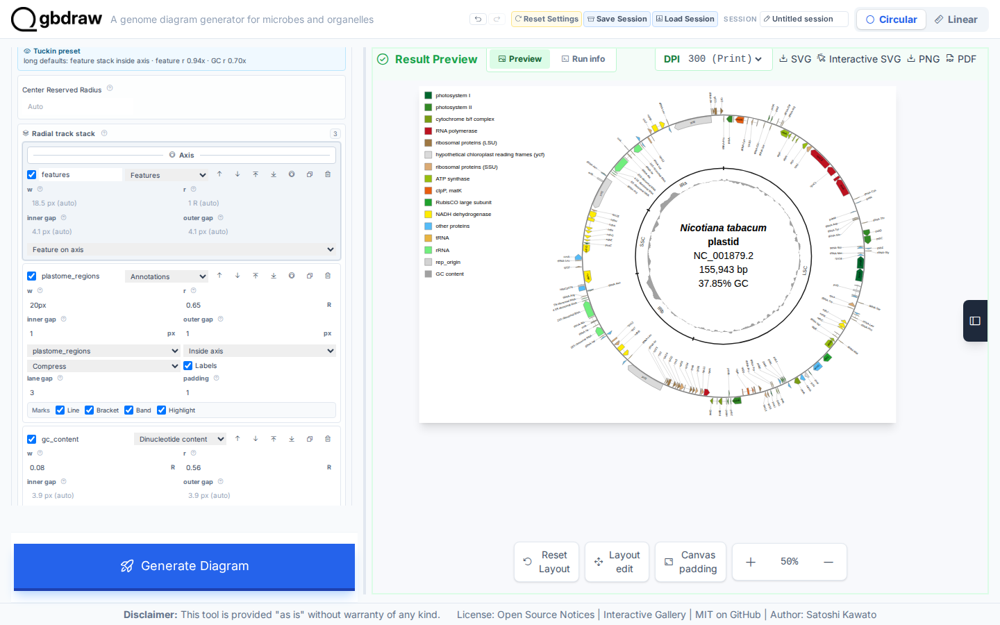
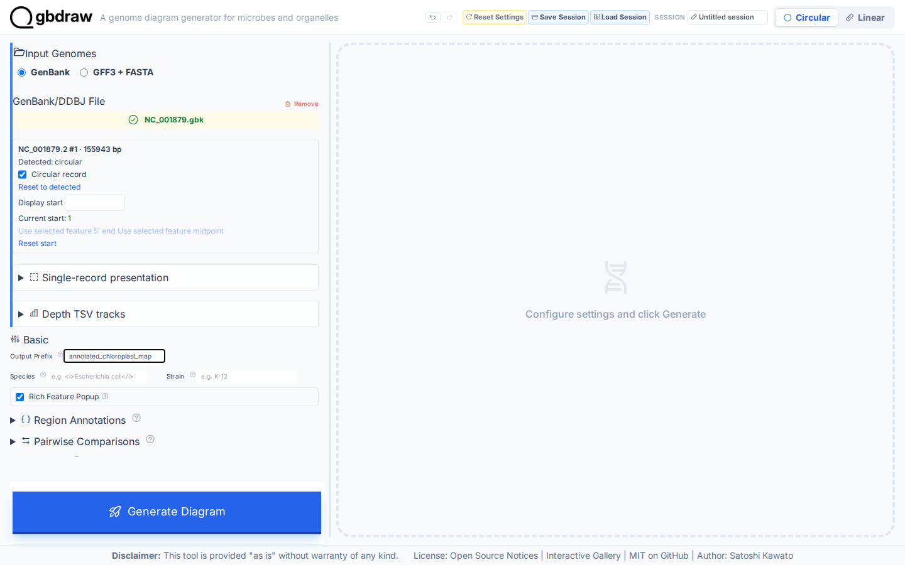
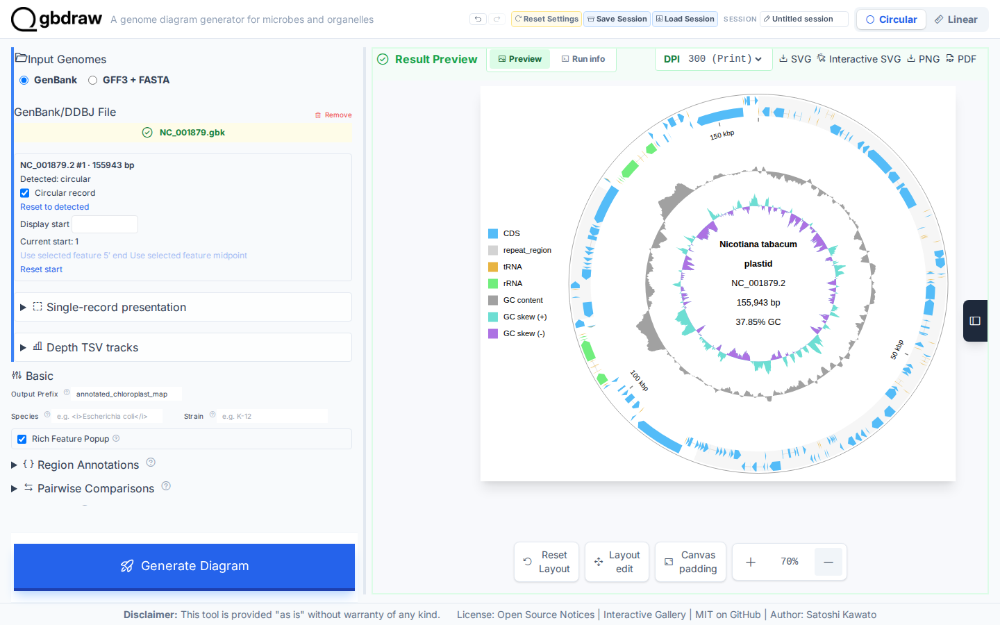
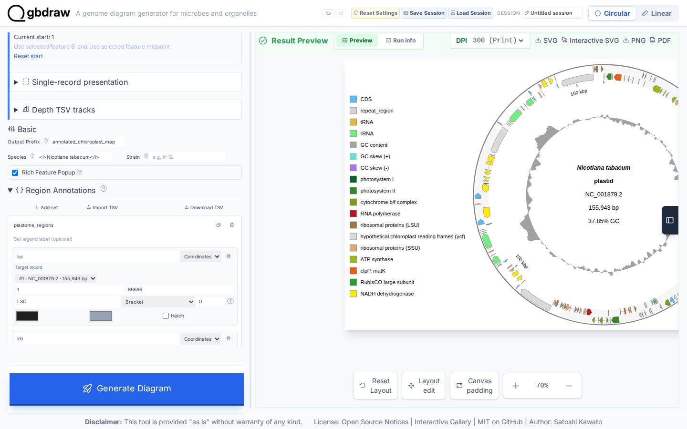
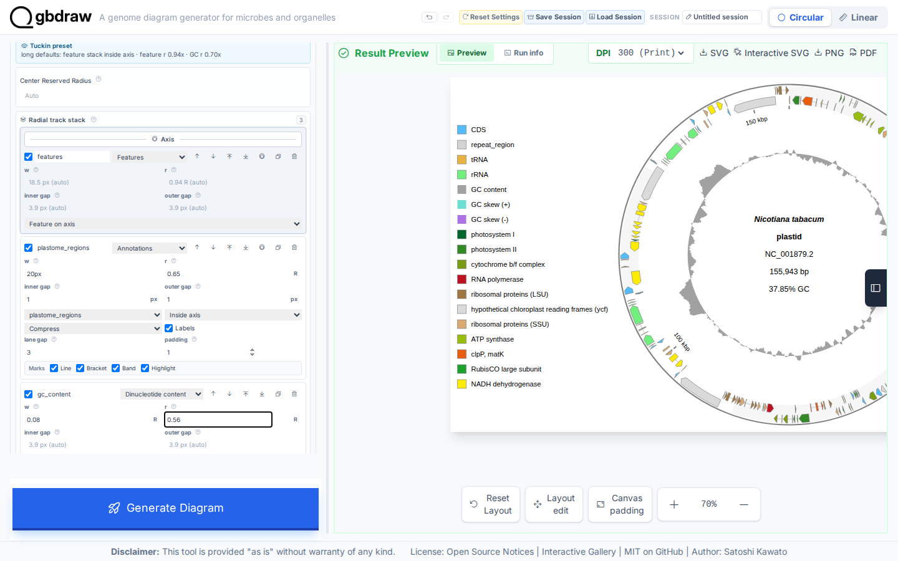

[Documentation home](../../DOCS.md) | [Tutorials](../README.md) | [Web app](../../HOW_TO/GUI/README.md)

# Recreate the Interactive SVG Gallery chloroplast map

## Choose how to build this figure

| GUI | CLI | Python API |
| --- | --- | --- |
| **This page** | [Command-line workflow](../CLI/build-an-annotated-chloroplast-map.md) | [Python workflow](../PYTHON/build-an-annotated-chloroplast-map.md) |

All three workflows use the same complete tobacco plastome, tables, visual
settings, and track geometry. Only the interface changes.

Build the complete tobacco plastome figure shown in the Interactive SVG
Gallery: functional gene colors, radial labels on both sides of the feature
ring, one inner LSC/IRb/SSC/IRa bracket lane, GC content, and an upper-left
legend. The tutorial keeps the raw GenBank record separate from every
presentation table.

## What you'll need

Starting state: open a fresh gbdraw web app page with no session loaded and no
files selected.

Use the filenames below when you download or save each file. See [Get the
tutorial inputs](../../GETTING_TUTORIAL_DATA.md) for browser download steps and
the meaning of each file type.

| File | File type | Purpose |
| --- | --- | --- |
| [`NC_001879.gbk` — NCBI `NC_001879.2`](https://www.ncbi.nlm.nih.gov/nuccore/NC_001879.2) | Authoritative download | Complete tobacco plastome GenBank record; save as `NC_001879.gbk` |
| [`nicotiana-tabacum-regions.tsv`](../../../gbdraw/web/tutorial-data/tobacco-plastome-regions/nicotiana-tabacum-regions.tsv) | Support download | LSC, IRb, SSC, and IRa annotations |
| [`chloroplast_specific_table.tsv`](../../../gbdraw/web/tutorial-data/tobacco-plastome-regions/chloroplast_specific_table.tsv) | Support download | Chloroplast gene-family color rules |
| [`qualifier_priority.tsv`](../../../gbdraw/web/tutorial-data/tobacco-plastome-regions/qualifier_priority.tsv) | Support download | CDS label-priority rules |
| `annotated_chloroplast_map.svg` | Generated | Finished static diagram saved in Step 6 |

The GenBank file is the complete 155,943 bp `NC_001879.2` record. The other
files define structural regions, chloroplast gene-family colors, and CDS label
priority; none edits the sequence or feature coordinates.

## Step 1: Load the complete plastome

Select **Circular** and **GenBank**, choose `NC_001879.gbk` in
**GenBank/DDBJ File**, and set **Output Prefix** to
`annotated_chloroplast_map`.

## Step 2: Generate the visible baseline

Select **Generate Diagram**. Confirm `NC_001879.2` and `155,943 bp`. This first
map proves that the complete record renders before custom tables or slots are
added.

## Step 3: Match the Gallery layout, labels, and colors

Set the main controls as follows:

| Control | Value |
| --- | --- |
| Species | `<i>Nicotiana tabacum</i>` |
| Track Preset | Tuckin |
| Separate Strands | On |
| Hide GC Content | Off |
| Hide GC Skew | On |
| Label Mode | Both (Out + Inner) |
| Outer X / Y label offset | `0.9` / `0.9` |
| Inner X / Y label offset | `0.975` / `0.975` |
| Circular Label Placement | Radial |
| Legend Position | Upper Left |
| Definition Font Size | `28` |
| Block / Line / Axis Stroke Width | `1` / `2` / `3` |
| Plot Title | None |

Set the four label offsets while **Circular Label Placement** is Horizontal,
then change it to Radial. Under **Features**, keep `CDS`, `rRNA`, and `tRNA`; add `tmRNA`, `ncRNA`,
`misc_RNA`, and `rep_origin`; remove `repeat_region`. Under **Colors**, upload
`chloroplast_specific_table.tsv` as **Specific Table (-t)**. Under **Labels**,
upload `qualifier_priority.tsv` as **Priority File (TSV)**. These settings
produce one legend entry per functional group and readable radial gene labels.

## Step 4: Import all four plastome regions

Open **Region Annotations** and import
`nicotiana-tabacum-regions.tsv`. Keep every row in lane `0`:

| Region | Inclusive range | Lane |
| --- | ---: | ---: |
| LSC | 1–86,686 | 0 |
| IRb | 86,687–112,029 | 0 |
| SSC | 112,030–130,600 | 0 |
| IRa | 130,601–155,943 | 0 |

## Step 5: Build the three-slot Gallery stack

Open **Custom Track Slots**, turn on **Use custom stack**, and remove the
**Ticks** and **GC skew** rows. Configure this exact outside-to-inside order:

| Slot | Renderer | Position | Radius | Width | Other settings |
| --- | --- | --- | ---: | ---: | --- |
| `features` | Features | On axis | Auto | Auto | Feature on axis / split |
| `plastome_regions` | Annotations | Inside | `0.65` | `20px` | Set `plastome_regions`; labels on; compress; inner/outer gap `1`; padding `1` |
| `gc_content` | Dinucleotide content | Inside | `0.56` | `0.08` | GC |

The region annotations belong between the feature ring and GC content. They
are not alternating outer decoration and do not need a separate legend item.

## Step 6: Generate and export the finished map

Select **Generate Diagram**. Verify the four structural labels, radial gene
labels inside and outside the feature ring, functional colors, inner GC-content
profile, and upper-left legend. There should be no coordinate-tick or skew
track. Select **SVG** to save `annotated_chloroplast_map.svg`.

## Next steps

- [Add region annotations and custom track slots](../../HOW_TO/GUI/add-region-annotations-and-track-slots.md)
- [Understand tracks, axes, and layout](../../EXPLANATION/understand-tracks-axes-and-layout.md)
- [Review track and annotation schemas](../../REFERENCE/palettes-feature-rules-labels-shapes-and-tracks.md)
