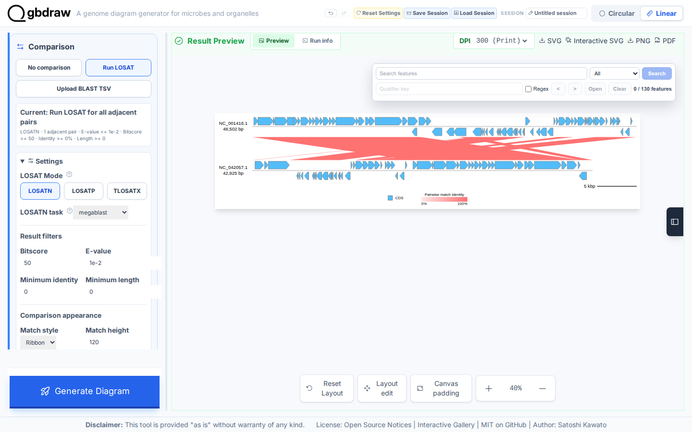
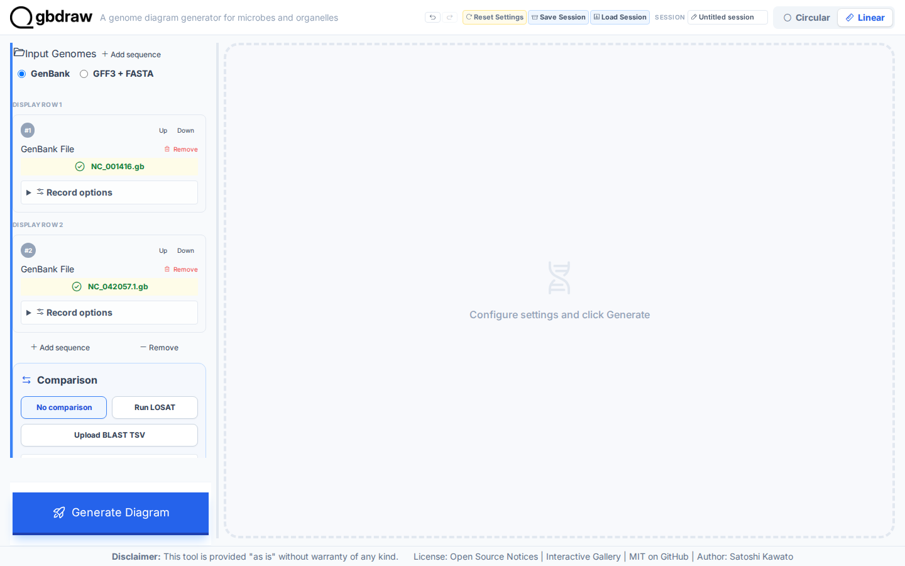
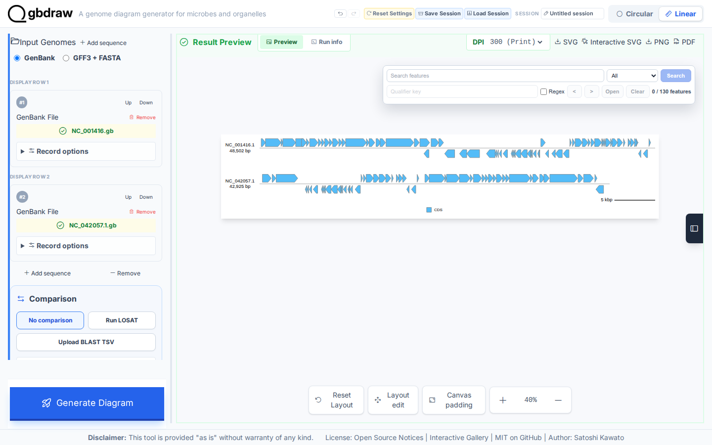
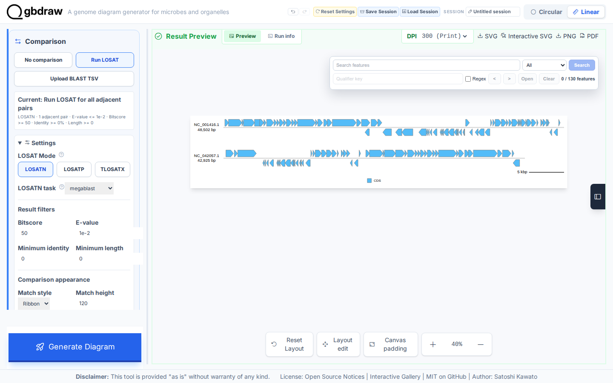
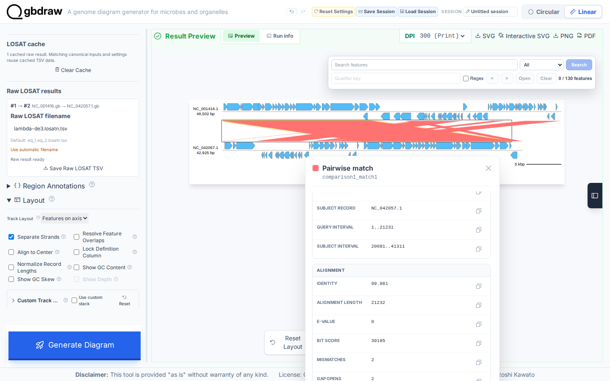

[Documentation home](../../DOCS.md) | [Tutorials](../README.md) | [Web app technical documentation](../../REFERENCE/web-app.md)

# Compare two genomes with LOSATN in the browser

## Choose how to build this figure

| GUI | CLI | Python API |
| --- | --- | --- |
| **This page** | [Command-line workflow](../CLI/compare-genomes-losatn.md) | [Python workflow](../PYTHON/compare-genomes-losatn.md) |

Compare the complete Lambda and DE3 phage genomes with browser LOSATN. You will first draw both records without a comparison, then run a serial, one-thread `megablast` search and export its evidence with the finished SVG.

*Six nucleotide matches connect the complete `NC_001416.1` and `NC_042057.1` records.*

## What you'll need

Starting state: open a fresh gbdraw web app page with no session loaded and no
files selected.

Use the filenames below when you download or save each file. See [Get the
tutorial inputs](../../GETTING_TUTORIAL_DATA.md) for browser download steps and
the meaning of each file type.

| File | File type | Purpose |
| --- | --- | --- |
| [`NC_001416.gb` — NCBI `NC_001416.1`](https://www.ncbi.nlm.nih.gov/nuccore/NC_001416.1) | Authoritative download | Complete Lambda GenBank record; save as `NC_001416.gb` |
| [`NC_042057.1.gb` — NCBI `NC_042057.1`](https://www.ncbi.nlm.nih.gov/nuccore/NC_042057.1) | Authoritative download | Complete DE3 GenBank record; save as `NC_042057.1.gb` |
| [`lambda-de3.losatn.tsv`](../../../gbdraw/web/tutorial-data/lambda-de3-comparison/lambda-de3.losatn.tsv) | Reference result | Frozen six-row result used only to check the new browser run |
| `lambda-de3.losatn.tsv` | Generated | Raw LOSATN evidence saved in Step 4 |
| `lambda-de3-losatn.svg` | Generated | Finished static diagram saved in Step 4 |

The two authoritative GenBank files are the browser inputs. The repository TSV
is a frozen reference output your own run should match; you will produce it
yourself in Step 4 rather than uploading it.

If you download the reference result, keep it in a separate comparison folder:
the reference result and your generated TSV intentionally have the same exact
filename, `lambda-de3.losatn.tsv`.

## Step 1: Load both complete genomes

Select **Linear**. A fresh Linear page reports **Current: No comparison** under
the record list. Under **Input Genomes**, keep **GenBank** selected.

1. In the first **GenBank File** control, choose `NC_001416.gb`.
2. Select **Add sequence** in the **Input Genomes** header.
3. In the second **GenBank File** control, choose `NC_042057.1.gb`.

Keep Lambda first and DE3 second. Leave both **Region (optional)** sections unchanged so the inputs remain the complete `NC_001416.1` (48,502 bp) and `NC_042057.1` (42,925 bp) records.

*The two green upload controls confirm the input order: Lambda first, DE3 second.*

## Step 2: Generate the map without comparison links

Select **Generate Diagram**. The first result should contain two annotated records and no links between them.

*Both record tracks are visible, with no links between them.*

## Step 3: Configure LOSATN

In **Comparison**, select **Run LOSAT** explicitly. Open **Settings**, choose
the **LOSATN** button in **LOSAT Mode**, and set **LOSATN task** and **Match height**. Open
**Basic** and set **Output Prefix**. Finally, continue past **Generate
Diagram**, open **Advanced comparison and layout**, and set the runtime and raw
result values.

| Section | Control | Value |
| --- | --- | --- |
| Settings | LOSAT Mode | LOSATN |
| Settings | LOSATN task | `megablast` |
| Settings / Comparison appearance | Match height | `120` |
| Basic | Output Prefix | `lambda-de3-losatn` |
| Advanced comparison and layout | Execution | Serial |
| Advanced comparison and layout | Total threads | 1 |
| Advanced comparison and layout | Parallel runs | 1 run |
| Advanced comparison and layout | Threads per run | Fixed at 1 |
| Advanced comparison and layout / Raw LOSAT results | Raw LOSAT filename | `lambda-de3.losatn.tsv` |

*The open Settings disclosure shows **LOSAT Mode: LOSATN**, `megablast`, the
result filters, and **Match height: 120**.*

## Step 4: Run LOSATN and download the evidence

Select **Generate Diagram** again. LOSATN runs in the browser, and the result should show six links in the enlarged comparison corridor. These links are high-identity nucleotide alignments; each link joins the query and subject intervals recorded in one TSV row.

*The longest match covers 21,232 aligned bases at 99.981% identity.*

Open **Advanced comparison and layout** and find **Raw LOSAT results**. In the
pair from sequence 1 to sequence 2, select **Save Raw LOSAT TSV**. The browser
saves `lambda-de3.losatn.tsv`. Then select **SVG** in the **Result Preview**
toolbar to save `lambda-de3-losatn.svg`.

The TSV should contain six tab-separated rows. Every query interval falls within 1–48,502, and every subject interval falls within 1–42,925.

## Step 5: Inspect one nucleotide match

Select the longest comparison ribbon in the preview. The **Pairwise match** popup identifies both records and reports the intervals, identity, alignment length, E-value, bit score, mismatches, and gap opens.

*The first match connects Lambda 1..21231 to DE3 20081..41311 and reports 99.981% identity.*

## Next steps

- [Review web app comparison surfaces](../../REFERENCE/web-app.md#comparison-surfaces)
- [Review record selection and layout](../../REFERENCE/web-app.md#record-selection-and-layout)
- [Choose an export format](../../REFERENCE/output-formats-and-export.md)
- [Review input and TSV schemas](../../REFERENCE/input-formats-and-tsv-schemas.md)
