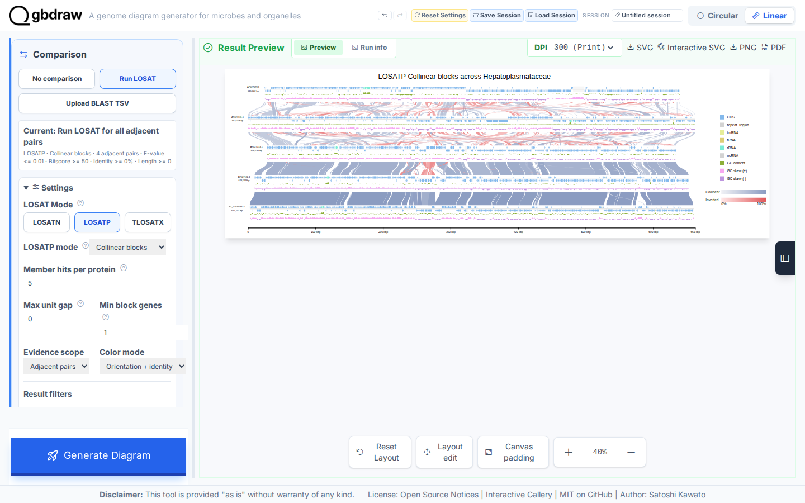
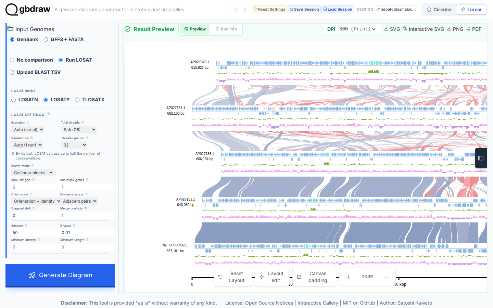
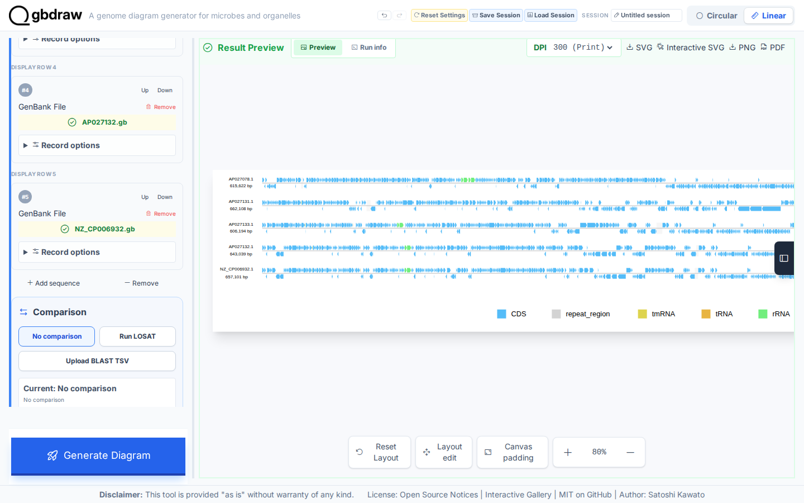
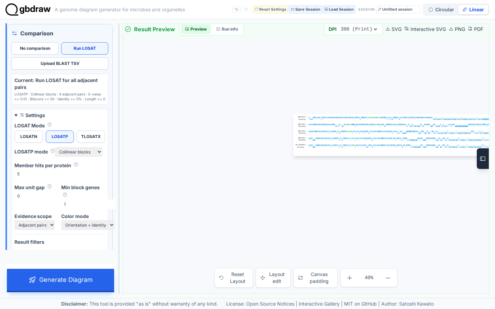
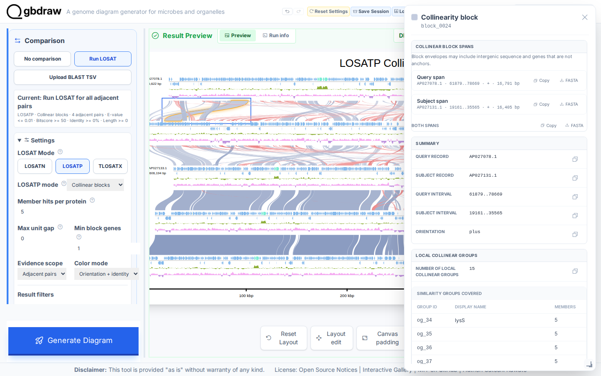

# Recreate the Gallery LOSATP Collinear blocks figure

## Choose how to build this figure

| GUI | CLI | Python API |
| --- | --- | --- |
| **This page** | [Command-line workflow](../CLI/compare-proteins-losatp-collinear.md) | [Python workflow](../PYTHON/compare-proteins-losatp-collinear.md) |

Start from the Interactive SVG Gallery's completed LOSATP **Collinear blocks**
project for five complete Hepatoplasmataceae genomes. Every screenshot in this
tutorial remains in Collinear mode; no Similarity-groups result is mixed into
the workflow.

## What you'll need

Use the bundled Gallery session
`gbdraw/web/gallery/sessions/hepatoplasmataceae_collinear.gbdraw-session.json.gz`.
It contains these complete records in display order:

1. `AP027078.1`
2. `AP027131.1`
3. `AP027133.1`
4. `AP027132.1`
5. `NZ_CP006932.1`

The session preserves 13 cached directional and self LOSATP results used by
the adjacent-pair Collinear workflow. Loading or regenerating it does not need
network access.

## Step 1: Load the Collinear Gallery project

Select **Load Session**, choose
`hepatoplasmataceae_collinear.gbdraw-session.json.gz`, and accept the success
message. Confirm **Linear**, five GenBank inputs, **Run LOSAT**, **LOSATP**, and
**Collinear blocks**.

## Step 2: Inspect the restored Collinear result

The restored preview already contains conserved-order blocks. Blue and red
families distinguish orientation; intensity carries average identity within
each family. The four displayed endpoint pairs connect adjacent records.

## Step 3: Verify the Gallery Collinear controls

Keep these values:

| Control | Value |
| --- | --- |
| Execution | Auto |
| Total threads | Safe |
| Parallel runs | Auto |
| Threads per run | Auto |
| blastp mode | Collinear blocks |
| Max unit gap | 0 |
| Min block genes | 1 |
| Color mode | Orientation + identity |
| Evidence scope | Adjacent pairs |
| Diagonal drift | 0 |
| Merge conflicts | 1 |
| Bitscore / E-value | 50 / `0.01` |
| Minimum identity / length | 0 / 0 |

Set **Output Prefix** to `losatp_collinear`. Keep the Middle layout, centered
records, separate strands, GC content and GC skew, ruler, ajisai palette,
curved ribbons, top title, and right legend.

## Step 4: Regenerate without rerunning LOSATP

Select **Generate Diagram**. The cached adjacent-pair evidence is reused with
zero search misses and zero new LOSATP jobs. This recomputes the Collinear
presentation while keeping the four readable adjacent ribbon layers.

## Step 5: Inspect and export a block

Select a ribbon. The popup reports the block ID, query and subject intervals,
orientation, covered Similarity groups, anchors, and envelope sequences.

Use **Both spans FASTA** to save `collinear_members.fasta`, then select **SVG**
to save `losatp_collinear.svg`.

## Next steps

- [Draw Collinear blocks as a focused task](../../HOW_TO/GUI/draw-collinear-protein-blocks.md)
- [Create protein Similarity groups](../../HOW_TO/GUI/create-protein-similarity-groups.md)
- [Choose a genome-comparison method](../../EXPLANATION/choose-a-genome-comparison-method.md)
- [Review LOSATP result semantics](../../REFERENCE/comparison-programs-thresholds-and-results.md)
