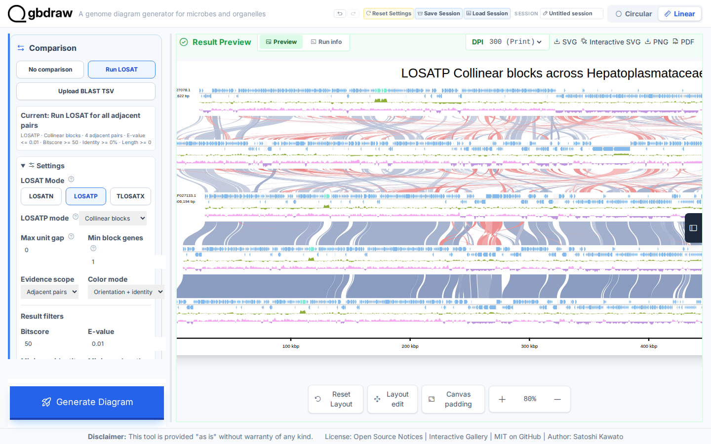

[Documentation home](../../DOCS.md) | [Tutorials](../README.md) | [Web app technical documentation](../../REFERENCE/web-app.md)

# Recreate the Gallery LOSATP Collinear blocks figure

## Choose how to build this figure

| GUI | CLI | Python API |
| --- | --- | --- |
| **This page** | [Command-line workflow](../CLI/compare-proteins-losatp-collinear.md) | [Python workflow](../PYTHON/compare-proteins-losatp-collinear.md) |

Build the Interactive SVG Gallery's LOSATP **Collinear blocks** figure from
five complete Hepatoplasmataceae genomes. This Tutorial starts with the
versioned source records, uploads each one, and runs LOSATP in the browser. It
does not load a Gallery session or reuse a prebuilt LOSATP cache.

## What you'll need

Starting state: open a fresh gbdraw web app page with no session loaded and no
files selected.

Download each record as **GenBank (full)** from the linked NCBI Revision History
snapshot and save it with the local filename shown. See [Get the tutorial
inputs](../../GETTING_TUTORIAL_DATA.md) for format and accession checks after
the download.

| Order | Local filename and authoritative source | Record ID | Length |
| ---: | --- | --- | ---: |
| 1 | [`AP027078.gb` — NCBI Revision History snapshot](https://www.ncbi.nlm.nih.gov/sviewer/viewer.cgi?tool=portal&save=file&db=nuccore&report=gbwithparts&id=AP027078.1&sat=3&satkey=69902295) | `AP027078.1` | 615,622 bp |
| 2 | [`AP027131.gb` — NCBI Revision History snapshot](https://www.ncbi.nlm.nih.gov/sviewer/viewer.cgi?tool=portal&save=file&db=nuccore&report=gbwithparts&id=AP027131.1&sat=3&satkey=69902296) | `AP027131.1` | 662,108 bp |
| 3 | [`AP027133.gb` — NCBI Revision History snapshot](https://www.ncbi.nlm.nih.gov/sviewer/viewer.cgi?tool=portal&save=file&db=nuccore&report=gbwithparts&id=AP027133.1&sat=3&satkey=69902298) | `AP027133.1` | 606,194 bp |
| 4 | [`AP027132.gb` — NCBI Revision History snapshot](https://www.ncbi.nlm.nih.gov/sviewer/viewer.cgi?tool=portal&save=file&db=nuccore&report=gbwithparts&id=AP027132.1&sat=3&satkey=69902297) | `AP027132.1` | 643,039 bp |
| 5 | [`NZ_CP006932.gb` — NCBI Revision History snapshot](https://www.ncbi.nlm.nih.gov/sviewer/viewer.cgi?tool=portal&save=file&db=nuccore&report=gbwithparts&id=NZ_CP006932.1&sat=60&satkey=39275474) | `NZ_CP006932.1` | 657,101 bp |

All five links are official NCBI Revision History downloads pinned to the
annotation revisions used here. The `sat=3` pins are `AP027078.1` with
`satkey=69902295`, `AP027131.1` with `satkey=69902296`, `AP027133.1` with
`satkey=69902298`, and `AP027132.1` with `satkey=69902297`;
`NZ_CP006932.1` uses `sat=60` and `satkey=39275474`. The record IDs and
sequence lengths remain those in the table. Save each NCBI response under its
listed local filename; do not substitute a repository copy or a Gallery
session.

The workflow creates these files:

| File | File type | Purpose |
| --- | --- | --- |
| `collinear_members.fasta` | Generated | Both nucleotide spans exported from one block in Step 5, then renamed |
| `losatp_collinear.svg` | Generated | Finished static diagram saved in Step 5 |

## Step 1: Upload the five source records

Select **Linear**. Under **Input Genomes**, keep **GenBank** selected and
confirm the fresh **Current: No comparison** status below the record list.

1. In the first **GenBank File** control, choose `AP027078.gb`.
2. Select **Add sequence** in the **Input Genomes** header, then choose
   `AP027131.gb` in the new card.
3. Repeat the header **Add sequence** action for `AP027133.gb`, `AP027132.gb`, and
   `NZ_CP006932.gb`, in that order.

Keep all optional regions empty so every row uses its complete record. Confirm
that the five green file controls show the filenames in the same order as the
source table.

*The fourth and fifth uploaders confirm the end of the input order:
`AP027132.gb` precedes `NZ_CP006932.gb`. Pair boundaries are inspected later
under **Selected pairs**.*

## Step 2: Generate the five-record baseline

Select **Generate Diagram** while the status remains **Current: No
comparison**. The first Linear result contains 2,994 rendered feature elements. Select **Zoom
out** six times to reach **40%**, then drag the preview horizontally until the
complete diagram is centered. Use this overview to verify all five rows and the
absence of ribbons.

For a readable check of the source identities, select **Zoom in** four times to
reach **80%**. Drag the preview horizontally to the right until the complete
left definition column is inside **Result Preview**. Confirm these five ID and
length pairs: `AP027078.1` / `615,622 bp`, `AP027131.1` / `662,108 bp`,
`AP027133.1` / `606,194 bp`, `AP027132.1` / `643,039 bp`, and
`NZ_CP006932.1` / `657,101 bp`.

Select **Zoom out** four times to return to **40%** before changing the
settings in Step 3.

## Step 3: Configure LOSATP Collinear

In **Comparison**, select **Run LOSAT** explicitly. Open **Selected pairs (4)**
and find **Comparison boundary: display row 4 to 5**. Confirm that its pair
connects sequence 4 (`AP027132.gb`) to sequence 5 (`NZ_CP006932.gb`), then
close the disclosure.

Open **Settings**, choose the **LOSATP** button in **LOSAT Mode**, and choose
**Pairwise matches** from the **LOSATP mode** menu. Under **Comparison appearance**, set **Match
style** to **Curve**, then change **LOSATP mode** to **Collinear blocks** and
set the primary search and filter values. The presentation switch preserves
the Curve draft while hiding the appearance controls. Continue past
**Generate Diagram**, open **Advanced comparison and layout**, and set the
runtime and advanced Collinear values.

Fresh and Reset Collinear settings default **Evidence scope** to **All
records**. This Gallery reproduction intentionally changes it to **Adjacent
pairs** to preserve the checked recipe and output.

| Section | Control | Value |
| --- | --- | --- |
| Settings | LOSAT Mode | LOSATP |
| Settings | LOSATP mode (appearance step) | Pairwise matches |
| Settings / Comparison appearance | Match style | Curve |
| Settings | LOSATP mode (final) | Collinear blocks |
| Settings | Max unit gap | `0` |
| Settings | Min block genes | `1` |
| Settings | Color mode | Orientation + identity |
| Settings | Evidence scope | Adjacent pairs |
| Settings / Result filters | Bitscore / E-value | `50` / `0.01` |
| Settings / Result filters | Minimum identity / length | `0` / `0` |
| Advanced comparison and layout | Execution | Auto |
| Advanced comparison and layout | Total threads | Safe |
| Advanced comparison and layout | Parallel runs | Auto |
| Advanced comparison and layout | Threads per run | Auto |
| Advanced comparison and layout / Advanced collinear search | Diagonal drift | `0` |
| Advanced comparison and layout / Advanced collinear search | Merge conflicts | `1` |
| Basic | Output Prefix | `losatp_collinear` |

Set **Track Layout** to **Features on axis**, center the records, separate
strands, and show GC content, GC skew, and a coordinate ruler. Choose the
**Ajisai** palette, put the title
`LOSATP Collinear blocks across Hepatoplasmataceae` at the top, and put the
legend on the right.

## Step 4: Run LOSATP and generate the blocks

Select **Generate Diagram**. This first Collinear run computes the required
directional, self, and adjacent-pair LOSATP evidence from the five uploaded
records; it does not restore cached evidence from a session. Leave the page
open until processing finishes. Select **Reset zoom**, select **Zoom out** six
times to reach **40%**, then drag the preview horizontally until the complete
diagram is centered.

The result contains 500 rendered Collinear match elements. Their endpoints
cover the four adjacent display pairs. Blue and red families distinguish the
two orientations, and intensity carries average identity within each family.

Keep the **40%** view as the complete overview. Select **Zoom in** four times to
reach **80%**, then drag the preview horizontally to the right until **Pairwise
match 1** is wholly inside **Result Preview**. This closer view separates
individual block boundaries while retaining their orientation colors.

## Step 5: Inspect and export a block

Focus the first visible ribbon and press **Enter**. Drag the popup by its header
to the opposite top corner so it does not cover the selected ribbon. The top of
the popup shows the query and subject spans and three FASTA downloads,
including **Both spans FASTA**.

Use **Both spans FASTA**. The browser names the download from its generated
match ID, for example `comparison1_match1_both.fna`; rename that file to
`collinear_members.fasta`. It must contain two non-empty nucleotide records,
one from each endpoint genome. Then scroll within the popup to inspect its
orientation, covered Similarity groups, and anchors. Close the popup, then
select **SVG** to save `losatp_collinear.svg`.

## Variant: use all-record evidence

Keep **Adjacent pairs** for the checked result above. To build blocks from
every record pair, change **Evidence scope** to **All records** in Step 3. A
fresh five-record run executes 25 directional and self search jobs. Block
construction uses evidence from every record pair, while the finished ribbons
still connect adjacent display rows.

See [selected Linear edges](../../REFERENCE/comparison-programs-thresholds-and-results.md#selected-linear-edges)
for the scope and display rules.

## Next steps

- [Review LOSATP comparison modes](../../REFERENCE/comparison-programs-thresholds-and-results.md)
- [Create protein Similarity groups](compare-proteins-losatp.md)
- [Choose a genome-comparison method](../../FAQ.md#which-comparison-method-should-i-use)
