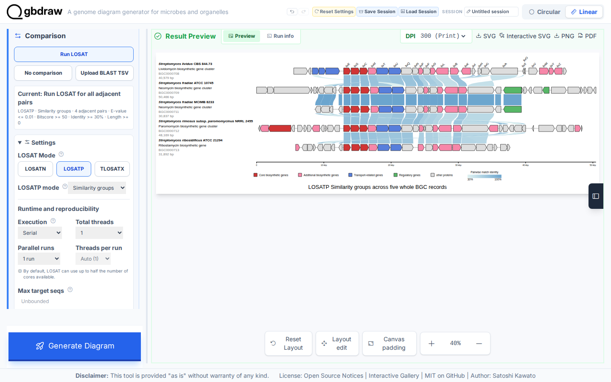
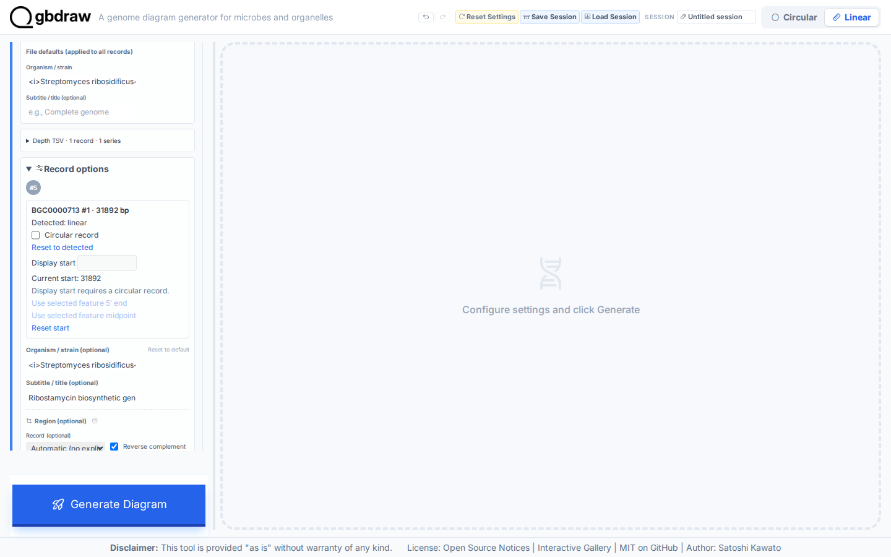
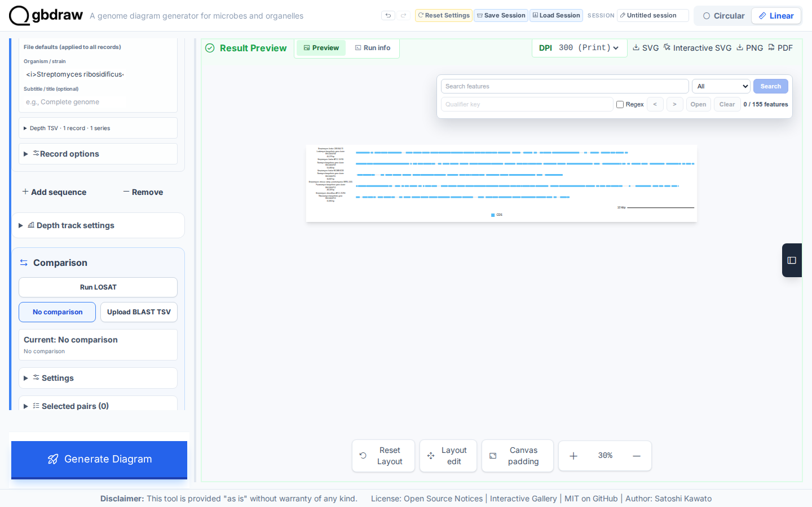
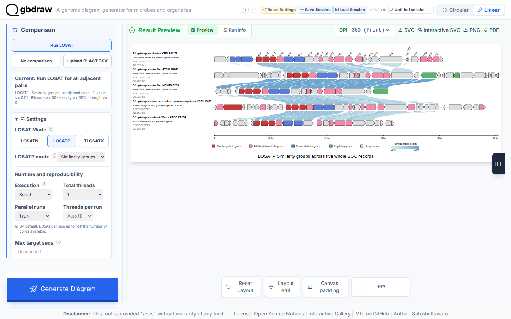
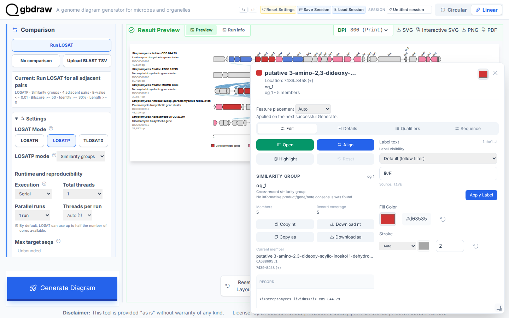
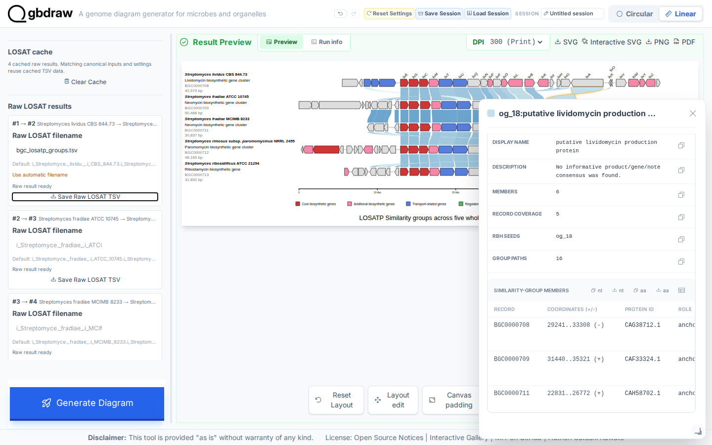

[Documentation home](../../DOCS.md) | [Tutorials](../README.md) | [Web app technical documentation](../../REFERENCE/web-app.md)

# Create protein Similarity groups with LOSATP in the browser

## Choose how to build this figure

| GUI | CLI | Python API |
| --- | --- | --- |
| **This page** | [Command-line workflow](../CLI/compare-proteins-losatp.md) | [Python workflow](../PYTHON/compare-proteins-losatp.md) |

Use LOSATP **Similarity groups** to compare five aminoglycoside biosynthetic
gene-cluster records. The records remain Linear. They are native BGC database
regions, not complete chromosomes, so this Tutorial does not turn them into
circular genomes.

## What you'll need

Starting state: open a fresh gbdraw web app page with no session loaded and no
files selected.

Download the five GenBank inputs from MIBiG in this order. See [Get the tutorial
inputs](../../GETTING_TUTORIAL_DATA.md) for browser download steps and the
meaning of each file type.

| Order | Downloaded input | Record ID | Length | CDS |
|---:|---|---|---:|---:|
| 1 | [`BGC0000708.gbk` — MIBiG `BGC0000708.5`](https://mibig.secondarymetabolites.org/repository/BGC0000708.5/BGC0000708.gbk) | `BGC0000708` | 40,579 bp | 30 |
| 2 | [`BGC0000709.gbk` — MIBiG `BGC0000709.5`](https://mibig.secondarymetabolites.org/repository/BGC0000709.5/BGC0000709.gbk) | `BGC0000709` | 50,466 bp | 38 |
| 3 | [`BGC0000711.gbk` — MIBiG `BGC0000711.5`](https://mibig.secondarymetabolites.org/repository/BGC0000711.5/BGC0000711.gbk) | `BGC0000711` | 30,837 bp | 21 |
| 4 | [`BGC0000712.gbk` — MIBiG `BGC0000712.5`](https://mibig.secondarymetabolites.org/repository/BGC0000712.5/BGC0000712.gbk) | `BGC0000712` | 48,169 bp | 40 |
| 5 | [`BGC0000713.gbk` — MIBiG `BGC0000713.5`](https://mibig.secondarymetabolites.org/repository/BGC0000713.5/BGC0000713.gbk) | `BGC0000713` | 31,892 bp | 26 |

Download the three presentation inputs and save the two generated results with
these exact filenames:

| File | File type | Purpose |
| --- | --- | --- |
| [`BGC0000708-BGC0000713_default_colors.tsv`](../../../gbdraw/web/tutorial-data/aminoglycoside-bgc-five/BGC0000708-BGC0000713_default_colors.tsv) | Support download | Default CDS color override |
| [`BGC0000708-BGC0000713_specific_colors.tsv`](../../../gbdraw/web/tutorial-data/aminoglycoside-bgc-five/BGC0000708-BGC0000713_specific_colors.tsv) | Support download | BGC gene-kind color rules |
| [`cds_gene_qualifier_priority.tsv`](../../../gbdraw/web/tutorial-data/shared/cds_gene_qualifier_priority.tsv) | Support download | CDS `gene` label priority |
| `bgc_losatp_groups.tsv` | Generated | Raw LOSATP evidence saved in Step 5 |
| `bgc_losatp_groups.svg` | Generated | Aligned static diagram saved in Step 5 |

Upload all five GenBank files as whole records. Keep the table order and leave all optional Region fields blank.
Keep the first four records in their source orientation; turn on
**Reverse complement** only for `BGC0000713` to reproduce the Gallery layout.

## Step 1: Load the five Linear records

Select **Linear** and **GenBank**. Confirm the fresh **Current: No comparison**
status. Upload `BGC0000708.gbk`, then use **Add sequence** in the **Input
Genomes** header four times and upload the remaining files in the table order.

For the fifth row, `BGC0000713`, open **Record options** and turn on **Reverse
complement**. This changes only its display orientation; it does not crop,
split, or alter the source record.

## Step 2: Draw the records before comparing them

Select **Generate Diagram**. The first result contains 155 CDS features and no
comparison ribbons.

## Step 3: Configure Similarity groups

In **Comparison**, select **Run LOSAT** explicitly. Open **Settings** and choose
the **LOSATP** button in **LOSAT Mode**, then choose **Similarity groups** from
the **LOSATP mode** menu. Under **Comparison appearance**, set **Match style**
to **Curve**, then enter the filter values. Continue past **Generate Diagram**,
open **Advanced comparison and layout**, and set the deterministic runtime
values.

| Section | Control | Value |
|---|---|---|
| Settings | LOSAT Mode | LOSATP |
| Settings | LOSATP mode | Similarity groups |
| Settings / Comparison appearance | Match style | Curve |
| Settings / Result filters | Bitscore | `50` |
| Settings / Result filters | E-value | `0.01` |
| Settings / Result filters | Minimum identity | `30` |
| Settings / Result filters | Minimum length | `0` |
| Advanced comparison and layout | Execution | Serial |
| Advanced comparison and layout | Total threads | `1` |
| Advanced comparison and layout | Parallel runs | `1 run` |
| Advanced comparison and layout | Threads per run | `1` |
| Layout | Separate Strands | Off |
| Basic | Output Prefix | `bgc_losatp_groups` |

Match the Interactive SVG Gallery presentation with these display settings:

| Control | Value |
|---|---|
| Palette | Orange |
| Override File (-d) | `BGC0000708-BGC0000713_default_colors.tsv` |
| Specific Table (-t) | `BGC0000708-BGC0000713_specific_colors.tsv` |
| Show Labels | First record |
| Priority File (TSV) | `cds_gene_qualifier_priority.tsv` |
| Label Font Size | `18` |
| Label Placement / Rotation | Above feature / `45` |
| Feature Height | `75` |
| Block Stroke Width / Line Stroke Width | `2` / `2` |
| Show Coordinate Scale (Linear) | On |
| Linear scale style | Ruler |
| Axis Stroke Width | `5` |
| Lock Definition Column | On |
| Definition name | `20` px, Bold |
| Definition subtitle | `20` px, Normal |
| Definition accession / length | `20` px, Normal |

The first record therefore carries readable CDS `gene` labels; the remaining
four records stay unlabeled. Under **Title & Legend**, set the four visible
Definition line sizes to `20`, choose **Bold** only for **Name / Species**, and
leave the other lines at **Normal**. Fit the complete final preview at **40%**
before capturing or exporting it.

## Step 4: Run LOSATP

Select **Generate Diagram** again. The result contains 23 stable
groups and 77 displayed group links. Similarity groups uses all-vs-all search
evidence across the five records, but the four displayed endpoint pairs are
`0708→0709`, `0709→0711`, `0711→0712`, and `0712→0713`.

There is no direct `BGC0000708→BGC0000713` ribbon. Proteins shared by the first
and last records are represented by the same group ID across the adjacent-link
chain. This is the canonical Similarity-groups presentation; it is not a
Pairwise comparison between only the first and last records.

## Step 5: Align every record to `og_1`

Select the `livE` CDS in `og_1` on the first record. Its feature popup includes
an **Align** action because the current result is in Similarity-groups mode.

Select **Align**. gbdraw regenerates the same 23-group comparison without
rerunning LOSATP and shifts each record so its `og_1` member shares one
x-coordinate. This is the alignment used by the Interactive SVG Gallery.

Open **Advanced comparison and layout** and find **Raw LOSAT results**. In the
comparison between sequence 1 and sequence 2, set **Raw LOSAT filename** to
`bgc_losatp_groups.tsv` and select **Save Raw LOSAT TSV**. The file contains
232 twelve-column rows. Select **SVG** after alignment to save
`bgc_losatp_groups.svg`.

## Step 6: Inspect a group

Select a comparison ribbon. The popup reports the group ID, display name,
member count, record coverage, RBH seeds, paths, and every member protein.

## Next steps

- [Review LOSATP comparison modes](../../REFERENCE/comparison-programs-thresholds-and-results.md)
- [Draw Collinear protein-match blocks](compare-proteins-losatp-collinear.md)
- [Choose a genome-comparison method](../../FAQ.md#which-comparison-method-should-i-use)
