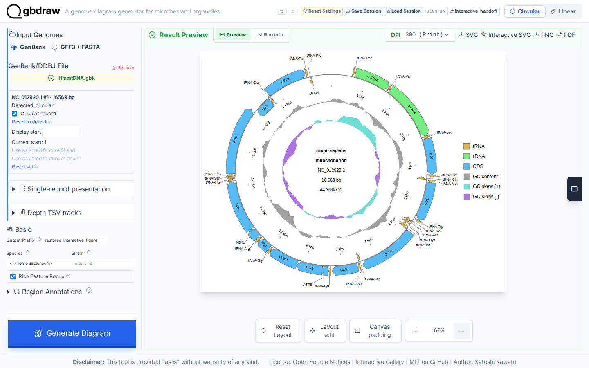
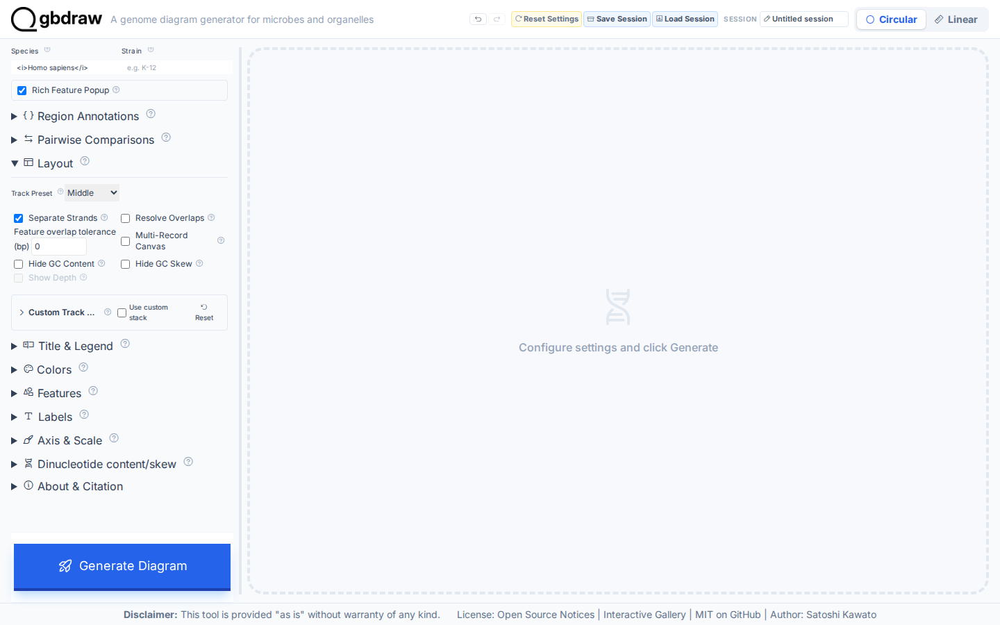
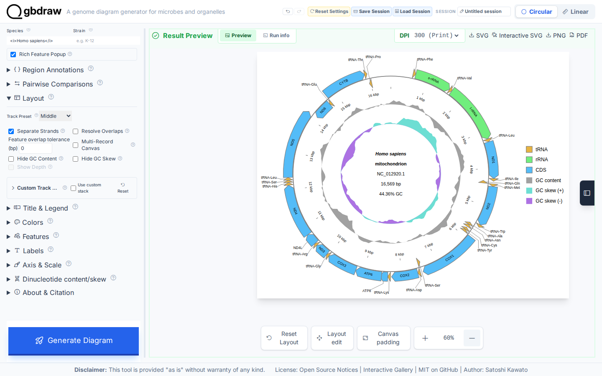
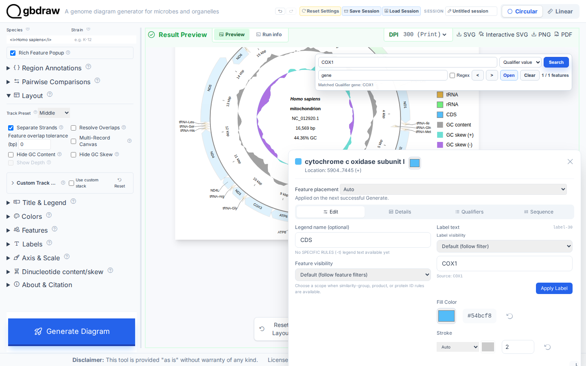
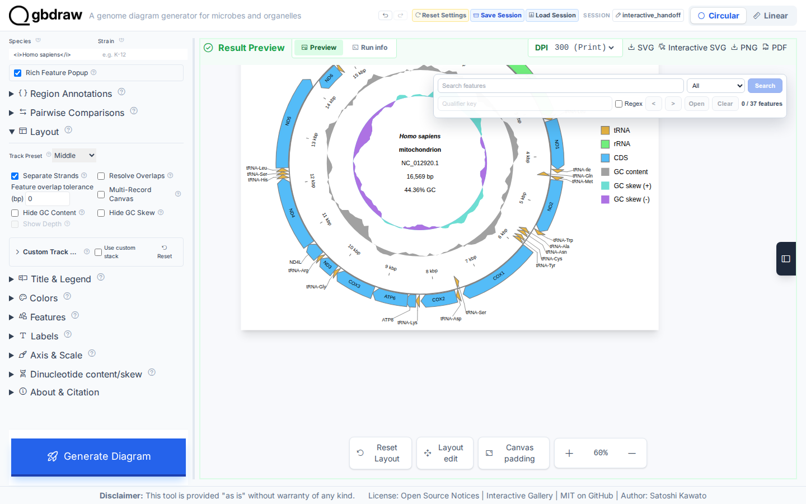

# Create an interactive figure and reproduce it from a saved session

## Choose how to build this figure

| GUI | CLI | Python API |
| --- | --- | --- |
| **This page** | [Command-line workflow](../CLI/create-and-resume-an-interactive-figure.md) | [Python workflow](../PYTHON/create-and-resume-an-interactive-figure.md) |

Create a finished human mitochondrial map, export an offline Interactive SVG,
inspect `COX1`, save the project, and reproduce the same figure in a fresh
browser context.

## What you'll need

- The gbdraw web app
- `gbdraw/web/tutorial-data/human-mitochondrion/HmmtDNA.gbk`

## Step 1: Load the record

Select **Circular** and **GenBank**, choose `HmmtDNA.gbk`, and set **Output
Prefix** to `interactive_human_mitochondrion`.

## Step 2: Generate the finished map

Set Species to `<i>Homo sapiens</i>`, use the Middle track preset, separate the
strands, keep GC content and GC skew, place labels outside, and put the legend
on the right. Select **Generate Diagram**.

The result contains the complete `NC_012920.1` record and 37 rendered feature
elements.

## Step 3: Export the offline Interactive SVG

In the Result Preview toolbar, select **Interactive SVG**. The browser saves
`interactive_human_mitochondrion.interactive.svg`.

This is a self-contained SVG: its feature metadata, search interface, popup
logic, and runtime assets travel with the file. It does not need the gbdraw web
app or a network connection when opened later.

## Step 4: Inspect COX1 before handoff

In **Search features**, choose **Qualifier value**, enter `gene` as the
qualifier key, search for `COX1`, and open the active feature. Confirm its
location in the feature popup.

Close the popup and clear the search.

## Step 5: Save the project session

Select **Save Session**, enter `interactive_handoff`, and save
`interactive_handoff.gbdraw-session.json.gz`.

The Interactive SVG is the reader-facing artifact. The session is the
reproducible working state: it preserves the inputs, settings, result, and
compatible render request needed to continue editing.

## Step 6: Reproduce the figure in a fresh context

Open a fresh gbdraw page, select **Load Session**, and choose the saved session.
After the result is restored, change **Output Prefix** to
`restored_interactive_figure`, select **Generate Diagram**, and export **SVG**.

The saved file is `restored_interactive_figure.svg`. Its record, feature IDs,
texts, labels, track groups, and placement match the original figure; only
subpixel browser font measurement may vary by less than one pixel.

## What you built

You now have three complementary artifacts: an offline Interactive SVG for
exploration, a compressed session for reproducible continuation, and a static
SVG regenerated from that session in a fresh browser context.

## Next steps

- [Inspect and edit a diagram](../../HOW_TO/GUI/inspect-and-edit-a-diagram.md)
- [Save, restore, undo, and reproduce work](../../HOW_TO/GUI/save-restore-undo-and-reproduce-work.md)
- [Export publication and interactive figures](../../HOW_TO/GUI/export-publication-and-interactive-figures.md)
- [Review Interactive SVG semantic hooks](../../REFERENCE/interactive-svg-and-semantic-hooks.md)
