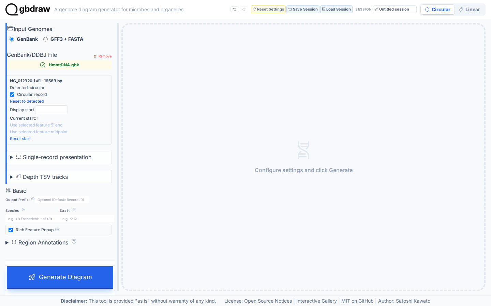
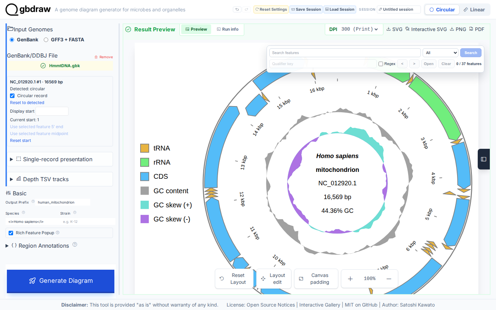
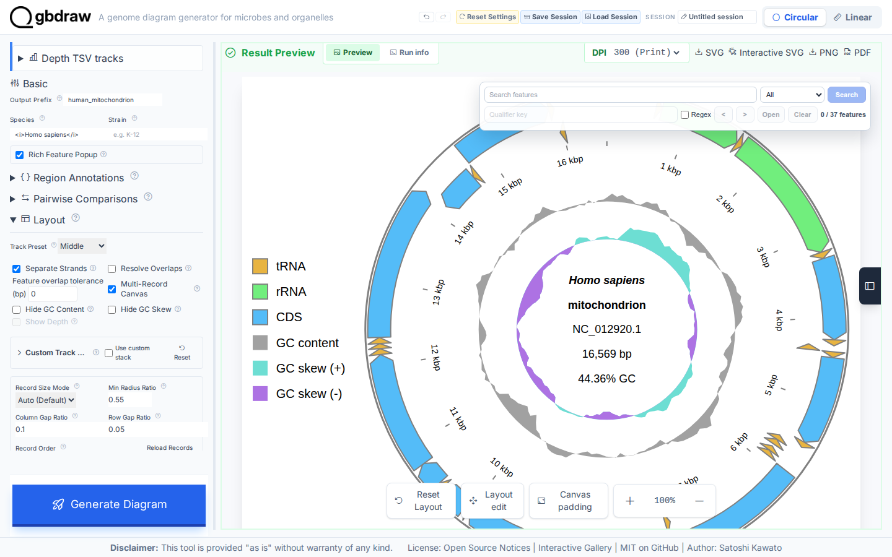
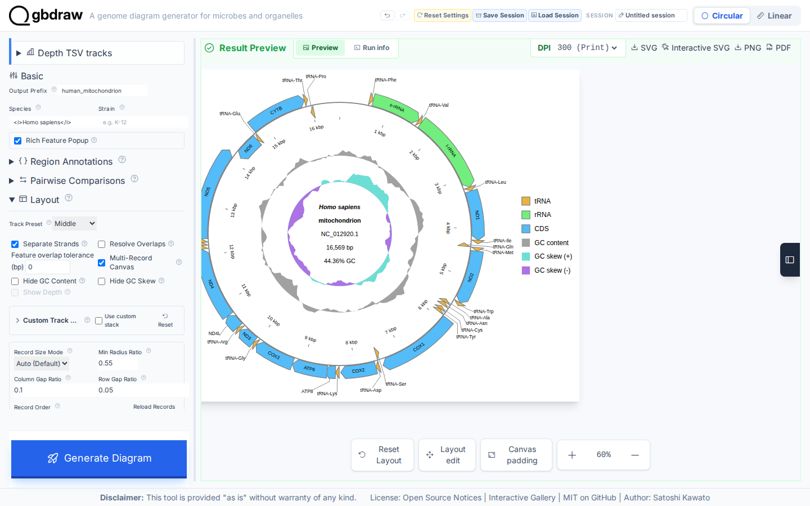

# Create and export your first circular genome diagram

## Choose how to build this figure

| GUI | CLI | Python API |
| --- | --- | --- |
| **This page** | [Command-line workflow](../CLI/first-circular-genome-diagram.md) | [Python workflow](../PYTHON/first-genome-diagram.md) |

All three workflows build the same labeled human mitochondrial figure. Only
the interface changes.

Create a labeled Circular SVG from the bundled human mitochondrial GenBank record. You will generate a working diagram in Step 2, then add the publication label and external feature labels before exporting it.

*The finished diagram identifies the record, keeps both GC tracks, places feature labels outside the circle, and puts the legend on the right.*

## What you'll need

- The gbdraw web app
- The bundled `gbdraw/web/tutorial-data/human-mitochondrion/HmmtDNA.gbk` file
- The bundled `gbdraw/web/tutorial-data/shared/cds_gene_qualifier_priority.tsv` label rule

## Step 1: Load the bundled mitochondrial genome

Select **Circular** at the top of the app and keep **GenBank** selected under **Input Genomes**. In **GenBank/DDBJ File**, choose `HmmtDNA.gbk`.

The uploader should show `HmmtDNA.gbk` in green.

*Confirm that Circular and GenBank are selected and that the uploader names `HmmtDNA.gbk`.*

## Step 2: Generate the first diagram

Select **Generate Diagram** without changing the advanced settings. When processing finishes, **Result Preview** displays the first Circular map.

*The first result identifies `NC_012920.1` and includes feature rings, GC content, GC skew, and coordinate ticks.*

## Step 3: Add a publication label

Under **Basic**, enter these values:

| Control | Value |
| --- | --- |
| Output Prefix | `human_mitochondrion` |
| Species | `<i>Homo sapiens</i>` |

Select **Generate Diagram** again. The center label should show *Homo sapiens* in italics.

*The Basic controls retain the output prefix and species markup, while the preview renders the species name in italics.*

## Step 4: Make the feature map easier to read

Set the final layout values below. **Track Preset** and the three checkboxes are under **Layout**. **Label Mode** and **Priority File (TSV)** are under **Labels**, and **Legend Position** is under **Title & Legend**.

| Control | Value |
| --- | --- |
| Track Preset | Middle |
| Separate Strands | On |
| Hide GC Content | Off |
| Hide GC Skew | Off |
| Label Mode | Out |
| Priority File (TSV) | `cds_gene_qualifier_priority.tsv` |
| Legend Position | Right |

*The visible Layout controls show Middle with separate strands enabled and both GC tracks retained. Keep Labels at Out and the legend at Right as listed above.*

Select **Generate Diagram**. The completed map adds external feature labels, uses the `gene` qualifier for every CDS label, and retains the right-side legend.

*The finished preview shows the labeled mitochondrial map and the six-entry legend on its right.*

## Step 5: Export the SVG

In the **Result Preview** toolbar, select **SVG**.

*Use SVG for the static publication figure. The browser saves `human_mitochondrion.svg`.*

## What you built

You now have a static Circular SVG named `human_mitochondrion.svg`. It contains the `NC_012920.1` record, an italicized *Homo sapiens* label, 37 rendered features, all 13 CDS labels from `gene`, coordinate ticks, GC content and skew tracks, and a right-side legend.

## Next steps

- [Create a Linear layout](first-linear-genome-diagram.md)
- [Customize plot colors and labels](../../HOW_TO/GUI/style-features-labels-titles-and-legends.md)
- [Compare genomes](compare-genomes-losatn.md)
- [Save and restore an interactive session](../../HOW_TO/GUI/save-restore-undo-and-reproduce-work.md)
