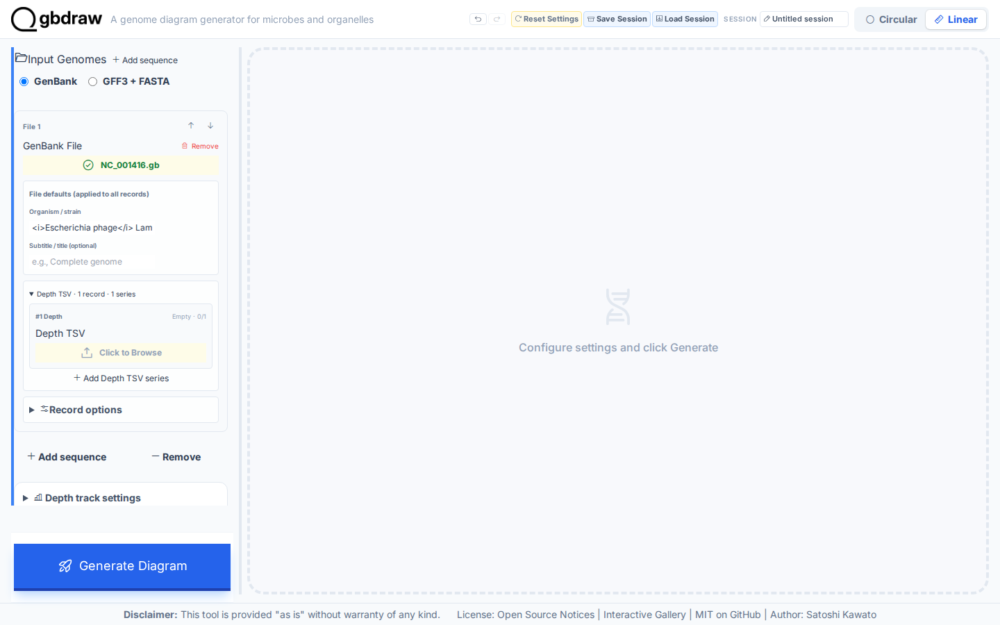
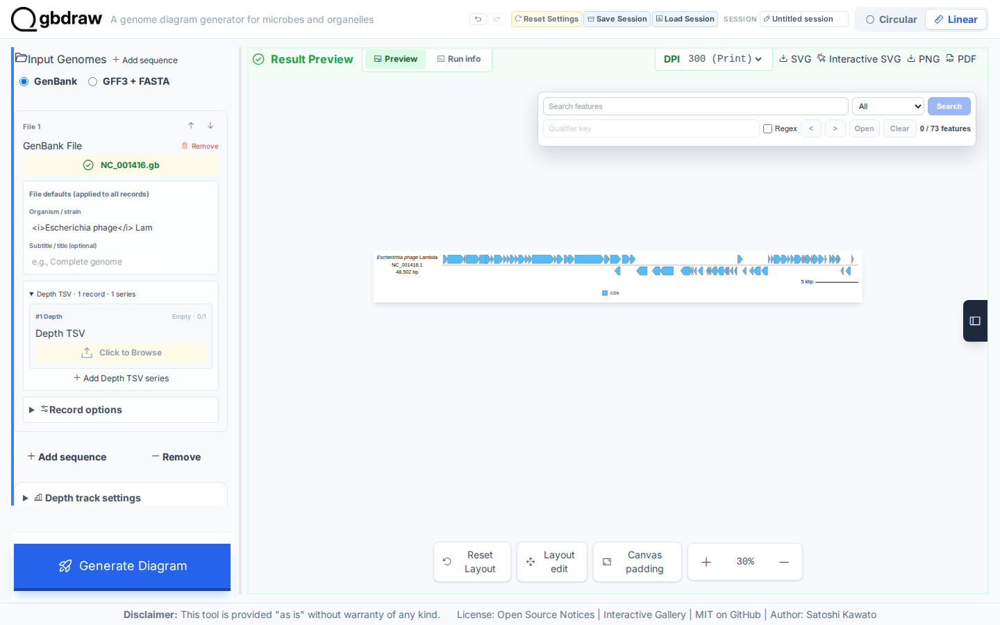
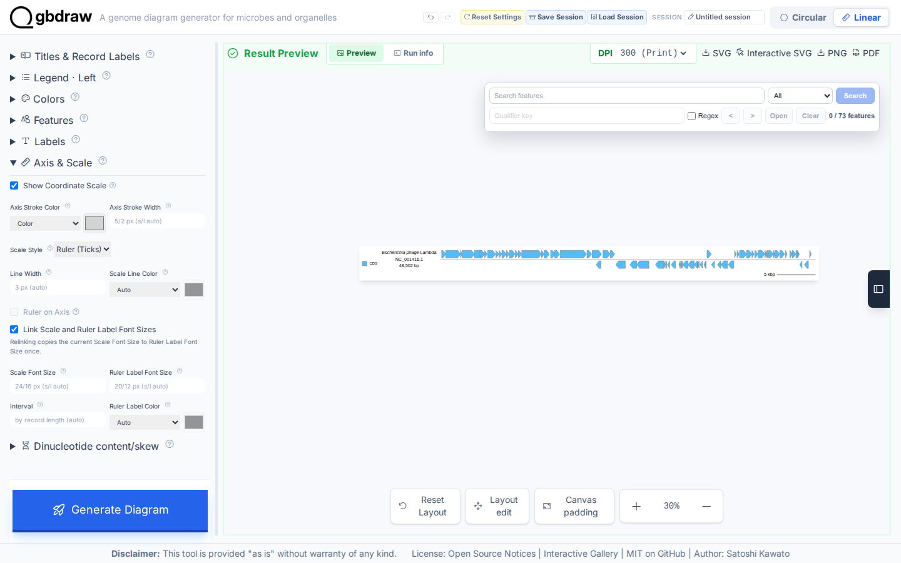

# Create and export your first linear genome diagram

## Choose how to build this figure

| GUI | CLI | Python API |
| --- | --- | --- |
| **This page** | [Command-line workflow](../CLI/first-linear-genome-diagram.md) | Not yet migrated |

The implemented variants build the same complete Lambda map. A Python variant
must reproduce that figure rather than introduce a different example.

Create a labeled Linear SVG from the complete bundled Lambda phage GenBank record. You will generate a working map in Step 2, then add concise gene labels and a coordinate ruler before exporting it.

*The finished map shows the whole 48,502 bp record, both strands, short gene labels, a ruler, and the CDS legend on the left.*

## What you'll need

- The gbdraw web app
- The bundled `gbdraw/web/tutorial-data/lambda/NC_001416.gb` file
- The bundled `gbdraw/web/tutorial-data/shared/cds_gene_qualifier_priority.tsv` label rule

The label rule tells gbdraw to use short `gene` values for CDS labels. Both files are part of the fixed Tutorial fixture set.

## Step 1: Load the bundled Lambda genome

Select **Linear** at the top of the app. Under **Input Genomes**, keep **GenBank** selected and choose **No comparison**. In the first **GenBank File** control, choose `NC_001416.gb`.

The uploader should show `NC_001416.gb` in green. Keep one input row only; this Tutorial uses the complete `NC_001416.1` record without cropping or splitting it.

*Confirm Linear, GenBank, and No comparison before generating. The first input row should name `NC_001416.gb`.*

## Step 2: Generate the first diagram

Select **Generate Diagram** without changing the presentation settings. When processing finishes, **Result Preview** displays the first Linear map.

*The first result identifies `NC_001416.1` and `48,502 bp`, draws all 73 CDS features, and keeps the two strand lanes separate.*

## Step 3: Add concise labels and a ruler

Set the values below. The controls are under **Basic**, **Layout**, **Labels**, **Axis & Scale**, and **Title & Legend**.

| Control | Value |
| --- | --- |
| Output Prefix | `lambda_linear` |
| Track Layout | Features on axis |
| Separate Strands | On |
| Show Labels | All Records |
| Priority File (TSV) | `cds_gene_qualifier_priority.tsv` |
| Show Coordinate Scale | On |
| Scale Style | Ruler (Ticks) |
| Legend Position | Left |

*The visible Axis & Scale controls show the coordinate scale and Ruler (Ticks). Keep the label, strand, and legend values exactly as listed in the table.*

## Step 4: Regenerate and export the SVG

Select **Generate Diagram** again. The completed map should include short labels such as `A`, `B`, `J`, and `int`. Its ruler spans the complete Lambda record, and the CDS legend appears on the left.

*Check the full 48,502 bp map before export. The ruler, labels, record definition, two strand lanes, and left CDS legend should all be visible.*

In the **Result Preview** toolbar, select **SVG**. The browser saves `lambda_linear.svg`.

## What you built

You now have a static Linear SVG named `lambda_linear.svg`. It contains the whole `NC_001416.1` record, all 73 displayed CDS features, concise gene labels, a coordinate ruler, separate strand lanes, and a left-side CDS legend.

## Next steps

- [Arrange multiple Linear records and regions](../../HOW_TO/GUI/arrange-linear-records-regions-and-orientation.md)
- [Customize plot colors and labels](../../HOW_TO/GUI/style-features-labels-titles-and-legends.md)
- [Compare genomes](compare-genomes-losatn.md)
- [Choose another output format](../../REFERENCE/output-formats-and-export.md)
