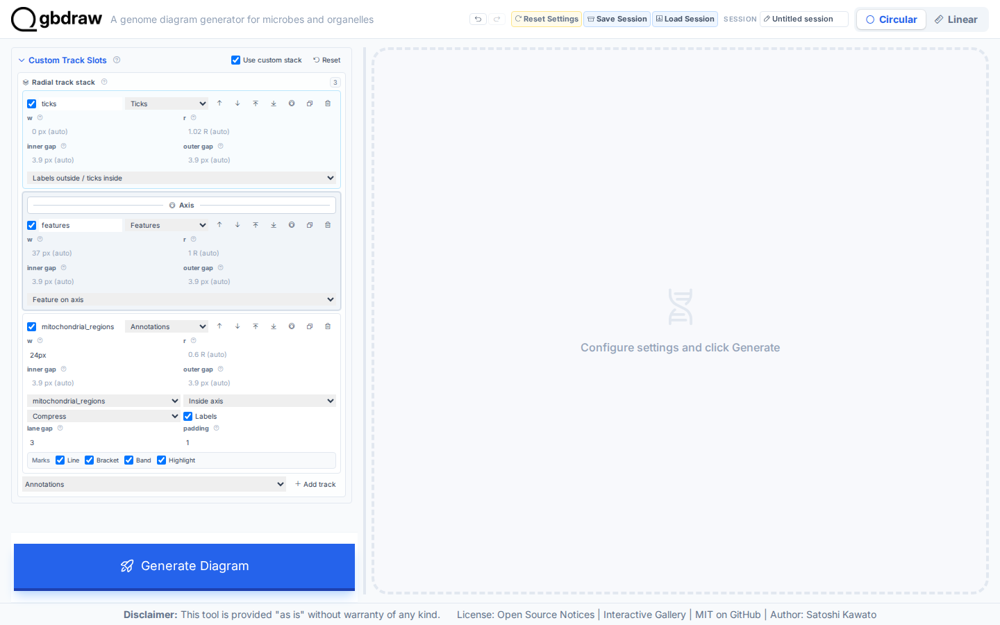
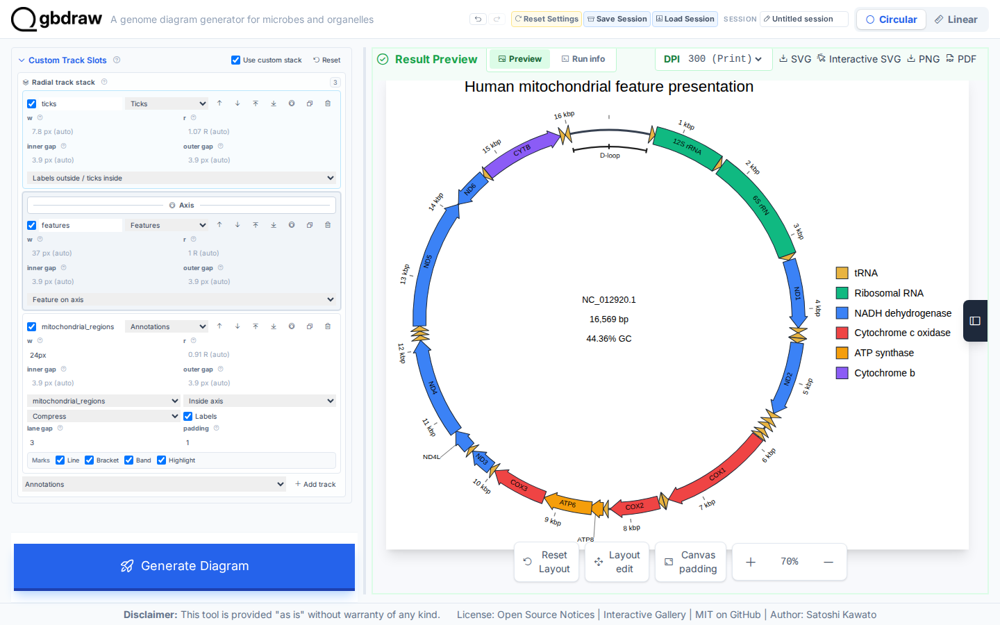

[Documentation home](../../DOCS.md) | [Tutorials](../README.md) | [Web app](../../HOW_TO/GUI/README.md)

# Highlight mitochondrial features in the web app

## Choose how to build this figure

| GUI | CLI | Python API |
| --- | --- | --- |
| **This page** | [CLI workflow](../CLI/highlight-mitochondrial-features.md) | [Python workflow](../PYTHON/highlight-mitochondrial-features.md) |

Apply functional colors, selected labels, feature shapes, strokes, and an
origin-spanning D-loop bracket to the complete human mitochondrial record. The
GenBank file remains unchanged.

## What you'll need

Starting state: open a fresh gbdraw web app page with no session loaded and no
files selected.

Use the filenames below when you download, create, or save each file. See [Get
the tutorial inputs](../../GETTING_TUTORIAL_DATA.md) for browser download steps
and the meaning of each file type.

| File | File type | Purpose |
| --- | --- | --- |
| [`HmmtDNA.gbk` — NCBI `NC_012920.1`](https://www.ncbi.nlm.nih.gov/nuccore/NC_012920.1) | Authoritative download | Complete human mitochondrial GenBank record; save as `HmmtDNA.gbk` |
| [`cds_gene_qualifier_priority.tsv`](../../../gbdraw/web/tutorial-data/shared/cds_gene_qualifier_priority.tsv) | Support download | CDS label-priority rule |
| `presentation_colors.tsv` | Create | Functional feature-color rules |
| `presentation_labels.tsv` | Create | Feature-label whitelist |
| `presentation_label_overrides.tsv` | Create | Two replacement rRNA labels applied in the editor |
| `mitochondrial_regions.tsv` | Create | Origin-spanning D-loop annotation |
| `mitochondrial_features_highlighted.svg` | Generated | Finished static diagram saved in Step 4 |

Create the four user-authored TSV files from the exact blocks below.

Save `presentation_colors.tsv`:

```tsv
CDS	gene	^ND(4L|[1-6])$	#3B82F6	NADH dehydrogenase
CDS	gene	^COX[1-3]$	#EF4444	Cytochrome c oxidase
CDS	gene	^ATP[68]$	#F59E0B	ATP synthase
CDS	gene	^CYTB$	#8B5CF6	Cytochrome b
rRNA	gene	^RNR[12]$	#10B981	Ribosomal RNA
```

Save `presentation_labels.tsv`:

```tsv
CDS	gene	^(ND[1-6]|ND4L|COX[1-3]|ATP[68]|CYTB)$
rRNA	gene	^RNR[12]$
```

Save `presentation_label_overrides.tsv`:

```tsv
record_id	feature_type	qualifier	value	label_text
NC_012920.1	rRNA	label	^s-rRNA$	12S rRNA
NC_012920.1	rRNA	label	^l-rRNA$	16S rRNA
```

Save `mitochondrial_regions.tsv`:

```tsv
set_id	id	mark	record	start	end	coordinate_space	wraps_origin	label	lane	stroke	stroke_width	line_cap	label_color	label_font_size	label_orientation	label_offset
mitochondrial_regions	d_loop	bracket	NC_012920.1	16024	576	source	true	D-loop	0	#202020	3	tick	#202020	14	tangent	7
```

## Step 1: Load the complete record

Select **Circular** and **GenBank**, then choose `HmmtDNA.gbk`. Set **Output
Prefix** to `mitochondrial_features_highlighted`, Species to `<i>Homo
sapiens</i>`, Track Preset to **Middle**, and leave **Separate Strands** off.

## Step 2: Set colors, labels, and feature appearance

Open **Colors**. Leave Palette on **default** and load
`presentation_colors.tsv` as **Specific Table (-t)**.

Open **Labels**, select **Both**, choose **Whitelist**, and load
`presentation_labels.tsv` as **Whitelist File**. Load
`cds_gene_qualifier_priority.tsv` as **Priority File (TSV)** and leave Label
Rendering on **Auto**. This displays all 13 CDS labels from their `gene`
qualifier and keeps the two rRNA labels in scope.

Open **Features** and set CDS and tRNA to **Arrow** and rRNA to **Rectangle**.
Leave Head Length Ratio blank for Auto and set Shaft Width Ratio to `0.72`.
Use block stroke `#1F2937` at `1.5` px and line stroke `#9CA3AF` at `1.5` px.

## Step 3: Add the D-loop track and generate

Open **Region Annotations** and import `mitochondrial_regions.tsv`. Open
**Custom Track Slots**, enable **Use custom stack**, and keep these enabled
rows in order:

1. `ticks`, outside the axis, with labels outside and ticks inside
2. `features`, on the axis
3. `mitochondrial_regions`, inside the axis, width `24px`

Bind the annotation row to `mitochondrial_regions`, show labels, set padding to
`1`, and select **Compress** for overflow. Remove the GC-content and GC-skew
rows. In **Axis & Scale**, set the axis stroke to `#374151` at `4` px. Set the
plot title to `Human mitochondrial feature presentation`, position it at the
top, and put the legend on the right.



Select **Generate Diagram**. Open the result editor, choose **Features**, and
load `presentation_label_overrides.tsv` with **Load Label TSV**. The editor
applies the two rRNA replacements and reflows their label placement. Close the
editor.

## Step 4: Verify and export

Confirm that the map still contains all 37 CDS, rRNA, and tRNA features. CDS
labels should use gene names such as `ND1`, `COX2`, `ATP6`, and `CYTB`. Check
for `12S rRNA`, `16S rRNA`, and the single origin-spanning D-loop bracket. The
five functional legend colors should match the CLI and Python figures.



Select **SVG** to save `mitochondrial_features_highlighted.svg`.

## Next steps

- [Style features, labels, titles, and legends](../../HOW_TO/GUI/style-features-labels-titles-and-legends.md)
- [Control feature visibility, shapes, strokes, and overlaps](../../HOW_TO/GUI/control-feature-visibility-shapes-strokes-and-overlaps.md)
- [Add region annotations and track slots](../../HOW_TO/GUI/add-region-annotations-and-track-slots.md)
- [Review the presentation-table reference](../../REFERENCE/palettes-feature-rules-labels-shapes-and-tracks.md)
