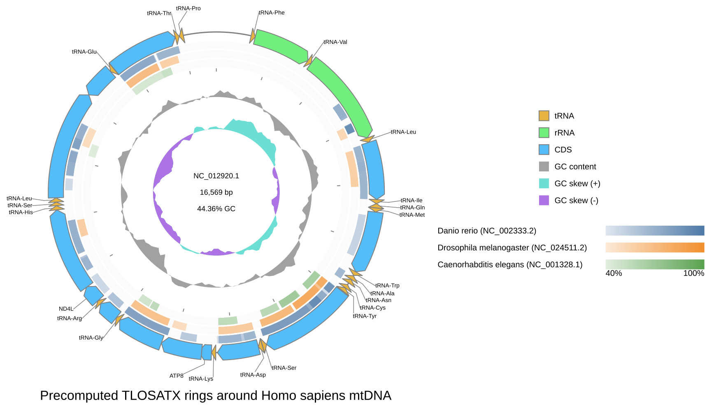

[Documentation home](../../DOCS.md) | [All Tutorials](../README.md) | [Python API reference](../../REFERENCE/python-api.md)

# Add precomputed circular comparison rings from Python

## Choose how to build this figure

| GUI | CLI | Python API |
| --- | --- | --- |
| [Web app](../GUI/add-precomputed-circular-comparison-rings.md) | [Command line](../CLI/add-precomputed-circular-comparison-rings.md) | **Python API** |

Build the same ordered three-ring map with the public Circular comparison
types.

## Step 1: Prepare the inputs

Place the human GenBank record, three TLOSATX tables, three companion FASTA
files, and the qualifier-priority table in an empty directory.

## Step 2: Draw and save the rings

<!-- executable:T-PY-06:start -->
```python
from pathlib import Path

from gbdraw import (
    CircularOptions,
    ComparisonRingOptions,
    ComparisonRingTrackOptions,
    LabelOptions,
    Thresholds,
    TitleOptions,
    draw_circular,
    read_genbank,
)


record = read_genbank([Path("HmmtDNA.gbk")])[0]
rings = ComparisonRingOptions(
    tracks=(
        ComparisonRingTrackOptions(
            source="danio-human.tlosatx.tsv",
            label="Danio rerio (NC_002333.2)",
            color="#4E79A7",
            comparison_sequence_source="NC_002333.2.fna",
        ),
        ComparisonRingTrackOptions(
            source="drosophila-human.tlosatx.tsv",
            label="Drosophila melanogaster (NC_024511.2)",
            color="#F28E2B",
            comparison_sequence_source="NC_024511.2.fna",
        ),
        ComparisonRingTrackOptions(
            source="caenorhabditis-human.tlosatx.tsv",
            label="Caenorhabditis elegans (NC_001328.1)",
            color="#59A14F",
            comparison_sequence_source="NC_001328.1.fna",
        ),
    ),
    reference="subject",
    ring_width=18,
    ring_gap=4,
)
options = CircularOptions(
    comparison_rings=rings,
    labels=LabelOptions(
        qualifier_priority="cds_gene_qualifier_priority.tsv",
    ),
    thresholds=Thresholds(
        bitscore=50,
        evalue=1e-5,
        identity=40,
        alignment_length=50,
    ),
    species="<i>Homo sapiens</i>",
    title=TitleOptions(
        text="Precomputed TLOSATX rings around Homo sapiens mtDNA",
        position="bottom",
    ),
    legend="right",
    config_overrides={
        "canvas.strandedness": False,
        "canvas.circular.track_type": "middle",
        "labels.circular.scope": "outer",
        "objects.definition.circular.font_size": 18,
    },
)
diagram = draw_circular(record, options=options)
saved_path = diagram.save(Path("python_precomputed_circular_rings.svg"))
print(f"Saved {saved_path}")
```
<!-- executable:T-PY-06:end -->



## Step 3: Verify the result

```bash
python docs/recipes/run_python_scenarios.py --scenario T-PY-06 --check
```

The runner verifies the ordered labels, subject-reference mapping, 106 retained
HSPs, companion sequence identities, and the standard SVG.
