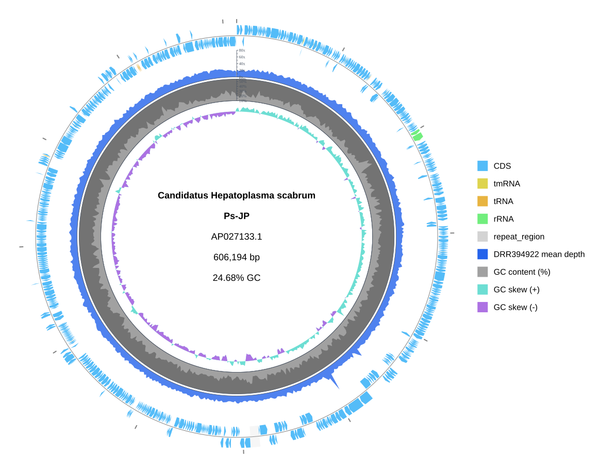

[Home](../../DOCS.md) | [Tutorials](../README.md) | [Get tutorial files](../../GETTING_TUTORIAL_DATA.md) | [Python API](../../REFERENCE/python-api.md)

# Build a quantitative genome map from Python

## Choose how to build this figure

| GUI | CLI | Python API |
| --- | --- | --- |
| [Web-app workflow](../GUI/build-a-quantitative-genome-map.md) | [CLI workflow](../CLI/build-a-quantitative-genome-map.md) | **This page** |

Combine the complete `AP027133.1` record with its measured 1 kbp depth series,
GC content, and GC skew in the same explicit slot stack as the CLI tutorial.

## What you'll need

| Kind | Filename | What to do |
| --- | --- | --- |
| Download | `AP027133.gb` ([NCBI Revision History snapshot for AP027133.1](https://www.ncbi.nlm.nih.gov/sviewer/viewer.cgi?tool=portal&save=file&db=nuccore&report=gbwithparts&id=AP027133.1&sat=3&satkey=69902298)) | Download the complete GenBank record and save it as `AP027133.gb`. |
| Download | [`AP027133.DRR394922.depth-1kb.tsv`](../../../gbdraw/web/tutorial-data/depth-1kb/AP027133.DRR394922.depth-1kb.tsv) | Save the supplied depth table with this exact filename. |
| Create | `quantitative_genome_map.py` | Save the complete Python program from Step 2 with this filename. |
| Generated | `quantitative_genome_map.svg` | The program writes this SVG. |
| Reference result | [`quantitative_genome_map.svg`](../../images/t-py-11/quantitative_genome_map.svg) | Compare your Generated SVG with this versioned result. |

Install gbdraw in the active Python environment before starting. The depth TSV
contains 607 arithmetic means from consecutive 1 kbp bins.

## Step 1: Prepare the working directory

Create and enter an empty directory:

```bash
mkdir gbdraw-python-quantitative-map
cd gbdraw-python-quantitative-map
```

Acquire the sequence from its authoritative accession link and download the
supplied depth table. Save both with the exact filenames shown. See [Get the
tutorial files](../../GETTING_TUTORIAL_DATA.md) for browser, `curl`, and
PowerShell instructions for authoritative sequence acquisition.

## Step 2: Save and run the Python program

Save the following complete program as `quantitative_genome_map.py`:

<!-- executable:T-PY-11:start -->
```python
from pathlib import Path

from gbdraw import (
    CircularOptions,
    CircularTrackOptions,
    DepthTrackOptions,
    draw_circular,
    read_genbank,
)
from gbdraw.api import CircularTrackSlot, ScalarSpec


track_slots = (
    CircularTrackSlot(
        id="ticks",
        renderer="ticks",
        side="outside",
        params={"tick_label_layout": "label_out_tick_in"},
    ),
    CircularTrackSlot(
        id="features",
        renderer="features",
        side="overlay",
        params={"lane_direction": "split"},
    ),
    CircularTrackSlot(
        id="depth_1",
        renderer="depth",
        side="inside",
        width=ScalarSpec(52, "px"),
        params={"track_index": 0, "legend_label": "DRR394922 mean depth"},
    ),
    CircularTrackSlot(
        id="gc_content",
        renderer="dinucleotide_content",
        side="inside",
        width=ScalarSpec(42, "px"),
        params={"nt": "GC", "legend_label": "GC content (%)"},
    ),
    CircularTrackSlot(
        id="gc_skew",
        renderer="dinucleotide_skew",
        side="inside",
        width=ScalarSpec(34, "px"),
        params={"nt": "GC", "legend_label": "GC skew"},
    ),
)
record = read_genbank(Path("AP027133.gb"))[0]
options = CircularOptions(
    tracks=CircularTrackOptions(slots=track_slots),
    depth_tracks=(
        DepthTrackOptions(
            source=Path("AP027133.DRR394922.depth-1kb.tsv"),
            label="DRR394922 mean depth",
            color="#2563EB",
            large_tick_interval=20,
            small_tick_interval=10,
        ),
    ),
    depth_window=1,
    depth_step=1000,
    window=1000,
    step=1000,
    legend="right",
    config_overrides={
        "canvas.strandedness": True,
        "canvas.show_depth": True,
        "canvas.show_gc": True,
        "canvas.show_skew": True,
        "labels.circular.scope": "none",
        "objects.depth.fill_color": "#2563EB",
        "objects.depth.min_depth": 0,
        "objects.depth.max_depth": 80,
        "objects.depth.normalize": False,
        "objects.depth.show_axis": True,
        "objects.depth.show_ticks": True,
        "objects.depth.large_tick_interval": 20,
        "objects.depth.small_tick_interval": 10,
        "objects.gc_content.mode": "percent",
        "objects.gc_content.min_percent": 10,
        "objects.gc_content.max_percent": 55,
        "objects.gc_content.show_axis": True,
        "objects.gc_content.show_ticks": True,
        "objects.gc_content.large_tick_interval": 10,
        "objects.gc_content.small_tick_interval": 5,
    },
)
diagram = draw_circular(record, options=options)
saved_path = diagram.save(Path("quantitative_genome_map.svg"))
print(f"Saved {saved_path}")
```
<!-- executable:T-PY-11:end -->

Before running it, your working directory should contain:

```text
gbdraw-python-quantitative-map/
├── AP027133.gb
├── AP027133.DRR394922.depth-1kb.tsv
└── quantitative_genome_map.py
```

### Run the program

```bash
python quantitative_genome_map.py
```

Expected output: the program prints `Saved quantitative_genome_map.svg` and
writes the Generated SVG in the current directory.

## Step 3: Inspect the quantitative tracks

Open the Generated `quantitative_genome_map.svg`. It should plot all 607 depth
values on a 0x–80x axis, GC content on a 10%–55% axis, and the signed GC-skew
fills in the same five-slot order as the CLI figure.



The image above is the Reference result. Compare the record definition, track
order, axes, tick labels, colors, and legend with your SVG.

## Next steps

- [Review Python layout and track options](../../REFERENCE/python-api.md#layout-and-track-options)
- [Review depth TSV schemas](../../REFERENCE/input-formats-and-tsv-schemas.md)
