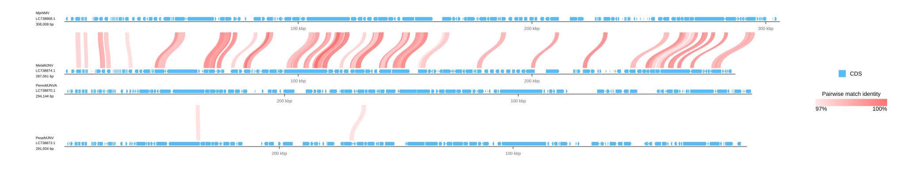

[Home](../../DOCS.md) | [Tutorials](../README.md) | [Typed requests](../../REFERENCE/typed-requests.md)

# Compare two Majanivirus genome pairs from Python

## Choose how to build this figure

| GUI | CLI | Python API |
| --- | --- | --- |
| [Web-app workflow](../GUI/build-a-table-driven-genome-comparison.md) | [CLI workflow](../CLI/build-a-table-driven-genome-comparison.md) | **This page** |

Reproduce the four-record CLI project with typed record presentation, explicit
comparison endpoints, two reverse-complemented displays, and shared ruler
geometry.

## What you'll need

Place the eight files from the `majanivirus-table-comparison` fixture in an
empty working directory.

## Step 1: Save and run the program

<!-- executable:T-PY-10:start -->
```python
from pathlib import Path

from gbdraw.api import (
    GenBankInputSource,
    LinearDiagramOptions,
    LinearDiagramRequest,
    LinearMultiRecordOptions,
    LinearOutputOptions,
    RecordInput,
    RecordPresentation,
    RenderOutputRequest,
    RequestRenderResult,
    render_request,
)


record_specs = (
    ("MjeNMV.gb", "MjeNMV", False),
    ("MelaMJNV.gb", "MelaMJNV", False),
    ("PemoMJNVA.gb", "PemoMJNVA", True),
    ("PeseMJNV.gb", "PeseMJNV", True),
)
comparison_files = (
    Path("MjeNMV.MelaMJNV.tblastx.out"),
    Path("PemoMJNVA.PeseMJNV.tblastx.out"),
)
assert all(path.is_file() for path in comparison_files)
request = LinearDiagramRequest(
    records=tuple(
        RecordInput(
            source=GenBankInputSource(filename),
            presentation=RecordPresentation(
                label=label,
                reverse_complement=reverse,
            ),
        )
        for filename, label, reverse in record_specs
    ),
    options=LinearDiagramOptions(
        comparison_table_file="comparisons.tsv",
        pairwise_match_style="curve",
        evalue=1e-5,
        identity=97,
        alignment_length=500,
        output=LinearOutputOptions(legend="right"),
        config_overrides={
            "labels.linear.scope": "none",
            "canvas.linear.track_layout": "above",
            "canvas.linear.comparison_height": 100,
            "canvas.linear.ruler_on_axis": True,
            "canvas.linear.keep_definition_left_aligned": True,
            "objects.scale.show": True,
            "objects.scale.style": "ruler",
            "objects.scale.stroke_color": "dimgray",
            "objects.scale.label_color": "dimgray",
            "objects.blast_match.style": "curve",
        },
    ),
    layout=LinearMultiRecordOptions(
        record_gap_px=28,
        multi_record_positions=("#1@1", "#2@2", "#3@3", "#4@4"),
    ),
    output=RenderOutputRequest(
        output_prefix="table_driven_comparison",
        formats=("svg",),
    ),
)
diagram = render_request(request)
assert isinstance(diagram, RequestRenderResult)
saved_path = diagram.output_paths[0]
print(f"Saved {saved_path}")
```
<!-- executable:T-PY-10:end -->

## Step 2: Verify the result

```bash
python docs/recipes/run_python_scenarios.py --scenario T-PY-10 --check
```

The runner checks the record order and orientation, the two declared endpoint
pairs, 80 and 2 retained HSPs, curved links, per-record rulers, shared scale,
and exact parity with the CLI SVG.



## What you built

Record placement and comparison ownership remain explicit. No link is inferred
from display adjacency.
