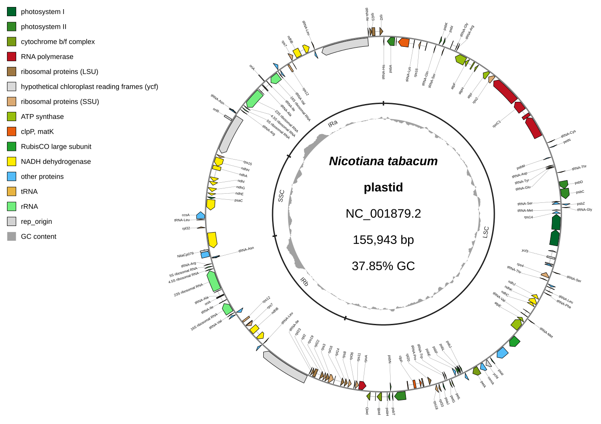

[Home](../../DOCS.md) | [Tutorials](../README.md) | [Get tutorial files](../../GETTING_TUTORIAL_DATA.md) | [Python API](../../REFERENCE/python-api.md) | [GUI version](../GUI/build-an-annotated-chloroplast-map.md)

# Recreate the Gallery chloroplast map from Python

## Choose how to build this figure

| GUI | CLI | Python API |
| --- | --- | --- |
| [Web-app workflow](../GUI/build-an-annotated-chloroplast-map.md) | [Command-line workflow](../CLI/build-an-annotated-chloroplast-map.md) | **This page** |

All three workflows use the same complete tobacco plastome, tables, visual
settings, and track geometry. Only the interface changes.

Use the public Python API to reproduce the same complete tobacco plastome map
as the GUI tutorial: chloroplast gene-family colors, radial labels on both
sides of the feature ring, LSC/IRb/SSC/IRa brackets, GC content, and an
upper-left legend.

This is the next step after the
[first Python genome diagram](first-genome-diagram.md). It keeps the raw
GenBank record unchanged and expresses each presentation decision in typed
options that can be reviewed and rerun.

## What you'll need

| Kind | Filename | What to do |
| --- | --- | --- |
| Download | `NC_001879.gbk` ([NCBI accession NC_001879.2](https://www.ncbi.nlm.nih.gov/nuccore/NC_001879.2)) | Download the complete tobacco plastome GenBank record and save it as `NC_001879.gbk`. |
| Download | [`nicotiana-tabacum-regions.tsv`](../../../gbdraw/web/tutorial-data/tobacco-plastome-regions/nicotiana-tabacum-regions.tsv) | Save the supplied region table with this exact filename. |
| Download | [`chloroplast_specific_table.tsv`](../../../gbdraw/web/tutorial-data/tobacco-plastome-regions/chloroplast_specific_table.tsv) | Save the supplied feature color table with this exact filename. |
| Download | [`qualifier_priority.tsv`](../../../gbdraw/web/tutorial-data/tobacco-plastome-regions/qualifier_priority.tsv) | Save the supplied label rule with this exact filename. |
| Create | `annotated_chloroplast.py` | Save the complete Python program from Step 2 with this filename. |
| Generated | `python_annotated_chloroplast.svg` | The program writes this SVG. |
| Reference result | [`python_annotated_chloroplast.svg`](../../images/t-py-02/python_annotated_chloroplast.svg) | Compare your Generated SVG with this versioned result. |

The GenBank file contains the complete 155,943 bp `NC_001879.2` plastome. The
three TSV files own the structural-region annotations, functional feature
colors, and CDS label priority.

Install gbdraw in the active Python environment before starting.

## Step 1: Prepare the working directory

Create and enter an empty directory:

```bash
mkdir gbdraw-python-chloroplast
cd gbdraw-python-chloroplast
```

Acquire the sequence from its authoritative accession link and download the
three supplied support tables. Save every file with the exact filename shown.
See [Get the tutorial files](../../GETTING_TUTORIAL_DATA.md) for browser,
`curl`, and PowerShell instructions for authoritative sequence acquisition.

## Step 2: Save and run the Python program

Save the following program as `annotated_chloroplast.py` beside the four input
files:

<!-- executable:T-PY-02:start -->
```python
from pathlib import Path

from gbdraw import (
    CircularOptions,
    CircularTrackOptions,
    Diagram,
    FeatureOptions,
    LabelOptions,
    draw_circular,
    read_genbank,
)
from gbdraw.api import AnnotationOptions, CircularTrackSlot, ScalarSpec


record = read_genbank(Path("NC_001879.gbk"))[0]
assert (record.id, len(record), record.annotations.get("topology")) == (
    "NC_001879.2",
    155_943,
    "circular",
)

track_slots = (
    CircularTrackSlot(
        id="features",
        renderer="features",
        side="overlay",
        params={"lane_direction": "split"},
    ),
    CircularTrackSlot(
        id="plastome_regions",
        renderer="annotations",
        side="inside",
        radius=ScalarSpec(0.65),
        width=ScalarSpec(20, "px"),
        params={
            "set_id": "plastome_regions",
            "show_labels": True,
            "padding_px": 1,
            "overflow": "compress",
        },
        inner_gap_px=1,
        outer_gap_px=1,
    ),
    CircularTrackSlot(
        id="gc_content",
        renderer="dinucleotide_content",
        side="inside",
        radius=ScalarSpec(0.56),
        width=ScalarSpec(0.08),
        params={"nt": "GC", "legend_label": "GC content"},
    ),
)

options = CircularOptions(
    features=FeatureOptions(
        types=(
            "CDS",
            "rRNA",
            "tRNA",
            "tmRNA",
            "ncRNA",
            "misc_RNA",
            "rep_origin",
        ),
        color_table=Path("chloroplast_specific_table.tsv"),
    ),
    labels=LabelOptions(
        qualifier_priority=Path("qualifier_priority.tsv"),
    ),
    annotations=AnnotationOptions(
        table_file="nicotiana-tabacum-regions.tsv",
    ),
    tracks=CircularTrackOptions(slots=track_slots),
    species="<i>Nicotiana tabacum</i>",
    legend="upper_left",
    config_overrides={
        "canvas.strandedness": True,
        "canvas.circular.track_type": "tuckin",
        "labels.circular.scope": "both",
        "labels.circular.placement": "radial",
        "labels.unified_adjustment.outer_labels.x_radius_offset": 0.9,
        "labels.unified_adjustment.outer_labels.y_radius_offset": 0.9,
        "labels.unified_adjustment.inner_labels.x_radius_offset": 0.975,
        "labels.unified_adjustment.inner_labels.y_radius_offset": 0.975,
        "objects.definition.circular.font_size": 28,
        "objects.definition.circular.interval": 30,
        "objects.features.block_stroke_color": "black",
        "objects.features.block_stroke_width.long": 1,
        "objects.features.line_stroke_width.long": 2,
        "objects.axis.circular.stroke_width.long": 3,
    },
)

chloroplast_diagram = draw_circular(record, options=options)
chloroplast_svg = chloroplast_diagram.to_svg()
chloroplast_bytes = chloroplast_diagram.to_bytes("svg")
chloroplast_path = chloroplast_diagram.save(
    Path("python_annotated_chloroplast.svg")
)

assert isinstance(chloroplast_diagram, Diagram)
assert chloroplast_diagram.mode == "circular"
assert chloroplast_svg.encode("utf-8") == chloroplast_bytes
assert chloroplast_path.read_bytes() == chloroplast_bytes
print(f"Saved {chloroplast_path}")
```
<!-- executable:T-PY-02:end -->

The first slot splits forward- and reverse-strand features around the axis.
The second places all four structural regions in one inner annotation lane.
The third adds GC content without adding coordinate ticks or a skew ring.

Before running it, your working directory should contain:

```text
gbdraw-python-chloroplast/
├── NC_001879.gbk
├── nicotiana-tabacum-regions.tsv
├── chloroplast_specific_table.tsv
├── qualifier_priority.tsv
└── annotated_chloroplast.py
```

### Run the program

```bash
python annotated_chloroplast.py
```

Expected output: the program prints
`Saved python_annotated_chloroplast.svg` and writes the Generated SVG in the
current directory.

## Step 3: Inspect the result

Open the Generated `python_annotated_chloroplast.svg`. Confirm the complete
`NC_001879.2` record, 147 logical features, radial gene labels, all four
structural-region brackets, GC content, and the functional-color legend.
There should be no coordinate-tick or GC-skew track.



The image above is the Reference result. Your SVG should have the same record,
feature colors, label placement, region brackets, track order, and legend.

The documentation runner executes the literal program above in a clean
directory and checks the typed options, slot geometry, feature and annotation
identities, visible labels, and equality of the file, text, and byte outputs.

## Next steps

- [Review Python layout and track options](../../REFERENCE/python-api.md#layout-and-track-options)
- [Review track and annotation schemas](../../REFERENCE/palettes-feature-rules-labels-shapes-and-tracks.md)
