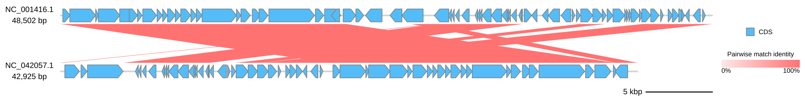

[Documentation home](../../DOCS.md) | [All Tutorials](../README.md) | [Python API reference](../../REFERENCE/python-api.md)

# Compare Lambda and DE3 from Python

## Choose how to build this figure

| GUI | CLI | Python API |
| --- | --- | --- |
| [Web app](../GUI/compare-genomes-losatn.md) | [Command line](../CLI/compare-genomes-losatn.md) | **Python API** |

Use the public `LinearComparisonOptions` type to attach the same six-row
LOSATN table used by the GUI and CLI variants.

## Step 1: Prepare the inputs

Place `NC_001416.gb`, `NC_042057.1.gb`, and `lambda-de3.losatn.tsv` in an empty
working directory.

## Step 2: Draw and save the comparison

<!-- executable:T-PY-04:start -->
```python
from pathlib import Path

from gbdraw import (
    LinearComparisonOptions,
    LinearOptions,
    Thresholds,
    draw_linear,
    read_genbank,
)


records = read_genbank([Path("NC_001416.gb"), Path("NC_042057.1.gb")])
assert [(record.id, len(record)) for record in records] == [
    ("NC_001416.1", 48_502),
    ("NC_042057.1", 42_925),
]

options = LinearOptions(
    comparisons=LinearComparisonOptions(
        blast_files=("lambda-de3.losatn.tsv",),
    ),
    thresholds=Thresholds(
        bitscore=50,
        evalue=0.01,
        identity=0,
        alignment_length=0,
    ),
    config_overrides={"canvas.linear.comparison_height": 120},
)
diagram = draw_linear(records, options=options)
saved_path = diagram.save(Path("python_lambda_de3_losatn.svg"))
print(f"Saved {saved_path}")
```
<!-- executable:T-PY-04:end -->

Open `python_lambda_de3_losatn.svg` to inspect the two complete records and six
comparison ribbons.



## Step 3: Verify the result

Run the literal code in a clean directory and repeat the SVG checks:

```bash
python docs/recipes/run_python_scenarios.py --scenario T-PY-04 --check
```

The validator checks the record order, source lengths, six retained matches,
comparison height, and standard-SVG safety.

## What you built

You attached fixed whole-genome comparison evidence to two in-memory records.
No external search runs during this Python recipe.
