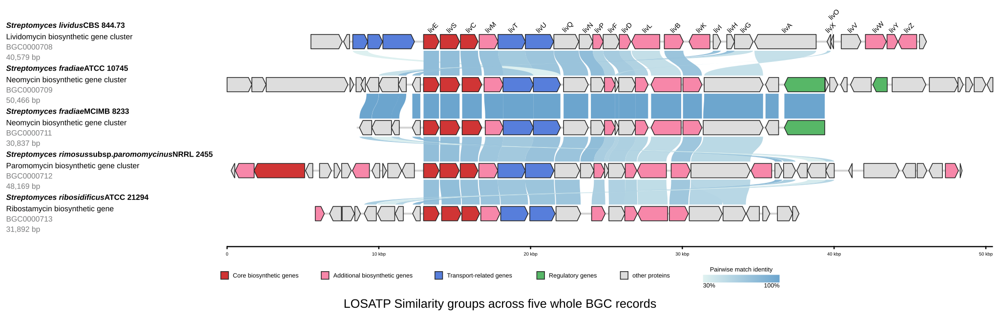

[Documentation home](../../DOCS.md) | [All Tutorials](../README.md) | [Python API reference](../../REFERENCE/python-api.md)

# Create protein Similarity groups with LOSATP from Python

## Choose how to build this figure

| GUI | CLI | Python API |
| --- | --- | --- |
| [Web app](../GUI/compare-proteins-losatp.md) | [Command line](../CLI/compare-proteins-losatp.md) | **Python API** |

This program loads five complete BGC records, reverses the fifth display,
runs the bundled one-thread LOSATP workflow, and aligns every row to `og_1`.

## Step 1: Prepare the inputs

Place the five GenBank records, both BGC color tables, and
`cds_gene_qualifier_priority.tsv` in an empty working directory.

## Step 2: Build the comparison

<!-- executable:T-PY-05:start -->
```python
from pathlib import Path

from gbdraw.api import (
    ColorOptions,
    InMemoryRecordSource,
    LinearDiagramOptions,
    LinearDiagramRequest,
    LinearOutputOptions,
    RecordInput,
    RecordPresentation,
    RenderOutputRequest,
    load_gbks,
    render_request,
)


paths = [
    Path("BGC0000708.gbk"),
    Path("BGC0000709.gbk"),
    Path("BGC0000711.gbk"),
    Path("BGC0000712.gbk"),
    Path("BGC0000713.gbk"),
]
records = load_gbks(paths)
presentations = [
    ("<i>Streptomyces lividus</i> CBS 844.73", "Lividomycin biosynthetic gene cluster"),
    ("<i>Streptomyces fradiae</i> ATCC 10745", "Neomycin biosynthetic gene cluster"),
    ("<i>Streptomyces fradiae</i> MCIMB 8233", "Neomycin biosynthetic gene cluster"),
    ("<i>Streptomyces rimosus</i> subsp. <i>paromomycinus</i> NRRL 2455", "Paromomycin biosynthetic gene cluster"),
    ("<i>Streptomyces ribosidificus</i> ATCC 21294", "Ribostamycin biosynthetic gene"),
]
request = LinearDiagramRequest(
    records=tuple(
        RecordInput(
            source=InMemoryRecordSource(record),
            presentation=RecordPresentation(
                label=label,
                subtitle=subtitle,
                reverse_complement=index == 4,
            ),
        )
        for index, (record, (label, subtitle)) in enumerate(
            zip(records, presentations, strict=True)
        )
    ),
    options=LinearDiagramOptions(
        colors=ColorOptions(
            color_table_file="BGC0000708-BGC0000713_specific_colors.tsv",
            default_colors_file="BGC0000708-BGC0000713_default_colors.tsv",
            default_colors_palette="orange",
        ),
        qualifier_priority_file="cds_gene_qualifier_priority.tsv",
        plot_title="LOSATP Similarity groups across five whole BGC records",
        output=LinearOutputOptions(
            legend="bottom",
            plot_title_position="bottom",
        ),
        protein_blastp_mode="orthogroup",
        losatp_threads=1,
        align_orthogroup_feature="CAG38695.1",
        pairwise_match_style="curve",
        bitscore=50,
        evalue=0.01,
        identity=30,
        alignment_length=0,
        config_overrides={
            "labels.linear.scope": "first",
            "labels.font_size.linear.short": 18,
            "labels.font_size.linear.long": 18,
            "labels.linear.placement": "above_feature",
            "labels.linear.rotation": 45,
            "canvas.linear.default_cds_height.short": 75,
            "canvas.linear.default_cds_height.long": 75,
            "objects.features.block_stroke_color": "#262626",
            "objects.features.block_stroke_width.short": 2,
            "objects.features.block_stroke_width.long": 2,
            "objects.features.line_stroke_width.short": 2,
            "objects.features.line_stroke_width.long": 2,
            "objects.axis.linear.stroke_width.short": 5,
            "objects.axis.linear.stroke_width.long": 5,
            "objects.scale.style": "ruler",
            "canvas.linear.track_layout": "middle",
            "canvas.linear.keep_definition_left_aligned": True,
            "objects.definition.linear.line_styles.name.font_size": 20,
            "objects.definition.linear.line_styles.name.font_weight": "bold",
            "objects.definition.linear.line_styles.subtitle.font_size": 20,
            "objects.definition.linear.line_styles.accession.font_size": 20,
            "objects.definition.linear.line_styles.accession.fill": "#7b7c7d",
            "objects.definition.linear.line_styles.length.font_size": 20,
            "objects.definition.linear.line_styles.length.fill": "#7b7c7d",
            "canvas.strandedness": False,
        },
    ),
    output=RenderOutputRequest(
        output_prefix="python_bgc_losatp_groups",
        formats=("svg",),
    ),
)
diagram = render_request(request)
saved_path = diagram.output_paths[0]
print(f"Saved {saved_path}")
```
<!-- executable:T-PY-05:end -->



The fixed record order and reversed fifth record match the browser Tutorial,
reduced to 23 Similarity groups and 77 adjacent links and aligned on `og_1`.
