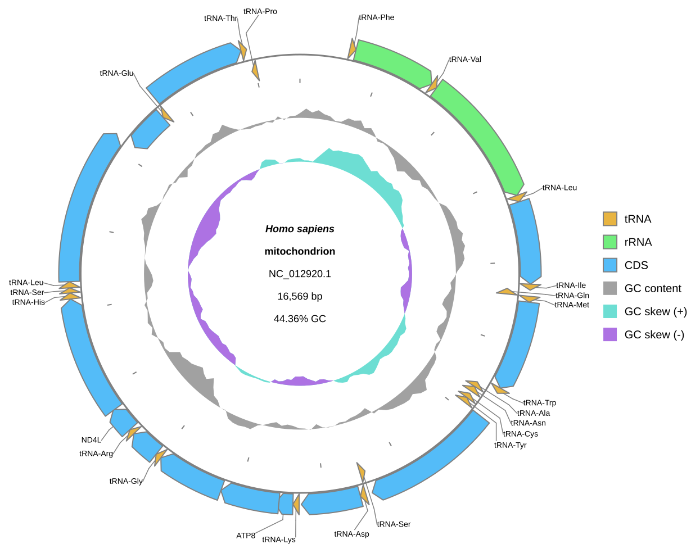

[Home](../../DOCS.md) | [Tutorials](../README.md) | [Python API](../../REFERENCE/python-api.md) | [Export](../../REFERENCE/output-formats-and-export.md)

# Draw and save your first genome diagram from Python

You will load the human mitochondrial reference genome, draw one Circular
diagram, and save it as a standard SVG with the beginner-facing Python API.

## What you'll need

- gbdraw installed in the active Python environment;
- the packaged [`HmmtDNA.gbk`](../../../gbdraw/web/tutorial-data/human-mitochondrion/HmmtDNA.gbk)
  fixture, saved with that filename;
- an empty working directory.

## Step 1: Save the Python program

Place `HmmtDNA.gbk` in the working directory. Save the following program as
`first_diagram.py` in the same directory:

<!-- executable:T-PY-01:start -->
```python
from pathlib import Path

from gbdraw import Diagram, draw_circular, read_genbank


input_path = Path("HmmtDNA.gbk")
output_path = Path("python_human_mitochondrion.svg")

record = read_genbank(input_path)[0]
diagram = draw_circular(record)
saved_path = diagram.save(output_path)

assert isinstance(diagram, Diagram)
assert saved_path == output_path
print(f"Saved {saved_path}")
```
<!-- executable:T-PY-01:end -->

`read_genbank()` returns a list because one GenBank file can contain more than
one record. This tutorial selects the only record in the fixture.

## Step 2: Run the program

```bash
python first_diagram.py
```

The program prints `Saved python_human_mitochondrion.svg`. The returned
`Diagram` remains available in memory, and `save()` writes the SVG in the
current directory.

## Step 3: Inspect the SVG

Open `python_human_mitochondrion.svg`. It contains `NC_012920.1`, 37 displayed
features, coordinate ticks, GC content, and GC skew.



The recipe runner extracts the exact Python block above, executes it in a clean
temporary directory, verifies that `diagram` is a `Diagram`, and checks the
same SVG semantics as the CLI tutorial.

## If the program fails

- `ModuleNotFoundError: No module named 'gbdraw'`: activate the environment
  where gbdraw is installed.
- `Output file already exists`: use a new empty directory or change
  `output_path`. `Diagram.save()` does not overwrite by default.

## What you built

You used three public names: `read_genbank`, `draw_circular`, and
`Diagram.save`. Run
`python docs/recipes/run_python_scenarios.py --scenario T-PY-01` from a
repository checkout to regenerate the published figure. Continue with the
[Python API reference](../../REFERENCE/python-api.md) for options, Linear
diagrams, and byte output. See [Choose GUI, CLI, or Python](../../EXPLANATION/choose-gui-cli-or-python.md)
when planning a different workflow.
