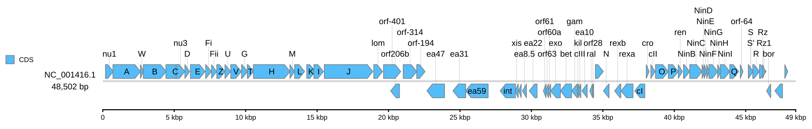

[Documentation home](../../DOCS.md) | [All Tutorials](../README.md) | [Python API reference](../../REFERENCE/python-api.md)

# Create a reproducible linear diagram from Python

## Choose how to build this figure

| GUI | CLI | Python API |
| --- | --- | --- |
| [Web app](../GUI/first-linear-genome-diagram.md) | [Command line](../CLI/first-linear-genome-diagram.md) | **Python API** |

This project draws the complete 48,502 bp Lambda record with separated feature
strands, concise labels, a centered ruler, and the legend on the left.

## Step 1: Prepare the inputs

Place `NC_001416.gb` and `cds_gene_qualifier_priority.tsv` in an empty working
directory. Both files are included in the public Tutorial data.

## Step 2: Draw and save the figure

<!-- executable:T-PY-03:start -->
```python
from pathlib import Path

from gbdraw import LabelOptions, LinearOptions, draw_linear, read_genbank


record = read_genbank([Path("NC_001416.gb")])[0]
assert record.id == "NC_001416.1" and len(record) == 48_502

options = LinearOptions(
    labels=LabelOptions(
        qualifier_priority="cds_gene_qualifier_priority.tsv",
    ),
    legend="left",
    config_overrides={
        "labels.linear.scope": "all",
        "canvas.strandedness": True,
        "canvas.linear.track_layout": "middle",
        "objects.scale.style": "ruler",
    },
)
diagram = draw_linear(record, options=options)
saved_path = diagram.save(Path("python_lambda_linear.svg"))
print(f"Saved {saved_path}")
```
<!-- executable:T-PY-03:end -->

The returned `Diagram` keeps the parsed record in memory and writes one standard
SVG. Open `python_lambda_linear.svg` to see the labeled whole-record map.



## Step 3: Verify the result

The executable recipe checks the record identity, 73 stable feature IDs,
representative gene labels, ruler marks, strand separation, and standard-SVG
safety. Run it from a repository checkout with:

```bash
python docs/recipes/run_python_scenarios.py --scenario T-PY-03 --check
```

## What you built

You built the same Lambda map as the GUI and CLI variants through the public
Python API. Change one option at a time when adapting the recipe so the record
identity and ruler remain easy to verify.
