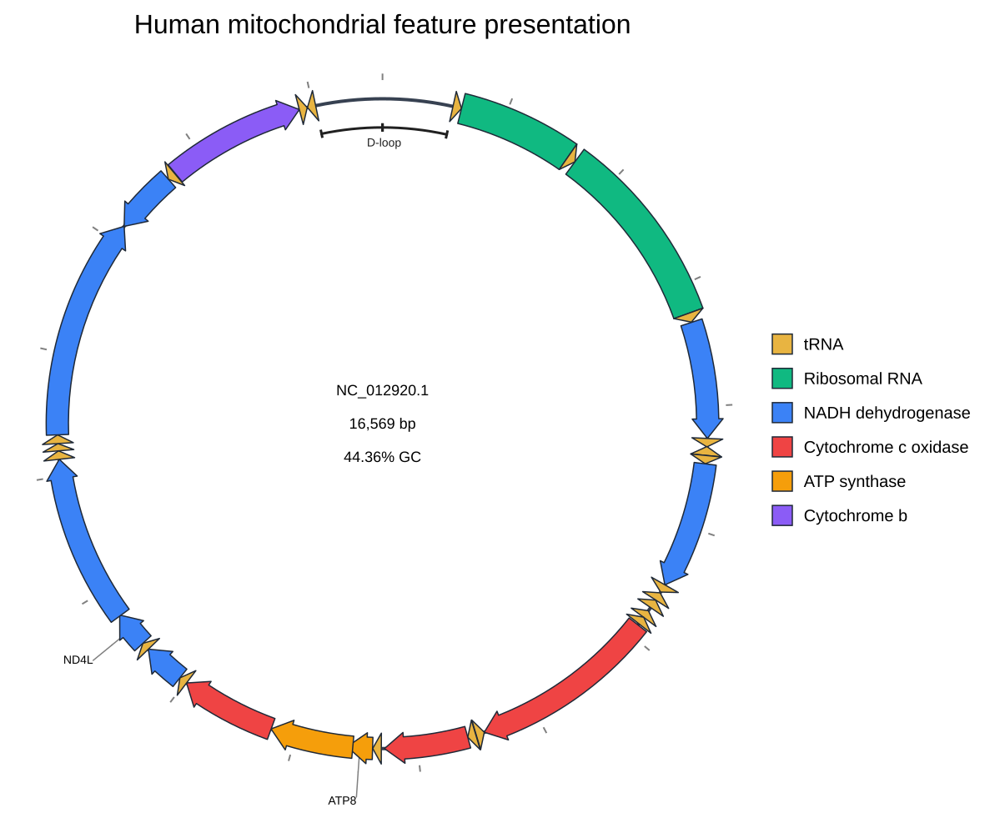

[Home](../../DOCS.md) | [Tutorials](../README.md) | [Get tutorial files](../../GETTING_TUTORIAL_DATA.md) | [Python API](../../REFERENCE/python-api.md)

# Highlight mitochondrial features from Python

## Choose how to build this figure

| GUI | CLI | Python API |
| --- | --- | --- |
| [Web-app workflow](../GUI/highlight-mitochondrial-features.md) | [CLI workflow](../CLI/highlight-mitochondrial-features.md) | **This page** |

Apply the CLI project's color, label, shape, stroke, and D-loop rules through
the public Python API without changing the GenBank record.

## What you'll need

| Kind | Filename | What to do |
| --- | --- | --- |
| Download | `HmmtDNA.gbk` ([NCBI accession NC_012920.1](https://www.ncbi.nlm.nih.gov/nuccore/NC_012920.1)) | Download the complete GenBank record and save it as `HmmtDNA.gbk`. |
| Download | [`cds_gene_qualifier_priority.tsv`](../../../gbdraw/web/tutorial-data/shared/cds_gene_qualifier_priority.tsv) | Save the supplied label rule as `cds_gene_qualifier_priority.tsv`. |
| Create | `highlight_mitochondrial_features.py` | Save the complete Python program from Step 2 with this filename. |
| Generated | `mitochondrial_features_highlighted.svg` | The program writes this SVG. |
| Reference result | [`mitochondrial_features_highlighted.svg`](../../images/t-py-09/mitochondrial_features_highlighted.svg) | Compare your Generated SVG with this versioned result. |

Install gbdraw in the active Python environment before starting. The program
creates the color, label, and D-loop tables in memory, so you do not need to
create separate TSV files.

## Step 1: Prepare the working directory

Create and enter an empty directory:

```bash
mkdir gbdraw-python-mitochondrial-features
cd gbdraw-python-mitochondrial-features
```

Acquire the sequence from its authoritative accession link and download the
supplied label rule. Save both with the exact filenames shown. See [Get the
tutorial files](../../GETTING_TUTORIAL_DATA.md) for browser, `curl`, and
PowerShell instructions for authoritative sequence acquisition.

## Step 2: Save and run the Python program

Save the following complete program as `highlight_mitochondrial_features.py`:

<!-- executable:T-PY-09:start -->
```python
from pathlib import Path

from pandas import DataFrame

from gbdraw import (
    CircularOptions,
    CircularTrackOptions,
    FeatureOptions,
    LabelOptions,
    TitleOptions,
    draw_circular,
    read_genbank,
)
from gbdraw.api import AnnotationOptions, CircularTrackSlot, ScalarSpec


color_table = DataFrame(
    [
        ["CDS", "gene", "^ND(4L|[1-6])$", "#3B82F6", "NADH dehydrogenase"],
        ["CDS", "gene", "^COX[1-3]$", "#EF4444", "Cytochrome c oxidase"],
        ["CDS", "gene", "^ATP[68]$", "#F59E0B", "ATP synthase"],
        ["CDS", "gene", "^CYTB$", "#8B5CF6", "Cytochrome b"],
        ["rRNA", "gene", "^RNR[12]$", "#10B981", "Ribosomal RNA"],
    ],
    columns=["feature_type", "qualifier_key", "value", "color", "caption"],
)
label_whitelist = DataFrame(
    [
        ["CDS", "gene", "^(ND[1-6]|ND4L|COX[1-3]|ATP[68]|CYTB)$"],
        ["rRNA", "gene", "^RNR[12]$"],
    ],
    columns=["feature_type", "qualifier", "keyword"],
)
label_overrides = DataFrame(
    [
        ["NC_012920.1", "rRNA", "label", "^s-rRNA$", "12S rRNA"],
        ["NC_012920.1", "rRNA", "label", "^l-rRNA$", "16S rRNA"],
    ],
    columns=["record_id", "feature_type", "qualifier", "value", "label_text"],
)
regions = DataFrame(
    [[
        "mitochondrial_regions", "d_loop", "bracket", "NC_012920.1",
        16024, 576, "source", True, "D-loop", 0, "#202020", 3, "tick",
        "#202020", 14, "tangent", 7,
    ]],
    columns=[
        "set_id", "id", "mark", "record", "start", "end",
        "coordinate_space", "wraps_origin", "label", "lane", "stroke",
        "stroke_width", "line_cap", "label_color", "label_font_size",
        "label_orientation", "label_offset",
    ],
)
track_slots = (
    CircularTrackSlot(
        id="ticks",
        renderer="ticks",
        side="outside",
        params={"tick_label_layout": "label_out_tick_in"},
    ),
    CircularTrackSlot(
        id="features",
        renderer="features",
        side="overlay",
        params={"lane_direction": "split"},
    ),
    CircularTrackSlot(
        id="mitochondrial_regions",
        renderer="annotations",
        side="inside",
        width=ScalarSpec(24, "px"),
        params={
            "set_id": "mitochondrial_regions",
            "show_labels": True,
            "padding_px": 1,
            "overflow": "compress",
        },
    ),
)

record = read_genbank(Path("HmmtDNA.gbk"))[0]
options = CircularOptions(
    features=FeatureOptions(
        types=("CDS", "rRNA", "tRNA"),
        color_table=color_table,
        shapes={"CDS": "arrow", "rRNA": "rectangle", "tRNA": "arrow"},
    ),
    labels=LabelOptions(
        qualifier_priority="cds_gene_qualifier_priority.tsv",
        whitelist=label_whitelist,
        overrides=label_overrides,
    ),
    annotations=AnnotationOptions(table=regions),
    tracks=CircularTrackOptions(slots=track_slots),
    species="<i>Homo sapiens</i>",
    title=TitleOptions(
        text="Human mitochondrial feature presentation",
        position="top",
    ),
    legend="right",
    config_overrides={
        "canvas.resolve_overlaps": False,
        "canvas.strandedness": False,
        "canvas.circular.track_type": "middle",
        "labels.circular.scope": "both",
        "labels.rendering": "auto",
        "objects.features.arrow_geometry.head_length_ratio": "auto",
        "objects.features.arrow_geometry.shaft_width_ratio": 0.72,
        "objects.features.block_stroke_color": "#1F2937",
        "objects.features.block_stroke_width.short": 1.5,
        "objects.features.block_stroke_width.long": 1.5,
        "objects.axis.circular.stroke_color": "#374151",
        "objects.axis.circular.stroke_width.short": 4,
        "objects.axis.circular.stroke_width.long": 4,
        "objects.features.line_stroke_color": "#9CA3AF",
        "objects.features.line_stroke_width.short": 1.5,
        "objects.features.line_stroke_width.long": 1.5,
    },
)
diagram = draw_circular(record, options=options)
saved_path = diagram.save(Path("mitochondrial_features_highlighted.svg"))
print(f"Saved {saved_path}")
```
<!-- executable:T-PY-09:end -->

Before running it, your working directory should contain:

```text
gbdraw-python-mitochondrial-features/
├── HmmtDNA.gbk
├── cds_gene_qualifier_priority.tsv
└── highlight_mitochondrial_features.py
```

### Run the program

```bash
python highlight_mitochondrial_features.py
```

Expected output: the program prints
`Saved mitochondrial_features_highlighted.svg` and writes the Generated SVG in
the current directory.

## Step 3: Inspect the result

Open the Generated `mitochondrial_features_highlighted.svg`. It should keep all
37 features, use gene names for CDS labels, show the two renamed rRNA labels,
retain the five functional legend colors and the arrow and rectangle shapes,
and include one origin-spanning D-loop bracket.



The image above is the Reference result. Compare its labels, colors, shapes,
strokes, legend, and D-loop bracket with your SVG.

## Next steps

- [Add tracks, annotations, colors, and labels](../../HOW_TO/PYTHON/add-tracks-annotations-colors-and-labels.md)
- [Review feature-rule and label schemas](../../REFERENCE/palettes-feature-rules-labels-shapes-and-tracks.md)
