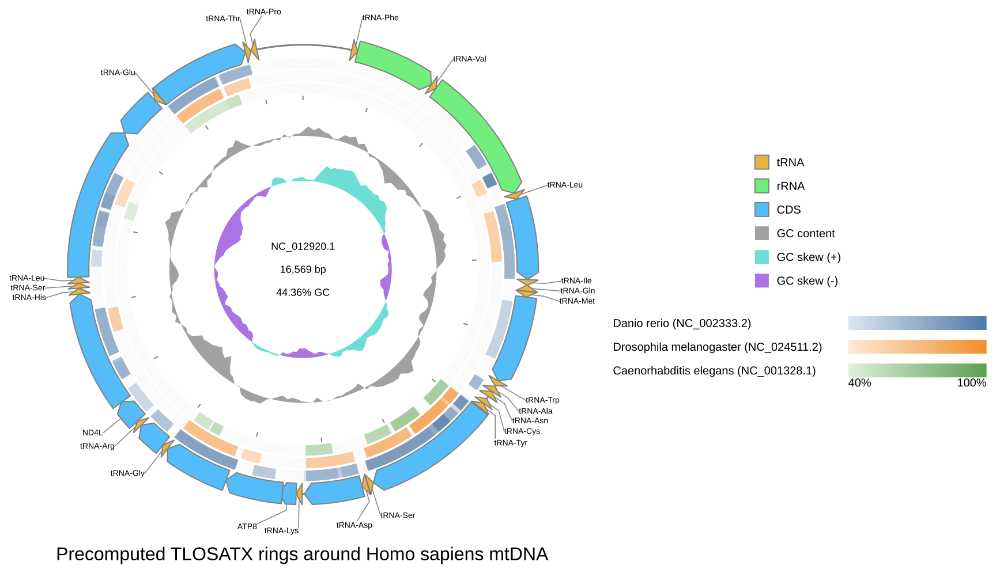
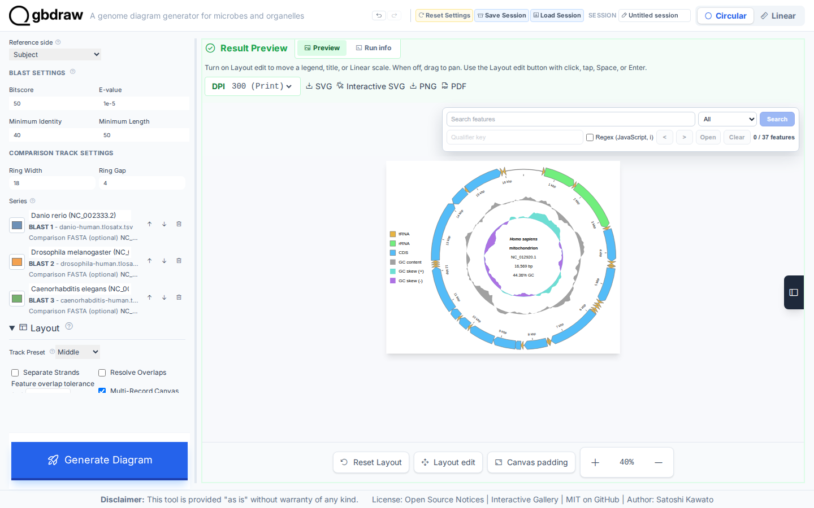
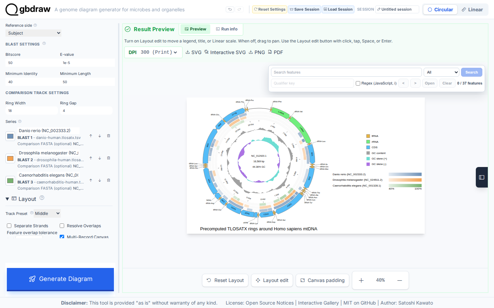
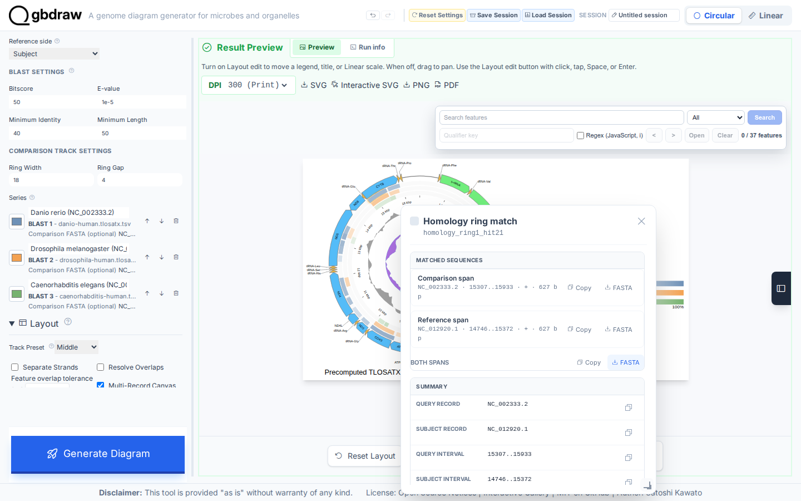

[Documentation home](../DOCS.md) | [Tutorials](README.md) | [Get the tutorial inputs](../GETTING_TUTORIAL_DATA.md) | [Technical documentation](../REFERENCE/README.md)

# Show how three animal mitochondrial genomes match the human reference

You will place three translated-nucleotide comparison rings (zebrafish,
fruit fly, and nematode) around the complete human mitochondrial genome as a
Circular SVG. Look for the ring order, the labels, and the colored HSPs, whose
positions are always coordinates on the human record.



The searches are already done and saved as TLOSATX outfmt 6 tables, so you
set the reference, the ring order, and the filters, then inspect and export
HSPs.

## Before you start

Download the inputs and save them with the exact filenames shown. [Get the
tutorial inputs](../GETTING_TUTORIAL_DATA.md) explains browser, `curl`, and
PowerShell downloads, the identity checks, and the meaning of each file type.

| File | Record | Length | Download |
| --- | --- | --- | --- |
| `HmmtDNA.gbk` | NCBI `NC_012920.1`, *Homo sapiens* mitochondrion, complete genome | 16,569 bp | [Record page](https://www.ncbi.nlm.nih.gov/nuccore/NC_012920.1); [full GenBank file](https://eutils.ncbi.nlm.nih.gov/entrez/eutils/efetch.fcgi?db=nuccore&id=NC_012920.1&rettype=gbwithparts&retmode=text) |
| `NC_002333.2.fna` | NCBI `NC_002333.2`, *Danio rerio* mitochondrion, complete genome | 16,596 bp | [Record page](https://www.ncbi.nlm.nih.gov/nuccore/NC_002333.2); [FASTA file](https://eutils.ncbi.nlm.nih.gov/entrez/eutils/efetch.fcgi?db=nuccore&id=NC_002333.2&rettype=fasta&retmode=text) |
| `NC_024511.2.fna` | NCBI `NC_024511.2`, *Drosophila melanogaster* mitochondrion, complete genome | 19,524 bp | [Record page](https://www.ncbi.nlm.nih.gov/nuccore/NC_024511.2); [FASTA file](https://eutils.ncbi.nlm.nih.gov/entrez/eutils/efetch.fcgi?db=nuccore&id=NC_024511.2&rettype=fasta&retmode=text) |
| `NC_001328.1.fna` | NCBI `NC_001328.1`, *Caenorhabditis elegans* mitochondrion, complete genome | 13,794 bp | [Record page](https://www.ncbi.nlm.nih.gov/nuccore/NC_001328.1); [FASTA file](https://eutils.ncbi.nlm.nih.gov/entrez/eutils/efetch.fcgi?db=nuccore&id=NC_001328.1&rettype=fasta&retmode=text) |
| `danio-human.tlosatx.tsv` | TLOSATX table, *Danio rerio* (query) against human (subject) | — | [`danio-human.tlosatx.tsv`](../../gbdraw/web/tutorial-data/metazoan-mitochondria-comparison/danio-human.tlosatx.tsv) (select **Download raw file**) |
| `drosophila-human.tlosatx.tsv` | TLOSATX table, *Drosophila melanogaster* (query) against human (subject) | — | [`drosophila-human.tlosatx.tsv`](../../gbdraw/web/tutorial-data/metazoan-mitochondria-comparison/drosophila-human.tlosatx.tsv) (select **Download raw file**) |
| `caenorhabditis-human.tlosatx.tsv` | TLOSATX table, *Caenorhabditis elegans* (query) against human (subject) | — | [`caenorhabditis-human.tlosatx.tsv`](../../gbdraw/web/tutorial-data/metazoan-mitochondria-comparison/caenorhabditis-human.tlosatx.tsv) (select **Download raw file**) |
| `cds_gene_qualifier_priority.tsv` | CDS `gene` label priority | — | [`cds_gene_qualifier_priority.tsv`](../../gbdraw/web/tutorial-data/shared/cds_gene_qualifier_priority.tsv) (select **Download raw file**) |

The three TLOSATX tables are precomputed results made before this Tutorial,
not results of the steps below; use them as downloaded. The web app pairs them with the comparison FASTA files in
this order:

| Ring | Precomputed table | Comparison FASTA | Ring label |
| ---: | --- | --- | --- |
| 1 | `danio-human.tlosatx.tsv` | `NC_002333.2.fna` | `Danio rerio (NC_002333.2)` |
| 2 | `drosophila-human.tlosatx.tsv` | `NC_024511.2.fna` | `Drosophila melanogaster (NC_024511.2)` |
| 3 | `caenorhabditis-human.tlosatx.tsv` | `NC_001328.1.fna` | `Caenorhabditis elegans (NC_001328.1)` |

Each interface creates these files:

| Interface | You create | gbdraw writes | Compare with |
| --- | --- | --- | --- |
| Web app | — | `circular_hsp_spans.fasta`, the reference and comparison intervals exported in Step 5; `precomputed_circular_rings.svg`, saved in Step 5 | The figure above |
| Command line | — | `precomputed_circular_rings.svg` | [`precomputed_circular_rings.svg`](../images/t-cli-09/precomputed_circular_rings.svg) |
| Python | `precomputed_circular_rings.py`, the program from Step 2 | `python_precomputed_circular_rings.svg` | [`python_precomputed_circular_rings.svg`](../images/t-py-06/python_precomputed_circular_rings.svg) |

For the command line and Python, install gbdraw so that `gbdraw -h` succeeds
and start in an empty working directory.

## In the web app

Starting state: open a fresh gbdraw web app page with no session loaded and no
files selected.

### Step 1: Load the human reference

Select **Circular** and **GenBank**, choose `HmmtDNA.gbk`, and set:

| Control | Value |
| --- | --- |
| Output Prefix | `precomputed_circular_rings` |
| Species | `<i>Homo sapiens</i>` |
| Track Preset | Middle |
| Separate Strands | Off |


### Step 2: Generate the reference map

Select **Generate Diagram** before adding comparison evidence. The first result
identifies `NC_012920.1`, contains 37 feature elements, and has no comparison
rings.


### Step 3: Add the three precomputed comparisons

Open **Pairwise Comparisons**, select **Upload BLAST**, and choose all three TSV
files together. Set **Reference side** to **Subject**: every table uses a
comparison genome as query and human mtDNA as subject.

Attach the matching comparison FASTA to each table, then use:

| Control | Value |
| --- | ---: |
| Bitscore | 50 |
| E-value | `1e-5` |
| Minimum identity | 40 |
| Minimum length | 50 |
| Ring width | 18 |
| Ring gap | 4 |

Keep the ring order and enter the labels shown in the input table. Set **Label
Mode** to **Out** and load `cds_gene_qualifier_priority.tsv` as **Priority File
(TSV)**. Set the title to
`Precomputed TLOSATX rings around Homo sapiens mtDNA`, and the legend to the
right in the separate Legend section. Set **Plot Title Position** to **Bottom**.



### Step 4: Generate and read the rings

Select **Generate Diagram**. The filters retain 106 HSPs across the three
rings. Colors and legend order identify the comparison source; positions
around the circle are always coordinates on the human subject record.



### Step 5: Inspect an HSP and export its spans

Select a colored HSP. The popup shows its endpoints, identity, alignment
length, reference side, and source ring. Use **Both spans FASTA** to save the
reference and comparison intervals as `circular_hsp_spans.fasta`.



Select **SVG** to save `precomputed_circular_rings.svg`.

### Variant: run TLOSATX in the browser

To compute the three rings instead of uploading frozen tables, keep the same
displayed reference, comparison file order, labels, and filters. Under
**Pairwise Comparisons**, select **Run LOSAT** and **TLOSATX**, and add each
comparison file with **Add Seq**; FASTA, GenBank, and DDBJ files are accepted.
Set **Reference gencode** to `2` and each row's **Comparison gencode** to `2`,
`5`, and `5` for zebrafish, fruit fly, and nematode, respectively. The
displayed human record is the TLOSATX subject.

The 106-HSP check in Step 4 applies only to the precomputed tables. See
[filters and direction](../REFERENCE/comparison-programs-thresholds-and-results.md#filters-and-direction)
for the live search contract.

## On the command line

### Step 1: Prepare the working directory

Create and enter an empty directory:

```bash
mkdir gbdraw-cli-precomputed-rings
cd gbdraw-cli-precomputed-rings
```

Download all eight files from the table in [Before you start](#before-you-start).
The GenBank and FASTA links download accession-pinned sequences directly from
NCBI. The remaining links are repository-hosted support tables; select
**Download raw file** for those. Save every file with the exact name in the
table.

On macOS, Linux, or WSL, run:

```bash
ncbi_efetch="https://eutils.ncbi.nlm.nih.gov/entrez/eutils/efetch.fcgi"
gbdraw_data_base="https://raw.githubusercontent.com/satoshikawato/gbdraw/main/gbdraw/web/tutorial-data"
curl -L "${ncbi_efetch}?db=nuccore&id=NC_012920.1&rettype=gbwithparts&retmode=text" -o HmmtDNA.gbk
curl -L "$gbdraw_data_base/metazoan-mitochondria-comparison/danio-human.tlosatx.tsv" -o danio-human.tlosatx.tsv
curl -L "$gbdraw_data_base/metazoan-mitochondria-comparison/drosophila-human.tlosatx.tsv" -o drosophila-human.tlosatx.tsv
curl -L "$gbdraw_data_base/metazoan-mitochondria-comparison/caenorhabditis-human.tlosatx.tsv" -o caenorhabditis-human.tlosatx.tsv
curl -L "${ncbi_efetch}?db=nuccore&id=NC_002333.2&rettype=fasta&retmode=text" -o NC_002333.2.fna
curl -L "${ncbi_efetch}?db=nuccore&id=NC_024511.2&rettype=fasta&retmode=text" -o NC_024511.2.fna
curl -L "${ncbi_efetch}?db=nuccore&id=NC_001328.1&rettype=fasta&retmode=text" -o NC_001328.1.fna
curl -L "$gbdraw_data_base/shared/cds_gene_qualifier_priority.tsv" -o cds_gene_qualifier_priority.tsv
```

Confirm the GenBank version and the three FASTA headers:

```bash
grep '^VERSION' HmmtDNA.gbk
grep -H '^>' NC_002333.2.fna NC_024511.2.fna NC_001328.1.fna
```

Expect `NC_012920.1` in the GenBank result and one matching accession-version
in each FASTA header. The working directory should now contain:

```text
gbdraw-cli-precomputed-rings/
├── HmmtDNA.gbk
├── danio-human.tlosatx.tsv
├── drosophila-human.tlosatx.tsv
├── caenorhabditis-human.tlosatx.tsv
├── NC_002333.2.fna
├── NC_024511.2.fna
├── NC_001328.1.fna
└── cds_gene_qualifier_priority.tsv
```

### Step 2: Draw the three rings

<!-- executable:T-CLI-09:start -->
```bash
gbdraw circular \
  --gbk HmmtDNA.gbk \
  --conservation_blast danio-human.tlosatx.tsv drosophila-human.tlosatx.tsv caenorhabditis-human.tlosatx.tsv \
  --conservation_sequence NC_002333.2.fna NC_024511.2.fna NC_001328.1.fna \
  --conservation_reference subject \
  --conservation_labels 'Danio rerio (NC_002333.2)' 'Drosophila melanogaster (NC_024511.2)' 'Caenorhabditis elegans (NC_001328.1)' \
  --conservation_colors '#4E79A7' '#F28E2B' '#59A14F' \
  --bitscore 50 \
  --evalue 1e-5 \
  --identity 40 \
  --alignment_length 50 \
  --conservation_ring_width 18 \
  --conservation_ring_gap 4 \
  --species '<i>Homo sapiens</i>' \
  --qualifier_priority cds_gene_qualifier_priority.tsv \
  --track_type middle \
  --labels out \
  --definition_font_size 18 \
  --plot_title 'Precomputed TLOSATX rings around Homo sapiens mtDNA' \
  --plot_title_position bottom \
  --legend right \
  -o precomputed_circular_rings \
  -f svg
```
<!-- executable:T-CLI-09:end -->

Expected output: gbdraw writes `precomputed_circular_rings.svg`
in the working directory.

Open `precomputed_circular_rings.svg` and compare its ring order and labels
with the figure at the top of this page. Verify the subject-reference
direction, the documented ring order and labels, and the comparison FASTA
identities. The finished SVG should retain 106 HSPs across the three rings.

`--conservation_sequence` also accepts GenBank or DDBJ flat files of the
comparison genomes. It supplies the sequences for the comparison-span FASTA
actions of an `interactive_svg`; it does not change the static rings.

### Step 3: Run the TLOSATX searches directly

With a LOSAT runtime, gbdraw can run the three searches itself instead of
reading the frozen tables. `--losat tlosatx` searches each
`--conservation_sequence` genome (the query) against the displayed human
record (the subject), so every ring uses the reference genome as its E-value
database. `--losat_gencode` sets the human table and
`--conservation_losat_gencode` sets one table per comparison genome, in the
same order; both default to 1. Drop `--conservation_blast` and
`--conservation_reference`:

```bash
gbdraw circular \
  --gbk HmmtDNA.gbk \
  --losat tlosatx \
  --losat_gencode 2 \
  --conservation_sequence NC_002333.2.fna NC_024511.2.fna NC_001328.1.fna \
  --conservation_losat_gencode 2 5 5 \
  --conservation_labels 'Danio rerio (NC_002333.2)' 'Drosophila melanogaster (NC_024511.2)' 'Caenorhabditis elegans (NC_001328.1)' \
  --conservation_colors '#4E79A7' '#F28E2B' '#59A14F' \
  --bitscore 50 \
  --evalue 1e-5 \
  --identity 40 \
  --alignment_length 50 \
  --conservation_ring_width 18 \
  --conservation_ring_gap 4 \
  --species '<i>Homo sapiens</i>' \
  --qualifier_priority cds_gene_qualifier_priority.tsv \
  --track_type middle \
  --labels out \
  --definition_font_size 18 \
  --plot_title 'Precomputed TLOSATX rings around Homo sapiens mtDNA' \
  --plot_title_position bottom \
  --legend right \
  --losat_output_dir tlosatx-results \
  -o precomputed_circular_rings \
  -f svg
```

With the LOSAT runtime that produced the frozen tables, the SVG is
byte-identical to Step 2. Another LOSAT version or NCBI BLAST+ can report
different rows. `tlosatx-results/` receives one TSV per ring and
`conservation.tsv`, which `--conservation_table` accepts unchanged; add
`--save_session` to keep the search results in a Session that replays without
LOSAT.

## In Python

### Step 1: Prepare the working directory

Create and enter an empty directory:

```bash
mkdir gbdraw-python-precomputed-rings
cd gbdraw-python-precomputed-rings
```

Download all eight files from the table in [Before you start](#before-you-start)
and save every file with the exact filename shown.

### Step 2: Save and run the Python program

Save the following complete program as `precomputed_circular_rings.py`:

<!-- executable:T-PY-06:start -->
```python
from pathlib import Path

from gbdraw import (
    CircularOptions,
    ComparisonRingOptions,
    ComparisonRingTrackOptions,
    LabelOptions,
    Thresholds,
    TitleOptions,
    draw_circular,
    read_genbank,
)


record = read_genbank([Path("HmmtDNA.gbk")])[0]
rings = ComparisonRingOptions(
    tracks=(
        ComparisonRingTrackOptions(
            source="danio-human.tlosatx.tsv",
            label="Danio rerio (NC_002333.2)",
            color="#4E79A7",
            comparison_sequence_source="NC_002333.2.fna",
        ),
        ComparisonRingTrackOptions(
            source="drosophila-human.tlosatx.tsv",
            label="Drosophila melanogaster (NC_024511.2)",
            color="#F28E2B",
            comparison_sequence_source="NC_024511.2.fna",
        ),
        ComparisonRingTrackOptions(
            source="caenorhabditis-human.tlosatx.tsv",
            label="Caenorhabditis elegans (NC_001328.1)",
            color="#59A14F",
            comparison_sequence_source="NC_001328.1.fna",
        ),
    ),
    reference="subject",
    ring_width=18,
    ring_gap=4,
)
options = CircularOptions(
    comparison_rings=rings,
    labels=LabelOptions(
        qualifier_priority="cds_gene_qualifier_priority.tsv",
    ),
    thresholds=Thresholds(
        bitscore=50,
        evalue=1e-5,
        identity=40,
        alignment_length=50,
    ),
    species="<i>Homo sapiens</i>",
    title=TitleOptions(
        text="Precomputed TLOSATX rings around Homo sapiens mtDNA",
        position="bottom",
    ),
    legend="right",
    config_overrides={
        "canvas.strandedness": False,
        "canvas.circular.track_type": "middle",
        "labels.circular.scope": "outer",
        "objects.definition.circular.font_size": 18,
    },
)
diagram = draw_circular(record, options=options)
saved_path = diagram.save(Path("python_precomputed_circular_rings.svg"))
print(f"Saved {saved_path}")
```
<!-- executable:T-PY-06:end -->

Before running it, your working directory should contain:

```text
gbdraw-python-precomputed-rings/
├── HmmtDNA.gbk
├── danio-human.tlosatx.tsv
├── drosophila-human.tlosatx.tsv
├── caenorhabditis-human.tlosatx.tsv
├── NC_002333.2.fna
├── NC_024511.2.fna
├── NC_001328.1.fna
├── cds_gene_qualifier_priority.tsv
└── precomputed_circular_rings.py
```

Draw and save the rings:

```bash
python precomputed_circular_rings.py
```

Expected output: the program prints
`Saved python_precomputed_circular_rings.svg` and writes the SVG in
the current directory.

### Step 3: Inspect the rings

Open `python_precomputed_circular_rings.svg` and check the three
ring labels and their Danio, Drosophila, Caenorhabditis order.

Your SVG should match the figure at the top of this page. Compare the
subject-reference direction, ring widths, gaps, labels, colors, and order with
your SVG.

The saved SVG should keep the ordered ring labels, the subject-reference
mapping, and 106 retained HSPs across the three companion sequences.

### Step 4: Run the TLOSATX searches directly

With a LOSAT runtime, `ComparisonRingOptions(losat="tlosatx")` runs the three
searches instead of reading the tables. Each track names its comparison
genome with `comparison_sequence_source` (FASTA, GenBank, or DDBJ) and no
`source`; the displayed human record is the subject. `reference_gencode` and
each track's `losat_gencode` set the TLOSATX tables (default 1). Replace
`rings` in the program with:

```python
rings = ComparisonRingOptions(
    losat="tlosatx",
    reference_gencode=2,
    tracks=(
        ComparisonRingTrackOptions(
            comparison_sequence_source="NC_002333.2.fna",
            losat_gencode=2,
            label="Danio rerio (NC_002333.2)",
            color="#4E79A7",
        ),
        ComparisonRingTrackOptions(
            comparison_sequence_source="NC_024511.2.fna",
            losat_gencode=5,
            label="Drosophila melanogaster (NC_024511.2)",
            color="#F28E2B",
        ),
        ComparisonRingTrackOptions(
            comparison_sequence_source="NC_001328.1.fna",
            losat_gencode=5,
            label="Caenorhabditis elegans (NC_001328.1)",
            color="#59A14F",
        ),
    ),
    ring_width=18,
    ring_gap=4,
)
```

With the LOSAT runtime that produced the frozen tables, the SVG matches Step 2.
`losat_executable`, `ncbi_blast_executable`, and `threads` choose the runtime;
by default gbdraw resolves one.

## Next steps

- [Review Circular rings and uploaded comparison tables](../REFERENCE/comparison-programs-thresholds-and-results.md)
- [Choose a genome-comparison method](../FAQ.md#which-comparison-method-should-i-use)
- Technical documentation for the [web app](../REFERENCE/web-app.md), the
  [command line](../REFERENCE/command-line.md), and [Python](../REFERENCE/python-api.md)

## About the data

- `HmmtDNA.gbk` is NCBI accession `NC_012920.1`, and the three FASTA files
  are NCBI `NC_002333.2`, `NC_024511.2`, and `NC_001328.1`. Check the accession
  version in the `VERSION` line or FASTA header; it identifies the exact
  nucleotide sequence.
- The three TLOSATX tables and `cds_gene_qualifier_priority.tsv` are gbdraw
  support files hosted in this repository. Every table uses a comparison genome
  as query and the human mitochondrial genome as subject.
- The command and the Python program on this page run in gbdraw's automated
  documentation checks against the frozen tables. The checks confirm the ring
  order and labels, the subject-reference mapping, the comparison FASTA
  identities, and 106 retained HSPs across the three rings. The 106-HSP count
  applies only to the precomputed tables, not to the live TLOSATX variants.
