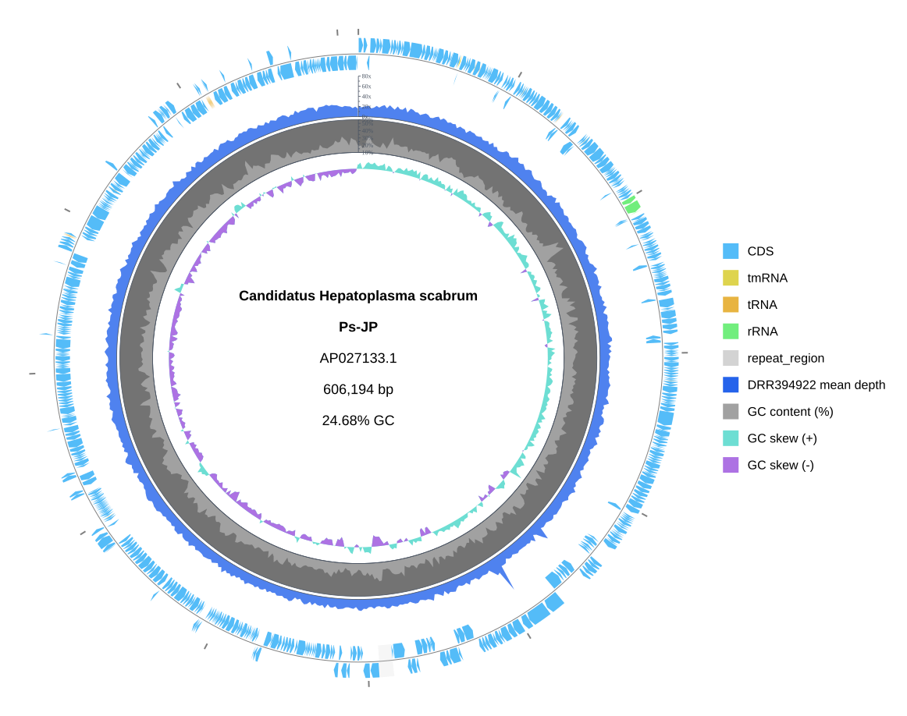
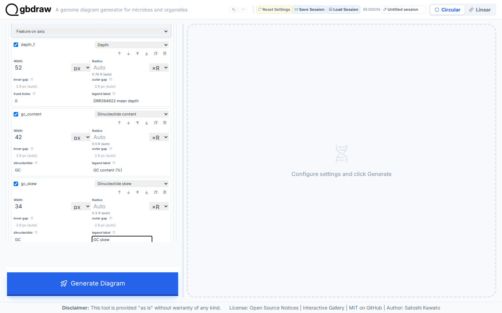
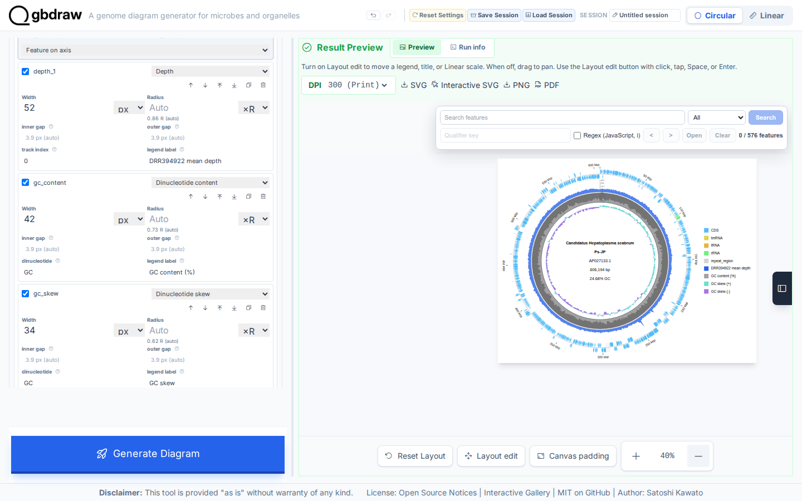
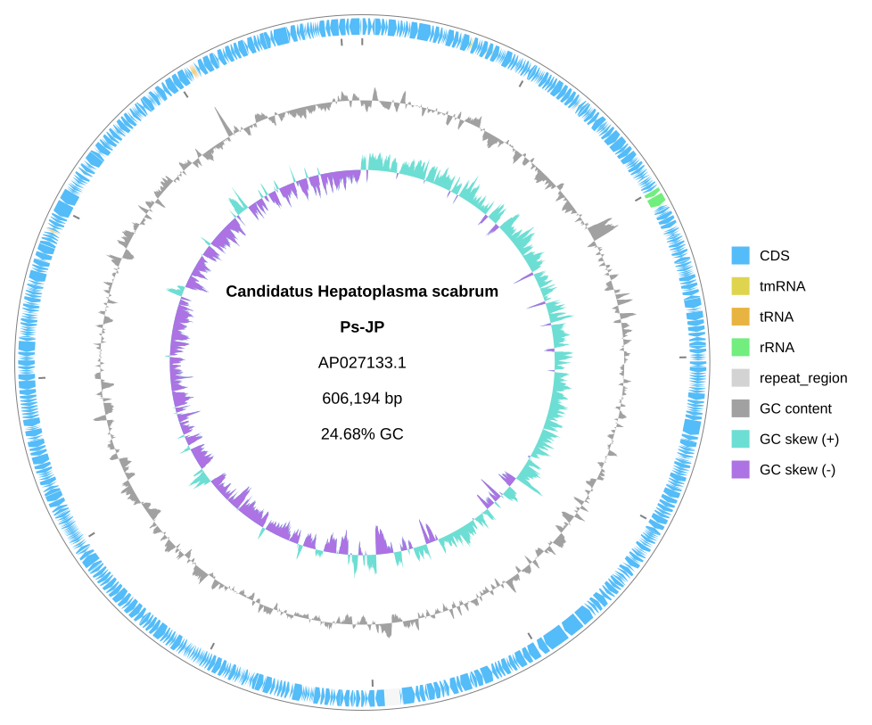

[Documentation home](../DOCS.md) | [Tutorials](README.md) | [Get the tutorial inputs](../GETTING_TUTORIAL_DATA.md) | [Technical documentation](../REFERENCE/README.md)

# Plot read depth, GC content, and GC skew on a genome map

You will combine measured sequencing depth with GC content and GC skew on the complete 606,194 bp circular `AP027133.1` record. Read the rings from outside to inside: coordinate ticks, features, a blue depth ring, GC content, and GC skew.



*Depth and GC content have labeled axes and ticks; GC skew is read around its zero baseline.*

## Before you start

Download the inputs and save them with the exact filenames shown. [Get the
tutorial inputs](../GETTING_TUTORIAL_DATA.md) explains browser, `curl`, and
PowerShell downloads.

| File | Record | Length | Download |
| --- | --- | --- | --- |
| `AP027133.gb` | NCBI `AP027133.1`, MAG: Candidatus Hepatoplasma scabrum Ps-JP DNA, complete genome | 606,194 bp | [Record page](https://www.ncbi.nlm.nih.gov/nuccore/AP027133.1); [full GenBank file](https://eutils.ncbi.nlm.nih.gov/entrez/eutils/efetch.fcgi?db=nuccore&id=AP027133.1&rettype=gbwithparts&retmode=text); [Revision History snapshot](https://www.ncbi.nlm.nih.gov/sviewer/viewer.cgi?tool=portal&save=file&db=nuccore&report=gbwithparts&id=AP027133.1&sat=3&satkey=69902298) |
| `AP027133.DRR394922.depth-1kb.tsv` | Sequencing-depth means at 1 kbp intervals | 607 bins | [`AP027133.DRR394922.depth-1kb.tsv`](../../gbdraw/web/tutorial-data/depth-1kb/AP027133.DRR394922.depth-1kb.tsv) (select **Download raw file**) |

The depth table contains 607 arithmetic means from consecutive 1 kbp bins.
Its first column is `AP027133.1`, its positions run from 1 through 606,001, and
its depth range is 12.446x to 74.546x.

Each interface creates these files:

| Interface | You create | gbdraw writes | Compare with |
| --- | --- | --- | --- |
| Web app | — | `quantitative_genome_map.svg`, saved in Step 4 | The figure above |
| Command line | — | `quantitative_genome_baseline.svg` and `quantitative_genome_map.svg` | [`quantitative_genome_baseline.svg`](../images/t-cli-05/quantitative_genome_baseline.svg) and [`quantitative_genome_map.svg`](../images/t-cli-05/quantitative_genome_map.svg) |
| Python | `quantitative_genome_map.py`, the program from Step 2 | `quantitative_genome_map.svg` | [`quantitative_genome_map.svg`](../images/t-py-11/quantitative_genome_map.svg) |

For the command line and Python, install gbdraw with its standard plotting
dependencies and start in an empty working directory.

## In the web app

Starting state: open a fresh gbdraw web app page with no session loaded and no
files selected.

### Step 1: Load the record and depth table

Select **Circular** and **GenBank**, then choose `AP027133.gb`. Set Output
Prefix to `quantitative_genome_map` and enable **Separate Strands**.

Open **Depth TSV tracks** and load
`AP027133.DRR394922.depth-1kb.tsv`. Configure the series as follows:

- Depth Window: `1`
- Depth Step: `1000`
- Depth Min and Max: `0` and `80`
- Log Scale: off
- Depth Axis and Depth Ticks: on
- Legend title: `DRR394922 mean depth`
- Color: `#2563EB`
- Large and Small Tick: `20` and `10`

Window `1` preserves the already aggregated 1 kbp means; Step `1000` maps
their recorded positions.

### Step 2: Configure GC content and skew

Open **Dinucleotide content/skew**. Set Window and Step to `1000`, select
**Percent** for GC Content Mode, and use a 10%–55% range. Enable Percent Axis
and Percent Ticks with large ticks every `10` and small ticks every `5`.

### Step 3: Fix the radial track order and generate

Open **Custom Track Slots** and enable **Use custom stack**. Arrange and size
the enabled rows as follows:

1. `ticks`, outside the axis, labels outside and ticks inside
2. `features`, on the axis
3. `depth_1`, inside, width `52px`, track index `0`
4. `gc_content`, inside, width `42px`, dinucleotide `GC`, legend label
   `GC content (%)`
5. `gc_skew`, inside, width `34px`, dinucleotide `GC`, legend label `GC skew`

Put the legend on the right.



Select **Generate Diagram**.

### Step 4: Verify

Read the rings from outside to inside: coordinate
ticks, features, blue depth, GC content, and GC skew. The depth axis runs from
0x to 80x. The GC-content axis shows 10%, 20%, 30%, 40%, 50%, and the 55%
upper bound.



Select **SVG** to save `quantitative_genome_map.svg`.

## On the command line

You will make a baseline annotated genome, then add a blue depth series, GC
content, and GC skew in three explicit inner slots.

### Step 1: Prepare the inputs and track settings

#### Create the working directory and download the inputs

Create and enter an empty directory:

```bash
mkdir gbdraw-cli-quantitative-map
cd gbdraw-cli-quantitative-map
```

Download both files from the table in [Before you start](#before-you-start).
On macOS, Linux, or WSL, you can download them with `curl`:

```bash
ncbi_efetch="https://eutils.ncbi.nlm.nih.gov/entrez/eutils/efetch.fcgi"
gbdraw_data_base="https://raw.githubusercontent.com/satoshikawato/gbdraw/main/gbdraw/web/tutorial-data"
curl -L "${ncbi_efetch}?db=nuccore&id=AP027133.1&rettype=gbwithparts&retmode=text" -o AP027133.gb
curl -L "$gbdraw_data_base/depth-1kb/AP027133.DRR394922.depth-1kb.tsv" -o AP027133.DRR394922.depth-1kb.tsv
```

Confirm that the source record reports `VERSION     AP027133.1`:

```bash
grep '^VERSION' AP027133.gb
```

The working directory should now contain:

```text
gbdraw-cli-quantitative-map/
├── AP027133.gb
└── AP027133.DRR394922.depth-1kb.tsv
```

#### Configure the depth axis

The depth file is already aggregated at 1 kbp. Therefore the finished command
uses `--depth_window 1 --depth_step 1000`; another averaging window would
summarize those means again. A linear 0x–80x axis makes the 20x major ticks
easy to compare.

#### Add GC content and GC skew

`--window 1000 --step 1000` derives both sequence tracks at the same sampling
interval as the depth input. GC content uses a 10%–55% percent axis. GC skew
has positive and negative filled series around zero, so its direction changes
are meaningful even without a separate tick axis.

#### Place the track stack explicitly

The slot declarations place the features on one axis, then put depth,
GC content, and GC skew inside it in that order. The feature slot deliberately
keeps gbdraw's default width; only the three quantitative series need explicit
widths.

### Step 2: Run both reproducible commands

<!-- executable:T-CLI-05:start -->
```bash
gbdraw circular \
  --gbk AP027133.gb \
  --labels none \
  --legend right \
  -o quantitative_genome_baseline \
  -f svg

gbdraw circular \
  --gbk AP027133.gb \
  --depth_track AP027133.DRR394922.depth-1kb.tsv \
  --depth_track_label 'DRR394922 mean depth' \
  --depth_track_color '#2563EB' \
  --depth_window 1 \
  --depth_step 1000 \
  --depth_min 0 \
  --depth_max 80 \
  --no_depth_log_scale \
  --show_depth_axis \
  --show_depth_ticks \
  --depth_large_tick_interval 20 \
  --depth_small_tick_interval 10 \
  --gc \
  --skew \
  --window 1000 \
  --step 1000 \
  --gc_content_mode percent \
  --gc_content_min_percent 10 \
  --gc_content_max_percent 55 \
  --show_gc_content_axis \
  --show_gc_content_ticks \
  --gc_content_large_tick_interval 10 \
  --gc_content_small_tick_interval 5 \
  --circular_track_slot 'ticks:ticks@side=outside,tick_label_layout=label_out_tick_in' \
  --circular_track_slot 'features:features@side=overlay,lane_direction=split' \
  --circular_track_slot 'depth_1:depth@track_index=0,side=inside,w=52px,legend_label=DRR394922 mean depth' \
  --circular_track_slot 'gc_content:dinucleotide_content@side=inside,w=42px,nt=GC,legend_label=GC content (%)' \
  --circular_track_slot 'gc_skew:dinucleotide_skew@side=inside,w=34px,nt=GC,legend_label=GC skew' \
  --separate_strands \
  --labels none \
  --legend right \
  -o quantitative_genome_map \
  -f svg
```
<!-- executable:T-CLI-05:end -->

### Step 3: Verify the two outputs

Expected output: the first command writes
`quantitative_genome_baseline.svg`, and the second writes
`quantitative_genome_map.svg`.

Open `quantitative_genome_baseline.svg`. Verify the `AP027133.1` identifier,
`606,194 bp` length, and absence of depth, GC-content, or skew rings.



Open `quantitative_genome_map.svg`. From outside to inside, the semantic slot
order is ticks, features, depth, GC content, and GC skew. Check the blue depth
ring, the 0x–80x depth ticks, the 10%–55% GC-content ticks, and the two signed
GC-skew fills.

Your quantitative SVG should match the figure at the top of this page: the same record definition, track order, axes, tick labels, colors, and legend.

### Check the source record

The baseline and final figure use the same complete record. The second command
adds one measured table and two derived tracks; it does not change feature
coordinates or treat missing depth as zero.

## In Python

This section uses the beginner-facing Python API to build the same explicit
slot stack as the command-line project.

### Step 1: Prepare the working directory

Create and enter an empty directory:

```bash
mkdir gbdraw-python-quantitative-map
cd gbdraw-python-quantitative-map
```

Download both files from the table in [Before you start](#before-you-start)
and save them with the exact filenames shown.

### Step 2: Save and run the Python program

Save the following complete program as `quantitative_genome_map.py`:

<!-- executable:T-PY-11:start -->
```python
from pathlib import Path

from gbdraw import (
    CircularOptions,
    CircularTrackOptions,
    DepthTrackOptions,
    draw_circular,
    read_genbank,
)
from gbdraw.api import CircularTrackSlot, ScalarSpec


track_slots = (
    CircularTrackSlot(
        id="ticks",
        renderer="ticks",
        side="outside",
        params={"tick_label_layout": "label_out_tick_in"},
    ),
    CircularTrackSlot(
        id="features",
        renderer="features",
        side="overlay",
        params={"lane_direction": "split"},
    ),
    CircularTrackSlot(
        id="depth_1",
        renderer="depth",
        side="inside",
        width=ScalarSpec(52, "px"),
        params={"track_index": 0, "legend_label": "DRR394922 mean depth"},
    ),
    CircularTrackSlot(
        id="gc_content",
        renderer="dinucleotide_content",
        side="inside",
        width=ScalarSpec(42, "px"),
        params={"nt": "GC", "legend_label": "GC content (%)"},
    ),
    CircularTrackSlot(
        id="gc_skew",
        renderer="dinucleotide_skew",
        side="inside",
        width=ScalarSpec(34, "px"),
        params={"nt": "GC", "legend_label": "GC skew"},
    ),
)
record = read_genbank(Path("AP027133.gb"))[0]
options = CircularOptions(
    tracks=CircularTrackOptions(slots=track_slots),
    depth_tracks=(
        DepthTrackOptions(
            source=Path("AP027133.DRR394922.depth-1kb.tsv"),
            label="DRR394922 mean depth",
            color="#2563EB",
            large_tick_interval=20,
            small_tick_interval=10,
        ),
    ),
    depth_window=1,
    depth_step=1000,
    window=1000,
    step=1000,
    legend="right",
    config_overrides={
        "canvas.strandedness": True,
        "canvas.show_depth": True,
        "canvas.show_gc": True,
        "canvas.show_skew": True,
        "labels.circular.scope": "none",
        "objects.depth.fill_color": "#2563EB",
        "objects.depth.min_depth": 0,
        "objects.depth.max_depth": 80,
        "objects.depth.normalize": False,
        "objects.depth.show_axis": True,
        "objects.depth.show_ticks": True,
        "objects.depth.large_tick_interval": 20,
        "objects.depth.small_tick_interval": 10,
        "objects.gc_content.mode": "percent",
        "objects.gc_content.min_percent": 10,
        "objects.gc_content.max_percent": 55,
        "objects.gc_content.show_axis": True,
        "objects.gc_content.show_ticks": True,
        "objects.gc_content.large_tick_interval": 10,
        "objects.gc_content.small_tick_interval": 5,
    },
)
diagram = draw_circular(record, options=options)
saved_path = diagram.save(Path("quantitative_genome_map.svg"))
print(f"Saved {saved_path}")
```
<!-- executable:T-PY-11:end -->

Before running it, your working directory should contain:

```text
gbdraw-python-quantitative-map/
├── AP027133.gb
├── AP027133.DRR394922.depth-1kb.tsv
└── quantitative_genome_map.py
```

Run the program:

```bash
python quantitative_genome_map.py
```

Expected output: the program prints `Saved quantitative_genome_map.svg` and
writes the SVG in the current directory.

### Step 3: Inspect the quantitative tracks

Open `quantitative_genome_map.svg`. It should plot all 607 depth
values on a 0x–80x axis, GC content on a 10%–55% axis, and the signed GC-skew
fills in the same five-slot order as the command-line figure.

Your SVG should match the figure at the top of this page: the same record definition, track order, axes, tick labels, colors, and legend.

## Next steps

- [Review tracks, axes, and annotations](../REFERENCE/palettes-feature-rules-labels-shapes-and-tracks.md#tracks-axes-and-annotations)
- [Review the depth TSV schema](../REFERENCE/input-formats-and-tsv-schemas.md)
- [Review Python layout and track options](../REFERENCE/python-api.md#layout-and-track-options)
- Technical documentation for the [web app](../REFERENCE/web-app.md), the
  [command line](../REFERENCE/command-line.md), and [Python](../REFERENCE/python-api.md)

## About the data

- `AP027133.gb` is NCBI `AP027133.1`. The Revision History snapshot link uses
  `sat=3` and `satkey=69902298` to pin the exact revision of the record; check
  the accession version (`.1`) in the `VERSION` line.
- `AP027133.DRR394922.depth-1kb.tsv` is a gbdraw support file hosted in this
  repository.
