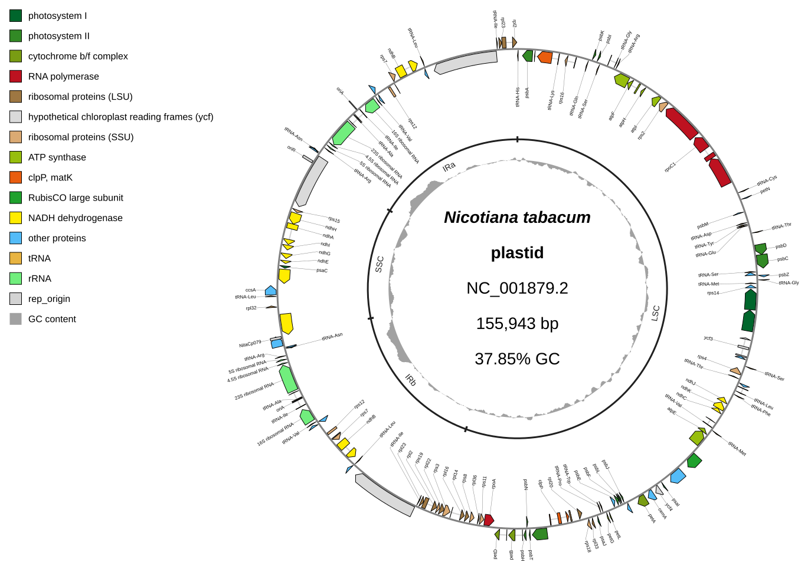
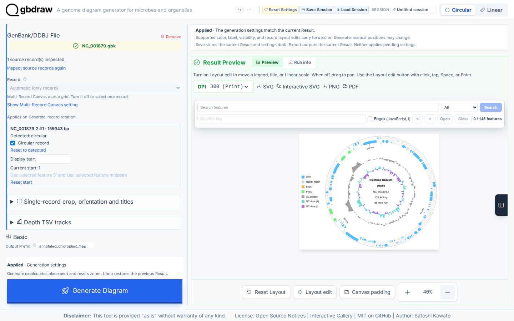
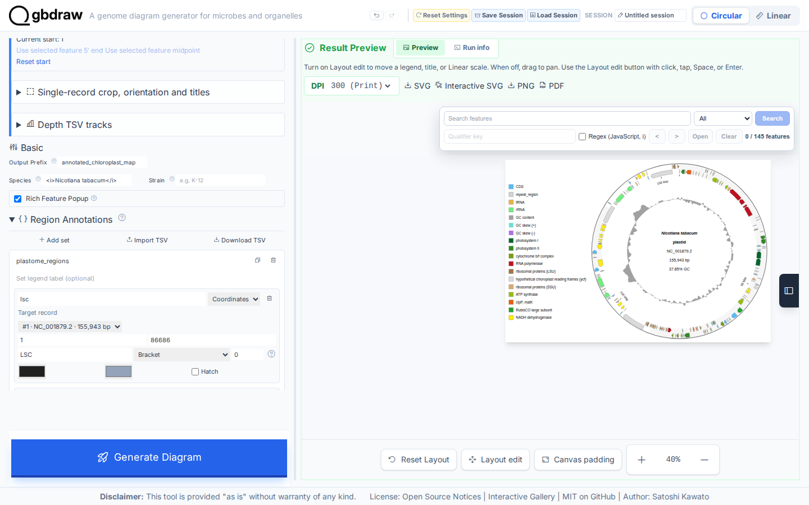
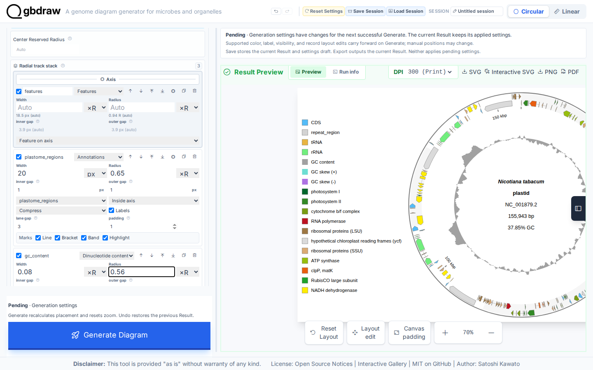
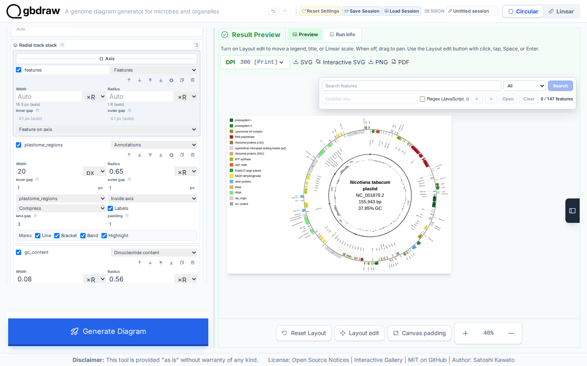

[Documentation home](../DOCS.md) | [Tutorials](README.md) | [Get the tutorial inputs](../GETTING_TUTORIAL_DATA.md) | [Technical documentation](../REFERENCE/README.md)

# Make an annotated map of the tobacco chloroplast genome

You will draw the complete tobacco plastome as a Circular SVG, as in the
Interactive SVG Gallery. Look for the functional gene colors, radial labels on
both sides of the feature ring, one inner LSC/IRb/SSC/IRa bracket lane, GC
content, and the upper-left legend.



## Before you start

Download the inputs and save them with the exact filenames shown. [Get the
tutorial inputs](../GETTING_TUTORIAL_DATA.md) explains browser, `curl`, and
PowerShell downloads and the meaning of each file type.

| File | Record | Length | Download |
| --- | --- | --- | --- |
| `NC_001879.gbk` | NCBI `NC_001879.2`, *Nicotiana tabacum* plastid, complete genome | 155,943 bp | [Record page](https://www.ncbi.nlm.nih.gov/nuccore/NC_001879.2); [full GenBank file](https://eutils.ncbi.nlm.nih.gov/entrez/eutils/efetch.fcgi?db=nuccore&id=NC_001879.2&rettype=gbwithparts&retmode=text) |
| `nicotiana-tabacum-regions.tsv` | LSC, IRb, SSC, and IRa annotations | — | [`nicotiana-tabacum-regions.tsv`](../../gbdraw/web/tutorial-data/tobacco-plastome-regions/nicotiana-tabacum-regions.tsv) (select **Download raw file**) |
| `chloroplast_specific_table.tsv` | Chloroplast gene-family color rules | — | [`chloroplast_specific_table.tsv`](../../gbdraw/web/tutorial-data/tobacco-plastome-regions/chloroplast_specific_table.tsv) (select **Download raw file**) |
| `qualifier_priority.tsv` | CDS label-priority rules | — | [`qualifier_priority.tsv`](../../gbdraw/web/tutorial-data/tobacco-plastome-regions/qualifier_priority.tsv) (select **Download raw file**) |

The GenBank file is the complete 155,943 bp `NC_001879.2` record. The other
files define structural regions, chloroplast gene-family colors, and CDS label
priority; none edits the sequence or feature coordinates.

Each interface creates these files:

| Interface | You create | gbdraw writes | Compare with |
| --- | --- | --- | --- |
| Web app | — | `annotated_chloroplast_map.svg`, saved in Step 6 | The figure above |
| Command line | — | `cli_annotated_chloroplast.svg` | [`cli_annotated_chloroplast.svg`](../images/t-cli-06/cli_annotated_chloroplast.svg) |
| Python | `annotated_chloroplast.py`, the program from Step 2 | `python_annotated_chloroplast.svg` | [`python_annotated_chloroplast.svg`](../images/t-py-02/python_annotated_chloroplast.svg) |

For the command line and Python, install gbdraw so that `gbdraw -h` succeeds
and start in an empty working directory.

## In the web app

Starting state: open a fresh gbdraw web app page with no session loaded and no
files selected.

### Step 1: Load the complete plastome

Select **Circular** and **GenBank**, choose `NC_001879.gbk` in
**GenBank/DDBJ File**, and set **Output Prefix** to
`annotated_chloroplast_map`.


### Step 2: Generate the visible baseline

Select **Generate Diagram**. Confirm `NC_001879.2` and `155,943 bp`. This first
map proves that the complete record renders before custom tables or slots are
added.



### Step 3: Match the Gallery layout, labels, and colors

Set the main controls as follows:

| Control | Value |
| --- | --- |
| Species | `<i>Nicotiana tabacum</i>` |
| Track Preset | Tuckin |
| Separate Strands | On |
| Hide GC Content | Off |
| Hide GC Skew | On |
| Label Mode | Both (Out + Inner) |
| Outer X / Y label offset | `0.9` / `0.9` |
| Inner X / Y label offset | `0.975` / `0.975` |
| Circular Label Placement | Radial |
| Legend position | Upper Left |
| Default font size | `28` |
| Block / Line / Axis Stroke Width | `1` / `2` / `3` |
| Plot Title | None |

Set the four label offsets while **Circular Label Placement** is Horizontal,
then change it to Radial. Under **Features**, keep `CDS`, `rRNA`, and `tRNA`; add `tmRNA`, `ncRNA`,
`misc_RNA`, and `rep_origin`; remove `repeat_region`. Under **Colors**, upload
`chloroplast_specific_table.tsv` as **Specific Table (-t)**. Under **Labels**,
upload `qualifier_priority.tsv` as **Priority File (TSV)**. These settings
produce one legend entry per functional group and readable radial gene labels.

### Step 4: Import all four plastome regions

Open **Region Annotations** and import
`nicotiana-tabacum-regions.tsv`. Keep every row in lane `0`:

| Region | Inclusive range | Lane |
| --- | ---: | ---: |
| LSC | 1–86,686 | 0 |
| IRb | 86,687–112,029 | 0 |
| SSC | 112,030–130,600 | 0 |
| IRa | 130,601–155,943 | 0 |



To reuse the current annotation table, select **Download TSV**. The file can
be imported again through **Import TSV**, including any edits made here.

### Step 5: Build the three-slot Gallery stack

Open **Custom Track Slots**, turn on **Use custom stack**, and remove the
**Ticks** and **GC skew** rows. Configure this exact outside-to-inside order:

| Slot | Renderer | Position | Radius | Width | Other settings |
| --- | --- | --- | ---: | ---: | --- |
| `features` | Features | On axis | Auto | Auto | Feature on axis / split |
| `plastome_regions` | Annotations | Inside | `0.65 ×R` | `20 px` | Set `plastome_regions`; labels on; compress; inner/outer gap `1`; padding `1` |
| `gc_content` | Dinucleotide content | Inside | `0.56 ×R` | `0.08 ×R` | GC |

Enter the number and select **px** or **×R** in each Width/Radius control.
R is the base circle radius. Keep the features fields empty for Auto.

The region annotations belong between the feature ring and GC content. They
are not alternating outer decoration and do not need a separate legend item.



### Step 6: Generate and export the finished map

Select **Generate Diagram**. Verify the four structural labels, radial gene
labels inside and outside the feature ring, functional colors, inner GC-content
profile, and upper-left legend. There should be no coordinate-tick or skew
track. Select **SVG** to save `annotated_chloroplast_map.svg`.



## On the command line

### Step 1: Prepare the working directory

Create and enter an empty directory:

```bash
mkdir gbdraw-cli-chloroplast
cd gbdraw-cli-chloroplast
```

Download all four files from the table in [Before you start](#before-you-start).
The sequence link downloads accession `NC_001879.2` directly from NCBI in full
GenBank format. The other links are repository-hosted support tables; select
**Download raw file** for those. Save every file with the exact name in the
table.

On macOS, Linux, or WSL, run:

```bash
ncbi_efetch="https://eutils.ncbi.nlm.nih.gov/entrez/eutils/efetch.fcgi"
gbdraw_data_base="https://raw.githubusercontent.com/satoshikawato/gbdraw/main/gbdraw/web/tutorial-data"
curl -L "${ncbi_efetch}?db=nuccore&id=NC_001879.2&rettype=gbwithparts&retmode=text" -o NC_001879.gbk
curl -L "$gbdraw_data_base/tobacco-plastome-regions/nicotiana-tabacum-regions.tsv" -o nicotiana-tabacum-regions.tsv
curl -L "$gbdraw_data_base/tobacco-plastome-regions/chloroplast_specific_table.tsv" -o chloroplast_specific_table.tsv
curl -L "$gbdraw_data_base/tobacco-plastome-regions/qualifier_priority.tsv" -o qualifier_priority.tsv
```

Confirm that the source record reports `VERSION     NC_001879.2`:

```bash
grep '^VERSION' NC_001879.gbk
```

The working directory should now contain:

```text
gbdraw-cli-chloroplast/
├── NC_001879.gbk
├── nicotiana-tabacum-regions.tsv
├── chloroplast_specific_table.tsv
└── qualifier_priority.tsv
```

### Step 2: Run the documented command

<!-- executable:T-CLI-06:start -->
```bash
gbdraw circular \
  --gbk NC_001879.gbk \
  -t chloroplast_specific_table.tsv \
  -k CDS,rRNA,tRNA,tmRNA,ncRNA,misc_RNA,rep_origin \
  --species '<i>Nicotiana tabacum</i>' \
  --track_type tuckin \
  --separate_strands \
  --gc \
  --no-skew \
  --labels both \
  --label_placement radial \
  --outer_label_x_radius_offset 0.9 \
  --outer_label_y_radius_offset 0.9 \
  --inner_label_x_radius_offset 0.975 \
  --inner_label_y_radius_offset 0.975 \
  --qualifier_priority qualifier_priority.tsv \
  --annotation_table nicotiana-tabacum-regions.tsv \
  --circular_track_slot 'features:features@side=overlay,lane_direction=split' \
  --circular_track_slot 'plastome_regions:annotations@set_id=plastome_regions,side=inside,r=0.65,w=20px,inner_gap_px=1,outer_gap_px=1,show_labels=true,padding_px=1,overflow=compress' \
  --circular_track_slot 'gc_content:dinucleotide_content@side=inside,r=0.56,w=0.08,nt=GC,legend_label=GC content' \
  --block_stroke_color black \
  --block_stroke_width 1 \
  --line_stroke_width 2 \
  --axis_stroke_width 3 \
  --definition_font_size 28 \
  --legend upper_left \
  -o cli_annotated_chloroplast \
  -f svg
```
<!-- executable:T-CLI-06:end -->

Expected output: gbdraw writes
`cli_annotated_chloroplast.svg` in the working directory.

The explicit slots are the same three-slot stack used by the web app and
Python steps. Because no tick or skew slot is declared, neither appears in the
finished figure.

### Step 3: Inspect the result

Open `cli_annotated_chloroplast.svg`. Confirm `NC_001879.2`, 147 logical
features, radial labels, all four structural-region brackets, GC content, and
the functional-color legend.

Your SVG should match the figure at the top of this page: the same complete
record, structural-region brackets, track order, labels, and functional colors.

## In Python

### Step 1: Prepare the working directory

Create and enter an empty directory:

```bash
mkdir gbdraw-python-chloroplast
cd gbdraw-python-chloroplast
```

Download all four files from the table in [Before you start](#before-you-start)
and save every file with the exact filename shown.

### Step 2: Save and run the Python program

Save the following program as `annotated_chloroplast.py` beside the four input
files:

<!-- executable:T-PY-02:start -->
```python
from pathlib import Path

from gbdraw import (
    CircularOptions,
    CircularTrackOptions,
    Diagram,
    FeatureOptions,
    LabelOptions,
    draw_circular,
    read_genbank,
)
from gbdraw.api import AnnotationOptions, CircularTrackSlot, ScalarSpec


record = read_genbank(Path("NC_001879.gbk"))[0]
assert (record.id, len(record), record.annotations.get("topology")) == (
    "NC_001879.2",
    155_943,
    "circular",
)

track_slots = (
    CircularTrackSlot(
        id="features",
        renderer="features",
        side="overlay",
        params={"lane_direction": "split"},
    ),
    CircularTrackSlot(
        id="plastome_regions",
        renderer="annotations",
        side="inside",
        radius=ScalarSpec(0.65),
        width=ScalarSpec(20, "px"),
        params={
            "set_id": "plastome_regions",
            "show_labels": True,
            "padding_px": 1,
            "overflow": "compress",
        },
        inner_gap_px=1,
        outer_gap_px=1,
    ),
    CircularTrackSlot(
        id="gc_content",
        renderer="dinucleotide_content",
        side="inside",
        radius=ScalarSpec(0.56),
        width=ScalarSpec(0.08),
        params={"nt": "GC", "legend_label": "GC content"},
    ),
)

options = CircularOptions(
    features=FeatureOptions(
        types=(
            "CDS",
            "rRNA",
            "tRNA",
            "tmRNA",
            "ncRNA",
            "misc_RNA",
            "rep_origin",
        ),
        color_table=Path("chloroplast_specific_table.tsv"),
    ),
    labels=LabelOptions(
        qualifier_priority=Path("qualifier_priority.tsv"),
    ),
    annotations=AnnotationOptions(
        table_file="nicotiana-tabacum-regions.tsv",
    ),
    tracks=CircularTrackOptions(slots=track_slots),
    species="<i>Nicotiana tabacum</i>",
    legend="upper_left",
    config_overrides={
        "canvas.strandedness": True,
        "canvas.circular.track_type": "tuckin",
        "labels.circular.scope": "both",
        "labels.circular.placement": "radial",
        "labels.unified_adjustment.outer_labels.x_radius_offset": 0.9,
        "labels.unified_adjustment.outer_labels.y_radius_offset": 0.9,
        "labels.unified_adjustment.inner_labels.x_radius_offset": 0.975,
        "labels.unified_adjustment.inner_labels.y_radius_offset": 0.975,
        "objects.definition.circular.font_size": 28,
        "objects.definition.circular.interval": 30,
        "objects.features.block_stroke_color": "black",
        "objects.features.block_stroke_width.long": 1,
        "objects.features.line_stroke_width.long": 2,
        "objects.axis.circular.stroke_width.long": 3,
    },
)

chloroplast_diagram = draw_circular(record, options=options)
chloroplast_svg = chloroplast_diagram.to_svg()
chloroplast_bytes = chloroplast_diagram.to_bytes("svg")
chloroplast_path = chloroplast_diagram.save(
    Path("python_annotated_chloroplast.svg")
)

assert isinstance(chloroplast_diagram, Diagram)
assert chloroplast_diagram.mode == "circular"
assert chloroplast_svg.encode("utf-8") == chloroplast_bytes
assert chloroplast_path.read_bytes() == chloroplast_bytes
print(f"Saved {chloroplast_path}")
```
<!-- executable:T-PY-02:end -->

The first slot splits forward- and reverse-strand features around the axis.
The second places all four structural regions in one inner annotation lane.
The third adds GC content without adding coordinate ticks or a skew ring.

Before running it, your working directory should contain:

```text
gbdraw-python-chloroplast/
├── NC_001879.gbk
├── nicotiana-tabacum-regions.tsv
├── chloroplast_specific_table.tsv
├── qualifier_priority.tsv
└── annotated_chloroplast.py
```

Run the program:

```bash
python annotated_chloroplast.py
```

Expected output: the program prints
`Saved python_annotated_chloroplast.svg` and writes the SVG in the
current directory.

### Step 3: Inspect the result

Open `python_annotated_chloroplast.svg`. Confirm the complete
`NC_001879.2` record, 147 logical features, radial gene labels, all four
structural-region brackets, GC content, and the functional-color legend.
There should be no coordinate-tick or GC-skew track.

Your SVG should match the figure at the top of this page: the same record,
feature colors, label placement, region brackets, track order, and legend.

## Next steps

- [Make your first Circular diagram in Python](first-circular-genome-diagram.md)
- [Review tracks, axes, and annotations](../REFERENCE/palettes-feature-rules-labels-shapes-and-tracks.md#tracks-axes-and-annotations)
- [Annotation table fields](../REFERENCE/input-formats-and-tsv-schemas.md#annotation-table-fields)
- [Review track and annotation schemas](../REFERENCE/palettes-feature-rules-labels-shapes-and-tracks.md)
- [Review Python layout and track options](../REFERENCE/python-api.md#layout-and-track-options)
- Technical documentation for the [web app](../REFERENCE/web-app.md), the
  [command line](../REFERENCE/command-line.md), and [Python](../REFERENCE/python-api.md)

## About the data

- `NC_001879.gbk` is NCBI accession `NC_001879.2`, the complete tobacco
  plastome. Check the accession version (`.2`) in the `VERSION` line; it
  identifies the exact nucleotide sequence.
- The three TSV files are gbdraw support files hosted in this repository. They
  hold the structural-region annotations, the functional feature colors, and
  the CDS label priority.
- The command and the Python program on this page run in gbdraw's automated
  documentation checks in a clean directory. The checks confirm the complete
  record, the feature count, the annotation identities, the three-slot order,
  the typed options and slot geometry, the visible labels, and the colors. They
  also confirm that the command-line and Python renderings match and that the
  file, text, and byte outputs of the Python program are equal.
