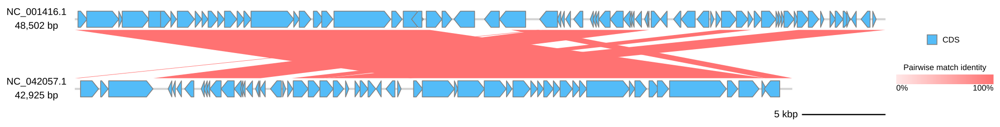
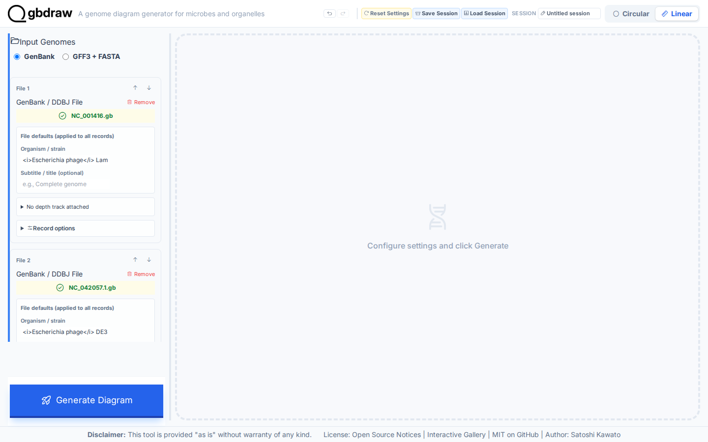
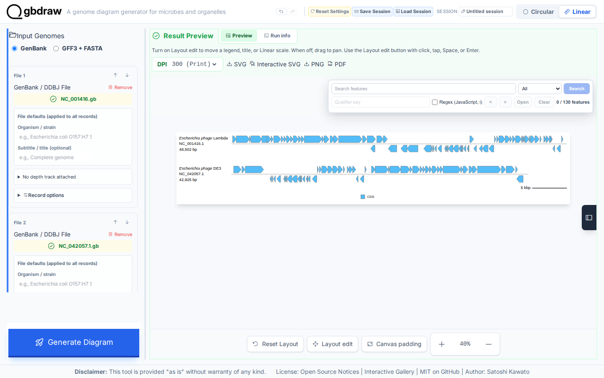
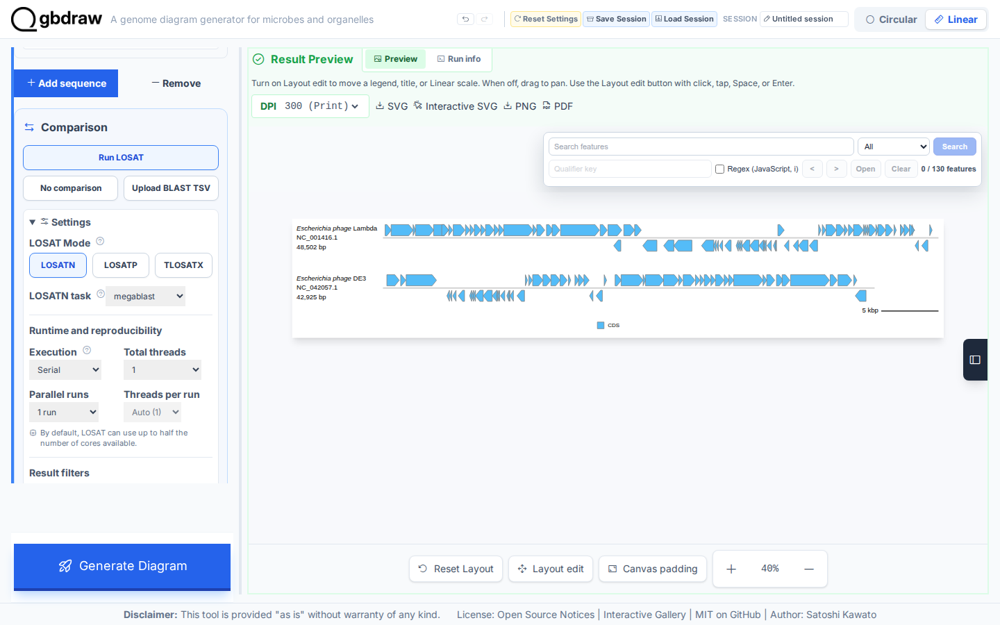
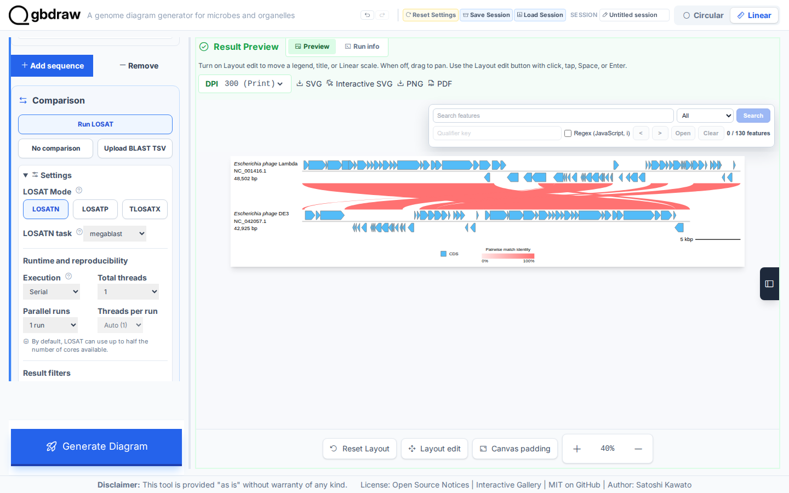
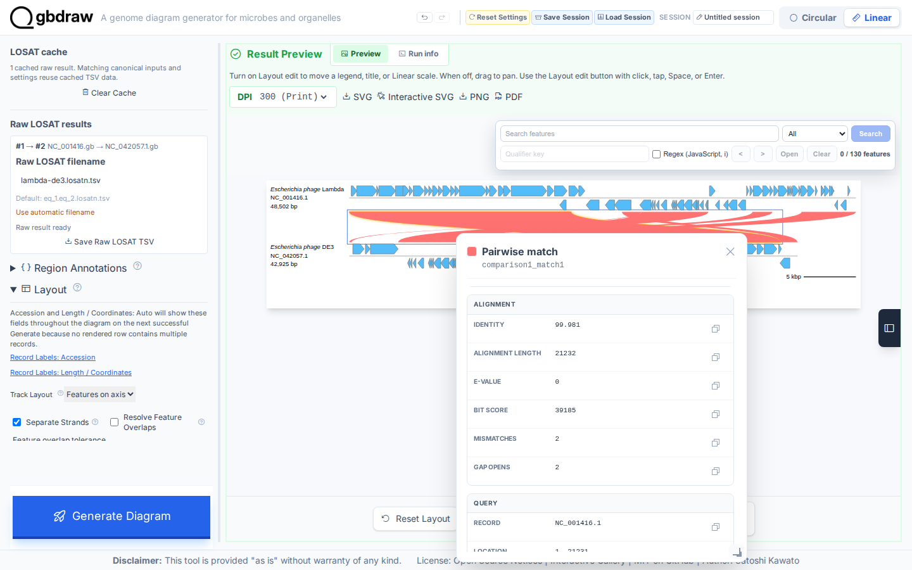

[Documentation home](../DOCS.md) | [Tutorials](README.md) | [Get the tutorial inputs](../GETTING_TUTORIAL_DATA.md) | [Technical documentation](../REFERENCE/README.md)

# Show where the Lambda and DE3 phage genomes match

You will compare the complete Lambda and DE3 phage genomes with LOSATN and draw the result as a Linear diagram. Look for six nucleotide matches that join the two records through an enlarged comparison band.



*Six nucleotide matches connect the complete `NC_001416.1` and `NC_042057.1` records.*

## Before you start

Download the inputs and save them with the exact filenames shown. [Get the
tutorial inputs](../GETTING_TUTORIAL_DATA.md) explains browser, `curl`, and
PowerShell downloads.

| File | Record | Length | Download |
| --- | --- | --- | --- |
| `NC_001416.gb` | NCBI `NC_001416.1`, Enterobacteria phage lambda, complete genome | 48,502 bp | [Record page](https://www.ncbi.nlm.nih.gov/nuccore/NC_001416.1); [full GenBank file](https://eutils.ncbi.nlm.nih.gov/entrez/eutils/efetch.fcgi?db=nuccore&id=NC_001416.1&rettype=gbwithparts&retmode=text) |
| `NC_042057.1.gb` | NCBI `NC_042057.1`, Enterobacteria phage DE3, complete genome | 42,925 bp | [Record page](https://www.ncbi.nlm.nih.gov/nuccore/NC_042057.1); [full GenBank file](https://eutils.ncbi.nlm.nih.gov/entrez/eutils/efetch.fcgi?db=nuccore&id=NC_042057.1&rettype=gbwithparts&retmode=text) |
| `lambda-de3.losatn.tsv` | Six-row LOSATN result (command-line Step 3 and the Python table variant only) | — | [`lambda-de3.losatn.tsv`](../../gbdraw/web/tutorial-data/lambda-de3-comparison/lambda-de3.losatn.tsv) (select **Download raw file**) |

The two GenBank files are the inputs for every interface. The repository TSV is
a frozen six-row result. In the web app you produce this file yourself in Step 4
instead of uploading it. If you download it for comparison, keep it in a
separate folder: the file your web app run saves has the same filename,
`lambda-de3.losatn.tsv`.

Each interface creates these files:

| Interface | You create | gbdraw writes | Compare with |
| --- | --- | --- | --- |
| Web app | — | `lambda-de3.losatn.tsv` and `lambda-de3-losatn.svg`, saved in Step 4 | The figure above |
| Command line | — | `lambda-de3-losatn.svg` | [`lambda-de3-losatn.svg`](../images/t-cli-07/lambda-de3-losatn.svg) |
| Python | `lambda_de3_losatn.py`, the program from Step 2 | `python_lambda_de3_losatn.svg` | [`python_lambda_de3_losatn.svg`](../images/t-py-04/python_lambda_de3_losatn.svg) |

For the command line and Python, install gbdraw so that `gbdraw -h` succeeds
and start in an empty working directory. `--losat losatn` and
`losat="losatn"` need a LOSAT runtime or NCBI BLAST+ `blastn`; see the
[command-line reference](../REFERENCE/command-line.md) for the resolution order.

## In the web app

Starting state: open a fresh gbdraw web app page with no session loaded and no
files selected.

Compare the complete Lambda and DE3 phage genomes with browser LOSATN. You will first draw both records without a comparison, then run a serial, one-thread `megablast` search and export its result with the finished SVG.

### Step 1: Load both complete genomes

Select **Linear**. On a fresh Linear page, **No comparison** is pressed in the
**Comparison** command group. Under **Input Genomes**, keep **GenBank** selected.

1. In the first **GenBank / DDBJ File** control, choose `NC_001416.gb`.
2. Select **Add sequence** below the File list.
3. In the second **GenBank / DDBJ File** control, choose `NC_042057.1.gb`.

Keep Lambda first and DE3 second. Leave both **Region (optional)** sections unchanged so the inputs remain the complete `NC_001416.1` (48,502 bp) and `NC_042057.1` (42,925 bp) records.



*The two green upload controls confirm the input order: Lambda first, DE3 second.*

### Step 2: Generate the map without comparison links

Select **Generate Diagram**. The first result should contain two annotated records and no links between them.



*Both record tracks are visible, with no links between them.*

### Step 3: Configure LOSATN

In **Comparison**, select **Run LOSAT** explicitly. Open **Settings**, choose
the **LOSATN** button in **LOSAT Mode**, and set **LOSATN task**, **Match height**,
and the **Runtime and reproducibility** values. Open **Basic** and set **Output
Prefix**. Finally, continue past **Generate Diagram**, open **Advanced
comparison and layout**, and set the raw result value.

| Section | Control | Value |
| --- | --- | --- |
| Settings | LOSAT Mode | LOSATN |
| Settings | LOSATN task | `megablast` |
| Settings / Comparison appearance | Match height | `120` |
| Basic | Output Prefix | `lambda-de3-losatn` |
| Settings / Runtime and reproducibility | Execution | Serial |
| Settings / Runtime and reproducibility | Total threads | 1 |
| Settings / Runtime and reproducibility | Parallel runs | 1 run |
| Settings / Runtime and reproducibility | Threads per run | Fixed at 1 |
| Advanced comparison and layout / Raw LOSAT results | Raw LOSAT filename | `lambda-de3.losatn.tsv` |



*The open Settings disclosure shows **LOSAT Mode: LOSATN**, `megablast`, the
result filters, and **Match height: 120**.*

### Step 4: Run LOSATN and download the evidence

Select **Generate Diagram** again. LOSATN runs in the browser, and the result should show six links in the enlarged comparison corridor. These links are high-identity nucleotide alignments; each link joins the query and subject intervals recorded in one TSV row.



*The longest match covers 21,232 aligned bases at 99.981% identity.*

Open **Advanced comparison and layout** and find **Raw LOSAT results**. In the
pair from sequence 1 to sequence 2, select **Save Raw LOSAT TSV**. The browser
saves `lambda-de3.losatn.tsv`. Then select **SVG** in the **Result Preview**
toolbar to save `lambda-de3-losatn.svg`.

The TSV should contain six tab-separated rows. Every query interval falls within 1–48,502, and every subject interval falls within 1–42,925.

### Step 5: Inspect one nucleotide match

Select the longest comparison ribbon in the preview. The **Pairwise match** popup identifies both records and reports the intervals, identity, alignment length, E-value, bit score, mismatches, and gap opens.



*The first match connects Lambda 1..21231 to DE3 20081..41311 and reports 99.981% identity.*

## On the command line

This variant runs LOSATN from the command line and draws the figure of the
web app: both complete phage records in the same order, the same six
matches, and the 120 px comparison band used there. Step 3 draws the same
figure from a saved LOSATN table instead.

### Step 1: Prepare the working directory

Create and enter an empty directory:

```bash
mkdir gbdraw-cli-losatn
cd gbdraw-cli-losatn
```

Download the files from the table in [Before you start](#before-you-start).
The two sequence links download accession-pinned full GenBank records directly
from NCBI. The LOSATN link is a repository-hosted support table; select
**Download raw file** for it. Save every file with the exact name in the table.

On macOS, Linux, or WSL, run:

```bash
ncbi_efetch="https://eutils.ncbi.nlm.nih.gov/entrez/eutils/efetch.fcgi"
gbdraw_data_base="https://raw.githubusercontent.com/satoshikawato/gbdraw/main/gbdraw/web/tutorial-data"
curl -L "${ncbi_efetch}?db=nuccore&id=NC_001416.1&rettype=gbwithparts&retmode=text" -o NC_001416.gb
curl -L "${ncbi_efetch}?db=nuccore&id=NC_042057.1&rettype=gbwithparts&retmode=text" -o NC_042057.1.gb
curl -L "$gbdraw_data_base/lambda-de3-comparison/lambda-de3.losatn.tsv" -o lambda-de3.losatn.tsv
```

Confirm that the two records report the pinned versions:

```bash
grep -H '^VERSION' NC_001416.gb NC_042057.1.gb
```

Expect `NC_001416.1` and `NC_042057.1`. The working directory should now
contain:

```text
gbdraw-cli-losatn/
├── NC_001416.gb
├── NC_042057.1.gb
└── lambda-de3.losatn.tsv
```

### Step 2: Run LOSATN and draw the comparison

`--losat losatn` compares the records with LOSAT `blastn` (default task
`megablast`) before drawing. gbdraw uses the LOSAT runtime it resolves, or NCBI
BLAST+ `blastn`; see the
[command-line reference](../REFERENCE/command-line.md) for the resolution
order and `gbdraw setup-losat`.

<!-- executable:T-CLI-07:start -->
```bash
gbdraw linear \
  --gbk NC_001416.gb NC_042057.1.gb \
  --record_id NC_001416.1 \
  --record_id NC_042057.1 \
  --losat losatn \
  --bitscore 50 \
  --evalue 0.01 \
  --identity 0 \
  --alignment_length 0 \
  --comparison_height 120 \
  -o lambda-de3-losatn \
  -f svg
```
<!-- executable:T-CLI-07:end -->

Expected output: gbdraw writes `lambda-de3-losatn.svg` in the
working directory.

Open that SVG. It should contain six ribbons between the complete Lambda and
DE3 records.

Your SVG should match the figure at the top of this page. Verify that both accessions and all
six endpoint pairs match the TSV and that the ribbons use the 120 px comparison
band set above. The pinned LOSAT runtime gives the same six rows as the browser;
another runtime or version can report different rows.

To keep the search result, add `--losat_output_dir losatn-results`. gbdraw
writes `NC_001416.1.NC_042057.1.losatn.tsv` (BLAST outfmt 6) and
`comparisons.tsv`, which you can pass back with `--comparisons_table` to draw
again without searching. `--save_session` stores the result in the Session, so
the Session replays without LOSAT.

### Step 3: Draw from a saved LOSATN table

If LOSAT is not available, draw the same figure from the LOSATN table that the
web app produced:

```bash
gbdraw linear \
  --gbk NC_001416.gb NC_042057.1.gb \
  --record_id NC_001416.1 \
  --record_id NC_042057.1 \
  --blast lambda-de3.losatn.tsv \
  --bitscore 50 \
  --evalue 0.01 \
  --identity 0 \
  --alignment_length 0 \
  --comparison_height 120 \
  -o lambda-de3-losatn \
  -f svg
```

The result is byte-identical to Step 2.

## In Python

Use the public `LinearComparisonOptions` type to run LOSATN on the two records
and draw the six-row comparison of the web app and command-line variants. Step 3 shows the
same figure from the saved LOSATN table.

### Step 1: Prepare the working directory

Create and enter an empty directory:

```bash
mkdir gbdraw-python-losatn
cd gbdraw-python-losatn
```

Download both sequences and the supplied LOSATN table from the table in
[Before you start](#before-you-start). Save every file with the exact filename shown.

### Step 2: Save and run the Python program

Save the following complete program as `lambda_de3_losatn.py`:

<!-- executable:T-PY-04:start -->
```python
from pathlib import Path

from gbdraw import (
    LinearComparisonOptions,
    LinearOptions,
    Thresholds,
    draw_linear,
    read_genbank,
)


records = read_genbank([Path("NC_001416.gb"), Path("NC_042057.1.gb")])
assert [(record.id, len(record)) for record in records] == [
    ("NC_001416.1", 48_502),
    ("NC_042057.1", 42_925),
]

options = LinearOptions(
    comparisons=LinearComparisonOptions(
        losat="losatn",
    ),
    thresholds=Thresholds(
        bitscore=50,
        evalue=0.01,
        identity=0,
        alignment_length=0,
    ),
    config_overrides={"canvas.linear.comparison_height": 120},
)
diagram = draw_linear(records, options=options)
saved_path = diagram.save(Path("python_lambda_de3_losatn.svg"))
print(f"Saved {saved_path}")
```
<!-- executable:T-PY-04:end -->

Before running it, your working directory should contain:

```text
gbdraw-python-losatn/
├── NC_001416.gb
├── NC_042057.1.gb
├── lambda-de3.losatn.tsv
└── lambda_de3_losatn.py
```

Run the program:

```bash
python lambda_de3_losatn.py
```

Expected output: the program prints `Saved python_lambda_de3_losatn.svg` and
writes the SVG in the current directory.

### Step 3: Inspect the comparison

Open `python_lambda_de3_losatn.svg` to inspect the two complete
records and six comparison ribbons.

Your SVG should match the figure at the top of this page. Verify the two accessions, source
lengths, record order, six retained matches, and 120 px comparison band.

### Draw from the saved LOSATN table

Without LOSAT, replace `losat="losatn"` with the table the web app produced; the
SVG is byte-identical:

```python
comparisons=LinearComparisonOptions(
    blast_files=("lambda-de3.losatn.tsv",),
),
```

## Next steps

- [Review web app comparison surfaces](../REFERENCE/web-app.md#comparison-surfaces)
- [Review record selection and layout](../REFERENCE/web-app.md#record-selection-and-layout)
- [Choose an export format](../REFERENCE/output-formats-and-export.md)
- [Review input and TSV schemas](../REFERENCE/input-formats-and-tsv-schemas.md)
- [Review uploaded comparison tables and result semantics](../REFERENCE/comparison-programs-thresholds-and-results.md)
- [Review Python Linear comparison options](../REFERENCE/python-api.md#linear-options)
- Technical documentation for the [web app](../REFERENCE/web-app.md), the
  [command line](../REFERENCE/command-line.md), and [Python](../REFERENCE/python-api.md)

## About the data

- `NC_001416.gb` and `NC_042057.1.gb` are NCBI records `NC_001416.1` and
  `NC_042057.1`. Check the accession version (`.1`) in the `VERSION` line; it
  identifies the exact nucleotide sequence.
- `lambda-de3.losatn.tsv` is a frozen six-row LOSATN result hosted in this
  repository. Your own run should match it; another LOSAT runtime or version can
  report different rows.
- The command and the Python program on this page run in gbdraw's automated
  documentation checks. The checks confirm the record order, source lengths,
  six retained matches, the 120 px comparison band, and standard-SVG safety.
