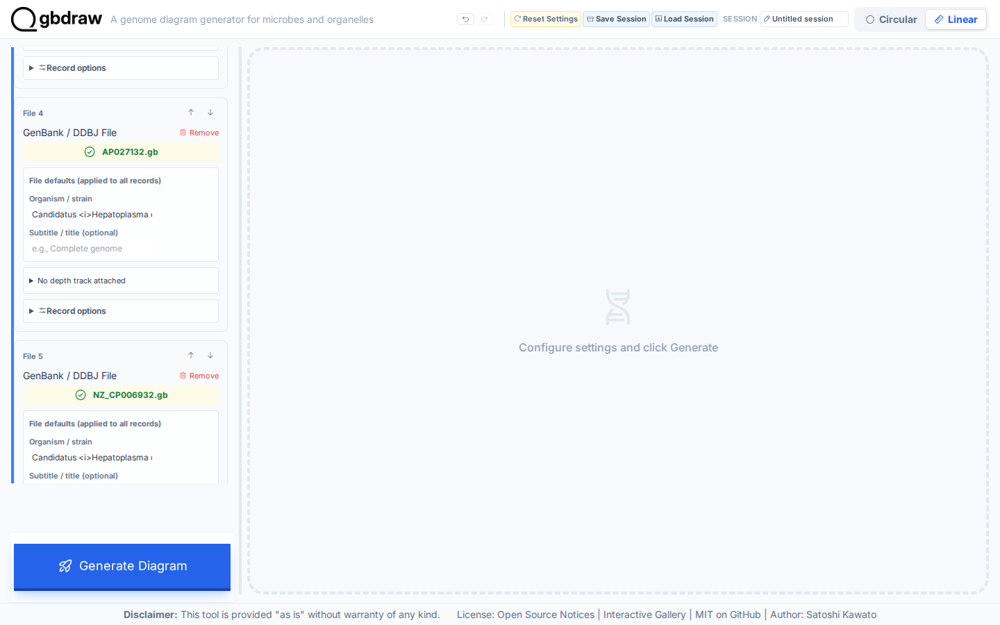
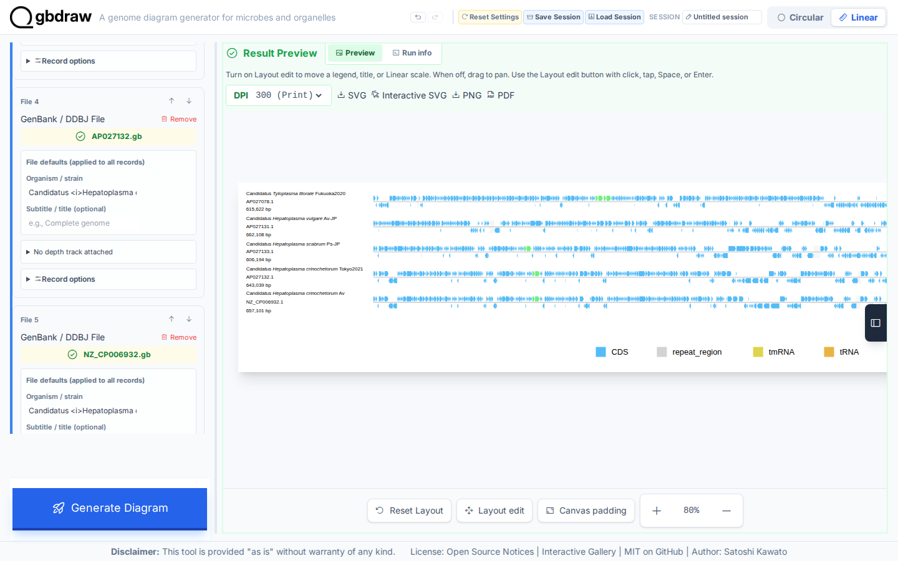
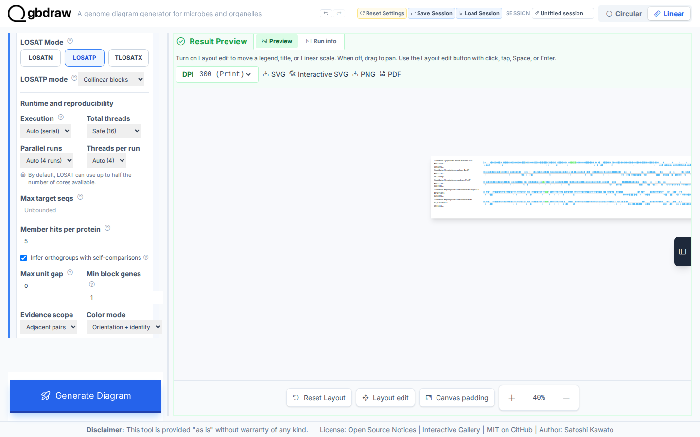
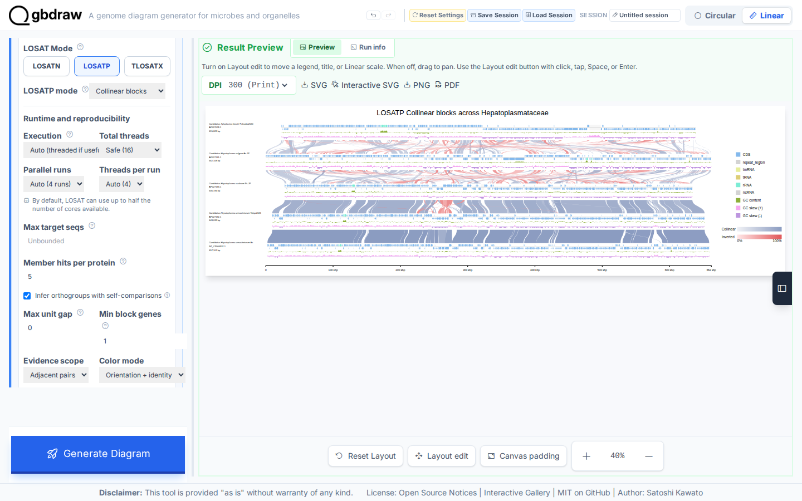
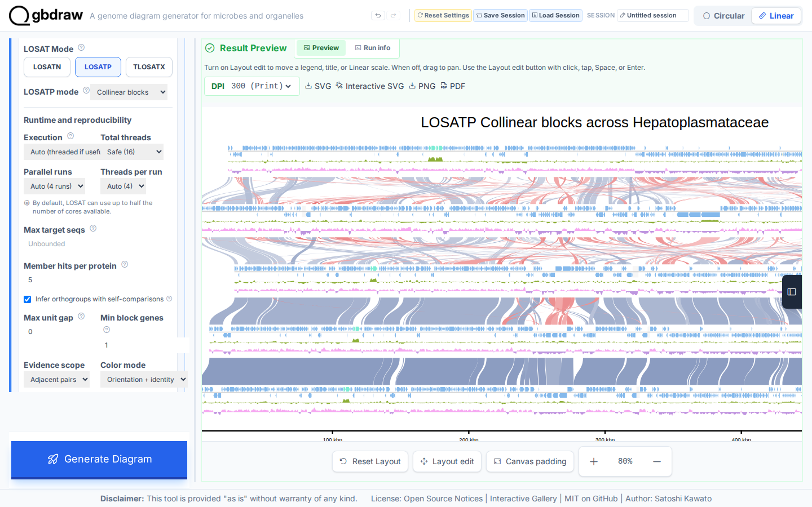
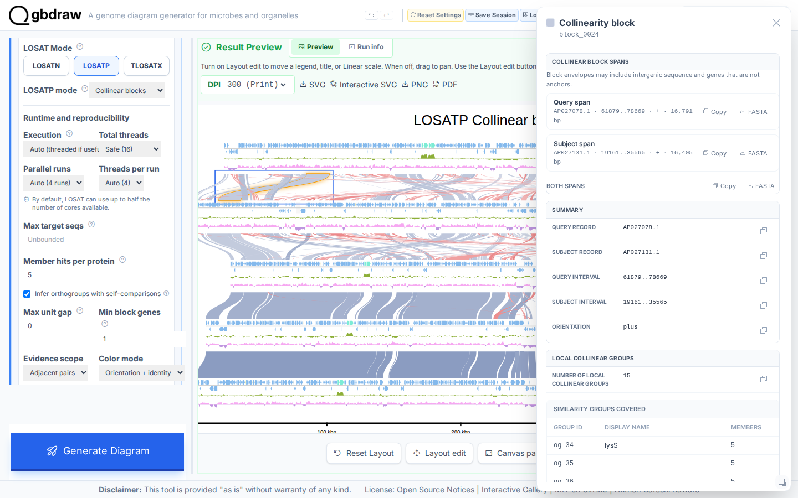

[Documentation home](../DOCS.md) | [Tutorials](README.md) | [Get the tutorial inputs](../GETTING_TUTORIAL_DATA.md) | [Technical documentation](../REFERENCE/README.md)

# Show where neighboring Hepatoplasmataceae genomes keep the same gene order

You will run an adjacent LOSATP search across five complete Hepatoplasmataceae
genomes and draw the Collinear blocks that join neighboring records. Look for
five records in the order listed below and ribbons between each adjacent pair,
colored blue or red by orientation, with intensity showing average identity.


*The figure has 2,994 displayed features and 500 Collinear match elements.*

Each block joins protein matches that stay in the same order between two
adjacent genomes. It shows shared local gene order, not a whole-genome synteny
or orthology call.

## Before you start

Download each record as **GenBank (full)** from the linked NCBI Revision History
snapshot and save it with the local filename shown. [Get the tutorial
inputs](../GETTING_TUTORIAL_DATA.md) explains browser, `curl`, and PowerShell
downloads and the accession checks.

| File | Record | Length | Download |
| --- | --- | --- | --- |
| `AP027078.gb` | NCBI `AP027078.1`, MAG: Candidatus Tyloplasma litorale Fukuoka2020 DNA, complete genome | 615,622 bp | [NCBI Revision History snapshot](https://www.ncbi.nlm.nih.gov/sviewer/viewer.cgi?tool=portal&save=file&db=nuccore&report=gbwithparts&id=AP027078.1&sat=3&satkey=69902295) |
| `AP027131.gb` | NCBI `AP027131.1`, MAG: Candidatus Hepatoplasma vulgare Av-JP DNA, complete genome | 662,108 bp | [NCBI Revision History snapshot](https://www.ncbi.nlm.nih.gov/sviewer/viewer.cgi?tool=portal&save=file&db=nuccore&report=gbwithparts&id=AP027131.1&sat=3&satkey=69902296) |
| `AP027133.gb` | NCBI `AP027133.1`, MAG: Candidatus Hepatoplasma scabrum Ps-JP DNA, complete genome | 606,194 bp | [NCBI Revision History snapshot](https://www.ncbi.nlm.nih.gov/sviewer/viewer.cgi?tool=portal&save=file&db=nuccore&report=gbwithparts&id=AP027133.1&sat=3&satkey=69902298) |
| `AP027132.gb` | NCBI `AP027132.1`, MAG: Candidatus Hepatoplasma crinochetorum Tokyo2021 DNA, complete genome | 643,039 bp | [NCBI Revision History snapshot](https://www.ncbi.nlm.nih.gov/sviewer/viewer.cgi?tool=portal&save=file&db=nuccore&report=gbwithparts&id=AP027132.1&sat=3&satkey=69902297) |
| `NZ_CP006932.gb` | NCBI `NZ_CP006932.1`, Candidatus Hepatoplasma crinochetorum Av chromosome, complete genome | 657,101 bp | [NCBI Revision History snapshot](https://www.ncbi.nlm.nih.gov/sviewer/viewer.cgi?tool=portal&save=file&db=nuccore&report=gbwithparts&id=NZ_CP006932.1&sat=60&satkey=39275474) |

Use these five Revision History links, not the live accession downloads. NCBI
can update a record's annotation without changing its sequence accession
version. These pinned revisions preserve the exact feature tables used to
reproduce this Tutorial's 2,994 displayed features and 500 Collinear matches.
Save each NCBI response under its listed local filename, in the order shown;
do not substitute a repository copy or a Gallery session.

Each interface creates these files:

| Interface | You create | gbdraw writes | Compare with |
| --- | --- | --- | --- |
| Web app | — | `collinear_members.fasta` (both nucleotide spans exported from one block in Step 5, then renamed) and `losatp_collinear.svg` (the finished static diagram saved in Step 5) | The figure above |
| Command line | — | `losatp_collinear.svg` | [`losatp_collinear.svg`](../images/t-cli-10/losatp_collinear.svg) |
| Python | `losatp_collinear.py`, the program from Step 2 | `losatp_collinear.svg` | [`losatp_collinear.svg`](../images/t-py-07/losatp_collinear.svg) |

For the command line and Python, install gbdraw and start in an empty working
directory.

## In the web app

Starting state: open a fresh gbdraw web app page with no session loaded and no
files selected. This workflow starts with the versioned source records, uploads
each one, and runs LOSATP in the browser. It does not load a Gallery session or
reuse a prebuilt LOSATP cache.

### Step 1: Upload the five source records

Select **Linear**. Under **Input Genomes**, keep **GenBank** selected and
confirm that **No comparison** is pressed in the **Comparison** command group.

1. In the first **GenBank / DDBJ File** control, choose `AP027078.gb`.
2. Select **Add sequence** below the File list, then choose
   `AP027131.gb` in the new card.
3. Repeat the **Add sequence** action for `AP027133.gb`, `AP027132.gb`, and
   `NZ_CP006932.gb`, in that order.

Keep all optional regions empty so every row uses its complete record. Confirm
that the five green file controls show the filenames in the same order as the
source table.



*The fourth and fifth uploaders confirm the end of the input order:
`AP027132.gb` precedes `NZ_CP006932.gb`. Pair boundaries are inspected later
under **Selected pairs**.*

### Step 2: Generate the five-record baseline

Select **Generate Diagram** while **No comparison** is still pressed. The first Linear result contains 2,994 rendered feature elements. Select **Zoom
out** six times to reach **40%**, then drag the preview horizontally until the
complete diagram is centered. Use this overview to verify all five rows and the
absence of ribbons.

For a readable check of the source identities, select **Zoom in** four times to
reach **80%**. Drag the preview horizontally to the right until the complete
left definition column is inside **Result Preview**. Confirm these five ID and
length pairs: `AP027078.1` / `615,622 bp`, `AP027131.1` / `662,108 bp`,
`AP027133.1` / `606,194 bp`, `AP027132.1` / `643,039 bp`, and
`NZ_CP006932.1` / `657,101 bp`.



Select **Zoom out** four times to return to **40%** before changing the
settings in Step 3.

### Step 3: Configure LOSATP Collinear

In **Comparison**, select **Run LOSAT** explicitly. Open **Selected pairs (4)**
and find **Comparison boundary: display row 4 to 5**. Confirm that its pair
connects sequence 4 (`AP027132.gb`) to sequence 5 (`NZ_CP006932.gb`), then
close the disclosure.

Open **Settings** and choose the **LOSATP** button in **LOSAT Mode**. Choose
**Pairwise matches** from the **LOSATP mode** menu and set **Match style** to
**Curve** under **Comparison appearance**; Collinear blocks keeps that style but
hides the control. Then choose **Collinear blocks** from the **LOSATP mode**
menu, select **Infer orthogroups with self-comparisons**, clear **Max target
seqs** so it shows **Unbounded**, and set the remaining block, runtime, and
result-filter values. Continue past **Generate Diagram**, open **Advanced
comparison and layout**, and set the advanced Collinear values.

Fresh Web Collinear settings leave **Infer orthogroups with self-comparisons**
off and set **Max target seqs** to `5`. The Gallery figure and the
command-line and Python workflows infer orthogroups with self-comparisons from
an unbounded search, so change both values to reproduce it. Fresh and Reset
Collinear settings default **Evidence scope** to **Adjacent pairs**, which is
also the value used by this checked recipe and output.

| Section | Control | Value |
| --- | --- | --- |
| Settings | LOSAT Mode | LOSATP |
| Settings / Comparison appearance | Match style (set in Pairwise matches) | Curve |
| Settings | LOSATP mode | Collinear blocks |
| Settings / Runtime and reproducibility | Execution | Auto |
| Settings / Runtime and reproducibility | Total threads | Safe |
| Settings / Runtime and reproducibility | Parallel runs | Auto |
| Settings / Runtime and reproducibility | Threads per run | Auto |
| Settings | Max target seqs | Blank (**Unbounded**) |
| Settings | Member hits per protein | `5` |
| Settings | Infer orthogroups with self-comparisons | Selected |
| Settings | Max unit gap | `0` |
| Settings | Min block genes | `1` |
| Settings | Color mode | Orientation + identity |
| Settings | Evidence scope | Adjacent pairs |
| Settings / Result filters | Bitscore / E-value | `50` / `0.01` |
| Settings / Result filters | Minimum identity / length | `0` / `0` |
| Advanced comparison and layout / Advanced collinear search | Diagonal drift | `0` |
| Advanced comparison and layout / Advanced collinear search | Merge conflicts | `1` |
| Advanced comparison and layout / Advanced collinear search | Paralog links per group | `2` |
| Basic | Output Prefix | `losatp_collinear` |

Set **Track Layout** to **Features on axis**, center the records, separate
strands, and show GC content, GC skew, and a coordinate ruler. Choose the
**Ajisai** palette, put the title
`LOSATP Collinear blocks across Hepatoplasmataceae` at the top, and put the
legend on the right.



### Step 4: Run LOSATP and generate the blocks

Select **Generate Diagram**. This first Collinear run computes the required
directional, self, and adjacent-pair LOSATP evidence from the five uploaded
records; it does not restore cached evidence from a session. Leave the page
open until processing finishes. Select **Reset zoom**, select **Zoom out** six
times to reach **40%**, then drag the preview horizontally until the complete
diagram is centered.

The result contains 500 rendered Collinear match elements. Their endpoints
cover the four adjacent display pairs. Blue and red families distinguish the
two orientations, and intensity carries average identity within each family.



Keep the **40%** view as the complete overview. Select **Zoom in** four times to
reach **80%**, then drag the preview horizontally to the right until **Pairwise
match 1** is wholly inside **Result Preview**. This closer view separates
individual block boundaries while retaining their orientation colors.



### Step 5: Inspect and export a block

Focus the first visible ribbon and press **Enter**. Drag the popup by its header
to the opposite top corner so it does not cover the selected ribbon. The top of
the popup shows the query and subject spans and three FASTA downloads,
including **Both spans FASTA**.



Use **Both spans FASTA**. The browser names the download from its generated
match ID, for example `comparison1_match1_both.fna`; rename that file to
`collinear_members.fasta`. It must contain two non-empty nucleotide records,
one from each endpoint genome. Then scroll within the popup to inspect its
orientation, covered Similarity groups, and anchors. Close the popup, then
select **SVG** to save `losatp_collinear.svg`.

### Variant: use all-record evidence

Keep **Adjacent pairs** for the checked result above. To build blocks from
every record pair, change **Evidence scope** to **All records** in Step 3. A
fresh five-record run executes 25 directional and self search jobs. Block
construction uses evidence from every record pair, while the finished ribbons
still connect adjacent display rows.

See [selected Linear edges](../REFERENCE/comparison-programs-thresholds-and-results.md#selected-linear-edges)
for the scope and display rules.

## On the command line

### Step 1: Prepare the working directory

Create and enter an empty directory:

```bash
mkdir gbdraw-cli-losatp-collinear
cd gbdraw-cli-losatp-collinear
```

Download the five records from the table in [Before you start](#before-you-start),
in full GenBank format, and save them with the exact names and in the order
shown. On macOS, Linux, or WSL, run:

```bash
curl -L "https://www.ncbi.nlm.nih.gov/sviewer/viewer.cgi?tool=portal&save=file&db=nuccore&report=gbwithparts&id=AP027078.1&sat=3&satkey=69902295" -o AP027078.gb
curl -L "https://www.ncbi.nlm.nih.gov/sviewer/viewer.cgi?tool=portal&save=file&db=nuccore&report=gbwithparts&id=AP027131.1&sat=3&satkey=69902296" -o AP027131.gb
curl -L "https://www.ncbi.nlm.nih.gov/sviewer/viewer.cgi?tool=portal&save=file&db=nuccore&report=gbwithparts&id=AP027133.1&sat=3&satkey=69902298" -o AP027133.gb
curl -L "https://www.ncbi.nlm.nih.gov/sviewer/viewer.cgi?tool=portal&save=file&db=nuccore&report=gbwithparts&id=AP027132.1&sat=3&satkey=69902297" -o AP027132.gb
curl -L "https://www.ncbi.nlm.nih.gov/sviewer/viewer.cgi?tool=portal&save=file&db=nuccore&report=gbwithparts&id=NZ_CP006932.1&sat=60&satkey=39275474" -o NZ_CP006932.gb
```

Confirm that the records report the five pinned versions:

```bash
grep -H '^VERSION' AP027078.gb AP027131.gb AP027133.gb AP027132.gb NZ_CP006932.gb
```

The working directory should now contain:

```text
gbdraw-cli-losatp-collinear/
├── AP027078.gb
├── AP027131.gb
├── AP027133.gb
├── AP027132.gb
└── NZ_CP006932.gb
```

### Step 2: Render a standard SVG

<!-- executable:T-CLI-10:start -->
```bash
gbdraw linear \
  --gbk AP027078.gb AP027131.gb AP027133.gb AP027132.gb NZ_CP006932.gb \
  --losat losatp \
  --losatp_mode collinear \
  --losat_threads 32 \
  --collinear_search_scope adjacent \
  --collinear_max_unit_gap 0 \
  --collinear_min_anchors 1 \
  --collinear_max_diagonal_drift 0 \
  --collinear_max_conflicts_in_merge_gap 1 \
  --collinear_color_mode orientation_identity \
  --bitscore 50 \
  --evalue 0.01 \
  --identity 0 \
  --alignment_length 0 \
  --pairwise_match_style curve \
  --track_layout middle \
  --align_center \
  --separate_strands \
  --gc \
  --skew \
  --scale_style ruler \
  --palette ajisai \
  --plot_title 'LOSATP Collinear blocks across Hepatoplasmataceae' \
  --plot_title_position top \
  --legend right \
  -o losatp_collinear \
  -f svg
```
<!-- executable:T-CLI-10:end -->

Expected output: LOSATP performs four adjacent protein searches,
and gbdraw writes `losatp_collinear.svg` in the working directory.

Open `losatp_collinear.svg` and compare its record layout and Collinear blocks
with the figure at the top of this page. Your SVG should match it: verify five
complete records in the documented order, centered alignment, rulers, GC
content and skew, and 500 rendered Collinear match elements colored by
orientation and identity.

## In Python

### Step 1: Prepare the working directory

Create and enter an empty directory:

```bash
mkdir gbdraw-python-losatp-collinear
cd gbdraw-python-losatp-collinear
```

Download all five records from the table in [Before you start](#before-you-start)
and save them with the exact filenames shown.

### Step 2: Save and run the Python program

Save the following complete program as `losatp_collinear.py`:

<!-- executable:T-PY-07:start -->
```python
from pathlib import Path

from gbdraw import (
    FeatureOptions,
    LinearComparisonOptions,
    LinearOptions,
    Thresholds,
    TitleOptions,
    draw_linear,
    read_genbank,
)
from gbdraw.api import LosslessCollinearityParameters


records = read_genbank(
    [
        Path("AP027078.gb"),
        Path("AP027131.gb"),
        Path("AP027133.gb"),
        Path("AP027132.gb"),
        Path("NZ_CP006932.gb"),
    ]
)
options = LinearOptions(
    features=FeatureOptions(palette="ajisai"),
    comparisons=LinearComparisonOptions(
        losat="losatp",
        losatp_mode="collinear",
        threads=32,
        match_style="curve",
        collinearity_scope="adjacent",
        collinearity_color="orientation_identity",
        collinearity_params=LosslessCollinearityParameters(
            min_anchors=1,
            max_unit_gap=0,
            max_diagonal_drift=0,
            max_conflicts=1,
        ),
    ),
    thresholds=Thresholds(
        bitscore=50,
        evalue=0.01,
        identity=0,
        alignment_length=0,
    ),
    title=TitleOptions(
        text="LOSATP Collinear blocks across Hepatoplasmataceae",
        position="top",
    ),
    legend="right",
    config_overrides={
        "canvas.linear.track_layout": "middle",
        "canvas.linear.align_center": True,
        "canvas.strandedness": True,
        "canvas.show_gc": True,
        "canvas.show_skew": True,
        "objects.scale.style": "ruler",
    },
)
diagram = draw_linear(records, options=options)
saved_path = diagram.save(Path("losatp_collinear.svg"))
print(f"Saved {saved_path}")
```
<!-- executable:T-PY-07:end -->

Before running it, your working directory should contain:

```text
gbdraw-python-losatp-collinear/
├── AP027078.gb
├── AP027131.gb
├── AP027133.gb
├── AP027132.gb
├── NZ_CP006932.gb
└── losatp_collinear.py
```

Run the program:

```bash
python losatp_collinear.py
```

Expected output: gbdraw's LOSAT runtime performs adjacent protein searches.
The program then prints `Saved losatp_collinear.svg` and writes the
SVG in the current directory.

### Step 3: Inspect the Collinear map

Open `losatp_collinear.svg` and check the five complete records in the
documented order, 500 rendered Collinear matches, centered alignment, rulers,
GC content, and GC skew. Your SVG should match the figure at the top of this
page: the same record layout and the same adjacent Collinear blocks colored by
orientation and identity.

## Next steps

- [Review LOSATP comparison modes](../REFERENCE/comparison-programs-thresholds-and-results.md)
- [Create protein Similarity groups](compare-proteins-losatp.md)
- [Choose a genome-comparison method](../FAQ.md#which-comparison-method-should-i-use)
- Technical documentation for the [web app](../REFERENCE/web-app.md), the
  [command line](../REFERENCE/command-line.md), and [Python](../REFERENCE/python-api.md)

## About the data

- All five links are official NCBI Revision History downloads pinned to the
  annotation revisions used here. The `sat=3` pins are `AP027078.1` with
  `satkey=69902295`, `AP027131.1` with `satkey=69902296`, `AP027133.1` with
  `satkey=69902298`, and `AP027132.1` with `satkey=69902297`;
  `NZ_CP006932.1` uses `sat=60` and `satkey=39275474`. The record IDs and
  sequence lengths remain those in the table.
