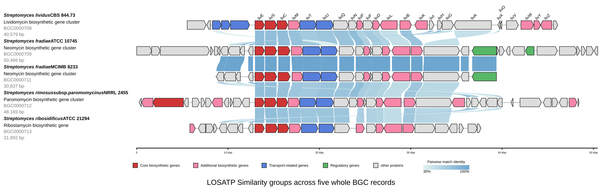
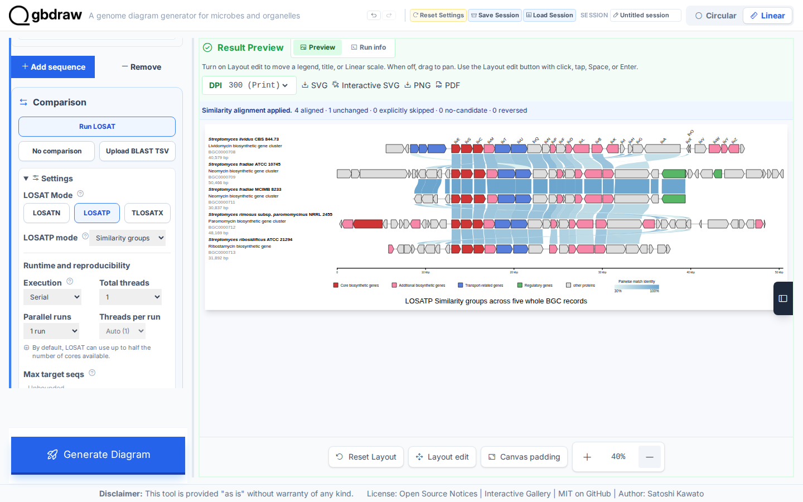
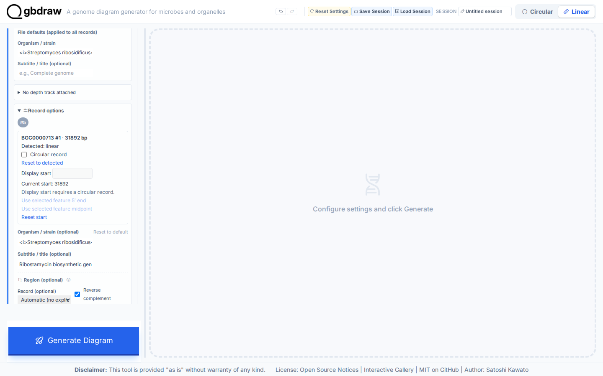
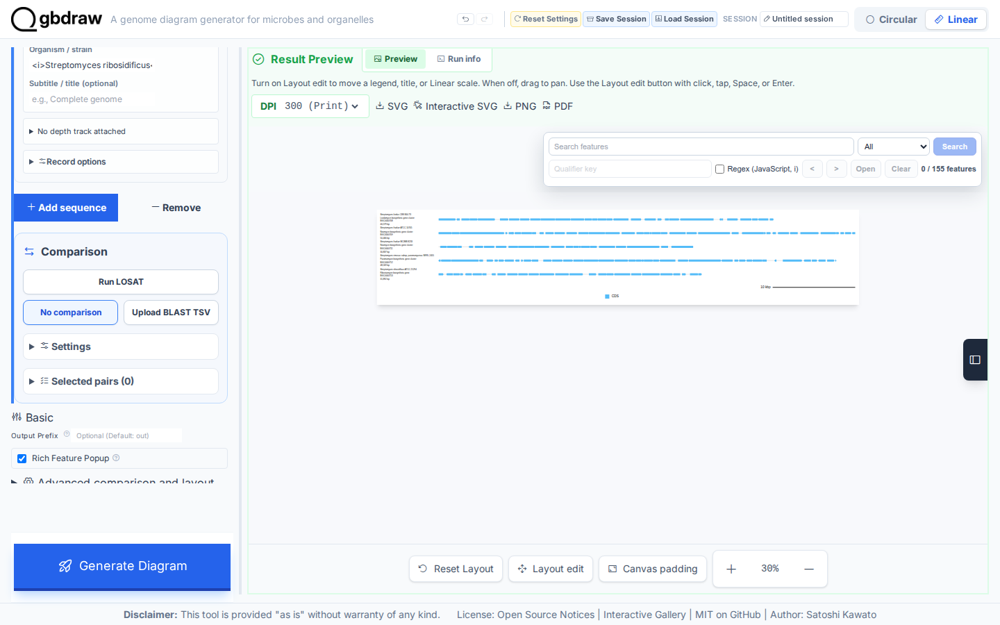
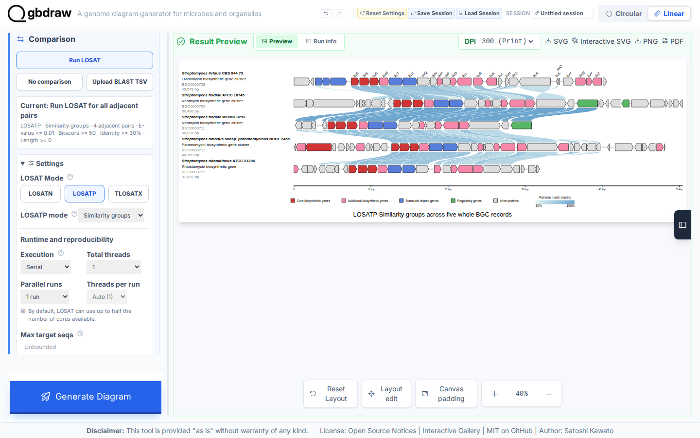
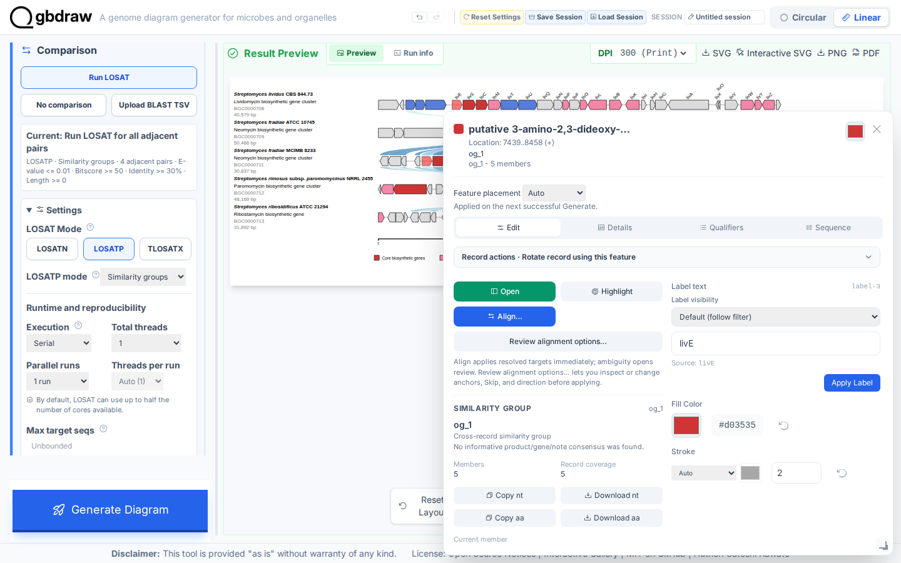
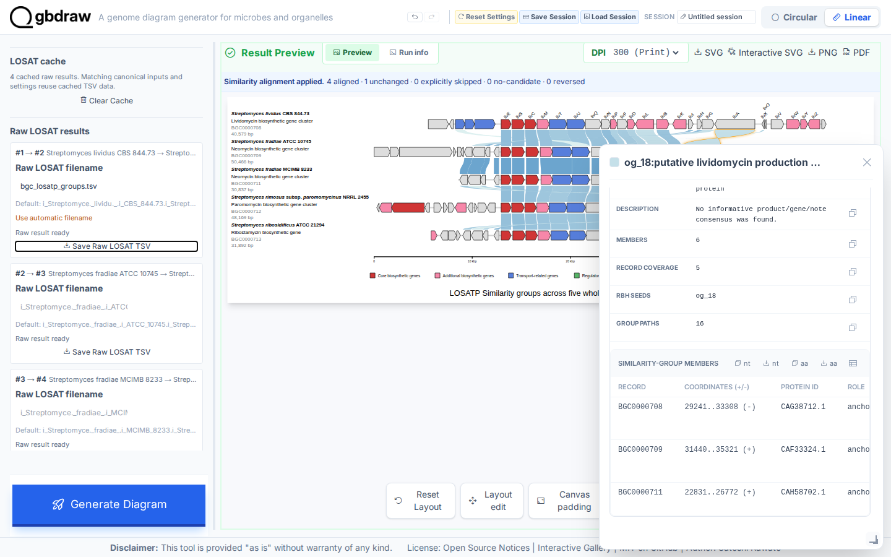

[Documentation home](../DOCS.md) | [Tutorials](README.md) | [Get the tutorial inputs](../GETTING_TUTORIAL_DATA.md) | [Technical documentation](../REFERENCE/README.md)

# Find shared proteins across five aminoglycoside gene clusters

You will compare five aminoglycoside biosynthetic gene-cluster records with LOSATP **Similarity groups** and align them on one shared protein group. Look for 23 Similarity groups, 77 links between adjacent records, and every record lined up on group `og_1`.



*The records remain Linear. They are MIBiG gene-cluster regions, not complete chromosomes, so this Tutorial does not turn them into circular genomes.*

## Before you start

Download the inputs and save them with the exact filenames shown. [Get the
tutorial inputs](../GETTING_TUTORIAL_DATA.md) explains browser, `curl`, and
PowerShell downloads.

Download the five GenBank inputs from MIBiG in this order:

| Order | File | Record | Length | CDS | Download |
|---:|---|---|---:|---:|---|
| 1 | `BGC0000708.gbk` | MIBiG `BGC0000708.5`, `BGC0000708`, *Streptomyces lividus* lividomycin biosynthesis gene cluster | 40,579 bp | 30 | [`BGC0000708.gbk`](https://mibig.secondarymetabolites.org/repository/BGC0000708.5/BGC0000708.gbk) |
| 2 | `BGC0000709.gbk` | MIBiG `BGC0000709.5`, `BGC0000709`, *Streptomyces fradiae* neomycin biosynthesis gene cluster, strain DSM 40063 | 50,466 bp | 38 | [`BGC0000709.gbk`](https://mibig.secondarymetabolites.org/repository/BGC0000709.5/BGC0000709.gbk) |
| 3 | `BGC0000711.gbk` | MIBiG `BGC0000711.5`, `BGC0000711`, *Streptomyces fradiae* neomycin biosynthetic gene cluster, strain MCIMB 8233 | 30,837 bp | 21 | [`BGC0000711.gbk`](https://mibig.secondarymetabolites.org/repository/BGC0000711.5/BGC0000711.gbk) |
| 4 | `BGC0000712.gbk` | MIBiG `BGC0000712.5`, `BGC0000712`, *Streptomyces rimosus* subsp. *paromomycinus* genomic region of the paromomycin biosynthesis gene cluster, strain NRRL 2455 | 48,169 bp | 40 | [`BGC0000712.gbk`](https://mibig.secondarymetabolites.org/repository/BGC0000712.5/BGC0000712.gbk) |
| 5 | `BGC0000713.gbk` | MIBiG `BGC0000713.5`, `BGC0000713`, *Streptomyces ribosidificus* ribostamycin biosynthetic gene cluster | 31,892 bp | 26 | [`BGC0000713.gbk`](https://mibig.secondarymetabolites.org/repository/BGC0000713.5/BGC0000713.gbk) |

Download the three presentation inputs from the repository. Select **Download
raw file** for each:

| File | Purpose | Download |
| --- | --- | --- |
| `BGC0000708-BGC0000713_default_colors.tsv` | Default CDS color override | [`BGC0000708-BGC0000713_default_colors.tsv`](../../gbdraw/web/tutorial-data/aminoglycoside-bgc-five/BGC0000708-BGC0000713_default_colors.tsv) |
| `BGC0000708-BGC0000713_specific_colors.tsv` | BGC gene-kind color rules | [`BGC0000708-BGC0000713_specific_colors.tsv`](../../gbdraw/web/tutorial-data/aminoglycoside-bgc-five/BGC0000708-BGC0000713_specific_colors.tsv) |
| `cds_gene_qualifier_priority.tsv` | CDS `gene` label priority | [`cds_gene_qualifier_priority.tsv`](../../gbdraw/web/tutorial-data/shared/cds_gene_qualifier_priority.tsv) |

Each interface creates these files:

| Interface | You create | gbdraw writes | Compare with |
| --- | --- | --- | --- |
| Web app | — | `bgc_losatp_groups.tsv` (raw LOSATP result) and `bgc_losatp_groups.svg` (aligned diagram), saved in Step 5 | The figure above |
| Command line | — | `bgc_losatp_groups.svg` | [`bgc_losatp_groups.svg`](../images/t-cli-08/bgc_losatp_groups.svg) |
| Python | `bgc_losatp_groups.py`, the program from Step 2 | `python_bgc_losatp_groups.svg` | [`python_bgc_losatp_groups.svg`](../images/t-py-05/python_bgc_losatp_groups.svg) |

For the command line and Python, install gbdraw so that `gbdraw -h` succeeds
and start in an empty working directory.

## In the web app

Starting state: open a fresh gbdraw web app page with no session loaded and no
files selected.

Use LOSATP **Similarity groups** to compare the five aminoglycoside biosynthetic
gene-cluster records.

Upload all five GenBank files as whole records. Keep the table order and leave all optional Region fields blank.
Keep the first four records in their source orientation; turn on
**Reverse complement** only for `BGC0000713` to reproduce the Gallery layout.



### Step 1: Load the five Linear records

Select **Linear** and **GenBank**. Confirm that **No comparison** is pressed in
the **Comparison** command group. Upload `BGC0000708.gbk`, then use **Add sequence** in the **Input
Genomes** header four times and upload the remaining files in the table order.

For the fifth row, `BGC0000713`, open **Record options** and turn on **Reverse
complement**. This changes only its display orientation; it does not crop,
split, or alter the source record.



### Step 2: Draw the records before comparing them

Select **Generate Diagram**. The first result contains 155 CDS features and no
comparison ribbons.



### Step 3: Configure Similarity groups

In **Comparison**, select **Run LOSAT** explicitly. Open **Settings** and choose
the **LOSATP** button in **LOSAT Mode**, then choose **Similarity groups** from
the **LOSATP mode** menu. Under **Comparison appearance**, set **Match style**
to **Curve**, then enter the filter values and the deterministic **Runtime and
reproducibility** values.

| Section | Control | Value |
|---|---|---|
| Settings | LOSAT Mode | LOSATP |
| Settings | LOSATP mode | Similarity groups |
| Settings / Comparison appearance | Match style | Curve |
| Settings / Result filters | Bitscore | `50` |
| Settings / Result filters | E-value | `0.01` |
| Settings / Result filters | Minimum identity | `30` |
| Settings / Result filters | Minimum length | `0` |
| Settings / Runtime and reproducibility | Execution | Serial |
| Settings / Runtime and reproducibility | Total threads | `1` |
| Settings / Runtime and reproducibility | Parallel runs | `1 run` |
| Settings / Runtime and reproducibility | Threads per run | `1` |
| Layout | Separate Strands | Off |
| Basic | Output Prefix | `bgc_losatp_groups` |

Match the Interactive SVG Gallery presentation with these display settings:

| Control | Value |
|---|---|
| Palette | Orange |
| Override File (-d) | `BGC0000708-BGC0000713_default_colors.tsv` |
| Specific Table (-t) | `BGC0000708-BGC0000713_specific_colors.tsv` |
| Show Labels | First record |
| Priority File (TSV) | `cds_gene_qualifier_priority.tsv` |
| Label Font Size | `18` |
| Label Placement / Rotation | Above feature / `45` |
| Feature Height | `75` |
| Block Stroke Width / Line Stroke Width | `2` / `2` |
| Show Coordinate Scale (Linear) | On |
| Linear scale style | Ruler |
| Axis Stroke Width | `5` |
| Lock Definition Column | On |
| Definition name | `20` px, Bold |
| Definition subtitle | `20` px, Normal |
| Definition accession / length | `20` px, Normal |

The first record therefore carries readable CDS `gene` labels; the remaining
four records stay unlabeled. Under **Titles & Record Labels**, open each line's
**Style**, set the four visible line sizes to `20`, choose **Bold** only for **Name / Species**, and
leave the other lines at **Normal**. Fit the complete final preview at **40%**
before capturing or exporting it.



### Step 4: Run LOSATP

Select **Generate Diagram** again. The result contains 23 stable
groups and 77 displayed group links. Similarity groups uses all-vs-all search
results across the five records, but the four displayed endpoint pairs are
`0708→0709`, `0709→0711`, `0711→0712`, and `0712→0713`.

There is no direct `BGC0000708→BGC0000713` ribbon. Proteins shared by the first
and last records are represented by the same group ID across the adjacent-link
chain. This is the standard Similarity-groups presentation; it is not a
Pairwise comparison between only the first and last records.

### Step 5: Align every record to `og_1`

Select the `livE` CDS in `og_1` on the first record. Its feature popup includes
an **Align…** action because the current result is in Similarity-groups mode.



Select **Align…**. gbdraw regenerates the same 23-group comparison without
rerunning LOSATP and shifts each record so its `og_1` member shares one
x-coordinate. If ambiguity opens **Select alignment anchors**, select the
recommended first candidate in each unresolved row, leave **Keep current
directions** selected and choose **Apply**. Inspect and accept a refreshed
preview with another Apply if requested. This is the alignment used by the
Interactive SVG Gallery.


Open **Advanced comparison and layout** and find **Raw LOSAT results**. In the
comparison between sequence 1 and sequence 2, set **Raw LOSAT filename** to
`bgc_losatp_groups.tsv` and select **Save Raw LOSAT TSV**. The file contains
232 twelve-column rows. Select **SVG** after alignment to save
`bgc_losatp_groups.svg`.

### Step 6: Inspect a group

Select a comparison ribbon. The popup reports the group ID, display name,
member count, record coverage, RBH seeds, paths, and every member protein.



#### Optional: review directions and Reset

Use the same five records and presentation from Steps 1–5. Click the first
record's left-facing `livA` CDS (`CAG38712.1`, group `og_18`) and choose
**Review alignment options…**. Choose a
**Select** anchor for each row still needing a choice. Start with **Keep current
directions**, then select **All selected arrows right →**. The reference
currently points left while the selected targets point right, so the preview
changes only the reference record. Select **Apply**; if final validation updates
the preview, inspect it and select **Apply** again. Features and labels reverse
with the record; biological source strands stay unchanged.

Open **Editor**, select **Similarity groups**, then choose **Reset alignment…**
in **Active plan**. **Reset positions** is selected by default and
would keep the new reference direction. Select **Reset positions and alignment
direction changes**, inspect the listed reference and select **Reset** to
restore its pre-Align direction and positions. The plan is cleared. **Undo**
restores the aligned artifact and its search results; reopen Reset to try the other
scope. After either successful Reset, Undo is required before another scope.
Combined Reset also replaces subsequent manual direction edits on the listed
records. See the [Web alignment reference](../REFERENCE/web-app.md#similarity-group-alignment-in-linear-view)
for Custom, exclusions, missing old results and retry details.

The documentation's automated checks of this web app procedure verify these choices, both Reset scopes and Undo
from the original five inputs. They capture the Keep figure and group popup
before those optional steps, then restore Keep before downloading the SVG.
Regenerate the captures with
`python docs/capture/run_all.py --scenario T-GUI-04 --tier extended`;
environment and source-verification details are in the
[capture README](../capture/README.md).

## On the command line

This recipe compares the five aminoglycoside biosynthetic gene clusters,
builds the same 23 Similarity groups as the web app, and aligns the
records to the group containing `CAG38695.1` (`og_1`).

### Step 1: Prepare the working directory

Create and enter an empty directory:

```bash
mkdir gbdraw-cli-losatp-groups
cd gbdraw-cli-losatp-groups
```

Download the files from the table in [Before you start](#before-you-start).
The five sequence links download the versioned BGC entries directly from
MIBiG. The other links are repository-hosted support tables; select **Download
raw file** for those. Save every file with the exact name in the table.

On macOS, Linux, or WSL, run:

```bash
gbdraw_data_base="https://raw.githubusercontent.com/satoshikawato/gbdraw/main/gbdraw/web/tutorial-data"
curl -L "https://mibig.secondarymetabolites.org/repository/BGC0000708.5/BGC0000708.gbk" -o BGC0000708.gbk
curl -L "https://mibig.secondarymetabolites.org/repository/BGC0000709.5/BGC0000709.gbk" -o BGC0000709.gbk
curl -L "https://mibig.secondarymetabolites.org/repository/BGC0000711.5/BGC0000711.gbk" -o BGC0000711.gbk
curl -L "https://mibig.secondarymetabolites.org/repository/BGC0000712.5/BGC0000712.gbk" -o BGC0000712.gbk
curl -L "https://mibig.secondarymetabolites.org/repository/BGC0000713.5/BGC0000713.gbk" -o BGC0000713.gbk
curl -L "$gbdraw_data_base/aminoglycoside-bgc-five/BGC0000708-BGC0000713_default_colors.tsv" -o BGC0000708-BGC0000713_default_colors.tsv
curl -L "$gbdraw_data_base/aminoglycoside-bgc-five/BGC0000708-BGC0000713_specific_colors.tsv" -o BGC0000708-BGC0000713_specific_colors.tsv
curl -L "$gbdraw_data_base/shared/cds_gene_qualifier_priority.tsv" -o cds_gene_qualifier_priority.tsv
```

Confirm that the five downloaded records report the expected BGC accessions:

```bash
grep -H '^VERSION' BGC0000708.gbk BGC0000709.gbk BGC0000711.gbk BGC0000712.gbk BGC0000713.gbk
```

The working directory should now contain:

```text
gbdraw-cli-losatp-groups/
├── BGC0000708.gbk
├── BGC0000709.gbk
├── BGC0000711.gbk
├── BGC0000712.gbk
├── BGC0000713.gbk
├── BGC0000708-BGC0000713_default_colors.tsv
├── BGC0000708-BGC0000713_specific_colors.tsv
└── cds_gene_qualifier_priority.tsv
```

### Step 2: Run LOSATP and draw the figure

<!-- executable:T-CLI-08:start -->
```bash
gbdraw linear \
  --gbk BGC0000708.gbk BGC0000709.gbk BGC0000711.gbk BGC0000712.gbk BGC0000713.gbk \
  --record_label '<i>Streptomyces lividus</i> CBS 844.73' \
  --record_label '<i>Streptomyces fradiae</i> ATCC 10745' \
  --record_label '<i>Streptomyces fradiae</i> MCIMB 8233' \
  --record_label '<i>Streptomyces rimosus</i> subsp. <i>paromomycinus</i> NRRL 2455' \
  --record_label '<i>Streptomyces ribosidificus</i> ATCC 21294' \
  --record_subtitle 'Lividomycin biosynthetic gene cluster' \
  --record_subtitle 'Neomycin biosynthetic gene cluster' \
  --record_subtitle 'Neomycin biosynthetic gene cluster' \
  --record_subtitle 'Paromomycin biosynthetic gene cluster' \
  --record_subtitle 'Ribostamycin biosynthetic gene' \
  --reverse_complement false \
  --reverse_complement false \
  --reverse_complement false \
  --reverse_complement false \
  --reverse_complement true \
  --losat losatp \
  --losatp_mode similarity_groups \
  --losat_threads 1 \
  --bitscore 50 \
  --evalue 0.01 \
  --identity 30 \
  --alignment_length 0 \
  --similarity_alignment_feature CAG38695.1 \
  --palette orange \
  --default_colors BGC0000708-BGC0000713_default_colors.tsv \
  --table BGC0000708-BGC0000713_specific_colors.tsv \
  --qualifier_priority cds_gene_qualifier_priority.tsv \
  --show_labels first \
  --label_font_size 18 \
  --label_placement above_feature \
  --label_rotation 45 \
  --feature_height 75 \
  --block_stroke_color '#262626' \
  --block_stroke_width 2 \
  --line_stroke_width 2 \
  --axis_stroke_width 5 \
  --scale_style ruler \
  --track_layout middle \
  --keep_definition_left_aligned \
  --definition_line_style 'name:size=20,weight=bold' \
  --definition_line_style 'subtitle:size=20' \
  --definition_line_style 'accession:size=20,color=#7b7c7d' \
  --definition_line_style 'length:size=20,color=#7b7c7d' \
  --pairwise_match_style curve \
  --plot_title 'LOSATP Similarity groups across five whole BGC records' \
  --plot_title_position bottom \
  --legend bottom \
  -o bgc_losatp_groups \
  -f svg
```
<!-- executable:T-CLI-08:end -->

Expected output: the bundled LOSAT runtime performs four adjacent searches and
writes `bgc_losatp_groups.svg` in the working directory.

Open `bgc_losatp_groups.svg` and compare its record order and link layout with
the figure at the top of this page.

Your SVG should match the figure at the top of this page. Verify 232 raw rows, 23 Similarity
groups, and 77 adjacent links. The fifth record should remain reversed, matching
the web app's alignment.

### Variant: draw individual Pairwise matches

The same five records can produce individual curves instead of Similarity
groups. In the command above, change `--losatp_mode similarity_groups` to
`pairwise`, remove `--similarity_alignment_feature CAG38695.1`, and set
`--losatp_max_hits` to `1` and `--show_labels` to `none`. Add
`--losat_output_dir .` to write the raw search rows to `losatp.raw.tsv` in the
working directory. Use `cli_losatp_pairwise` for `-o` and change the title to
`LOSATP Pairwise protein matches across five BGC records`.

Pairwise mode searches four adjacent pairs. It does not run a direct
`BGC0000708` to `BGC0000713` comparison. With the thresholds in this Tutorial,
the raw file has 791 rows and the SVG has 76 individual links. See the
[command-line comparison boundary](../REFERENCE/command-line.md#comparison-boundary)
for mode and runtime rules.

## In Python

This program loads the five BGC records, reverses the fifth display,
runs gbdraw's one-thread LOSATP workflow, and aligns the records to the group
containing `CAG38695.1` (`og_1`).

### Step 1: Prepare the working directory

Create and enter an empty directory:

```bash
mkdir gbdraw-python-losatp-groups
cd gbdraw-python-losatp-groups
```

Download the five sequences from their direct MIBiG source links and
the three supplied support tables from the tables in
[Before you start](#before-you-start). Save every file with the exact filename shown.

### Step 2: Save and run the Python program

Save the following complete program as `bgc_losatp_groups.py`:

<!-- executable:T-PY-05:start -->
```python
from pathlib import Path

from gbdraw.api import (
    ColorOptions,
    InMemoryRecordSource,
    LinearDiagramOptions,
    LinearDiagramRequest,
    LinearOutputOptions,
    LosatRuntimeOptions,
    LosatSearchOptions,
    RecordInput,
    RecordPresentation,
    RenderOutputRequest,
    SimilarityAlignmentReference,
    load_gbks,
    render_request,
)


paths = [
    Path("BGC0000708.gbk"),
    Path("BGC0000709.gbk"),
    Path("BGC0000711.gbk"),
    Path("BGC0000712.gbk"),
    Path("BGC0000713.gbk"),
]
records = load_gbks(paths)
presentations = [
    ("<i>Streptomyces lividus</i> CBS 844.73", "Lividomycin biosynthetic gene cluster"),
    ("<i>Streptomyces fradiae</i> ATCC 10745", "Neomycin biosynthetic gene cluster"),
    ("<i>Streptomyces fradiae</i> MCIMB 8233", "Neomycin biosynthetic gene cluster"),
    ("<i>Streptomyces rimosus</i> subsp. <i>paromomycinus</i> NRRL 2455", "Paromomycin biosynthetic gene cluster"),
    ("<i>Streptomyces ribosidificus</i> ATCC 21294", "Ribostamycin biosynthetic gene"),
]
request = LinearDiagramRequest(
    records=tuple(
        RecordInput(
            source=InMemoryRecordSource(record),
            presentation=RecordPresentation(
                label=label,
                subtitle=subtitle,
                reverse_complement=index == 4,
            ),
        )
        for index, (record, (label, subtitle)) in enumerate(
            zip(records, presentations, strict=True)
        )
    ),
    options=LinearDiagramOptions(
        colors=ColorOptions(
            color_table_file="BGC0000708-BGC0000713_specific_colors.tsv",
            default_colors_file="BGC0000708-BGC0000713_default_colors.tsv",
            default_colors_palette="orange",
        ),
        qualifier_priority_file="cds_gene_qualifier_priority.tsv",
        plot_title="LOSATP Similarity groups across five whole BGC records",
        output=LinearOutputOptions(
            legend="bottom",
            plot_title_position="bottom",
        ),
        losat_search=LosatSearchOptions(
            program="losatp",
            losatp_mode="similarity_groups",
            runtime=LosatRuntimeOptions(threads=1),
        ),
        pairwise_match_style="curve",
        bitscore=50,
        evalue=0.01,
        identity=30,
        alignment_length=0,
        config_overrides={
            "labels.linear.scope": "first",
            "labels.font_size.linear.short": 18,
            "labels.font_size.linear.long": 18,
            "labels.linear.placement": "above_feature",
            "labels.linear.rotation": 45,
            "canvas.linear.default_cds_height.short": 75,
            "canvas.linear.default_cds_height.long": 75,
            "objects.features.block_stroke_color": "#262626",
            "objects.features.block_stroke_width.short": 2,
            "objects.features.block_stroke_width.long": 2,
            "objects.features.line_stroke_width.short": 2,
            "objects.features.line_stroke_width.long": 2,
            "objects.axis.linear.stroke_width.short": 5,
            "objects.axis.linear.stroke_width.long": 5,
            "objects.scale.style": "ruler",
            "canvas.linear.track_layout": "middle",
            "canvas.linear.keep_definition_left_aligned": True,
            "objects.definition.linear.line_styles.name.font_size": 20,
            "objects.definition.linear.line_styles.name.font_weight": "bold",
            "objects.definition.linear.line_styles.subtitle.font_size": 20,
            "objects.definition.linear.line_styles.accession.font_size": 20,
            "objects.definition.linear.line_styles.accession.fill": "#7b7c7d",
            "objects.definition.linear.line_styles.length.font_size": 20,
            "objects.definition.linear.line_styles.length.fill": "#7b7c7d",
            "canvas.strandedness": False,
        },
    ),
    similarity_alignment=SimilarityAlignmentReference(feature_id="CAG38695.1"),
    output=RenderOutputRequest(
        output_prefix="python_bgc_losatp_groups",
        formats=("svg",),
    ),
)
diagram = render_request(request)
saved_path = diagram.output_paths[0]
print(f"Saved {saved_path}")
```
<!-- executable:T-PY-05:end -->

Before running it, your working directory should contain:

```text
gbdraw-python-losatp-groups/
├── BGC0000708.gbk
├── BGC0000709.gbk
├── BGC0000711.gbk
├── BGC0000712.gbk
├── BGC0000713.gbk
├── BGC0000708-BGC0000713_default_colors.tsv
├── BGC0000708-BGC0000713_specific_colors.tsv
├── cds_gene_qualifier_priority.tsv
└── bgc_losatp_groups.py
```

Run the program:

```bash
python bgc_losatp_groups.py
```

Expected output: gbdraw's LOSAT runtime performs four adjacent searches.
The program then prints `Saved python_bgc_losatp_groups.svg` and writes the
SVG in the current directory.

`SimilarityAlignmentReference(feature_id="CAG38695.1")` names the first
record's `livE` protein. After the search, gbdraw resolves it into the
`og_1` alignment plan with the same rules as the command line
`--similarity_alignment_feature` and the web app's **Align**; it does not search
again.

### Step 3: Inspect the comparison

Open `python_bgc_losatp_groups.svg` and confirm the five records
appear in the documented order with the fifth record reversed.

Your SVG should match the figure at the top of this page: compare its record labels, alignment,
definition column, feature colors, and curved links.

The fixed record order and reversed fifth record match the web app.
The run should produce 23 Similarity groups and 77 adjacent links, with every
record aligned on `og_1`.

## Next steps

- [Review LOSATP comparison modes](../REFERENCE/comparison-programs-thresholds-and-results.md)
- [Draw Collinear protein-match blocks](compare-proteins-losatp-collinear.md)
- [Choose a genome-comparison method](../FAQ.md#which-comparison-method-should-i-use)
- Technical documentation for the [web app](../REFERENCE/web-app.md), the
  [command line](../REFERENCE/command-line.md), and [Python](../REFERENCE/python-api.md)

## About the data

- The five GenBank files are versioned MIBiG entries (`BGC0000708.5`,
  `BGC0000709.5`, `BGC0000711.5`, `BGC0000712.5`, and `BGC0000713.5`). They are
  native BGC database regions, not complete chromosomes. Check the accession in
  the `VERSION` line of each file.
- The two color tables and `cds_gene_qualifier_priority.tsv` are gbdraw support
  files hosted in this repository.
- The command and the Python program on this page run in gbdraw's automated
  documentation checks. The checks confirm 232 raw rows, 23 Similarity groups,
  77 adjacent links, and the record order with the fifth record reversed.
