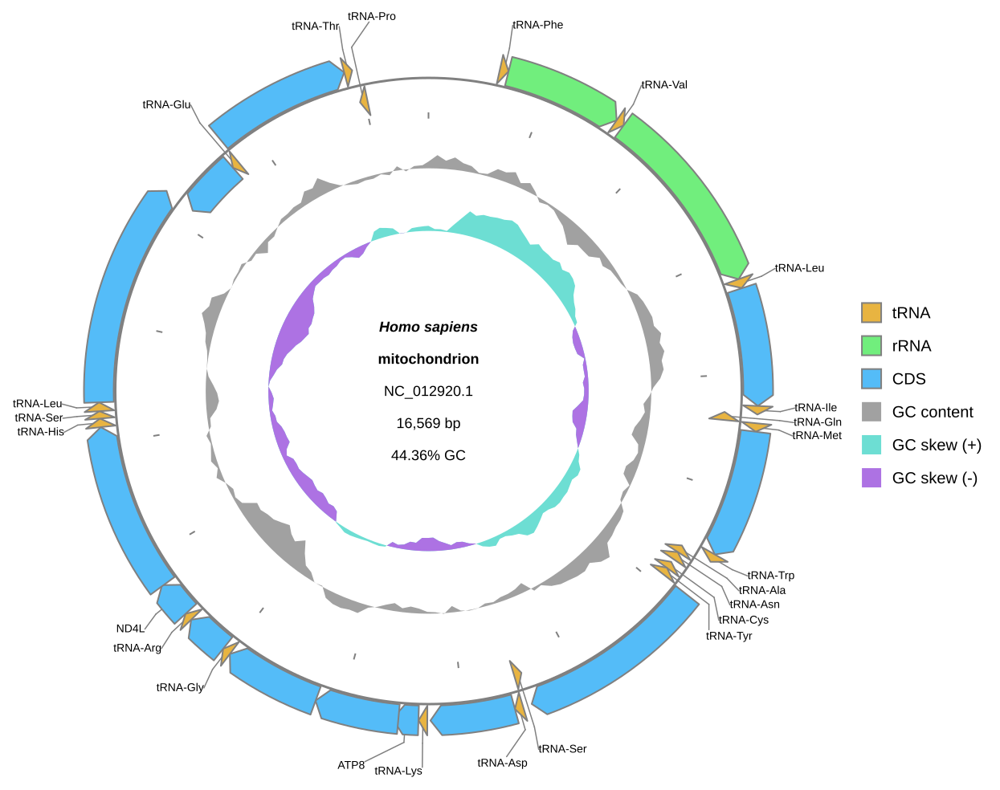
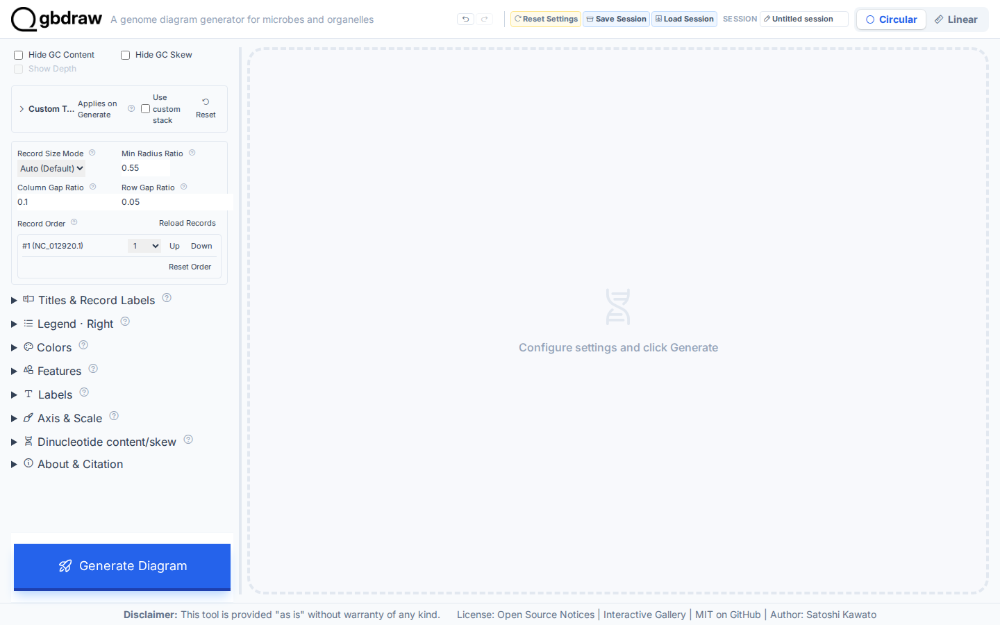
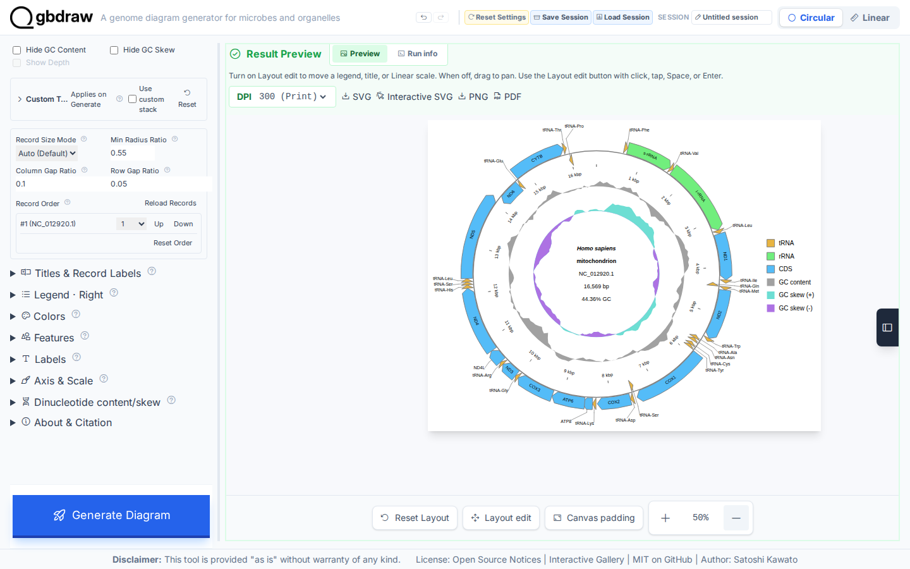
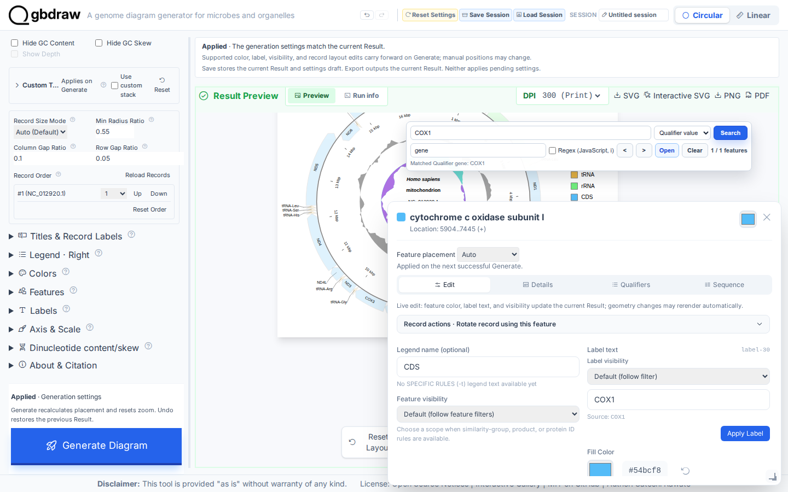
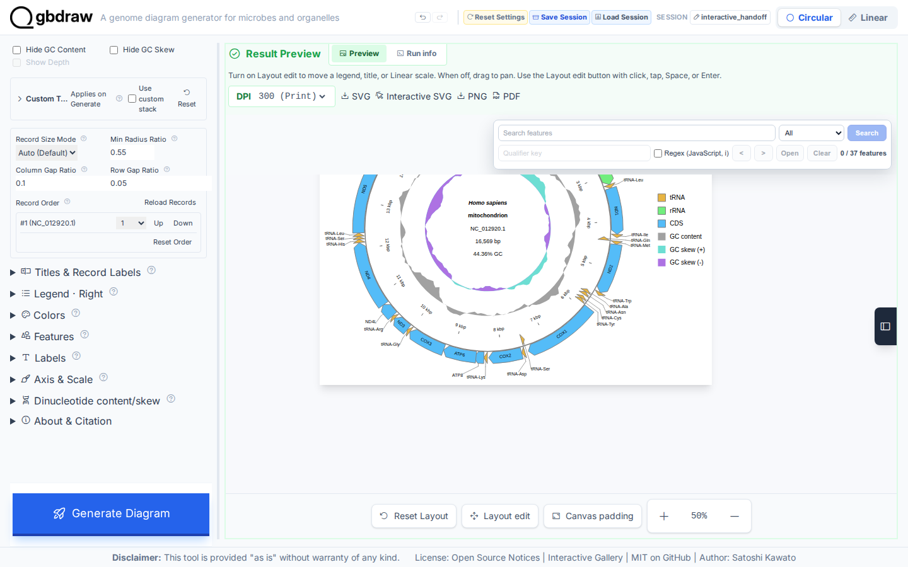
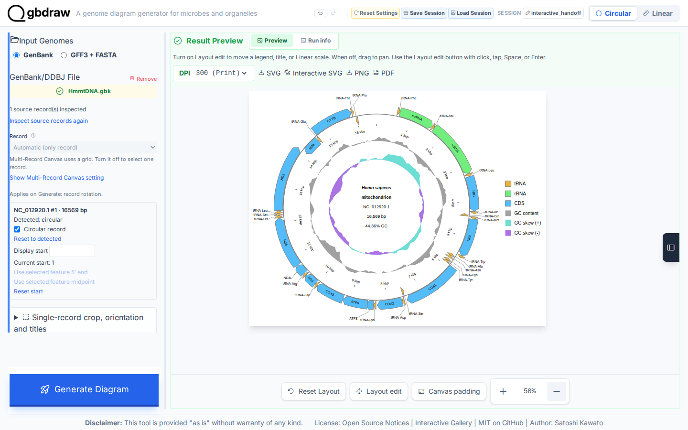

[Documentation home](../DOCS.md) | [Tutorials](README.md) | [Get the tutorial inputs](../GETTING_TUTORIAL_DATA.md) | [Technical documentation](../REFERENCE/README.md)

# Save an interactive mitochondrial figure and reopen it later

You will draw the human mitochondrial genome as a Circular map, export it as an
offline Interactive SVG, save the project as a session, and reproduce the same
figure from that session. Look for the reopened map matching the original: the
same 37 feature IDs, labels, tracks, and legend.



*The reopened figure is drawn again entirely from the saved session.*

## Before you start

Use the filenames below when you download or save each file. [Get the tutorial
inputs](../GETTING_TUTORIAL_DATA.md) explains browser, `curl`, and PowerShell
downloads.

| File | Record | Length | Download |
| --- | --- | --- | --- |
| `HmmtDNA.gbk` | NCBI `NC_012920.1`, Homo sapiens mitochondrion, complete genome | 16,569 bp | [Record page](https://www.ncbi.nlm.nih.gov/nuccore/NC_012920.1); [full GenBank file](https://eutils.ncbi.nlm.nih.gov/entrez/eutils/efetch.fcgi?db=nuccore&id=NC_012920.1&rettype=gbwithparts&retmode=text) |
| `cds_gene_qualifier_priority.tsv` | CDS `gene` label priority | — | [`cds_gene_qualifier_priority.tsv`](../../gbdraw/web/tutorial-data/shared/cds_gene_qualifier_priority.tsv) (select **Download raw file**) |

Each interface creates these files:

| Interface | You create | gbdraw writes | Compare with |
| --- | --- | --- | --- |
| Web app | — | `interactive_human_mitochondrion.interactive.svg` (offline Interactive SVG, Step 3), `interactive_handoff.gbdraw-session.json.gz` (project session, saved in Step 5 and loaded in Step 6), `restored_interactive_figure.svg` (static SVG regenerated from the loaded session, Step 6) | The figure above |
| Command line | — | `interactive_human_mitochondrion.svg` (the static master), `interactive_human_mitochondrion.interactive.svg`, `interactive_handoff.gbdraw-session.json.gz`, `restored_interactive_figure.svg` | [`restored_interactive_figure.svg`](../images/t-cli-11/restored_interactive_figure.svg) |
| Python | `interactive_handoff.py`, the program from Step 2 | `interactive_human_mitochondrion.svg`, `interactive_human_mitochondrion.interactive.svg`, `interactive_handoff.gbdraw-session.json.gz`, `restored_interactive_figure.svg` | [`restored_interactive_figure.svg`](../images/t-py-08/restored_interactive_figure.svg) |

For the command line and Python, install gbdraw and start in an empty working
directory.

## In the web app

Starting state: open a fresh gbdraw web app page with no session loaded and no
files selected. Step 6 starts from a second fresh page and then changes it to a
loaded-session state.

### Step 1: Load the record

Select **Circular** and **GenBank**, choose `HmmtDNA.gbk`, and set **Output
Prefix** to `interactive_human_mitochondrion`.



### Step 2: Generate the finished map

Set Species to `<i>Homo sapiens</i>`, use the Middle track preset, separate the
strands, keep GC content and GC skew, and place labels outside. Under
**Labels**, load `cds_gene_qualifier_priority.tsv` as **Priority File (TSV)**.
Put the legend on the right, then select **Generate Diagram**.



The result contains the complete `NC_012920.1` record and 37 rendered feature
elements.

### Step 3: Export the offline Interactive SVG

In the Result Preview toolbar, select **Interactive SVG**. The browser saves
`interactive_human_mitochondrion.interactive.svg`.


This is a self-contained SVG: its feature metadata, search interface, popup
logic, and runtime assets travel with the file. It does not need the gbdraw web
app or a network connection when opened later.

### Step 4: Inspect COX1 before handoff

In **Search features**, choose **Qualifier value**, enter `gene` as the
qualifier key, search for `COX1`, and open the active feature. Confirm its
location in the feature popup.



Close the popup and clear the search.

### Step 5: Save the project session

Select **Save Session**, enter `interactive_handoff`, and save
`interactive_handoff.gbdraw-session.json.gz`.



The Interactive SVG is the reader-facing artifact. The session is the
reproducible working state: it preserves the inputs, settings, result, and
compatible render request needed to continue editing.

### Step 6: Reproduce the figure in a fresh context

Open a fresh gbdraw page with no files selected, select **Load Session**, and
choose `interactive_handoff.gbdraw-session.json.gz`. Editing controls wait
while **Loading session…** is shown. After the result is restored, **Source
records** shows **Records not inspected** because the saved preview is displayed
without reading the embedded GenBank record again. Change **Output Prefix** to
`restored_interactive_figure`, select **Generate Diagram**, and export **SVG**.
Generate inspects the embedded record before rendering.



The saved file is `restored_interactive_figure.svg`. Its record, feature IDs,
texts, labels, track groups, and placement match the original figure; only
subpixel browser font measurement may vary by less than one pixel.

## On the command line

### Step 1: Prepare the inputs, then export the figure and session

#### Prepare the working directory

Create and enter an empty directory:

```bash
mkdir gbdraw-cli-interactive-session
cd gbdraw-cli-interactive-session
```

Download both files from the table in [Before you start](#before-you-start).
For the repository-hosted label rule, select **Download raw file**. On macOS, Linux, or WSL, run:

```bash
ncbi_efetch="https://eutils.ncbi.nlm.nih.gov/entrez/eutils/efetch.fcgi"
gbdraw_data_base="https://raw.githubusercontent.com/satoshikawato/gbdraw/main/gbdraw/web/tutorial-data"
curl -L "${ncbi_efetch}?db=nuccore&id=NC_012920.1&rettype=gbwithparts&retmode=text" -o HmmtDNA.gbk
curl -L "$gbdraw_data_base/shared/cds_gene_qualifier_priority.tsv" -o cds_gene_qualifier_priority.tsv
```

Confirm that the source record reports `VERSION     NC_012920.1`:

```bash
grep '^VERSION' HmmtDNA.gbk
```

The working directory should now contain:

```text
gbdraw-cli-interactive-session/
├── HmmtDNA.gbk
└── cds_gene_qualifier_priority.tsv
```

#### Export the figure and session

<!-- executable:T-CLI-11:start -->
```bash
gbdraw circular \
  --gbk HmmtDNA.gbk \
  --qualifier_priority cds_gene_qualifier_priority.tsv \
  --separate_strands \
  --track_type middle \
  --labels out \
  --species '<i>Homo sapiens</i>' \
  --legend right \
  --session_output interactive_handoff.gbdraw-session.json.gz \
  -o interactive_human_mitochondrion \
  -f svg,interactive_svg

gbdraw circular \
  --session interactive_handoff.gbdraw-session.json.gz \
  -o restored_interactive_figure \
  -f svg
```
<!-- executable:T-CLI-11:end -->

Expected output: the first command writes
`interactive_human_mitochondrion.svg`,
`interactive_human_mitochondrion.interactive.svg`, and
`interactive_handoff.gbdraw-session.json.gz`. The second command reads only
the session and writes `restored_interactive_figure.svg`.

### Step 2: Verify the restored figure

Open `restored_interactive_figure.svg`. It should match the original static
master exactly: the same 37 feature IDs, the same `COX1` search metadata, and
the same visible content, reproduced entirely from the saved session.

Your SVG should match the figure at the top of this page: the same record
identity, visible labels and tracks, and legend. Check them before testing the
Interactive SVG in a browser.

## In Python

### Step 1: Prepare the working directory

Create and enter an empty directory:

```bash
mkdir gbdraw-python-interactive-session
cd gbdraw-python-interactive-session
```

Download both files from the table in [Before you start](#before-you-start)
and save them with the exact filenames shown.

### Step 2: Save and run the Python program

Save the following complete program as `interactive_handoff.py`:

<!-- executable:T-PY-08:start -->
```python
from datetime import datetime, timezone
from pathlib import Path

from gbdraw.api import (
    CircularDiagramOptions,
    CircularDiagramRequest,
    CircularOutputOptions,
    GenBankInputSource,
    RecordInput,
    RenderOutputRequest,
    RequestRenderResult,
    load_session_document,
    materialize_session,
    render_request,
    save_session_document,
    session_to_request,
    with_request_output,
)


request = CircularDiagramRequest(
    records=(
        RecordInput(
            source=GenBankInputSource("HmmtDNA.gbk"),
            record_key="human-mitochondrion",
        ),
    ),
    options=CircularDiagramOptions(
        qualifier_priority_file="cds_gene_qualifier_priority.tsv",
        species="<i>Homo sapiens</i>",
        output=CircularOutputOptions(legend="right"),
        config_overrides={
            "canvas.strandedness": True,
            "canvas.circular.track_type": "middle",
            "canvas.show_gc": True,
            "canvas.show_skew": True,
            "labels.circular.scope": "outer",
            "labels.circular.placement": "horizontal",
        },
    ),
    output=RenderOutputRequest(
        output_prefix="interactive_human_mitochondrion",
        formats=("svg", "interactive_svg"),
    ),
)

result = render_request(request)
assert isinstance(result, RequestRenderResult)

session_path = Path("interactive_handoff.gbdraw-session.json.gz")
session_document = save_session_document(
    session_path,
    request,
    title="Interactive human mitochondrial handoff",
    created_at=datetime(2026, 8, 4, tzinfo=timezone.utc),
)
loaded_document = load_session_document(session_path)

with materialize_session(loaded_document, output_directory=Path(".")) as materialized:
    replay_request = session_to_request(materialized)
    restored_request = with_request_output(
        replay_request,
        output_prefix="restored_interactive_figure",
        formats=("svg",),
    )
    restored_result = render_request(restored_request)

assert isinstance(restored_result, RequestRenderResult)
print("Exported the interactive figure and session")
print("Restored restored_interactive_figure.svg")
```
<!-- executable:T-PY-08:end -->

Before running it, your working directory should contain:

```text
gbdraw-python-interactive-session/
├── HmmtDNA.gbk
├── cds_gene_qualifier_priority.tsv
└── interactive_handoff.py
```

Run the program:

```bash
python interactive_handoff.py
```

Expected output: the program prints
`Exported the interactive figure and session`, followed by
`Restored restored_interactive_figure.svg`. It writes the four files
listed above.

### Step 3: Inspect the restored figure

Open `restored_interactive_figure.svg`. It should reproduce the original static
export exactly, using the embedded resources and feature metadata carried by
the saved session.

Your SVG should match the figure at the top of this page: the same record
identity, labels, tracks, and legend. The two static SVGs should also be
byte-identical.

## Next steps

- [Review session and request compatibility](../REFERENCE/session-and-request-compatibility.md)
- [Review preview, search, and editor behavior](../REFERENCE/web-app.md#preview-search-and-editor)
- [Review output formats and export](../REFERENCE/output-formats-and-export.md)
- [Review Interactive SVG semantic hooks](../REFERENCE/interactive-svg-and-semantic-hooks.md)
- [Review typed-request fields](../REFERENCE/typed-requests.md)
- Technical documentation for the [web app](../REFERENCE/web-app.md), the
  [command line](../REFERENCE/command-line.md), and [Python](../REFERENCE/python-api.md)

## About the data

- `HmmtDNA.gbk` is NCBI RefSeq `NC_012920.1`. Check the accession version
  (`.1`) in the `VERSION` line; it identifies the exact nucleotide sequence.
- `cds_gene_qualifier_priority.tsv` is a gbdraw support file hosted in this
  repository. It tells gbdraw to label CDS features with the `gene` qualifier.
