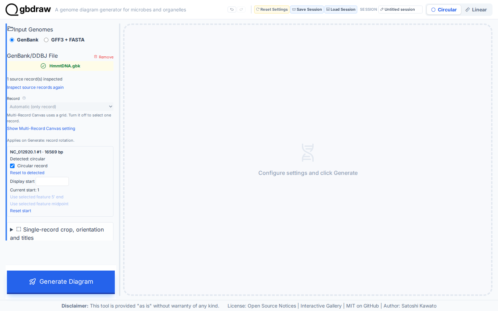
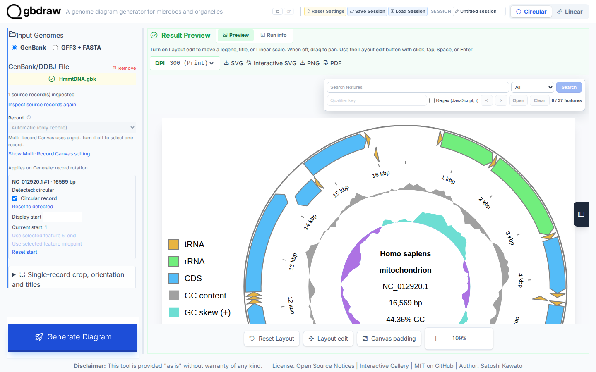
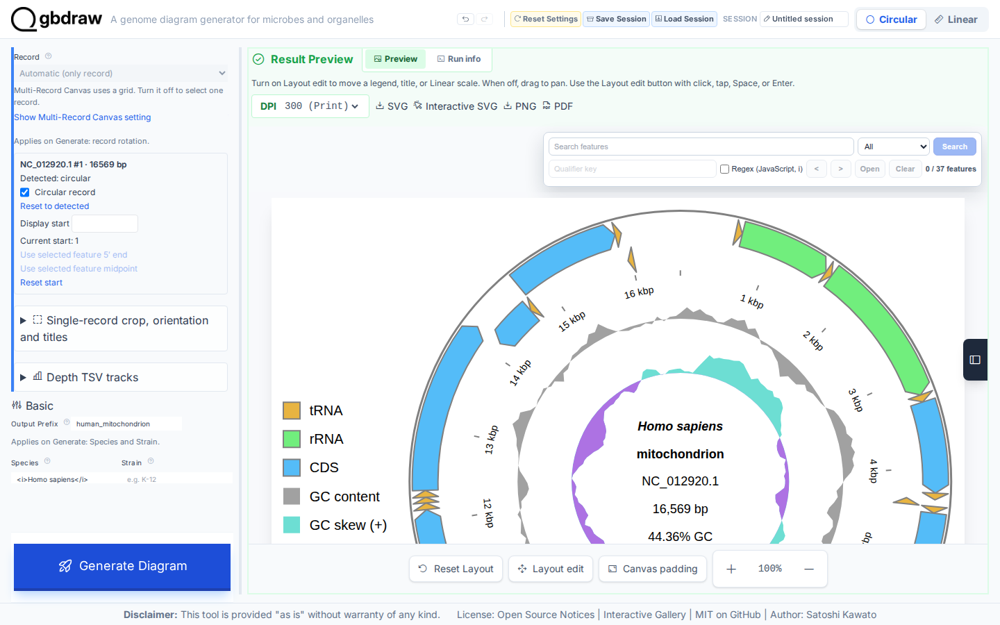
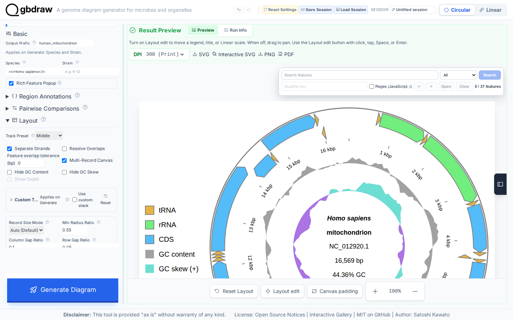
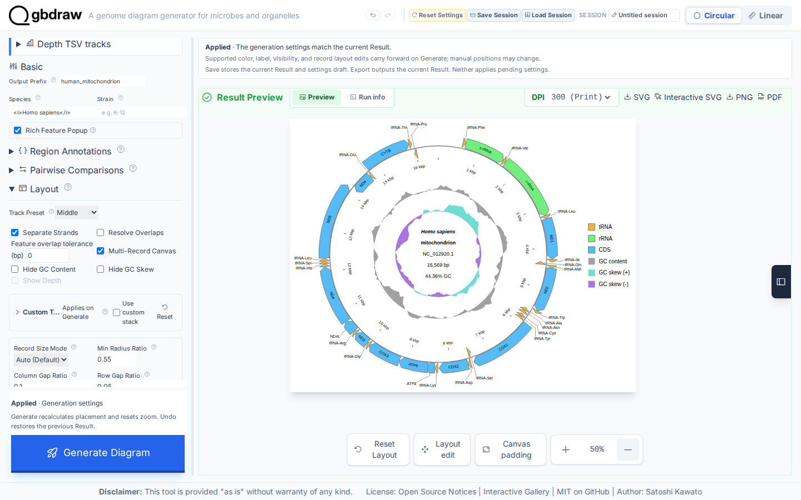
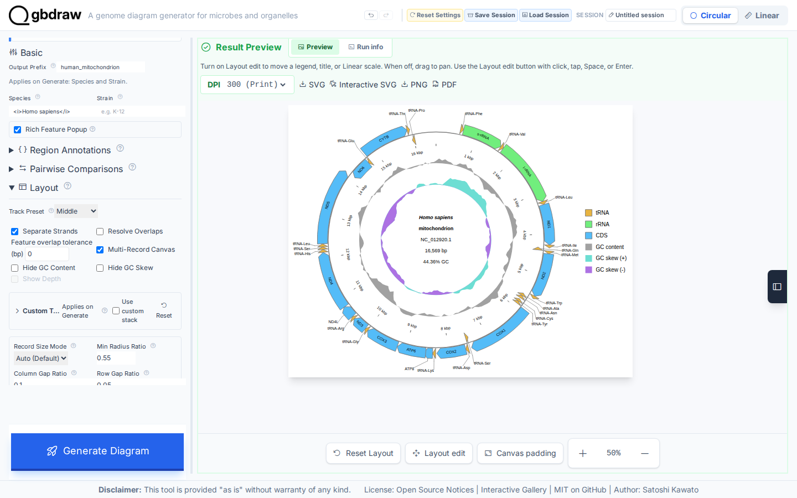

[Documentation home](../DOCS.md) | [Tutorials](README.md) | [Get the tutorial inputs](../GETTING_TUTORIAL_DATA.md) | [Technical documentation](../REFERENCE/README.md)

# Draw a labeled circular map of the human mitochondrial genome

You will draw the 16,569 bp human mitochondrial reference genome as a
Circular SVG. Look for the 37 displayed features with short gene-symbol labels
outside the circle, the GC content and GC skew plots inside it, and the legend
on the right.


*CDS labels come from the `gene` qualifier, so they read `ND1`, `COX1`, and `CYTB` instead of the longer `product` text.*

## Before you start

Download the inputs and save them with the exact filenames shown. [Get the
tutorial inputs](../GETTING_TUTORIAL_DATA.md) explains browser, `curl`, and
PowerShell downloads.

| File | Record | Length | Download |
| --- | --- | --- | --- |
| `HmmtDNA.gbk` | NCBI `NC_012920.1`, *Homo sapiens* mitochondrion, complete genome | 16,569 bp | [Record page](https://www.ncbi.nlm.nih.gov/nuccore/NC_012920.1); [full GenBank file](https://eutils.ncbi.nlm.nih.gov/entrez/eutils/efetch.fcgi?db=nuccore&id=NC_012920.1&rettype=gbwithparts&retmode=text) |
| `cds_gene_qualifier_priority.tsv` | CDS label-priority rule | — | [`cds_gene_qualifier_priority.tsv`](../../gbdraw/web/tutorial-data/shared/cds_gene_qualifier_priority.tsv) (select **Download raw file**) |

Each interface creates these files:

| Interface | You create | gbdraw writes | Compare with |
| --- | --- | --- | --- |
| Web app | — | `human_mitochondrion.svg`, saved in Step 5 | The figure above |
| Command line | — | `human_mitochondrion.svg` | [`human_mitochondrion.svg`](../images/t-cli-01/human_mitochondrion.svg) |
| Python | `first_diagram.py`, the program from Step 2 | `python_human_mitochondrion.svg` | [`python_human_mitochondrion.svg`](../images/t-py-01/python_human_mitochondrion.svg) |

For the command line and Python, install gbdraw so that `gbdraw -h` succeeds
and start in an empty working directory.

## In the web app

Starting state: open a fresh gbdraw web app page with no session loaded and no
files selected.

### Step 1: Load the NCBI mitochondrial genome

Select **Circular** at the top of the app and keep **GenBank** selected under **Input Genomes**. In **GenBank/DDBJ File**, choose `HmmtDNA.gbk`.

The uploader should show `HmmtDNA.gbk` in green. The app inspects the file at
once: **Source records** reports **1 source record(s) inspected**, and the
`NC_012920.1` rotation row appears below it.



*Confirm that Circular and GenBank are selected, the uploader names `HmmtDNA.gbk`, and **Source records** reports one inspected record.*

### Step 2: Generate the first diagram

Select **Generate Diagram** without changing the advanced settings. When processing finishes, **Result Preview** displays the first Circular map.



*The first result identifies `NC_012920.1` and includes feature rings, GC content, GC skew, and coordinate ticks.*

### Step 3: Add a publication label

Under **Basic**, enter these values:

| Control | Value |
| --- | --- |
| Output Prefix | `human_mitochondrion` |
| Species | `<i>Homo sapiens</i>` |

Select **Generate Diagram** again. The center label should show *Homo sapiens* in italics.



*The Basic controls retain the output prefix and species markup, while the preview renders the species name in italics.*

### Step 4: Make the feature map easier to read

Set the final layout values below. **Track Preset** and the three checkboxes are under **Layout**. **Label Mode** and **Priority File (TSV)** are under **Labels**, and **Legend position** is under the separate **Legend · Left** section.

| Control | Value |
| --- | --- |
| Track Preset | Middle |
| Separate Strands | On |
| Hide GC Content | Off |
| Hide GC Skew | Off |
| Label Mode | Out |
| Priority File (TSV) | `cds_gene_qualifier_priority.tsv` |
| Legend position | Right |



*The visible Layout controls show Middle with separate strands enabled and both GC tracks retained. Keep Labels at Out and the legend at Right as listed above.*

Select **Generate Diagram**. The completed map adds external feature labels, uses the `gene` qualifier for every CDS label, and retains the right-side legend.



*The finished preview shows the labeled mitochondrial map and the six-entry legend on its right.*

### Step 5: Export the SVG

In the **Result Preview** toolbar, select **SVG**.



*Use SVG for the static publication figure. The browser saves `human_mitochondrion.svg`.*

## On the command line

### Step 1: Prepare the working directory

Create and enter a new directory:

```bash
mkdir gbdraw-cli-circular
cd gbdraw-cli-circular
```

Download both files from the table in [Before you start](#before-you-start).
On macOS, Linux, or WSL, you can download them with `curl`:

```bash
ncbi_efetch="https://eutils.ncbi.nlm.nih.gov/entrez/eutils/efetch.fcgi"
gbdraw_data_base="https://raw.githubusercontent.com/satoshikawato/gbdraw/main/gbdraw/web/tutorial-data"
curl -L "${ncbi_efetch}?db=nuccore&id=NC_012920.1&rettype=gbwithparts&retmode=text" -o HmmtDNA.gbk
curl -L "$gbdraw_data_base/shared/cds_gene_qualifier_priority.tsv" -o cds_gene_qualifier_priority.tsv
```

Confirm that the source record reports `VERSION     NC_012920.1`:

```bash
grep '^VERSION' HmmtDNA.gbk
```

Before running gbdraw, the working directory should contain:

```text
gbdraw-cli-circular/
├── HmmtDNA.gbk
└── cds_gene_qualifier_priority.tsv
```

### Step 2: Generate the first diagram

Run this command from the directory containing `HmmtDNA.gbk`:

<!-- executable:T-CLI-01:start -->
```bash
gbdraw circular \
  --gbk HmmtDNA.gbk \
  --qualifier_priority cds_gene_qualifier_priority.tsv \
  --separate_strands \
  --track_type middle \
  --labels out \
  --species "<i>Homo sapiens</i>" \
  --legend right \
  -o human_mitochondrion \
  -f svg
```
<!-- executable:T-CLI-01:end -->

Expected output: the command prints `Generated SVG: human_mitochondrion.svg`
and writes the file in the current directory.

### Step 3: Inspect the SVG

Open `human_mitochondrion.svg` in a browser or vector editor.
Check the center definition for `NC_012920.1` and `16,569 bp`, then follow the
two inner plots for GC content and GC skew. CDS labels should use short gene
symbols such as `ND1`, `COX1`, and `CYTB`, not product descriptions such as
"NADH dehydrogenase subunit 1."

Your SVG should match the figure at the top of this page: the same record,
track order, labels, and legend, even if metadata or XML formatting differs.

### If the command fails

- `gbdraw: command not found`: activate the environment where gbdraw is installed.
- `Output file already exists`: return to a new empty directory or choose a new
  output prefix. gbdraw does not overwrite an existing file by default.

## In Python

This section uses the beginner-facing Python API.

### Step 1: Prepare the working directory

Create and enter an empty directory:

```bash
mkdir gbdraw-python-circular
cd gbdraw-python-circular
```

Download both files from the table in [Before you start](#before-you-start)
and save them with the exact filenames shown.

### Step 2: Save and run the Python program

Save the following complete program as `first_diagram.py` beside the two
downloaded files:

<!-- executable:T-PY-01:start -->
```python
from pathlib import Path

from gbdraw import (
    CircularOptions,
    Diagram,
    LabelOptions,
    draw_circular,
    read_genbank,
)


input_path = Path("HmmtDNA.gbk")
output_path = Path("python_human_mitochondrion.svg")

record = read_genbank(input_path)[0]
options = CircularOptions(
    labels=LabelOptions(
        qualifier_priority=Path("cds_gene_qualifier_priority.tsv"),
    ),
    species="<i>Homo sapiens</i>",
    legend="right",
    config_overrides={
        "canvas.strandedness": True,
        "canvas.circular.track_type": "middle",
        "labels.circular.scope": "outer",
        "labels.circular.placement": "horizontal",
    },
)
diagram = draw_circular(record, options=options)
saved_path = diagram.save(output_path)

assert isinstance(diagram, Diagram)
assert saved_path == output_path
print(f"Saved {saved_path}")
```
<!-- executable:T-PY-01:end -->

`read_genbank()` returns a list because one GenBank file can contain more than
one record. This tutorial selects the only record in the downloaded file. The
options match the web app and command-line steps: separate strands, Middle
layout, outer labels, gene-first CDS label priority, and a right legend.

Before running it, your working directory should contain:

```text
gbdraw-python-circular/
├── HmmtDNA.gbk
├── cds_gene_qualifier_priority.tsv
└── first_diagram.py
```

Run the program:

```bash
python first_diagram.py
```

Expected output: the program prints `Saved python_human_mitochondrion.svg`.
Within the program, `draw_circular()` returns a `Diagram`, and `save()` writes
the SVG in the current directory.

### Step 3: Inspect the SVG

Open `python_human_mitochondrion.svg`. It contains `NC_012920.1`, 37 displayed
features, coordinate ticks, GC content, and GC skew. It should match the
figure at the top of this page: the same record, track order, labels, and
legend, even if XML metadata differs.

### Continue to a multi-record Circular diagram

`read_genbank()` also accepts a list of paths, and `draw_circular()` accepts
the returned list of records. A four-record continuation can combine the human
record from this Tutorial with complete GenBank records [NCBI
`NC_002333.2`](https://www.ncbi.nlm.nih.gov/nuccore/NC_002333.2), [NCBI
`NC_024511.2`](https://www.ncbi.nlm.nih.gov/nuccore/NC_024511.2), and [NCBI
`NC_001328.1`](https://www.ncbi.nlm.nih.gov/nuccore/NC_001328.1). Save those
additional downloads as `NC_002333.2.gb`, `NC_024511.2.gb`, and
`NC_001328.1.gb`.

Pass all four paths to `read_genbank()`, then pass its result to
`draw_circular()` and save `python_multi_record.svg`. Use options without the
single-record `species` value so that each record keeps its own definition.
The [Python layout and track options](../REFERENCE/python-api.md#layout-and-track-options)
document multi-record drawing.

### If the program fails

- `ModuleNotFoundError: No module named 'gbdraw'`: activate the environment
  where gbdraw is installed.
- `Output file already exists`: use a new empty directory or change
  `output_path`. `Diagram.save()` does not overwrite by default.

## Next steps

- [Draw a Linear genome map](first-linear-genome-diagram.md)
- [Review feature-presentation rules](../REFERENCE/palettes-feature-rules-labels-shapes-and-tracks.md#feature-presentation)
- [Compare genomes](compare-genomes-losatn.md)
- [Save and restore an interactive session](../REFERENCE/session-and-request-compatibility.md)
- [Choose another output format](../REFERENCE/output-formats-and-export.md)
- Technical documentation for the [web app](../REFERENCE/web-app.md), the
  [command line](../REFERENCE/command-line.md), and [Python](../REFERENCE/python-api.md)

## About the data

- `HmmtDNA.gbk` is NCBI RefSeq `NC_012920.1`. Check the accession version
  (`.1`) in the `VERSION` line; it identifies the exact nucleotide sequence.
- `cds_gene_qualifier_priority.tsv` is a gbdraw support file hosted in this
  repository. It tells gbdraw to label CDS features with the `gene` qualifier.
- The command and the Python program on this page run in gbdraw's automated
  documentation checks against an offline copy of the same accession. The
  checks confirm the XML structure, the record metadata, 37 stable feature IDs,
  both GC tracks, the ticks, and the absence of scripts, event handlers, and
  external links. They also confirm that all 13 CDS gene symbols are present
  and that the longer CDS product descriptions are absent from label text. The
  command-line and Python SVGs are the same drawing.
