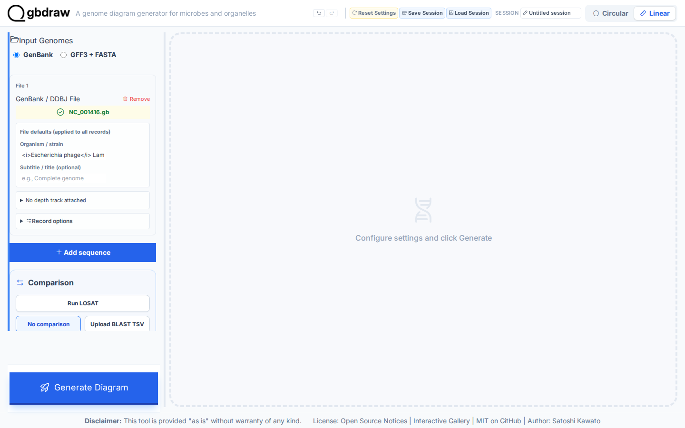
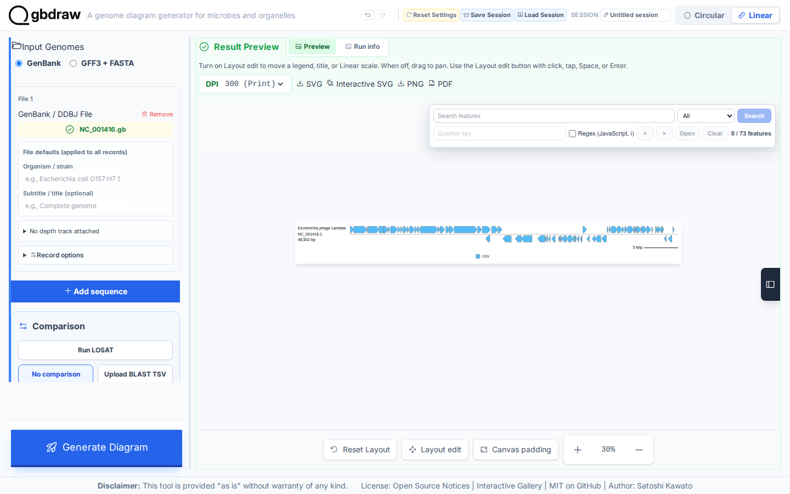
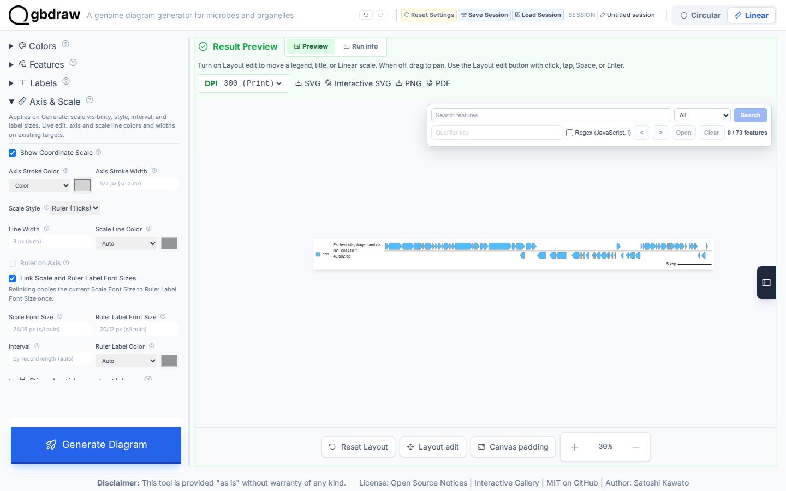
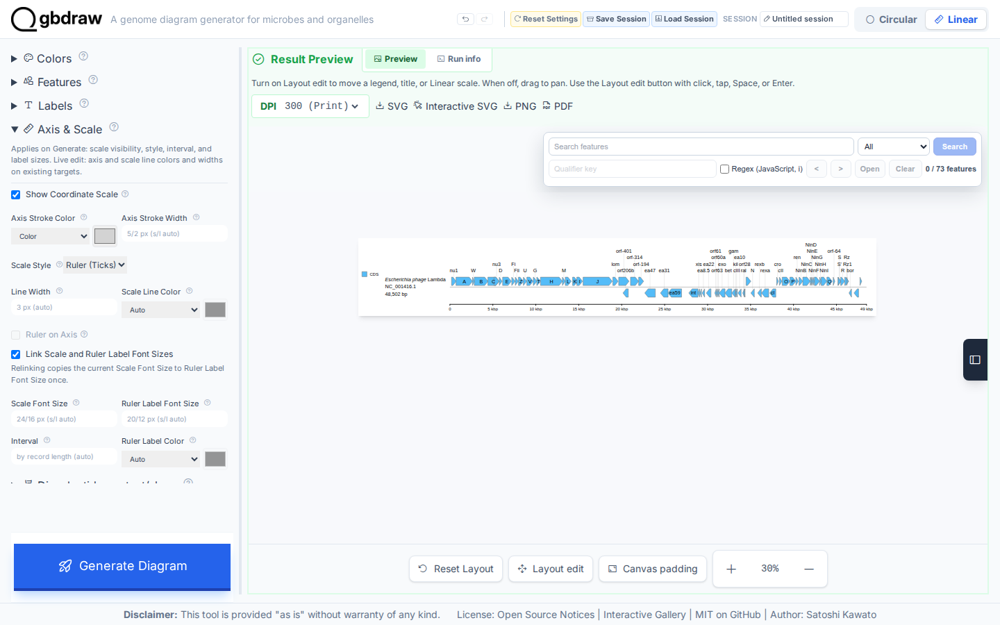

[Documentation home](../DOCS.md) | [Tutorials](README.md) | [Get the tutorial inputs](../GETTING_TUTORIAL_DATA.md) | [Technical documentation](../REFERENCE/README.md)

# Draw a labeled linear map of the Lambda phage genome

You will draw the complete 48,502 bp Lambda phage reference genome as a
Linear SVG. Look for all 73 CDS features on two strand lanes, short gene labels
such as `A`, `B`, `J`, and `int`, the ruler along the record axis, and the CDS
legend on the left.


*The whole record is drawn without cropping; the ruler is marked every 5 kbp.*

## Before you start

Download the inputs and save them with the exact filenames shown. [Get the
tutorial inputs](../GETTING_TUTORIAL_DATA.md) explains browser, `curl`, and
PowerShell downloads.

| File | Record | Length | Download |
| --- | --- | --- | --- |
| `NC_001416.gb` | NCBI `NC_001416.1`, Enterobacteria phage lambda, complete genome | 48,502 bp | [Record page](https://www.ncbi.nlm.nih.gov/nuccore/NC_001416.1); [full GenBank file](https://eutils.ncbi.nlm.nih.gov/entrez/eutils/efetch.fcgi?db=nuccore&id=NC_001416.1&rettype=gbwithparts&retmode=text) |
| `cds_gene_qualifier_priority.tsv` | CDS label-priority rule | — | [`cds_gene_qualifier_priority.tsv`](../../gbdraw/web/tutorial-data/shared/cds_gene_qualifier_priority.tsv) (select **Download raw file**) |

The label rule tells gbdraw to use short `gene` values instead of long product
descriptions for CDS labels.

Each interface creates these files:

| Interface | You create | gbdraw writes | Compare with |
| --- | --- | --- | --- |
| Web app | — | `lambda_linear.svg`, saved in Step 4 | The figure above |
| Command line | — | `lambda_linear.svg` | [`lambda_linear.svg`](../images/t-cli-02/lambda_linear.svg) |
| Python | `lambda_linear.py`, the program from Step 2 | `python_lambda_linear.svg` | [`python_lambda_linear.svg`](../images/t-py-03/python_lambda_linear.svg) |

For the command line and Python, install gbdraw so that `gbdraw -h` succeeds
and start in an empty working directory.

## In the web app

Starting state: open a fresh gbdraw web app page with no session loaded and no
files selected.

### Step 1: Load the NCBI Lambda genome

Select **Linear** at the top of the app. A fresh Linear page starts with **No
comparison**. Under **Input Genomes**, keep **GenBank** selected. The **GenBank
File** uploader is the first control in **Sequence 1**; choose
`NC_001416.gb`. Leave **Record options** closed.

The uploader should show `NC_001416.gb` in green. Keep one input row only; this Tutorial uses the complete `NC_001416.1` record without cropping or splitting it.



*Confirm Linear, GenBank, the `NC_001416.gb` upload, and the pressed **No
comparison** command before generating.*

### Step 2: Generate the first diagram

Select **Generate Diagram** without changing the presentation settings. When processing finishes, **Result Preview** displays the first Linear map.



*The first result identifies `NC_001416.1` and `48,502 bp`, draws all 73 CDS features, and keeps the two strand lanes separate.*

### Step 3: Add concise labels and a ruler

Set **Output Prefix** under **Basic**. **Generate Diagram** follows **Basic** in
the DOM. Continue past it to the **Layout**, **Labels**, **Axis & Scale**, and
**Legend · Bottom** sections for the remaining values below. Leave the closed
**Advanced comparison and layout** disclosure unchanged.

| Control | Value |
| --- | --- |
| Output Prefix | `lambda_linear` |
| Track Layout | Features on axis |
| Separate Strands | On |
| Show Labels | All Records |
| Priority File (TSV) | `cds_gene_qualifier_priority.tsv` |
| Show Coordinate Scale | On |
| Scale Style | Ruler (Ticks) |
| Legend position | Left |



*The visible Axis & Scale controls show the coordinate scale and Ruler (Ticks). Keep the label, strand, and legend values exactly as listed in the table.*

### Step 4: Regenerate and export the SVG

Select **Generate Diagram** again. The completed map should include short labels such as `A`, `B`, `J`, and `int`. Its ruler spans the complete Lambda record, and the CDS legend appears on the left.



*Check the full 48,502 bp map before export. The ruler, labels, record definition, two strand lanes, and left CDS legend should all be visible.*

In the **Result Preview** toolbar, select **SVG**. The browser saves `lambda_linear.svg`.

## On the command line

### Step 1: Prepare the working directory

Create and enter a new directory:

```bash
mkdir gbdraw-cli-linear
cd gbdraw-cli-linear
```

Download both files from the table in [Before you start](#before-you-start).
On macOS, Linux, or WSL, you can download them with `curl`:

```bash
ncbi_efetch="https://eutils.ncbi.nlm.nih.gov/entrez/eutils/efetch.fcgi"
gbdraw_data_base="https://raw.githubusercontent.com/satoshikawato/gbdraw/main/gbdraw/web/tutorial-data"
curl -L "${ncbi_efetch}?db=nuccore&id=NC_001416.1&rettype=gbwithparts&retmode=text" -o NC_001416.gb
curl -L "$gbdraw_data_base/shared/cds_gene_qualifier_priority.tsv" -o cds_gene_qualifier_priority.tsv
```

Confirm that the source record reports `VERSION     NC_001416.1`:

```bash
grep '^VERSION' NC_001416.gb
```

Before running gbdraw, the working directory should contain:

```text
gbdraw-cli-linear/
├── NC_001416.gb
└── cds_gene_qualifier_priority.tsv
```

### Step 2: Generate the first diagram

Run this command from the working directory containing the two input files:

<!-- executable:T-CLI-02:start -->
```bash
gbdraw linear \
  --gbk NC_001416.gb \
  --qualifier_priority cds_gene_qualifier_priority.tsv \
  --show_labels all \
  --separate_strands \
  --scale_style ruler \
  --track_layout middle \
  --legend left \
  -o lambda_linear \
  -f svg
```
<!-- executable:T-CLI-02:end -->

Expected output: the command prints `Generated SVG: lambda_linear.svg` and
writes the file in the current directory.

### Step 3: Inspect the SVG

Open `lambda_linear.svg`. The definition at the left identifies
`NC_001416.1` and `48,502 bp`. The centered ruler is marked every 5 kbp, and
short labels such as `A`, `B`, `J`, and `int` remain legible near their CDS
features.

Your SVG should match the figure at the top of this page: the same complete
record, labels, ruler, and legend.

### If the command fails

- The ruler is missing: keep `--scale_style ruler` and `--track_layout middle`
  in the same command.
- `Output file already exists`: use a new empty directory or a new output
  prefix. gbdraw refuses to replace the existing SVG by default.

## In Python

### Step 1: Prepare the working directory

Create and enter an empty directory:

```bash
mkdir gbdraw-python-linear
cd gbdraw-python-linear
```

Download both files from the table in [Before you start](#before-you-start)
and save them with the exact filenames shown.

### Step 2: Save and run the Python program

Save the following complete program as `lambda_linear.py`:

<!-- executable:T-PY-03:start -->
```python
from pathlib import Path

from gbdraw import LabelOptions, LinearOptions, draw_linear, read_genbank


record = read_genbank([Path("NC_001416.gb")])[0]
assert record.id == "NC_001416.1" and len(record) == 48_502

options = LinearOptions(
    labels=LabelOptions(
        qualifier_priority="cds_gene_qualifier_priority.tsv",
    ),
    legend="left",
    config_overrides={
        "labels.linear.scope": "all",
        "canvas.strandedness": True,
        "canvas.linear.track_layout": "middle",
        "objects.scale.style": "ruler",
    },
)
diagram = draw_linear(record, options=options)
saved_path = diagram.save(Path("python_lambda_linear.svg"))
print(f"Saved {saved_path}")
```
<!-- executable:T-PY-03:end -->

Before running it, your working directory should contain:

```text
gbdraw-python-linear/
├── NC_001416.gb
├── cds_gene_qualifier_priority.tsv
└── lambda_linear.py
```

Run the program:

```bash
python lambda_linear.py
```

Expected output: the program prints `Saved python_lambda_linear.svg` and
writes the SVG in the current directory.

### Step 3: Inspect the SVG

Open `python_lambda_linear.svg` to see the labeled whole-record map, all 73 CDS
features, the ruler, and the two separated strands. It should match the figure
at the top of this page: the same complete record, labels, ruler, separated
strands, and left legend.

## Next steps

- [Open the matching Gallery entry](https://gbdraw.app/gallery/#lambda_basic_linear) for its interactive figure, Session, and step-by-step web app guide
- [Review record selection and layout](../REFERENCE/web-app.md#record-selection-and-layout)
- [Review feature-presentation rules](../REFERENCE/palettes-feature-rules-labels-shapes-and-tracks.md#feature-presentation)
- [Compare genomes](compare-genomes-losatn.md)
- [Choose another output format](../REFERENCE/output-formats-and-export.md)
- Technical documentation for the [web app](../REFERENCE/web-app.md), the
  [command line](../REFERENCE/command-line.md), and [Python](../REFERENCE/python-api.md)

## About the data

- `NC_001416.gb` is NCBI RefSeq `NC_001416.1`. Check the accession version
  (`.1`) in the `VERSION` line; it identifies the exact nucleotide sequence.
- `cds_gene_qualifier_priority.tsv` is a gbdraw support file hosted in this
  repository, not a sequence source.
- The command and the Python program on this page run in gbdraw's automated
  documentation checks. The checks confirm the XML structure, the record
  metadata, all 73 stable feature IDs, representative gene labels, and ruler
  labels, and they reject active or external content in the standard SVG.
