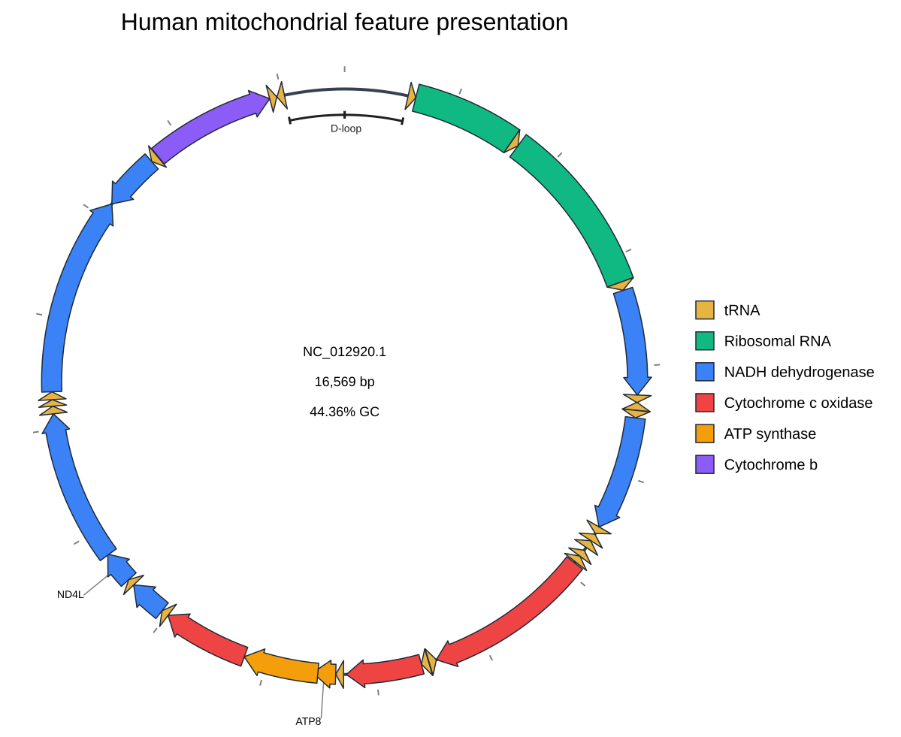
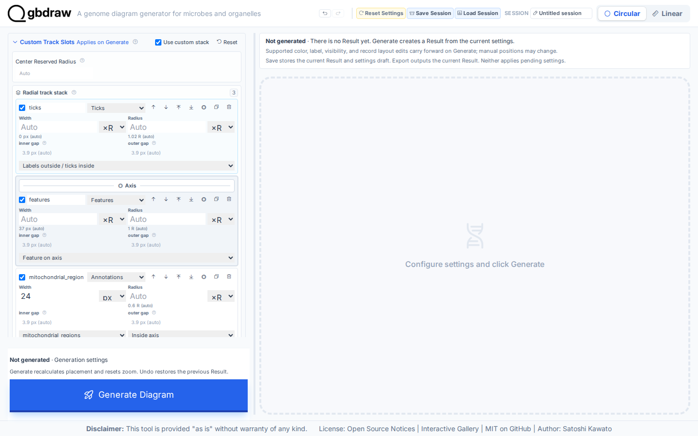
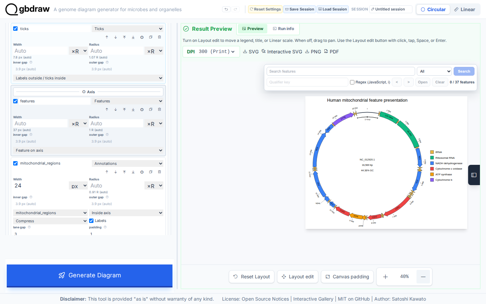
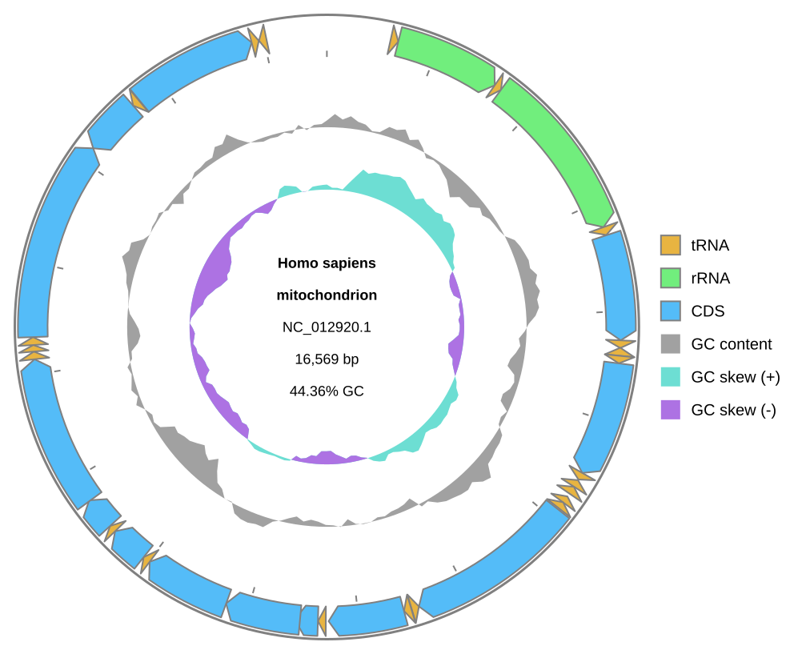

[Documentation home](../DOCS.md) | [Tutorials](README.md) | [Get the tutorial inputs](../GETTING_TUTORIAL_DATA.md) | [Technical documentation](../REFERENCE/README.md)

# Highlight selected features on the human mitochondrial map

You will turn the complete 16,569 bp human mitochondrial reference into a focused Circular map without editing its GenBank file. Look for functional colors on the 13 CDS and two rRNA features, gene-name labels, arrow and rectangle shapes, and one origin-spanning D-loop bracket.



*Feature shapes, strokes, colors, labels, and the D-loop bracket are presentation settings, not edits to the biological record.*

## Before you start

Download the inputs and save them with the exact filenames shown. [Get the
tutorial inputs](../GETTING_TUTORIAL_DATA.md) explains browser, `curl`, and
PowerShell downloads.

| File | Record | Length | Download |
| --- | --- | --- | --- |
| `HmmtDNA.gbk` | NCBI [`NC_012920.1`](https://www.ncbi.nlm.nih.gov/nuccore/NC_012920.1), *Homo sapiens* mitochondrion, complete genome | 16,569 bp | [Record page](https://www.ncbi.nlm.nih.gov/nuccore/NC_012920.1); [full GenBank file](https://eutils.ncbi.nlm.nih.gov/entrez/eutils/efetch.fcgi?db=nuccore&id=NC_012920.1&rettype=gbwithparts&retmode=text) |
| `cds_gene_qualifier_priority.tsv` | CDS label-priority rule | — | [`cds_gene_qualifier_priority.tsv`](../../gbdraw/web/tutorial-data/shared/cds_gene_qualifier_priority.tsv) (select **Download raw file**) |

Each interface creates these files:

| Interface | You create | gbdraw writes | Compare with |
| --- | --- | --- | --- |
| Web app | `presentation_colors.tsv`, `presentation_labels.tsv`, `presentation_label_overrides.tsv`, and `mitochondrial_regions.tsv` | `mitochondrial_features_highlighted.svg`, saved in Step 4 | The figure above |
| Command line | `tables/presentation_colors.tsv`, `tables/presentation_labels.tsv`, `tables/presentation_label_overrides.tsv`, and `tables/mitochondrial_regions.tsv`, created in Step 1 | `mitochondrial_features_baseline.svg` and `mitochondrial_features_highlighted.svg` | [`mitochondrial_features_baseline.svg`](../images/t-cli-03/mitochondrial_features_baseline.svg) and [`mitochondrial_features_highlighted.svg`](../images/t-cli-03/mitochondrial_features_highlighted.svg) |
| Python | `highlight_mitochondrial_features.py`, the program from Step 2 | `mitochondrial_features_highlighted.svg` | [`mitochondrial_features_highlighted.svg`](../images/t-py-09/mitochondrial_features_highlighted.svg) |

For the command line and Python, install gbdraw and start in an empty working
directory. The Python program creates the color, label, and D-loop tables in
memory, so it needs no separate TSV files.

The web app and the command line use four small TSV tables that you create
from the exact blocks below. The web app saves them beside the other inputs;
the command line saves them in a `tables` subdirectory.

Save `presentation_colors.tsv`. Rows are evaluated in order; the first matching
feature-specific rule wins over the base palette.

```tsv
CDS	gene	^ND(4L|[1-6])$	#3B82F6	NADH dehydrogenase
CDS	gene	^COX[1-3]$	#EF4444	Cytochrome c oxidase
CDS	gene	^ATP[68]$	#F59E0B	ATP synthase
CDS	gene	^CYTB$	#8B5CF6	Cytochrome b
rRNA	gene	^RNR[12]$	#10B981	Ribosomal RNA
```

Save `presentation_labels.tsv`, a label whitelist:

```tsv
CDS	gene	^(ND[1-6]|ND4L|COX[1-3]|ATP[68]|CYTB)$
rRNA	gene	^RNR[12]$
```

Save `presentation_label_overrides.tsv`, which holds replacement text for the two rRNA labels:

```tsv
record_id	feature_type	qualifier	value	label_text
NC_012920.1	rRNA	label	^s-rRNA$	12S rRNA
NC_012920.1	rRNA	label	^l-rRNA$	16S rRNA
```

Save `mitochondrial_regions.tsv`, the origin-spanning D-loop annotation:

```tsv
set_id	id	mark	record	start	end	coordinate_space	wraps_origin	label	lane	stroke	stroke_width	line_cap	label_color	label_font_size	label_orientation	label_offset
mitochondrial_regions	d_loop	bracket	NC_012920.1	16024	576	source	true	D-loop	0	#202020	3	tick	#202020	14	tangent	7
```

## In the web app

Starting state: open a fresh gbdraw web app page with no session loaded and no
files selected.

### Step 1: Load the complete record

Select **Circular** and **GenBank**, then choose `HmmtDNA.gbk`. Set **Output
Prefix** to `mitochondrial_features_highlighted`, Species to `<i>Homo
sapiens</i>`, Track Preset to **Middle**, and leave **Separate Strands** off.

### Step 2: Set colors, labels, and feature appearance

Open **Colors**. Leave Palette on **default** and load
`presentation_colors.tsv` as **Specific Table (-t)**.

Open **Labels**, select **Both**, choose **Whitelist**, and load
`presentation_labels.tsv` as **Whitelist File**. Load
`cds_gene_qualifier_priority.tsv` as **Priority File (TSV)** and leave Label
Rendering on **Auto**. This displays all 13 CDS labels from their `gene`
qualifier and keeps the two rRNA labels in scope.

Open **Features** and set CDS and tRNA to **Arrow** and rRNA to **Rectangle**.
Leave Head Length Ratio blank for Auto and set Shaft Width Ratio to `0.72`.
Use block stroke `#1F2937` at `1.5` px and line stroke `#9CA3AF` at `1.5` px.

### Step 3: Add the D-loop track and generate

Open **Region Annotations** and import `mitochondrial_regions.tsv`. Open
**Custom Track Slots**, enable **Use custom stack**, and keep these enabled
rows in order:

1. `ticks`, outside the axis, with labels outside and ticks inside
2. `features`, on the axis
3. `mitochondrial_regions`, inside the axis, width `24px`

Bind the annotation row to `mitochondrial_regions`, show labels, set padding to
`1`, and select **Compress** for overflow. Remove the GC-content and GC-skew
rows. In **Axis & Scale**, set the axis stroke to `#374151` at `4` px. Set the
plot title to `Human mitochondrial feature presentation`, position it at the
top, and put the legend on the right.



Select **Generate Diagram**. Open the result editor, choose **Features**, and
load `presentation_label_overrides.tsv` with **Load Label TSV**. The editor
applies the two rRNA replacements and reflows their label placement. Close the
editor.

### Step 4: Verify and export

Confirm that the map still contains all 37 CDS, rRNA, and tRNA features. CDS
labels should use gene names such as `ND1`, `COX2`, `ATP6`, and `CYTB`. Check
for `12S rRNA`, `16S rRNA`, and the single origin-spanning D-loop bracket. The
five functional legend colors should match the command-line and Python figures.



Select **SVG** to save `mitochondrial_features_highlighted.svg`.

## On the command line

You will make a baseline map, then a second SVG in which selected CDS and rRNA
features have deliberate colors and labels. All 13 mitochondrial CDS remain
visible. The D-loop is added as a named, origin-spanning region annotation,
using the same bracket semantics as the chloroplast Gallery example.

### Step 1: Prepare the source record and presentation tables

#### Create the working directory and download the source inputs

Create the project directory and its `tables` subdirectory:

```bash
mkdir gbdraw-cli-mitochondrial-features
cd gbdraw-cli-mitochondrial-features
mkdir tables
```

Download both files from the table in [Before you start](#before-you-start).
On macOS, Linux, or WSL, you can download them with `curl`:

```bash
ncbi_efetch="https://eutils.ncbi.nlm.nih.gov/entrez/eutils/efetch.fcgi"
gbdraw_data_base="https://raw.githubusercontent.com/satoshikawato/gbdraw/main/gbdraw/web/tutorial-data"
curl -L "${ncbi_efetch}?db=nuccore&id=NC_012920.1&rettype=gbwithparts&retmode=text" -o HmmtDNA.gbk
curl -L "$gbdraw_data_base/shared/cds_gene_qualifier_priority.tsv" -o cds_gene_qualifier_priority.tsv
```

Confirm that the source record reports `VERSION     NC_012920.1`:

```bash
grep '^VERSION' HmmtDNA.gbk
```

#### Define color rules

Save the `presentation_colors.tsv` block from [Before you start](#before-you-start)
as `tables/presentation_colors.tsv`.

#### Select and rename labels

Save the whitelist block as `tables/presentation_labels.tsv`, and the
resolved-label replacements as `tables/presentation_label_overrides.tsv`.

The qualifier-priority file selects `gene` for all 13 CDS labels. The whitelist
keeps those CDS and the two rRNAs in scope, and the override table renames the
two rRNA labels.

#### Add the D-loop as a region annotation

Save the `mitochondrial_regions.tsv` block as `tables/mitochondrial_regions.tsv`.

The source D-loop joins bases 16,024–16,569 and 1–576. One row with
`wraps_origin=true` preserves that biology and draws a single named bracket.
The finished command draws every CDS and tRNA as an arrow and rRNA as a
rectangle.

#### Check the working directory

After downloading the source record and support file and creating the four
tables, the working directory should contain:

```text
gbdraw-cli-mitochondrial-features/
├── HmmtDNA.gbk
├── cds_gene_qualifier_priority.tsv
└── tables/
    ├── presentation_colors.tsv
    ├── presentation_labels.tsv
    ├── presentation_label_overrides.tsv
    └── mitochondrial_regions.tsv
```

### Step 2: Run both reproducible commands

Run the block from the directory containing the two inputs and the `tables`
directory.

<!-- executable:T-CLI-03:start -->
```bash
gbdraw circular \
  --gbk HmmtDNA.gbk \
  --labels none \
  --legend right \
  -o mitochondrial_features_baseline \
  -f svg

gbdraw circular \
  --gbk HmmtDNA.gbk \
  -k CDS,rRNA,tRNA \
  --table tables/presentation_colors.tsv \
  --qualifier_priority cds_gene_qualifier_priority.tsv \
  --label_whitelist tables/presentation_labels.tsv \
  --label_table tables/presentation_label_overrides.tsv \
  --annotation_table tables/mitochondrial_regions.tsv \
  --feature_shape CDS=arrow \
  --feature_shape rRNA=rectangle \
  --feature_shape tRNA=arrow \
  --arrow_head_length_ratio auto \
  --arrow_shaft_width_ratio 0.72 \
  --track_type middle \
  --circular_track_slot 'ticks:ticks@side=outside,tick_label_layout=label_out_tick_in' \
  --circular_track_slot 'features:features@side=overlay,lane_direction=split' \
  --circular_track_slot 'mitochondrial_regions:annotations@set_id=mitochondrial_regions,side=inside,w=24px,show_labels=true,padding_px=1,overflow=compress' \
  --labels both \
  --label_rendering auto \
  --block_stroke_color '#1F2937' \
  --block_stroke_width 1.5 \
  --axis_stroke_color '#374151' \
  --axis_stroke_width 4 \
  --line_stroke_color '#9CA3AF' \
  --line_stroke_width 1.5 \
  --species '<i>Homo sapiens</i>' \
  --plot_title 'Human mitochondrial feature presentation' \
  --plot_title_position top \
  --legend right \
  -o mitochondrial_features_highlighted \
  -f svg
```
<!-- executable:T-CLI-03:end -->

### Step 3: Verify the two outputs

Expected output: the first command writes
`mitochondrial_features_baseline.svg`, and the second writes
`mitochondrial_features_highlighted.svg`.

Open `mitochondrial_features_baseline.svg` first. Verify that its definition
names `NC_012920.1`, reports `16,569 bp`, and shows the complete circular
record.



Open `mitochondrial_features_highlighted.svg`. Check that all 13 CDS labels use
their gene names, including `COX1`, and that `12S rRNA` and `16S rRNA` are also
present. The blue, red, amber, violet, and green rules should appear in the
legend. rRNA blocks are rectangular, directional features remain arrows, and
the D-loop appears as one origin-spanning inner bracket.

Your highlighted SVG should match the figure at the top of this page: the same record definition, labels, feature shapes, annotation bracket, colors, and legend. Compare your baseline SVG with the baseline figure above.

### Check the source record

Only presentation inputs changed. `HmmtDNA.gbk` stayed byte-for-byte identical;
the SVG still contains the same complete `NC_012920.1` sequence context.

## In Python

This section uses the beginner-facing Python API to apply the command-line
project's color, label, shape, stroke, and D-loop rules without changing the
GenBank record.

### Step 1: Prepare the working directory

Create and enter an empty directory:

```bash
mkdir gbdraw-python-mitochondrial-features
cd gbdraw-python-mitochondrial-features
```

Download both files from the table in [Before you start](#before-you-start)
and save them with the exact filenames shown.

### Step 2: Save and run the Python program

Save the following complete program as `highlight_mitochondrial_features.py`:

<!-- executable:T-PY-09:start -->
```python
from pathlib import Path

from pandas import DataFrame

from gbdraw import (
    CircularOptions,
    CircularTrackOptions,
    FeatureOptions,
    LabelOptions,
    TitleOptions,
    draw_circular,
    read_genbank,
)
from gbdraw.api import AnnotationOptions, CircularTrackSlot, ScalarSpec


color_table = DataFrame(
    [
        ["CDS", "gene", "^ND(4L|[1-6])$", "#3B82F6", "NADH dehydrogenase"],
        ["CDS", "gene", "^COX[1-3]$", "#EF4444", "Cytochrome c oxidase"],
        ["CDS", "gene", "^ATP[68]$", "#F59E0B", "ATP synthase"],
        ["CDS", "gene", "^CYTB$", "#8B5CF6", "Cytochrome b"],
        ["rRNA", "gene", "^RNR[12]$", "#10B981", "Ribosomal RNA"],
    ],
    columns=["feature_type", "qualifier_key", "value", "color", "caption"],
)
label_whitelist = DataFrame(
    [
        ["CDS", "gene", "^(ND[1-6]|ND4L|COX[1-3]|ATP[68]|CYTB)$"],
        ["rRNA", "gene", "^RNR[12]$"],
    ],
    columns=["feature_type", "qualifier", "keyword"],
)
label_overrides = DataFrame(
    [
        ["NC_012920.1", "rRNA", "label", "^s-rRNA$", "12S rRNA"],
        ["NC_012920.1", "rRNA", "label", "^l-rRNA$", "16S rRNA"],
    ],
    columns=["record_id", "feature_type", "qualifier", "value", "label_text"],
)
regions = DataFrame(
    [[
        "mitochondrial_regions", "d_loop", "bracket", "NC_012920.1",
        16024, 576, "source", True, "D-loop", 0, "#202020", 3, "tick",
        "#202020", 14, "tangent", 7,
    ]],
    columns=[
        "set_id", "id", "mark", "record", "start", "end",
        "coordinate_space", "wraps_origin", "label", "lane", "stroke",
        "stroke_width", "line_cap", "label_color", "label_font_size",
        "label_orientation", "label_offset",
    ],
)
track_slots = (
    CircularTrackSlot(
        id="ticks",
        renderer="ticks",
        side="outside",
        params={"tick_label_layout": "label_out_tick_in"},
    ),
    CircularTrackSlot(
        id="features",
        renderer="features",
        side="overlay",
        params={"lane_direction": "split"},
    ),
    CircularTrackSlot(
        id="mitochondrial_regions",
        renderer="annotations",
        side="inside",
        width=ScalarSpec(24, "px"),
        params={
            "set_id": "mitochondrial_regions",
            "show_labels": True,
            "padding_px": 1,
            "overflow": "compress",
        },
    ),
)

record = read_genbank(Path("HmmtDNA.gbk"))[0]
options = CircularOptions(
    features=FeatureOptions(
        types=("CDS", "rRNA", "tRNA"),
        color_table=color_table,
        shapes={"CDS": "arrow", "rRNA": "rectangle", "tRNA": "arrow"},
    ),
    labels=LabelOptions(
        qualifier_priority="cds_gene_qualifier_priority.tsv",
        whitelist=label_whitelist,
        overrides=label_overrides,
    ),
    annotations=AnnotationOptions(table=regions),
    tracks=CircularTrackOptions(slots=track_slots),
    species="<i>Homo sapiens</i>",
    title=TitleOptions(
        text="Human mitochondrial feature presentation",
        position="top",
    ),
    legend="right",
    config_overrides={
        "canvas.resolve_overlaps": False,
        "canvas.strandedness": False,
        "canvas.circular.track_type": "middle",
        "labels.circular.scope": "both",
        "labels.rendering": "auto",
        "objects.features.arrow_geometry.head_length_ratio": "auto",
        "objects.features.arrow_geometry.shaft_width_ratio": 0.72,
        "objects.features.block_stroke_color": "#1F2937",
        "objects.features.block_stroke_width.short": 1.5,
        "objects.features.block_stroke_width.long": 1.5,
        "objects.axis.circular.stroke_color": "#374151",
        "objects.axis.circular.stroke_width.short": 4,
        "objects.axis.circular.stroke_width.long": 4,
        "objects.features.line_stroke_color": "#9CA3AF",
        "objects.features.line_stroke_width.short": 1.5,
        "objects.features.line_stroke_width.long": 1.5,
    },
)
diagram = draw_circular(record, options=options)
saved_path = diagram.save(Path("mitochondrial_features_highlighted.svg"))
print(f"Saved {saved_path}")
```
<!-- executable:T-PY-09:end -->

Before running it, your working directory should contain:

```text
gbdraw-python-mitochondrial-features/
├── HmmtDNA.gbk
├── cds_gene_qualifier_priority.tsv
└── highlight_mitochondrial_features.py
```

Run the program:

```bash
python highlight_mitochondrial_features.py
```

Expected output: the program prints
`Saved mitochondrial_features_highlighted.svg` and writes the SVG in
the current directory.

### Step 3: Inspect the result

Open `mitochondrial_features_highlighted.svg`. It should keep all
37 features, use gene names for CDS labels, show the two renamed rRNA labels,
retain the five functional legend colors and the arrow and rectangle shapes,
and include one origin-spanning D-loop bracket.

Your SVG should match the figure at the top of this page: the same labels, colors, shapes, strokes, legend, and D-loop bracket.

## Next steps

- [Review feature-presentation rules](../REFERENCE/palettes-feature-rules-labels-shapes-and-tracks.md#feature-presentation)
- [Review tracks, axes, and annotations](../REFERENCE/palettes-feature-rules-labels-shapes-and-tracks.md#tracks-axes-and-annotations)
- [Review feature-rule and label schemas](../REFERENCE/palettes-feature-rules-labels-shapes-and-tracks.md)
- [Review Python layout and track options](../REFERENCE/python-api.md#layout-and-track-options)
- Technical documentation for the [web app](../REFERENCE/web-app.md), the
  [command line](../REFERENCE/command-line.md), and [Python](../REFERENCE/python-api.md)

## About the data

- `HmmtDNA.gbk` is NCBI RefSeq `NC_012920.1`. Check the accession version
  (`.1`) in the `VERSION` line; it identifies the exact nucleotide sequence.
- `cds_gene_qualifier_priority.tsv` is a gbdraw support file hosted in this
  repository. It tells gbdraw to label CDS features with the `gene` qualifier.
- The four TSV tables are created from the blocks on this page; the GenBank
  file is not modified.
