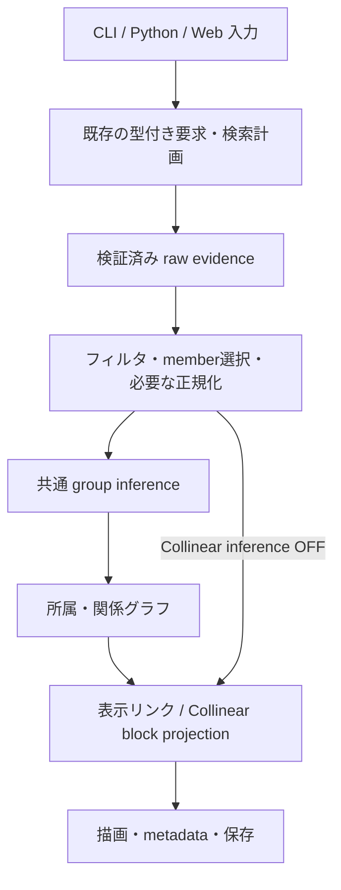

# Collinear / Similarity groups 計算量改修 — 総合計画書

- 作成日: 2026-09-15
- 状態: S08の統合・回帰検証とhandoff完了（2026-09-17 JST）。source変更後のSession保存不具合を修正し、最終sourceのgate・実browser・offline・上限内のWeb時間確認を完了した。S07.5〜S07.8の追加高速化は終了。S07の既承認、S06の将来merge前Review、S05却下を維持する。新たな性能承認や統合mergeは行っていない。
- 対象: Similarity groups（内部トークン `orthogroup`）と Collinear の解析、Web 中間キャッシュ、結果・保存メタデータ。

## S09: S06互換性・S08 Session writerの統合前レビュー（2026-09-17 JST）

今回新しく区切るレビュー工程。S08や局所重複調査の再開ではない。
最新origin/dev `5e0cb0fa` 由来の専用worktree/branchで10依存commitを重複なく継承し、
RW-04の未コミット37ファイルと375 source hashを照合した。
PATH-B、typed resource 1/2読込・3 writer、明示的旧tuple、S06例外宣言、S08 writerと
RW-01〜04の接続をReviewした。不正manifestが空/nucleotide-only raw cacheのとき
空manifestへ置換され正常保存される不具合を再現し、既存writerの最終検証で明示的に拒否した。
正常な空manifest保存、inactive raw保持、live cache/History、readerとindex寿命は維持する。
focused gateとsource/新規installed packageのdesktop/mobile実browserは通過。
保存失敗時の状態保持と正常Save→fresh Load→保存raw 13 hits・検索0回を確認した。最終source・wheel/package・継承証拠・既存11 worktreeの保持監査も完了した。
[S09 findings・根拠・検証・handoff](results/S09_PREMERGE_REVIEW.md)と
`results/data/s09-premerge-review/`に今回の証拠を分離した。
未変更の科学計算・全測定・長い新規検索は再実行せず、秒数改善は未測定。
S08完了・S07承認・S05却下・S07.5〜S07.8終了を維持する。
S06互換性例外とS08 writerの人によるmerge前Review、最終candidateのcommit固定は残る。
未コミットsourceをexact-head承認済みとしない。push/PR/merge/tag/deployは行わない。

## S08後続: alias validation（2026-09-17 JST）

RW-01〜03を含むcommit `6d361253` を最新origin/dev由来の専用worktreeへ継承した。
局所調査で、manifest validator内の同じaliasに対するNFC/trim二重評価を確認し、
RW-04として既存ownerの1箇所で2回→1回にした。検証回数・入力許容範囲・失敗順は維持する。
Unicode/ordinalのfocused gate、既存RW-01〜03・Session・run-analysis回帰、
source/installed packageのdesktop/mobile実Workerで保存raw 13 hits・検索0回、
結果/provenance一致、空alias時の失敗隔離・retryを確認した。
[調査範囲・修正・検証・handoff](results/S08_FOLLOWUP_ALIAS_VALIDATION.md)を参照。
新規時間測定なし。S08完了、S07承認、S06/S08 writerの将来merge前Review、S05却下、
S07.5〜S07.8終了を維持する。次のRWは登録していない。

## S08後続: manifest merge（2026-09-17 JST）

RW-03を既存merge owner内で修正した。Generateの入力manifest検証を2R→Rへ集約し、
統合後検証1回、invalid/conflictの失敗優先順、reload案内とdefault helper契約を維持した。
RW-01/RW-02の未コミット37ファイルをhash一致で継承し、getter/index寿命は変更していない。
focused Node gateとsource/installed packageの実Workerをdesktop/mobile・外部通信遮断で検証した。
保存rawは13 hits・検索0回。不正manifest時のResult/History保持と再試行も確認した。
[結果・source・証拠・handoff](results/S08_FOLLOWUP_MANIFEST_MERGE.md)を参照。
新規時間測定なし。S08完了、S07承認、S06/S08 writerのmerge前Review、S05却下、
S07.5〜S07.8終了は変えない。

## S08後続: raw validation（2026-09-17 JST）

S08の全成果は `8bf4b98ae02ef14f72caaebe3114f7a6fc3e0c75` にcommit済み。
以下のS08開始時・完了時に記した旧HEAD/未コミット表現は、その時点の検証履歴である。
最新origin/dev `5e0cb0fa` 由来の専用worktreeで依存を重複なく継承し、RW-01→RW-02を修正した。
既存getterの二重検証を除去し、非共有manifestの内容が不変なpair処理区間だけ既存indexを貸与する。
詳細・source hash・gate・lifecycle・offline・operation count・限界は
[results/S08_FOLLOWUP_RAW_VALIDATION.md](results/S08_FOLLOWUP_RAW_VALIDATION.md)を参照。
時間改善は未測定。次の局所候補RW-03は[重複計算一覧](results/S08_REDUNDANT_WORK.md)に記録し、raw-validation時点では実装しなかった。今回のRW-03結果は上記を参照。
S08完了、S07の既承認、S06とS08 writerの将来merge前Review、S05却下とS07.5〜S07.8終了は変えない。

## S06開始時の更新（2026-09-16）

S05は却下済み。未コミット候補・cache owner・共通解析class・Worker変更を復活させない。
S04→S06として実装する。PATH-B authorityは独立したPR #536で統合済み（OIPC revision 6 / PD-OI-023）。
今回のruntime差分にauthority変更を含めない。S04の最終current側測定を、入力・設定・sourceが一致する比較のbaselineに再利用する。
変更のないS04を再測定しない。過去のnoise、外部競合、未測定項目は引き継ぐ。
実装・必要な検証・測定・引き継ぎは完了し、結果は[results/S06.md](results/S06.md)に記録した。独立した性能合格は未達で、merge前の互換性Reviewが残る。これはS06完了時点の記録である。S07の結果は下記を参照する。

## S07完了時の更新（2026-09-16）

S06成果を別のローカルcommitに固定し、最新dev由来のS07 worktreeでcluster mergeを改修した。
1200 anchorsのchainではconflict訪問数478,800→399、isolated merge 712.03→1.90 ms、
peak 180,848→153,152 bytes。結果は一致し、全体gateは4,361 passed。
時間の数値判定は14 pass / 6 inconclusive / 0 confirmed regression。外部競合と既存baselineの
測定記録は維持する。ユーザーは「合格とします」「合格でいいです」と明示し、S07の性能評価を合格とした。独立再測定は実施していない。Galleryではmergeの寄与が小さく、索引分のpeak増加もある。
完全な測定・counter・memory・制限とS08への検証引き継ぎは[results/S07.md](results/S07.md)を参照。
S05は却下のままで、S08以降は実装していない。

## S07.5計画完了時の更新（2026-09-16）

[追加改修計画](results/S07_5_PLAN.md)に優先順位、変更owner、同値性oracle、測定境界、
実装session用プロンプトを固定した。S07の合格と数値判定は変更せず、独立再測定を開始条件にしない。
S07のCollinear ON/OFFと、到達依存が一致するS06のSimilarity測定を再利用した。
追加検証はunit構築量とfit用4列投影prototypeだけで、本番コードは変更していない。

1. **S07.6:** `build_collinearity_unit_index`の二重instance生成、同じmember順の再sort、
   per-alias一時setを削減する。Collinear ON/OFFに有効で、Similarityはこのownerを通らない。
2. **S07.7:** `_select_normalized_fit_rows`の一時frameを24列から必要な4列へ絞る。
   Collinear ON/Similarityに有効、OFFは不通過。scalar計算順とpandasの選択順を保つ。
3. **S08:** 採用した上記変更を統合検証する。numeric/member/RBH/rankの追加案は、
   計画に明記した証拠が得られるまで見送り、S08への必須依存にしない。

fit局所prototypeの時間は約27–32%短縮したが、別のLOSAT作業との競合を観測したため、
独立した性能合格やWeb全体改善率には使わない。既存native benchmarkは固定設定であり、
Vibrio保存recipeのblock条件やHepのactive draft modeとは異なる。この区別を後続測定で維持する。
S08旧promptのS05前提・共有LRU置換を示唆する記述は本更新で適用除外する。
S05のclass/cache owner/Worker transactionを復活させず、S06のmerge前互換性Reviewは残す。

## S07.6実装時の更新（2026-09-16）

[結果とhandoff](results/S07_6.md)。既存unit owner内で二重instance、member再sort、
per-alias一時setを削除した。独立oracle・凍結differential・324-case結果matrixを含む
関連native gateは883 passed / 1 skipped、typed/Session/SVG gateは195 passed。
実WorkerはCollinear ON/OFF、desktop/narrow、旧/新wheelの全出力hashが一致した。
当初の三変更候補ではunit単体のPython peakがHepで30.07%、Vibrioで20.96%減少し、post-search全体はほぼ不変だった。
実hostの外部LOSAT benchmarkを確認したため、受入timingを開始せず保留した。
実装・正確性検証完了と**性能判定未確立**を分ける。速度改善や性能合格は主張しない。
その後、ユーザーの「Benchmarkは後でいい」に従い、最終測定を延期した。
alias初出登録の二段処理、fallback locus ID再取得、代表aliasの重複追加も削減した。
追加削減後もunit/Collinear gate 622 passed、最終wheelの旧版との全出力一致を確認した。
最終候補と先行測定候補のsource hashを分け、再測定範囲・baseline・rollbackを結果文書に固定した。
S07の合格、S06のmerge前Review、S05却下を維持し、S07.7/S08は実行していない。

## S07.7・局所削減の更新（2026-09-16）

今回の明示依頼により、旧S07.5のmember/RBH/rank見送りを限定的に解除した。
[fit結果](results/S07_7.md)と[member/RBH/rank結果](results/S07_LOCAL_REDUCTIONS.md)を参照。
S07.6のHEADだけでなく未コミットの最終unit実装・tests・証拠をhash照合して引き継いだ。
新規production差分は`protein_colinearity.py`だけで、A→B→Cを順に比較・検証した。

- A: fit選択の一時frameを4列に投影。同じstable sort、bin、scalar計算順を保持。
- B: unlimited memberの余分なcopy、pair索引前の2列frame、best-hit直前の冗長なpair dedup、reciprocityの全列行変換を除去。必要な数値変換・pair distinctness・元HSP保持は維持。
- C: direction evidenceの全体sortを3回から1回へ集約。各record bucketで実際に読む先頭行だけを保持し、同じ順位の再計算を削除。core/拡張後所属の二snapshotは維持。

独立oracleとS07.6凍結sourceの完全一致比較を実施し、局所/support 718 passed、
関連native 882 passed / 1 skipped / 1 benchmark-runner test deselected、typed/Session/SVG 195 passed。
最終wheelの208 Python filesはsourceと一致。旧/新wheelの実helper 8 runsで完全一致し、desktop/narrowの8ケースでGenerate/save/fresh-load/regenerateを確認した。専用installからprepared rawの新規生成2件、新旧SessionのCLI replay 3件が成功。記録はfit結果文書に集約した。
後からbenchmarkが許可され、S07.6最終sourceと今回の6条件を同一入力・設定で比較した。Hep ON/OFF、Vibrio OFF、Similarity member=5/無制限の5条件は基準内。Vibrio ONは初回noise 9.51%でinconclusive。21回への増加は分散等から算出した値ではなくHep規定の流用で、ユーザー指示により停止。3回ずつの簡易比較は3.080→2.876秒だが合格判定には使わない。関連runner全8 testsも通過した。memory増加と全sampleは結果文書に記録した。
S03前の記録との累積観測はHep Collinear 5.73→0.40秒、Similarity 8.01→0.75秒。旧host競合があるため厳密な累積合格ではなく、検索開始からSVG完成までの改善率は未測定。残る処理の診断と測定境界はlocal reductions文書を参照。
後続のユーザー指示により、今後の時間測定は原則3回。7回・21回という計画上の要求を外し、noiseによる自動追加測定を行わない。runnerのdefaultも3回へ変更し、過去のreportは保存policyで判定して履歴を維持する。
S08は別依頼であり、今回の実装・正確性確認を計画全体の完了とは扱わない。

## S07.8・局所削減と測定履歴（2026-09-16）

[結果と当時の記録](results/S07_8.md)。`02ca8f95`を基準に別worktreeでHSP代表行copy、
member rank再参照、全groupの中間anchor list、unit minima/aliasの一時処理を削減。
凍結S07.7と独立oracle、関連native、typed/Session/SVG、実browser 8 helper runsと
8 Session flows、installed CLI 3 replaysを確認した。S07.7の履歴・判定は変更しない。

性能目的は未達。Hep ON/OFFとSimilarity 5/無制限は保存済み中央値より約22〜30%遅く、
Vibrio ONは3.415265→3.010780秒だが旧測定のnoiseが大きい。Vibrio OFFの差は
0.004826秒。旧7/21回と新3回の設定差で比較guardは全6条件を拒否し、正式なpassや
コードによる回帰とは判定できない。peakはON/Similarityで0.20〜0.38%減、OFFほぼ不変。
当時は有効な時間削減・回帰原因帰属・採用判断を残した。後述のユーザー指示により
追加高速化・原因追跡・性能採用実験は終了し、S08の残課題には含めない。

保存済みprofileを再確認すると、Vibrio ONのcoverage unionは155,844回・0.516秒、
Vibrio OFFの数値検証は0.281秒（内部のPython有限値走査0.133秒）。
一時区間構築の除去と検証を維持した配列化には調査根拠があるが、同値な実装・実時間改善は
未証明。これらは削減可能秒数ではない。今回のunit sort key全体は0.028秒にすぎない。
追加の自動再測定はせず、候補を未コミットで保持。S08・cache/runtime再設計は未実施。

## 追加削減終了・S08への引き継ぎ（2026-09-16）

ユーザーは「じゃあもう7.5は終わり。S8に移ろう。次のセッションのプロンプトを出して」と指示した。
S07.5〜S07.8の追加削減をここで区切る。性能改善未確立というS07.8の測定履歴は維持するが、追加高速化は終了案件であり未完了の宿題ではない。
ユーザーは「今回『もっと速くならないのか』っていったやつはもうやらなくていい」と明示した。
coverage unionや数値検証の配列化、原因追跡・追加性能採用実験をS08の残課題・開始条件・完了条件にしない。
[次セッション用S08プロンプト](SESSION_08_INTEGRATION.md)は未コミットS07.8差分を
検証候補として継承し、実経路の統合検証、Web待ち時間の区間確認、必要な不具合修正と最終handoffを行う。
S05前提と未決PATHを含んだ古いS08記述を更新した。新しい局所最適化・cache/runtime改修は含めない。
S08の実行は次セッションであり、この引き継ぎ作成を実行済みとは扱わない。

## S08統合検証完了（2026-09-17 JST）

[results/S08.md](results/S08.md)に実経路の検証と最終handoffを集約した。
fetchした`origin/dev`は`5e0cb0fa1d9920592da431b764fa2c9133b5bfdf`。
専用worktree `.worktrees/collinear-s08-20260916`、upstreamなしのbranch
`verify/collinear-s08-integration-20260916`で、8件の未統合依存とS07.8の
未コミット59ファイルを重複なく継承した。S07.8 reviewの58 hashと、全208 Python
sourceを照合済み。HEADは`02ca8f950a7561ae9569c66f3f91d30702b53a17`のままで、
HEADだけを最終sourceと扱わない。

S08のproduction修正は既存Session writerの1箇所。sourceのCDS translationを変更して
再生成すると、旧bindingのraw 3件が現manifestと一緒に保存され、fresh Loadが拒否された。
既存validatorでmanifestに解決できるrawだけを保存するよう修正した。live cache・History、
科学的解析、reader、schemaは維持する。関連Node 52件と、installed GUIでの変更・History・
Save/fresh Load/再解析は通過した。S07.8候補の性能承認や新しい最適化ではない。

全Python sourceと生成browser wheelの208ファイル、最終installed packageの466ファイルを照合した。
最終Python gateは **5,972 passed / 17 skipped / 11 deselected**。16件のSVG参照比較も同じgate内で通過。
Nodeの関連189件、architecture/Product fixture 53件、writer修正関連52件が通過。
実source SPAのSession lifecycle 8件、installed CLI/Python、installed GUIでのsource変更、
Cancel/retry、History、新旧Session、desktop/mobileのLinear/Circularとofflineを確認した。
途中のharness誤りとserver競合は結果文書に残し、影響した経路を最終sourceで確認済み。
architecture gateはPASS、互換性ReviewはREQUIREDのまま。S06と今回のwriter修正を将来merge前にReviewする。

既存native 6条件の時間・memory証拠は入力・設定・到達source・依存の一致を確認して再利用した。
新規Web測定は4代表caseのGenerate→SVG反映。raw新規検索は各1回、保存raw再解析とderived再利用は
各3回、warmup 0回、計28観測。追加測定なし。秒数の中央値は以下のとおり。

| Case | raw新規検索込み（1回） | 保存raw再解析（3回） | derived再利用（3回） |
| --- | ---: | ---: | ---: |
| Hep Collinear ON | 170.082 | 20.042 | 6.672 |
| Hep Collinear OFF | 108.112 | 14.798 | 4.364 |
| Hep Similarity member=5 | 284.648 | 22.731 | 8.049 |
| Vibrio Collinear ON | 741.895 | 199.641 | 118.767 |

Vibrioの保存rawでも約3分20秒を要する。描画・Result/History/DOMがそれぞれ約62/64秒で、
解析だけのnative 3.011秒とは測定境界が違う。全sample・MAD・区間・転送量・counterはS08結果文書に記録。
別の旧release記録にも同じVibrio fixtureで保存rawのGenerate 428.980/341.936秒があるため、
以前から分単位だった事例はある。ただしrevision・計測・環境、2回目の設定が異なり、厳密な改善率は出さない。

最終sourceはHEADと未コミット差分で固定した。主要ownerのSHA-256は以下。全変更のhashと分類、
共有dev・既存worktreeの保持確認は[最終監査](results/data/s08-review.json)を参照。

- `protein_colinearity.py`: `816111a76a99755034a3e4e5479230ba6f643cf810c576503f5d0dba267f453a`
- `collinearity_units.py`: `730c1354e98fcc539d7d395cc0c06f1fb3bbd4f71f57f9be211e2d9c8dc7ad8f`
- Web `services/config.js`: `0454339812b90e9c213e822d28dff0e890d5ef9703fdc85ac551c5542fba6e2a`

ユーザーから後続作業用の重複計算の文書化が追加依頼された。
[次回修正候補](results/S08_REDUNDANT_WORK.md)にraw getter内の二重manifest/TSV検証と、
pair間のmanifest検証再利用候補を根拠・保持契約・確認テスト付きで記録した。
今回の追加最適化実装はなく、終了したS07.5〜S07.8や却下済みS05を再開していない。
push、PR作成、統合merge、tag、deployは未実施。

## 1. 目的と完了の意味

総当たりを evidence の索引参照へ置き換え、全経路の列挙を通常の解析・描画・保存から切り離す。S05の共通解析class・cache owner・Worker transactionは却下済みで実装対象に含めない。

目標は次の四つである。

1. 同じ入力を繰り返し転送・検証・parse・集計しない。
2. 疎な入力の所属候補探索を、全タンパク質と全グループの積から実在 evidence に基づく処理へ変える。
3. （S05却下により対象外）有限のキャッシュ予算で解析段階を保持する案。
4. 経路情報を失わないグラフ表現によって、通常処理が全経路数に比例して増える問題を解消する。

2026-09-15にProduct Decision OwnerがPATH-B / lossless-graphを選択した。
根拠は[完全なhuman receiptとauthority引き継ぎ](results/S02_PRODUCT_DECISION.md)であり、
この計画書の推奨ではない。authorityのbase統合前に依存runtimeを実装しない。

## 2. 調査の基準と更新手順

### 2.1 計画時に確認した状態

- 発端: 共有作業ツリーの未追跡 `docs/internal/report.md`（このworktreeには含めない）。監査対象は旧作業ツリー `51d2ae362ac154a3e360727ad086ad1d27bbc989` と未コミット変更。
- 文書保存時に fetch して確認した `origin/dev`: `65f231af175c0dbbbbf9b4674566e84ce5dddac5`。
- 現在の共有作業ツリーには対象・対象外の未コミット変更がある。旧作業ツリーをそのまま実装ベースにしない。
- report の `/tmp/gbdraw-mode-audit/` は計画時に存在しなかった。再現コードを利用可能と仮定しない。
- report の秒数、239 passed / 1 skipped、Node import 失敗は過去の監査結果であり、新しいベースの測定・テスト結果ではない。

| report の論点 | ベース確認結果 | 扱い |
|---|---|---|
| 全 manifest のジョブごとの転送・検証 | `47f5cebd` でキー生成をバッチ化済み | 再実装せず、検証回数・キー・転送量を再確認 |
| HSP ペアごとの DataFrame / 行イテレータ処理 | 構造が残存 | S03 |
| 全経路の列挙 | 構造が残存 | S02 で契約調査、S06 で承認済み結果を実装 |
| 未所属タンパク質と全 core group の総当たり | 構造が残存 | S04 |
| filtered / converted の64件共有LRU | 構造が残存 | S05却下により対象外 |
| 不要な表示 projection、メタデータ線形検索 | S04で既存境界を改善済み | S04。S05は却下・対象外 |
| Collinear cluster 結合 | S07で不要な走査・sort・copyを削減 | 結果同値、実測と残る計算量はS07報告 |
| downstream cancel 後の raw 検索再実行 | `7db0539a` で対応済み | 回帰を防ぐ |
| optional Collinear inference、mode別limit記憶 | `65f231af` でruntimeも統合済み | ON/OFF・旧Session・mode切替を回帰検証 |

参照: [バッチキー生成](https://github.com/satoshikawato/gbdraw/commit/47f5cebd)、[キャンセル後の再利用](https://github.com/satoshikawato/gbdraw/commit/7db0539a)、[optional inference と limit 記憶](https://github.com/satoshikawato/gbdraw/commit/65f231af)。統合済みはコードの確認結果であり、本書作成時に当該runtimeのテストを実行したという意味ではない。

### 2.2 Product authority と別作業への依存

S01 の確認時には `origin/dev` が `9a4f7e29ab1b99676bb783321f8a9f40f969d04c`
へ進んでいた。追加差分は legacy LOSAT candidate の消費を成功時まで確定しない
retry 修正（PR #534）。計画済みの性能改修へ重複実装しない。
更新された入力・authority・consumer の一覧は
[S01 inventory](results/S01_INVENTORY.md)、実測と再現コマンドは
[S01 handoff](results/S01.md)を参照する。以後のセッションはこの基準との
差分を確認する。S02 の経路表現の選択と S03 以降の本番改修は別セッションである。

S02開始時のfetchでもbaseは`9a4f7e29`のままで、S01成果は未統合だったため
新規worktreeへcherry-pickした。調査・検証結果は[S02 handoff](results/S02.md)、
全consumerと公開履歴は[S02 inventory](results/S02_INVENTORY.md)、具体的な型・
順位・保存・互換性は[S02 contract](results/S02_PATH_CONTRACT.md)を参照する。
[Decision Pack](results/PATH_DECISION_PACK.md)は判断時の比較記録でありauthorityではない。
受領したPATH-Bの文書化・review・base統合状態は[判断引き継ぎ](results/S02_PRODUCT_DECISION.md)を参照する。
S06はS04を基準に実装する。S05はユーザーが2026-09-15に却下したため依存に含めない。
PATH-B authorityはPR #536、dev `5e0cb0fa` に統合済み。

S03開始時のfetchでもbaseは`9a4f7e29`。未統合のS01/S02成果を依存順に
新規worktreeへ引き継ぎ、authority-only commitは適用しなかった。
[S03 handoff](results/S03.md)に処理owner、同値結果、測定・環境条件、S04の
実在APIを記録する。S03の実装・検証・観測測定と引き継ぎは完了。ユーザーの
最終指示で独立再測定を省略したため、性能の数値判定24 passと、他benchmarkとの
重複による測定条件未達を分けて報告する。独立測定の性能合格とは扱わない。

S04開始時もfetch後のbaseは`9a4f7e29`。未統合のS01〜S03を一度ずつ引き継いだ
`d7695a62`を固定baselineとして、所属evidenceとmetadataの索引を実装した。
[S04 handoff](results/S04.md)にsnapshotの寿命、削除した走査、28 cases / 51 stagesの一致、
4,295 Python testsと214 Node tests、実browser、時間・操作回数・メモリの証拠を記録する。
最終の21-sample測定は22 pass / 2 inconclusive / 0 regression。sparse-200とunrelated-200は
MAD/中央値が5%を超え、数値上の性能合格にはしない。S03の省略指示や観測値は流用していない。
authority-only commitは未統合のままS04へ混ぜていない。S05は2026-09-15に却下済み。

[Option Integrity Product Contract revision 5](https://github.com/satoshikawato/gbdraw/blob/9e28581a3d0e7fb9117da0fbc11d46a945b0e59e/docs/internal/OPTION_INTEGRITY_PRODUCT_CONTRACT.md) は、以下を既に選択している。

- `PD-OI-001/002/004`: Web の raw/member limit のモード別初期値・記憶、明示した有限値と無制限の維持。
- `PD-OI-018`: 必要な全レコードの比較、入力ソース単位の検索、実際の検索DB範囲を含む raw identity。
- `PD-OI-021`: Web Collinear の **Infer orthogroups with self-comparisons** は fresh/reset で OFF。ON は既存推論を維持し、古いセッションで値が欠ける場合は歴史的 ON を維持。
- `PD-OI-022`: 完了した raw 検索は downstream cancel 後も再利用できる。未完了 batch を完了扱いしない。

先行する口頭計画で未反映とした optional inference と limit retention は、文書保存時の `65f231af` でruntimeへ統合された。S01 はこの既存実装を含むbaseで検証する。性能改修内に別の UI / defaults / migration 実装を作らず、ONの推論とOFFの直接block構築をそれぞれ維持する。既に承認された outcome に、同じ Product 選択を再要求しない。

単純な一行一レコード・推論 ON の隣接比較は方向付き evidence が `3R-2`、Similarity groups / Collinear All records 推論 ON は `R²`。推論 OFF の Collinear は self を除く。実際の LOSAT invocation 数は source batching、選択ペア、互換な検索設定によって異なる。レコード比較数・ソースジョブ数・プロセス起動数を別々に記録する。

S01 および各実装開始時に最新の `origin/dev` を確認し、既に解決した項目、改名した owner、更新された契約をこの表と handoff に反映する。計画時の schema 番号や古い行番号を新規実装の根拠に固定しない。

## 3. 科学的結果と互換性の不変条件

- 選択された scope に必要な self / reverse / 非隣接 evidence を保つ。OFF で不要になる evidence は承認済み契約に従う。
- `max_hsps=1`、隠れた candidate/member cap、経路の打ち切りを性能対策として導入しない。
- HSP union coverage、代表 HSP の同点順位、ペア順・行順、無効入力の扱いを維持する。
- support / diagnostic evidence、domain-only、best/second-best、role、confidence、assignment reason、関連辺を維持する。
- 固定 core snapshot と、所属拡張後に record-local 競合判定が使う集合を区別する。
- block の anchor、singleton、merge 順、境界条件、orientation、ID を維持する。
- group/path ID、出力順、型、空値・省略・エラーの契約を同値最適化の対象に含める。
- raw identity に実際の検索DB範囲・`searchContext`・入力 bindings を保つ。表示設定変更による raw 再利用を壊さない。
- failed/canceled/stale Generate は最後に成功した Result と committed request を置換しない。
- 公開 API と各保存 namespace の変更は S02 の調査・Product 判断・互換性方針に従う。

現在のコード・テストは観測事実であり、自動的に Product authority にはならない。既存の明確な authority と食い違う期待値は、性能改修で凍結せず S01/S02 で分類する。

## 4. 目標アーキテクチャ



この図は責務を表す。各箱のために新しい公開 class や framework を作る指示ではない。

| 責務 | 現在の主な owner / 方針 |
|---|---|
| protein identity、HSP 集計、所属判定 | `gbdraw/analysis/protein_colinearity.py`。Python に意味を集約 |
| block 形成 | `gbdraw/analysis/collinearity.py`。推論の有無で block algorithm を複製しない |
| 生物学的単位・座標 | 既存の unit / record planning owner を使用 |
| Web 検索の orchestration | `gbdraw/web/js/app/run-analysis.js` と既存 source batching / LOSAT services |
| helper transport | `python-helpers.js`、diagram worker protocol / worker。新しい推論ロジックは Python package へ置く |
| 中間キャッシュの寿命 | 一つの diagram Worker 内 owner。既存 parsed biological input cache と役割を混同しない |
| metadata / catalog | `gbdraw/web_support/orthogroup_metadata.py`、`feature_catalog.py` |
| 型付き保存 | `gbdraw/session_request_codec.py` と既存 resource/session owner |

両モードと各 surface は同じ解析実装を呼ぶ。キャッシュの有無で別の推論経路を持たない。私有関数への分解は必要な範囲にとどめ、移した旧実装は同じ変更で削除する。

### 4.1 原則の適用

| 原則 | 具体的な判断基準 |
|---|---|
| SRP | 推論、projection、キャッシュ寿命、保存形式の変更理由を分離 |
| OCP | 既存の二つ以上の consumer が共通結果を利用。未知の mode のための拡張点は作らない |
| LSP | 同値改修では返却型・順序・例外を維持。tuple を暗黙に lazy object にしない |
| ISP | block consumer に不要な表示リンク・全経路の生成を要求しない |
| DIP | 解析関数は検証済みデータと設定を受け取り、Vue / Worker / cache に依存しない |
| KISS | 一回走査、dict の逆引き、直近一解析の容量管理から始める |
| DRY | identity、スコア、同点順位、所属判定、形式変換を一つの owner が定義 |
| YAGNI | GPU、別言語移植、汎用 graph/cache framework、未要求の経路閲覧 UI を先行導入しない |

## 5. 計算量の改修設計

記号: `M` は manifest の転送・検証対象量、`J` はキー数、`H` は HSP 行数、`h_p` はペア p の HSP 数、`U` は未所属数、`A` は core member 総数、`E` は保持 evidence 数、`V` はグラフノード数、`P` は経路数、`L` は全経路を展開した総要素数、`N` は block anchor 数。

### 5.1 バッチキー生成（既存改修を検証）

全 manifest の扱いを `J` 回からバッチにつき一回へ減らし、キー生成部分を概ね `O(M+J)` にする。これは key helper に限定した評価であり、他の validation が存在しないという主張ではない。順序、direction、searchContext、失敗、キャンセルを検証する。

### 5.2 HSP 集計（S03）

テーブルの行を一回走査してペア別 accumulator へ振り分ける。代表行、coverage 区間、HSP 数、alignment length 合計だけを保持し、不要な DataFrame / tuple の全量コピーを避ける。

目標は概ね `O(H + Σ h_p log h_p)`。coverage union の整列は必要であり、全体を線形と呼ばない。member limit は集計より前の現在の意味を維持し、選ばれたペアの HSP を落とさない。

### 5.3 疎な所属候補と metadata（S04）

incoming/outgoing evidence と protein→group の逆引きから候補を得る。候補グループだけを絞ってから全 member を再走査する構成で終えず、実際に接続する evidence から support / diagnostic を還元する。

固定 core snapshot 用と拡張後集合用の索引は段階境界で構築する。既存 scoring と tie-break の owner を使う。candidate sort を含む仕事を実在 evidence と接続先グループに基づく量へ近づけるが、密な入力や selector 全体の線形性は主張しない。

protein→RBH group、protein→member、endpoint→edge metadata の逆引きも必要な consumer で一度作る。多対多、重複、最初に選ばれる edge と出力順を保持する。最新 selector の `comparison_pairs=()` が要件を満たす場合、不要な表示生成の抑止に利用する。

### 5.4 解析段階とキャッシュ（S05、却下済みの設計記録）

以下は却下された案の記録であり、S06/S07以降への依存や実装指示ではない。

| 段階 | identity に必要な主な情報 | 再利用可能な例 |
|---|---|---|
| raw | 実入力・protein/record bindings・方向・検索引数・検索DB範囲 | member limit、色、block条件の変更 |
| filtered | raw identity と filter thresholds | member limit、block条件の変更 |
| normalized | filtered identity、member limit、protein長など消費する情報 | 推論に無関係な block条件の変更 |
| inferred | normalized evidence、所属・順位・命名が読む情報、推論設定 | 色や独立した block条件の変更 |
| block/display | anchor、unit、gap、drift、conflict、display pairs、座標変換 | 下流 appearance の変更 |

この表は実装前に consumer の実際の read-set で具体化する。各行のために独立した cache を増設する指示ではない。raw と persisted derived identity の既存 owner・形式を維持する。

`_protein_sort_key()` は座標を読み、group/path ID の並びに影響する。向き・record順・注釈を無条件に inferred key から除かない。向き変更では raw/normalized evidence を再利用し、必要な下流を再計算する。独立性を証明した段階だけ reuse を広げる。

第一案は、直近一解析の必要な中間データ一式を単一 owner がバイト予算内で保持する方式。予算は native/browser の実測と既存 lifecycle に基づいて決め、上限値と算定方法を S05 handoff に記載する。件数上限だけには依存しない。

- 一式が予算内なら保持し、64表前後でも sequential eviction を起こさない。
- 超過時は保持しない。通常の計算経路で正確な結果を作り、理由を診断情報に残す。
- 保持予算と実行中の peak memory を区別する。新旧 snapshot、転送コピー、DataFrame、Wasm heap も測定する。
- 段階結果は不変に扱い、変更する境界でのみコピーする。
- 新しい cache hit は必要な入力・identity validation を迂回しない。
- キャッシュ公開の確定点と failure/cancel/stale 時の破棄を既存契約に合わせる。完了 raw retry の保存は既存 owner に任せる。
- Worker 終了、Clear Cache、入力 / Session / History 置換による失効を明示する。
- Python converted JSON は既存 JS derived cache と consumer を照合して整理し、同じ完成 payload の保持 owner を追加しない。

### 5.5 経路表現（S02・S06）

現在の `_build_ortholog_paths()` は全経路を列挙し、protein path で重複除去し、edge列の優先順位を決め、整列後の連番を path ID とする。各 edge には最初に含まれる path ID が入り、sharedProteinIds は複数経路への登場に依存する。

推奨は、同じノード・辺・選択規則を表す lossless graph を標準の中間・保存表現にすることである。DAG の構造保持は `O(V+E)`。非循環性と重複除去規則を証明した後、動的計画法で正確な経路数等を計算する。sort、大整数、旧 path ID の順位再現まで一律に線形とはしない。

全経路の明示的な列挙を consumer が要求する場合は、少なくとも `Ω(L)` の時間・出力量が必要。generator 化だけで、その後の JSON 配列化の指数コストは解消しない。

S02 の決定対象:

| 安定 choice code / outcome ID | 内容 | 性能上の限界 |
|---|---|---|
| `PATH-A` / `exhaustive-current` | 現在の全経路配列の公開・保存契約を維持 | 全量要求の指数コストは残る |
| `PATH-B` / `lossless-graph` | 関係グラフを通常の公開・保存経路に採用。必要な既存 consumer の経路取得契約を明示 | 通常経路は全列挙を回避。明示的な全量取得は出力量に比例 |

`PATH-B` はscenario revision 1の完全なhuman receiptで選択済み。S02 は API、exact count、path ID、shared情報、互換読込、保存形式、失敗時継続を具体化した。authorityはPR #536でbase統合済み。DAG でない到達可能入力を勝手に切り落としたり、edge 方向を変えたりしない。循環への対応が未決なら影響部分を判断へ戻す。

`OrthogroupResult`、`OrthologPath`、`OrthologEdge`、typed resource、SVG属性、catalog、popup、persisted raw/derived/session を consumer ごとに追跡する。catalog が最後に配列を count へ縮約しても、前段の encode が全量展開していれば未解決である。

JavaScript の安全な整数範囲を超える count も扱う。数値表現を暗黙に丸めず、必要な契約を決定する。未要求の paging UI や汎用 graph export は追加しない。

### 5.6 Cluster merge（S07、条件付き）

query order を一度整列し、二分探索で conflict 判定区間を狭める。merge 可否の内部判定だけなら max_conflicts 超過で終了する。exact count の consumer に打ち切り値を返さない。

順序済み endpoint を再利用し、成長 cluster の全コピーを確定時まで遅らせる案を比較する。sort と copy の最適化が merge 順・block ID・singleton 保存を変えないことを検証する。`O(log N + k)` の区間候補取得は、cluster 全体の線形性を意味しない。高度な多次元索引はこの段階の実測で必要と確認された場合だけ検討する。

## 6. セッションと依存関係

各ファイルをそのセッションの instruction prompt として使用する。共通規則は本書の §7〜§9 を参照する。全セッションを一度に実行する指示ではない。

| Session | Prompt | 必須前提 | 成果 / 次への条件 |
|---|---|---|---|
| S01 | [基準・再現・契約確認](SESSION_01_BASELINE.md) | なし | baseline、入力hash、観測とauthorityの対応、測定スクリプト |
| S02 | [経路契約と設計判断](SESSION_02_PATH_CONTRACT.md) | S01 | consumer inventory、比較設計、必要なら Product Decision Pack |
| S03 | [HSP集計](SESSION_03_HSP_AGGREGATION.md) | S01 | [完了報告](results/S03.md)：同値な一回走査集計、時間・メモリの観測比較。独立再測定は最終指示で省略、測定条件未達を明記 |
| S04 | [疎な候補探索とmetadata](SESSION_04_SPARSE_SUPPORT_AND_METADATA.md) | S03 | [完了報告](results/S04.md)：evidence・metadata索引、全結果一致。時間22 pass / 2 inconclusive、全項目合格は未達 |
| S05 | [共通解析境界と容量付きcache](SESSION_05_SHARED_ANALYSIS_AND_CACHE.md) | 対象外 | 2026-09-15却下済み。復活させない |
| S06 | [経路表現の実装](SESSION_06_PATH_REPRESENTATION.md) | S04、S02の選択を認可するbase authority | 選択済み契約の runtime / reader / writer、性能検証 |
| S07 | [Cluster merge評価・必要な改修](SESSION_07_CLUSTER_MERGE.md) | S04→S06。S06の独立性能合格は開始条件にしない | 完了・性能合格（ユーザー承認）。[結果・測定記録](results/S07.md) |
| S07.5 | [Gallery主要処理の追加改修計画](results/S07_5_PLAN.md) | S07の既存profile・計測結果、Similarityは同一依存のS06証拠 | 計画完了。二局所案を選択し、oracle・測定・次sessionプロンプトを固定。本番変更なし |
| S07.6 | [unit索引の実装プロンプト](results/S07_5_PLAN.md#11-次の実装session用プロンプト) | S07とS07.5 | unit二重生成・member再sort・alias一時setを除去。全index一致、counter/memory・real helper完了。[結果](results/S07_6.md)。追加削減と正確性検証完了。当初の最終benchmarkは延期。S07.7で最終sourceを比較baselineとして測定したが、S07→S07.6単独改善率は未評価 |
| S07.7 + local reductions | [fit結果](results/S07_7.md) / [member・RBH・rank結果](results/S07_LOCAL_REDUCTIONS.md) | S07.6最終source、今回の限定的再許可 | A/B/C実装・完全一致gate・実browser 8ケース・CLI replay完了。後日の許可で6条件のtime/memory比較：5 pass / 1 inconclusive、出力完全一致、memory増加を記録。Vibrio ONの3回比較は参考値 |
| S07.8 | [局所削減と未達](results/S07_8.md) | `02ca8f95`最終source | A/B/C実装、正確性、browser/CLI、6条件3回測定完了。速度改善未確立は測定履歴として保持。ユーザー指示で追加高速化は終了、S08の宿題にしない |
| S08 | [統合・回帰検証とhandoff](results/S08.md) | S03、S04、S06、S07、S07.6/S07.7とS07.8検証候補。S05は含めない | 完了。Session writer修正、最終gate・実browser/offline・Web時間内訳・source監査を記録。性能の新規承認とmergeは行わない |

実施順は S01 → S02 → S03 → S04 → S06 → S07 → S07.5（計画）→ S07.6（実装・正確性）→ S07.7・局所member/RBH/rank削減。当初benchmarkは延期されたが、後日の許可によりS07.6最終→今回の比較を実施した。S07.6単独改善率やWeb全workflowの改善率は未確立。S08は今回の依頼で統合検証を完了した。各sessionは別途依頼に従って開始し、本計画の完成だけで一括実行しない。S05は却下済み。S06の全path列挙除去はユーザー了承済みで、Galleryの一律高速化や独立性能合格を開始条件にしない。S07の性能合格を再び未達にしない。これらは依存関係の説明であり、sub-agent の自動起動を要求しない。

optional inference と limit retention は統合済みの回帰対象である。開始時のbaseにその変更が欠ける場合はcheckout/依存revisionを特定する。OFF の期待動作を仮実装した test stub で最終合格にせず、統合された実経路で確認する。

## 7. 全セッション共通の実行規則

1. リポジトリの `AGENTS.md`、`CLAUDE.md`、Webに触る場合は `gbdraw/web/CLAUDE.md` を読む。instruction prompt の実行だけから `$execute-plan-with-evidence` の利用を推定しない。
2. 編集前に working tree を確認し、対象・対象外の既存変更を区別する。必要な新規 work branch は fetch 後の最新 `origin/dev` から `git switch --no-track -c <branch-name> origin/dev` で作る。汚れた共有ツリーで安全に切り替えられない場合は isolated worktree を利用し、ユーザーの作業を stash/reset で隠さない。
3. 同じセッションの再開は既存 work branch と handoff を確認して継続する。前セッションの必要な runtime 変更が base に無い場合、混ぜて実装を複製せず、依存差分を特定する。承認済みの継続方法があればそれに従う。
4. 本書は push、merge、公開、deploy、tag の許可ではない。コミットを行う場合は branch/upstream を確認し、`main` / `dev` に直接作成しない。
5. 指定セッションの担当範囲を実装・検証・handoff まで完了する。単にコード案を示して実行済みとしない。対象外の大規模整理や並列 owner を追加しない。
6. [Architecture Fitness Function Ratchet](../ARCHITECTURE_FITNESS_FUNCTION_RATCHET.md) に従い、owner/path の前後、削除した旧経路、振る舞い検証、rollback を記録する。OE/PE/CB の完全な集合と例外判断は同 policy の例外条件が成立する場合だけ作る。
7. [Product Impact Ratchet](../PRODUCT_IMPACT_RATCHET.md) の該当範囲・developer preflight を確認する。`IMPLEMENT_EXISTING_AUTHORITY` / `EVIDENCE_REQUIRED` / `PRODUCT_DECISION_REQUIRED` / `NOT_ALLOWED` を理由付きで分類する。選択未決の依存 runtime だけを止め、独立した作業は継続する。
8. 新しい Product 選択は [Decision Pack template](../PRODUCT_DECISION_PACKET_TEMPLATE.md) を用いる。機械表現は人の明示的選択だけから作り、同じ候補の authority で同じ候補の runtime を自己認可しない。存在しない `BD-###` を作らない。
9. 公開の reader/migrator 追加は `main` first-parent または release tag の契約と代表fixtureで裏付ける。session/request/resource/cache/catalog の namespace を別々に確認する。branch-only 中間形式の migration chain を残さない。
10. production / tests / documentation / generated artifacts の差分を分けて監査する。通常検証で reference_outputs を更新しない。生成wheelは必要時に作成しコミットしない。owner-maintained social preview は変更しない。
11. benchmark の旧実装は必要ならテスト・比較用に隔離し、本番 fallback として残さない。cache miss / over-budget は明示した同じ計算経路で処理する。

## 8. 検証設計

### 8.1 再現資産

S01 は既存の `tools/benchmark_diagram_layout.py` の測定・source-root 比較方式を参考に、今回の解析用に必要な最小の runner を用意する。既存の適切な runner があれば拡張する。候補名は `tools/benchmark_protein_comparison.py`。実際に採用した一つのコマンドと引数を S01 handoff に固定し、後続は同じ runner を使う。

- 入力: Gallery の GenBank / 保存raw、合成fixtureのseed・generator・設定。
- 同一性: ファイルhash、protein/runtime identity、record/source順、scope、inference、各limit、filter、thread/search設定。
- 出力: stageごとの一致、group/member/edge/path/block metadata、typed resource、SVG geometryと必要なsemantic属性。
- 比較基準: 同じ設定を与えた変更前後。fresh default の変化と algorithm の効果を混ぜない。
- 保存: 実行コマンド、exit code、source commit/diff、依存バージョン、各sampleを機械可読結果へ記録。

再現コードとfixture生成方法はリポジトリで保持する。大きな一時生成物は作業ディレクトリに置けるが、handoffを一時パスだけに依存させない。report が未追跡なら、引用元としての扱いを明記し、最新コードで再現を構築する。

### 8.2 ケースと合格条件

| Case | 必要な検証 |
|---|---|
| manifest | バッチ1回検証、各キー・順序・searchContext一致、改ざん拒否、warm時転送量 |
| HSP | overlap、disjoint、reverse、clamp、missing/unknown ID、NaN/非有限、同点、重複、空入力 |
| sparse support | groups/unassigned 200/200、400/400、800/800。無関係group追加で候補数が総当たり増加しない |
| support correctness | incoming-only、same-record、cross-record、domain-only、best/second、tie、snapshot、record-local競合、dense入力 |
| cache | 49/64/81表、予算内外、cold/warm、色・block・member・filter・向き・順序・入力変更 |
| paths | 小規模で全path/ID/shared一致。R=8/12/16で既存式を照合。R=24以上はcompact経路で全列挙を避ける |
| path count | JS安全整数範囲を超えるcaseを、全経路展開せず正確に処理 |
| merge | 300/600/1200 anchors、strict boundary、reverse、singleton、max_conflicts、chain merge |
| cross-surface | CLI/Python/Webがそれぞれ公開する範囲で、Similarity、Collinear adjacent/all、inference ON/OFF、有限/無制限limit、multi-record sources |
| lifecycle | raw完了→downstream cancel→member変更→retry、raw設定変更、Clear Cache、Session/History置換、stale完了、Worker再作成 |

各caseは実装上必要な規模で実行する。旧実装の巨大な全列挙で故意にメモリを枯渇させず、大規模旧経路の理論値と実測を区別する。

時間測定は warmup と複数sampleの中央値・ばらつきを記録する。S01 で測定回数と許容変動を確定し、変更後の結果を見て合格基準を緩めない。profiling、tracemalloc、RSS、browser/Wasm memory は別runで測る。native の改善率をそのまま Web 全体の改善率としない。

安定した回帰テストは検証回数、走査行数、候補数、parse数、保持量、全列挙の有無を中心にする。wall-clock gate は同条件の反復測定とnoiseに基づく。小さい入力の負担増、cache oversize時の性能、dense入力も報告する。

### 8.3 必要な既存 gate

変更に対応するfocused testsを先に実行し、最後に共通解析・Web変更の広さに応じて以下を実行する。

```bash
pytest tests/test_protein_colinearity.py tests/test_collinearity.py tests/test_collinearity_units.py -v
pytest tests/test_web_feature_catalog.py tests/test_session_request_codec.py tests/test_session_compat.py -v
pytest tests/ -v -m "not slow"
pytest tests/test_output_comparison.py::TestOutputComparison -v
ruff check gbdraw/
```

Node testsは最新treeの実在inventoryに合わせる。主要対象は `losat-cache.test.mjs`、`run-analysis-derived-cache.test.mjs`、`run-analysis-simple-path.test.mjs`、raw/session identity、Worker lifecycle、architecture/Product contracts。report の Node import 失敗を現在も起きると断定せず、失敗時は所有する境界を診断する。

Browser検証では以下を確認する。

```bash
command -v playwright && playwright --version
python -c "from playwright.sync_api import sync_playwright; print('python playwright ok')"
node -e "console.log(require.resolve('@playwright/test'))"
```

Node版が無ければ Python Playwright で該当チェックを行う。Chromium sandbox制約なら同じlocal checkを必要な権限で再実行する。テストcommandは少なくとも30分を許容してincrementalに監視し、短いtest-owned timeoutを性能問題の回避として変更しない。

実browserでlocal assetsのみの動作、実helper/typed render経路、warm reuse、cancel、保存と再生成を確認する。共有render/cacheに触れた場合はCircularもsmoke確認する。public figureを更新する必要が生じた場合に限り対応skillと生成ownerを使用する。

## 9. Handoff と完了判定

各sessionは `results/S01.md` など一つの短いhandoffを作る。未実行の結果ファイルを今から成功状態で用意しない。handoffには次を含める。

1. base/head、branch/upstream、依存sessionのrevision。
2. 完了事項、未完了事項、該当authorityとpreflight分類。
3. owner/pathの変更、旧経路の削除、scope外の既存変更。
4. 再現コマンド、fixture/hash、tests/benchmarksの実測結果とlimits。
5. cache/保存形式/互換性への影響とrollback方法。
6. 次sessionが使う実在API・資産・前提。既承認outcomeを再質問しないための根拠。
7. 英語の proposed commit title と短い英語summary。実commit/pushの有無を明記。

S08は「同値な性能改善」「経路契約」「Web lifecycle」「architecture」「未達」を分けて総括する。S02の選択待ち、依存revisionの不足、未実施browser checkを成功扱いにしない。PATH-Aを選択した場合は、指数出力量の残存を最終報告に明記する。
