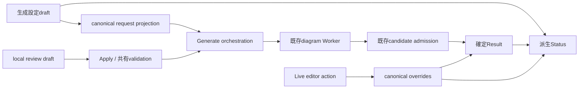

# Issue #602 総合実装計画

状態: Product結果は署名済み。正式authorityへの反映とruntime実装は未完了。
対象: [gbdraw Issue #602](https://github.com/satoshikawato/gbdraw/issues/602)
計画基準: `origin/dev@d457b7189b137185a8dec800819a312c30b969fa`
署名者 / 日付: `satoshikawato` / `2026-09-26`
実装ブランチ: `fix/issue-602-linear-live-edit-20260926`（計画書を含む既存ブランチをS01–S07で継続使用）
リモート: `origin/fix/issue-602-linear-live-edit-20260926`

本書は実装対象、責務、順序、受入条件の所有文書である。実作業の指示は[セッション一覧](INSTRUCTION_PROMPTS/README.md)、採択された本文と機械表現は[署名済みProduct Decisions](06_SIGNED_PRODUCT_DECISIONS.md)に置く。Decision Packは選択肢と判断根拠を保存する。署名記録と実装計画はactive Product authorityの代替ではない。

## 1. 解決する問題と採択結果

gbdraw Webはゲノム図を生成し、生成後の図も編集できる。Linearの共有行は複数recordを同じ水平行へ配置する機能である。Resultは最後に正常確定した図、生成設定draftは次のGenerateへ渡す編集可能な設定、review draftはApply前のローカル選択を意味する。

| Pack | Concern / revision | 採択 | 完成時の結果 |
| --- | --- | --- | --- |
| [01](01_METADATA_VISIBILITY_DECISION_PACK.md) | `linear.record-label-auto-visibility` / 2 | B / AUTO-FRESH-RESET-WITH-DISCLOSURE | AccessionとLengthのfresh/resetはAutoを維持。共有行による図全体の非表示理由とShowへの変更先を説明 |
| [02](02_DEFINITION_DEFAULT_DECISION_PACK.md) | `linear.definition-display` / 2 | A / D1-B-WEB-LOCKED-FRESH; retain D2-P and D3-A | Webのfresh/resetはLock Definition Column ON。保存OFF/ON、CLI/Python既定、Subtitle/Repliconを維持 |
| [03](03_EDIT_FEEDBACK_DECISION_PACK.md) | `web.edit-application-feedback` / 1 | A / DERIVED-APPLICATION-STATUS | 操作単位の適用説明と、現在Resultに対する生成設定のPendingを事実から表示 |
| [04](04_COMPACT_EDITOR_DECISION_PACK.md) | `web.editor.compact-presentation` / 1 | A / DOCKED-COMPACT-EDITOR | 狭いPreviewは図とEditorを上下に配置。同じResultと即時編集を使う |
| [05](05_COMPACT_ALIGNMENT_REVIEW_DECISION_PACK.md) | `web.similarity-alignment.review-presentation` / 1 | A / DOCKED-COMPACT-ALIGNMENT-REVIEW | 狭いPreviewは図とreviewを上下に配置。候補draft、Apply/Cancel、失敗retryを維持 |

メタデータを共有行でも既定Showにする案、全設定の自動Generate、第二renderer、per-row Auto、mini-preview、新保存schemaは採択されていない。図の空間配分は変えるが科学データや候補選択規則は変えない。

## 2. 調査基準と既存authority

最初のruntime作業前に最新origin/devへ再照合する。以下は計画基準SHAの事実であり、将来のHEADにそのまま当てはめない。

- Autoは、実際に描画するshared rowが一つでもあれば図全体でHiddenになる。AccessionとLengthは独立、明示Show/Hideはlayout変更で書き換わらない。休眠した行設定は無視する。`docs/REFERENCE/web-app.md` に明記されている。
- `PD-OI-024` scenario 1のD1-AはLock OFF既定を選択している。02-AはWeb fresh/reset部分だけを改訂し、D2-PのSubtitle保持、D3-AのReplicon/Organelle制御をすべて残す。
- Lock ONでもrecord translationでDefinitionがずれる旧不具合は修正済み。`diagrams/linear/assemble.py` は最終translation後に共通列原点を決め、`layout/linear.py` とbuilder/collision planningで配置を共用している。default変更のために座標処理を作り直さない。
- `gbdraw/web/CLAUDE.md` は右の単一feature/label/legend編集の即時canonical commitと必要時の自動rerenderを規定する。左PaletteにはInstant Previewがあり、右Alignment reviewにはApply前draftがある。パネルの左右だけでは適用時点を分類できない。
- `PD-OI-016` / `OIC-013` はGenerate失敗/Cancel/stale時に最後のResultとcommitted requestを保持する。`PD-OI-032` はtarget-only操作と他のpending設定を分離する。`PD-OI-031/034` はalignmentのresolved自動Apply、明示review、local編集、batch validation、retryを規定する。
- **既存の390px例外:** `PD-OI-035` scenario 2 / RETAIN_MOBILE_PALETTE_COVERAGEは、開いたreviewによるPreview遮蔽と390pxでの同時canvas操作の退役を許容する。05-Aは図を見ながら操作できる結果を明示的に採択している。S00で旧390px例外の適用範囲を終了し、05-Aの新しい可視領域・canvas操作を正式authorityに結び付ける。identity、一覧keyboard選択、Skip、描画されない候補、focus、overlay非保存等の独立寄与は保持する。旧例外と新しい必須結果を競合するactive記述として残さない。
- `tools/web-product-decisions.json` のBD storeは基準SHAでは空。存在しないBD番号を使わない。unmapped concernの正式記録先は既存の `docs/internal/OPTION_INTEGRITY_PRODUCT_CONTRACT.md`。
- Issueが参照する `docs/internal/GUI_AUDIT_DEV_20260926.md` は基準SHAに存在しない。取得していない監査内容を実測証拠として扱わない。

### 証拠と限界

| 基準SHAでの確認 | 結果 | 証明範囲 |
| --- | --- | --- |
| Node: visibility / typography / drawer / session-draft tests | 7 passed | 現行解決規則・owner・draft分離。新UIの成功証明ではない |
| Python: Definition alignment、非browser | 45 passed、15 deselected | 現行座標修正。browser測定は別途必要 |
| Chromium: mobile Editor overlays MOB1 J44 | 1 passed | 390×844の現行drawer。既存テストは操作遮蔽を許容 |

390×844ではPreview幅374pxに対しEditor幅334px、高さ473.5px。横幅の約89%を覆い、toolbar6操作の中心pointer hitが遮られた。[実測JSON](evidence/mobile-editor-open.json)と[画像](evidence/mobile-editor-open.png)を保存している。reviewの390px baseline、変更後のStatus、dockの使いやすさは未検証である。

baselineの再現commandは以下。使用Sessionは `lambda_basic_linear.gbdraw-session.json`。

```bash
node --test tests/web/linear-label-visibility.test.mjs tests/web/linear-typography.test.mjs tests/web/right-drawer.test.mjs tests/web/session-draft-authority.test.mjs
python -m pytest tests/test_linear_definition_alignment.py -q -m 'not browser'
GBDRAW_WEB_TEST_PORT=4186 npx playwright test tests/web/right-drawer.playwright.spec.js --grep 'mobile Editor overlays MOB1 J44' --workers=1
```

4186は計測時の空きport。現在の環境ではavailable portを確認する。結果再利用時はHEAD/入力/環境が一致する範囲だけを採用する。

## 3. 製品挙動の実装契約

### 3.1 メタデータ: Autoを維持して説明する

fresh/resetのAccessionとLengthは各Auto。共有行が実際にrenderされる場合、Autoのfieldだけを対象に、Linear LayoutとRecord Labelsへ理由・field名・図全体の非表示範囲を表示する。説明は「次の成功Generate」のdraft結果を示し、現在Resultが非表示だと推測しない。

Record Labelsへの導線はdisclosureを開き、対象selectへscroll/focusする。同じ操作でShowへ変更したりGenerateしたりしない。明示Show/Hideは書き換えない。共有行解除でAutoがShownに戻ることも同じresolverから説明する。説明やnavigationはHistoryを作らない。

### 3.2 Definition: Web fresh/resetだけをLock ONへ変更

default factoryを唯一の値の所有者にする。保存されたtrue/falseと、対応済み旧Sessionの省略意味は保持し、LoadだけでResultを再描画しない。現在の省略意味をpositive fixtureで確認してからfactoryを変える。malformed current inputを新defaultで修復しない。

Lock OFFは共通幅中央とrow追従を維持。Lock ONは最終sequence配置に対する共通左端とconfigured gap。CLI/Pythonの省略default、text_anchorの受入範囲、row共通/record固有のラベル、手入力/保存Subtitle、Show Replicon既定falseと命名順を保持する。Linear LayoutではON/OFFの違いとGenerate適用を常時短く説明する。

### 3.3 編集: 適用状態と生成設定の差を分ける

| 操作 | 表示分類 | 確定条件 |
| --- | --- | --- |
| Scale、crop、track slots等 | Applies on Generate | 正常なGenerateによるResult置換 |
| 単一feature/label/legend、Palette Instant Preview | Live edit | owning actionがcanonical overrideを即時commit。必要時のrerender中/失敗も示す |
| Alignment review等 | Apply required | local draftをApplyし、検証/renderが成功 |

生成設定PendingとLive applying/errorは同時に成立する。ひとつのdirty flagへ統合しない。右の色編集が成功しても未適用のscale変更のPendingは消えない。

Statusは現在modeの有効な描画意味を比較する。tab/scroll/focus/未使用modeのprofile/保存だけのメタデータはPendingにしない。AutoとShowは選択として保存し、現在の実効booleanが同じならそれだけでPendingにしない。row変更時にresolverを再評価する。根拠不足はunknown、無効設定はinvalidとし、Appliedと表示しない。

Generate前に配置再計算とzoom reset、Undoの復帰を説明する。既存のcanonical色/ラベル/visibility/対応済みlayoutの継承を守る。全DOM座標や手動位置を無条件に保存する保証は追加しない。Exportは現在Result、SaveはResultとdraftの両方を保存する。どちらもPendingを勝手に適用しない。

### 3.4 狭いPreview: 同じ図とパネルを上下に配置

既存40remのPreview container境界を基準にする。wideは現在のside Editor / floating review。狭いPreviewは上段canvas、下段Editorまたはreview。listだけをscrollし、header/Close、Apply/Cancelとcanvas toolbarへ到達できる配置にする。複製SVG、mini-preview、別のmobile editorを作らない。

390×844/740ではsticky headerとGenerate barを差し引き、利用可能幅全体かつ高さ200px以上のcanvasを確保する。短い高さ、landscape、keyboard、200% zoomでは必須操作への到達とscroll回復を保証する。物理的に不可能な画面にも200pxを強制しない。

review開始時は狭い画面のEditorを既存owner経由で閉じ、tabを保持する。review中は理由付きでEditor openをdisable。review終了後は明示reopen可能。open状態の自動復元用mirrorを作らない。reviewの狭い画面での自由dragは退役する。wideのdrag、非モーダルcanvas、local Select/Skip/方向設定、Apply前draft、失敗retryは維持する。

## 4. 実装アーキテクチャ



### Canonical比較を同じ所有者へ集約

`services/session-request.js` の既存record/track/config正規化から軽量な生成意味のprojectionを抽出し、request組立とStatus比較で共用する。仮名 `projectGenerationIntent` は設計上の候補であり、実装で同等の既存境界を再利用してよい。UIへ第二のrender-field一覧やenum/range/default規則を作らない。

比較基準は既存artifact ownerに所属させる。保存Resultのrequestと保存/commitされたeditor overridesを基礎にし、現在draftで基準を進めない。正常Generate、Session restore、Undo/Redoは該当artifactの基準を選ぶ。Live commitは実際に適用した範囲だけを更新する。Loadしたpending SessionはResultとactive draftの差を再構築する。canonical requestだけで表現できない適用済み編集は既存editor表現から補う。根拠がない場合はunknownにする。

Fileは既存resource backing/tokenとbinding identityで比較し、同名/同サイズだけで同一扱いしない。StatusのためにFile内容の読取り、全量hash、base64化、SVG/checkpoint cloneを行わない。publication用の `compareCanonicalRenderRequests` を全keystrokeで実行しない。Statusは `buildCanonicalRenderRequest` を呼ぶ新たなprivileged operatorにならない。

`app/generation-status.js` 等のfocused moduleは表示の導出とwiringに限定する。部分Pendingは担当範囲として残すか、共用projectionへ接続し、重複したglobal Pendingを除去する。Result/History/保存schemaをStatusのために増設しない。

### 画面配置と副作用を分離

`app/right-drawer.js` はvisibility/tab/action owner。`app/similarity-alignment.js` は候補draft/Apply/Cancel/retry owner。responsive配置はcanonicalデータや候補を変更しない。app-setupのpalette drag/clampはfocused helperへ必要最小限に寄せ、旧処理を同時に除去する。generic overlay managerを追加しない。

CSS/containerとdvh/safe-areaを優先し、実ブラウザで不足する場合だけ既存lifecycleにviewport/ResizeObserver測定を加える。狭い判定のJSとCSSを二重に所有させない。幅変更時に候補resolve、Python render、LOSAT、History actionを起動しない。

### Principlesを検証可能な制約にする

| 原則 | 適用とレビュー観点 |
| --- | --- |
| SRP | default・projection・Generate・Result admission・live action・review・配置・表示をそれぞれ一つの責務に置く |
| OCP | 既存tri-state、Lock boolean、artifact lifecycleの拡張点を使う。issue番号別分岐を加えない |
| LSP | live action、typed request、supported readerを同じ保証で利用できる。保存値/省略意味をfactory変更で破らない |
| ISP | Status/presentationは必要なintent・artifact・action stateだけを受け、Worker/ファイルI/O APIを持たない |
| DIP | UIはcanonical serviceとowning actionsへ依存し、DOMの色/textから確定状態を逆推定しない |
| KISS | Auto説明、一つのdefault変更、派生Status、同一panelのresponsive配置で解決 |
| DRY | projection/resolverを共用。重複global flag、旧位置計算、並行生成経路を除去 |
| YAGNI | 全設定自動Generate、汎用変更イベント基盤、新collision engine、新schema/互換path、外部sheet依存を加えない |

registered request/admission ownersとcanonical edgesは維持する。通常変更は変更範囲のowner/path非増加、CB追加なし、旧処理除去を簡潔に示す。新しい私的moduleは新semantic ownerと同義ではない。正のarchitecture debt等の例外だけcomplete OE/PE/CBと別maintainer判断へ進む。

## 5. セッション構成とbranch workflow

全セッションは直列に実行し、他者の変更をpreserveする。各指示書はその使命と選択済み結果を自分の本文にも持つ。検証済みの同一入力/環境/HEADの証拠は再利用し、前段の成功を無条件に将来HEADへ流用しない。

| Session | 所有範囲 | 開始条件 | 終了時の成果 |
| --- | --- | --- | --- |
| [S00](INSTRUCTION_PROMPTS/SESSION_00_AUTHORITY.md) | 署名回答の正式authority serializationのみ | 署名記録とbase allowlistを確認 | authority-only候補、receipt一致確認、merge待ち境界 |
| [S01](INSTRUCTION_PROMPTS/SESSION_01_AUTO_DISCLOSURE.md) | 01-BのAuto説明とLabels導線 | S00 authorityがorigin/devへmerge | default/解決規則不変、説明/browser証拠 |
| [S02](INSTRUCTION_PROMPTS/SESSION_02_DEFINITION_DEFAULT.md) | 02-AのWeb Lock defaultとreader保持 | S01完了、対応authorityあり | fresh/reset ON、保存/CLI/Python不変 |
| [S03](INSTRUCTION_PROMPTS/SESSION_03_CANONICAL_STATUS_PROJECTION.md) | 03-Aの共用projection/適用基準 | S02完了 | request意味一致、artifact/draft比較と履歴/読込証拠 |
| [S04](INSTRUCTION_PROMPTS/SESSION_04_APPLICATION_FEEDBACK.md) | 03-Aの表示/wiring/適用説明 | S03完了 | Pending/live/review分類、Generate/Save/Export説明 |
| [S05](INSTRUCTION_PROMPTS/SESSION_05_COMPACT_EDITOR.md) | 04-AのEditor上下配置 | S04完了 | 同一Editor、可視canvas、pointer/keyboard証拠 |
| [S06](INSTRUCTION_PROMPTS/SESSION_06_COMPACT_ALIGNMENT_REVIEW.md) | 05-Aのreview上下配置とdrawer調停 | S05完了、旧PD-OI-035例外のsupersession済み | draft/retry/focus/resize保持、同時canvas操作 |
| [S07](INSTRUCTION_PROMPTS/SESSION_07_ACCEPTANCE_AND_DOCS.md) | 統合検証、文書、diff review | S01–S06完了 | 受入全項目、required gates、完了handoff |

S00は最新origin/devから `product/issue-602-decisions-20260926` をupstreamなしで作る。authority-only branchには正式Product Contractの変更だけを置き、計画/receipt/evidenceは元の計画checkoutで参照する。計画文書をauthority-only候補へ混ぜない。実装ブランチを保持したまま別worktreeを使う。

実装には、最新origin/devの `d457b7189b137185a8dec800819a312c30b969fa` から作成し、計画書をcommitした既存の `fix/issue-602-linear-live-edit-20260926` を使用する。S01開始時にoriginをfetchし、S00の正式authorityがorigin/devへmerge済みであることを確認してから、そのorigin/devをこの実装ブランチへmergeする。計画commitを保持し、ブランチを作り直したりresetで置換したりしない。S02–S07も前段の変更と証拠を持つ同じブランチを継続する。毎回latest authorityとancestryを確認し、baseのProduct変更が競合する場合は該当範囲だけを再評価する。upstreamとpush先は同名の `origin/fix/issue-602-linear-live-edit-20260926` のみとする。

各セッションを検証済みの一つのlogical commit単位とし、commit前にbranch/upstreamを確認する。publishする場合のremote targetは同名work branchだけ。push/PR/merge/deploy/tagはその時点の明示許可を守る。署名は製品結果の承認であり、外部操作の承認を含まない。候補authorityを含む同じcandidateでruntimeを自己承認しない。

## 6. 受入条件と証拠の担当

| ID | 受入条件 | 主担当 |
| --- | --- | --- |
| V01 | fresh/reset Accession/Lengthが各Auto、1record rowsはShown、shared rendered rowがあればAutoのfieldは図全体でHidden | S01 |
| V02 | Auto/Show/Hide混合、shared row解除、disabled layoutの休眠行、保存選択を維持 | S01 |
| V03 | Layout/Labelsの説明がfield/理由/範囲/次回Generateを特定。導線はfocus/scrollだけで値/Historyを変えない | S01 |
| D01 | Web fresh/reset Lock ON。保存false/trueとsupported旧omission、Load Result、CLI/Python defaultを保持 | S02 |
| D02 | 不均等の正負translation、center/Similarity alignment、単一/共有/混在行で実SVG共通左端とgap。OFFはrow追従 | S02 |
| D03 | Subtitle/Replicon/Organelle/text_anchorの対応範囲、save/load/regenerationを維持 | S02 |
| E01 | scale/crop/slots等の有効差はPending。値を戻す/Undoで解消。tab等はPendingにしない | S03/S04 |
| E02 | Instant Preview、live edit、Apply前draftを分類。Pendingとlive applying/errorが併存 | S04 |
| E03 | Generate成功/失敗/Cancel/stale、Live commit、Undo/Redo、Session restoreでStatus/Resultが一致 | S03/S04 |
| E04 | 同名別Fileを識別。inactive設定を除外、invalid/unknownをAppliedとしない。StatusのWorker/bytes/hash/SVG clone追加ゼロ | S03 |
| E05 | canonical編集継承、Generate再配置/zoom説明、Save/Export意味が実際の結果と一致 | S04/S07 |
| M01 | 390×844/740のEditor/review open時、利用可能幅全体、高さ200px以上の可視canvas。header/barを差し引く | S05/S06 |
| M02 | 390×500、320px幅、844×390、200% zoom、soft keyboardで全必須操作に到達。短い画面はscroll回復 | S05/S06 |
| M03 | canvas/toolbar/toggleのpointer hitと実zoom/pan、候補選択/highlight。panelにボタンが収まるだけでは合格にしない | S05/S06 |
| M04 | resizeでSVG/canonical state/History/draftを変更しない。review時drawer close/tab保持、理由付きdisable、終了後明示reopen | S06 |
| M05 | narrow/wideのfocus/Escape/Close/Apply/Cancel/復帰。非モーダルreviewをfocus trapにしない | S05/S06 |
| G01 | request/科学的内容/identity/export一致。新依存、第二renderer/schema/互換pathゼロ。required gates合格 | S07 |

S01–S06は既存Node/Python/browser fixturesを拡張して意味のある回帰を確認する。S07は同じscenarioの統合継続を確認し、変更のないfocused suiteを理由なく繰り返さない。

## 7. 検証・文書・完了条件

- Web Node: visibility、typography、session-request/draft/active-config、record-display、candidate-render、History、palette、drawer、alignmentの既存 `tests/web/*.test.mjs`。
- Browser: `linear-typography.playwright.spec.js`、`linear-multi-record.playwright.spec.js`、`right-drawer.playwright.spec.js`、`similarity-alignment-ui.playwright.spec.js`、History/Session/active-result contractsを変更範囲で選ぶ。
- Python: `test_linear_definition_alignment.py` 等の既存配置/typed request/Session契約。描画変更があればread-onlyのOutputComparisonを実行。
- Final: Ruff、Web architecture contracts、trusted-base checker、非slow Python tests、buildと既存ci-impactが要求するgates。通常のoffline監査は依存/privacy/Worker lifecycleを変更しない限り追加しない。
- browser準備: Node/Python両Playwrightを確認し、wheelが必要なら通常prepare commandで生成する。生成wheelはcommitしない。port競合は空きportを使い、既存serviceを停止しない。Chromium sandbox失敗は同じcheckを適切なescalationで再実行する。
- 長いtestは少なくとも30分を許容して増分monitorする。tests自身のtimeout assertionは勝手に延長しない。remote CI pollは5分以上の間隔。
- user-facing文書の所有者は `docs/REFERENCE/web-app.md`。既存ページにAuto説明、Lock default、適用タイミング、狭い操作を反映する。新しいpublicページを増やさない。Gallery tutorialが直接affectedなら該当skillとgeneratorを使い、最小fixtureをpublic figureにしない。
- production、tests、docs、generated artifactsを別々にレビューする。`tests/reference_outputs/` は通常read-only。owner-maintained social previewは変更しない。意図したgeometry変更だけ再生成を別途レビューする。

各セッションは元の計画checkoutまたはruntime branchの `results/SXX.md` にbase/head、authority、変更対象、command/result、受入ID、visual observations、owner/path証拠、次の開始条件を記録する。authority-only branchにはこのhandoffを混ぜない。完成は全acceptanceとrequired gatesの確認後に宣言する。

## Proposed planning commit

Title: `docs: record signed decisions and session plans for issue 602`

Summary: Preserve Auto defaults, plan locked Web definitions and derived edit feedback, and separate compact Editor and alignment review work into reproducible implementation sessions.
