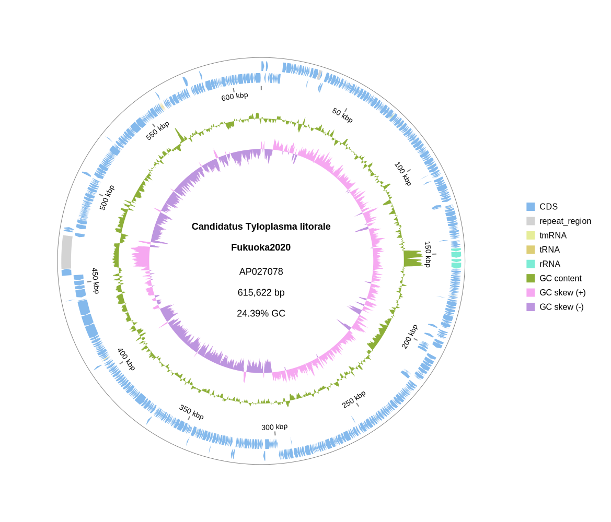
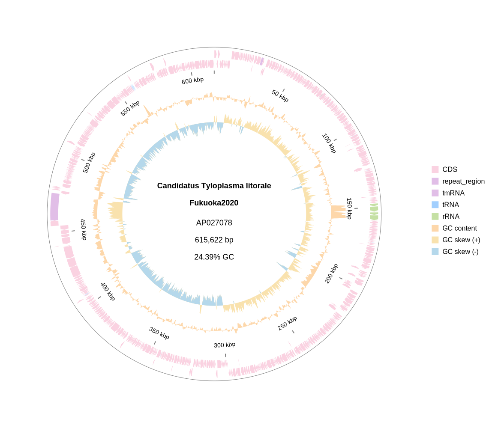

# Color palette reference

This page is generated from [`gbdraw/data/color_palettes.toml`](../gbdraw/data/color_palettes.toml) by `python tools/generate_palette_page.py`. Choose a palette with `-p/--palette <name>`. The TOML file is the complete source of truth for every semantic color.

gbdraw currently provides **55 palettes**.

## Interactive Circular preview

Open the [Circular Palette Explorer](https://gbdraw.app/gallery/palettes/) to choose a palette and recolor one full-size SVG immediately. The explorer keeps the diagram geometry fixed and loads the palette values generated from the TOML source.

## Representative full-size examples

### `default`


### `ajisai`




### `soft_pastels`




## Primary color values

The table keeps the most frequently compared roles visible. Open the TOML source for `tmRNA`, `ncRNA`, repeat, default, and collinear-block values.

| Palette | CDS | rRNA | tRNA | Skew high | Skew low | GC content | Match maximum |
| --- | --- | --- | --- | --- | --- | --- | --- |
| `default` | <span style="color:#54bcf8">■</span> `#54bcf8` | <span style="color:#71ee7d">■</span> `#71ee7d` | <span style="color:#e8b441">■</span> `#e8b441` | <span style="color:#6dded3">■</span> `#6dded3` | <span style="color:#ad72e3">■</span> `#ad72e3` | <span style="color:#a1a1a1">■</span> `#a1a1a1` | <span style="color:#FF7272">■</span> `#FF7272` |
| `mint` | <span style="color:#9cd9cf">■</span> `#9cd9cf` | <span style="color:#febf77">■</span> `#febf77` | <span style="color:#e8b441">■</span> `#e8b441` | <span style="color:#80b1d3">■</span> `#80b1d3` | <span style="color:#c7dfef">■</span> `#c7dfef` | <span style="color:#a1a1a1">■</span> `#a1a1a1` | <span style="color:#6ca5ce">■</span> `#6ca5ce` |
| `orange` | <span style="color:#fba651">■</span> `#fba651` | <span style="color:#2b80b9">■</span> `#2b80b9` | <span style="color:#9cd9cf">■</span> `#9cd9cf` | <span style="color:#87b5d6">■</span> `#87b5d6` | <span style="color:#cbe1f1">■</span> `#cbe1f1` | <span style="color:#a1a1a1">■</span> `#a1a1a1` | <span style="color:#6ca5ce">■</span> `#6ca5ce` |
| `soil` | <span style="color:#c6a76c">■</span> `#c6a76c` | <span style="color:#5cbc93">■</span> `#5cbc93` | <span style="color:#b2d1eb">■</span> `#b2d1eb` | <span style="color:#80b1d3">■</span> `#80b1d3` | <span style="color:#c9e0f0">■</span> `#c9e0f0` | <span style="color:#a1a1a1">■</span> `#a1a1a1` | <span style="color:#9c9288">■</span> `#9c9288` |
| `spring` | <span style="color:#dabcff">■</span> `#dabcff` | <span style="color:#80b1d3">■</span> `#80b1d3` | <span style="color:#9cd9cf">■</span> `#9cd9cf` | <span style="color:#8dd3c7">■</span> `#8dd3c7` | <span style="color:#d1ebe6">■</span> `#d1ebe6` | <span style="color:#a1a1a1">■</span> `#a1a1a1` | <span style="color:#82acd3">■</span> `#82acd3` |
| `ajisai` | <span style="color:#84b9ec">■</span> `#84b9ec` | <span style="color:#7cecd5">■</span> `#7cecd5` | <span style="color:#ddce76">■</span> `#ddce76` | <span style="color:#f6a8f1">■</span> `#f6a8f1` | <span style="color:#bd96df">■</span> `#bd96df` | <span style="color:#8daf38">■</span> `#8daf38` | <span style="color:#86c293">■</span> `#86c293` |
| `alpine_retreat` | <span style="color:#2b4865">■</span> `#2b4865` | <span style="color:#bad4f5">■</span> `#bad4f5` | <span style="color:#bac7e8">■</span> `#bac7e8` | <span style="color:#1d3557">■</span> `#1d3557` | <span style="color:#a8dadc">■</span> `#a8dadc` | <span style="color:#457b9d">■</span> `#457b9d` | <span style="color:#e9967a">■</span> `#e9967a` |
| `arctic` | <span style="color:#5a5a66">■</span> `#5a5a66` | <span style="color:#accbe1">■</span> `#accbe1` | <span style="color:#4d8c57">■</span> `#4d8c57` | <span style="color:#2d3e50">■</span> `#2d3e50` | <span style="color:#a0b9d0">■</span> `#a0b9d0` | <span style="color:#3d7199">■</span> `#3d7199` | <span style="color:#b2c4d6">■</span> `#b2c4d6` |
| `arctic_dawn` | <span style="color:#bdd4e7">■</span> `#bdd4e7` | <span style="color:#89a1c3">■</span> `#89a1c3` | <span style="color:#5e7bb0">■</span> `#5e7bb0` | <span style="color:#3c5379">■</span> `#3c5379` | <span style="color:#a1b8d6">■</span> `#a1b8d6` | <span style="color:#738aae">■</span> `#738aae` | <span style="color:#f0a980">■</span> `#f0a980` |
| `autumn` | <span style="color:#f2994a">■</span> `#f2994a` | <span style="color:#56ccf2">■</span> `#56ccf2` | <span style="color:#bb6bd9">■</span> `#bb6bd9` | <span style="color:#333333">■</span> `#333333` | <span style="color:#828282">■</span> `#828282` | <span style="color:#27ae60">■</span> `#27ae60` | <span style="color:#7ac0db">■</span> `#7ac0db` |
| `autumn_harvest` | <span style="color:#8b4513">■</span> `#8b4513` | <span style="color:#ffac1c">■</span> `#ffac1c` | <span style="color:#ffa07a">■</span> `#ffa07a` | <span style="color:#a0522d">■</span> `#a0522d` | <span style="color:#deb887">■</span> `#deb887` | <span style="color:#cd853f">■</span> `#cd853f` | <span style="color:#e2b85c">■</span> `#e2b85c` |
| `berry_field` | <span style="color:#6b2d5c">■</span> `#6b2d5c` | <span style="color:#d892e2">■</span> `#d892e2` | <span style="color:#b65775">■</span> `#b65775` | <span style="color:#331832">■</span> `#331832` | <span style="color:#966b9d">■</span> `#966b9d` | <span style="color:#503b31">■</span> `#503b31` | <span style="color:#93b98f">■</span> `#93b98f` |
| `citrine_verdure` | <span style="color:#94df5f">■</span> `#94df5f` | <span style="color:#f8b305">■</span> `#f8b305` | <span style="color:#5caceb">■</span> `#5caceb` | <span style="color:#394a2f">■</span> `#394a2f` | <span style="color:#a5b893">■</span> `#a5b893` | <span style="color:#afd73f">■</span> `#afd73f` | <span style="color:#b2c4d6">■</span> `#b2c4d6` |
| `citrus_grove` | <span style="color:#ffc13b">■</span> `#ffc13b` | <span style="color:#ff6b35">■</span> `#ff6b35` | <span style="color:#77cf11">■</span> `#77cf11` | <span style="color:#324a1f">■</span> `#324a1f` | <span style="color:#d3e4cd">■</span> `#d3e4cd` | <span style="color:#a3be8c">■</span> `#a3be8c` | <span style="color:#88af84">■</span> `#88af84` |
| `deep_saturates` | <span style="color:#2f67a0">■</span> `#2f67a0` | <span style="color:#d70000">■</span> `#d70000` | <span style="color:#6cdb6c">■</span> `#6cdb6c` | <span style="color:#e0d951">■</span> `#e0d951` | <span style="color:#7675cb">■</span> `#7675cb` | <span style="color:#5ba277">■</span> `#5ba277` | <span style="color:#FF7272">■</span> `#FF7272` |
| `desert_mirage` | <span style="color:#e3ac9d">■</span> `#e3ac9d` | <span style="color:#ab8c7c">■</span> `#ab8c7c` | <span style="color:#d7a87f">■</span> `#d7a87f` | <span style="color:#a77e65">■</span> `#a77e65` | <span style="color:#cec2b2">■</span> `#cec2b2` | <span style="color:#b39887">■</span> `#b39887` | <span style="color:#6ca5ce">■</span> `#6ca5ce` |
| `dune` | <span style="color:#daac6e">■</span> `#daac6e` | <span style="color:#b26521">■</span> `#b26521` | <span style="color:#70be00">■</span> `#70be00` | <span style="color:#b0adb3">■</span> `#b0adb3` | <span style="color:#6c6357">■</span> `#6c6357` | <span style="color:#99c7da">■</span> `#99c7da` | <span style="color:#99c7da">■</span> `#99c7da` |
| `earth` | <span style="color:#785e2f">■</span> `#785e2f` | <span style="color:#e0c58b">■</span> `#e0c58b` | <span style="color:#b8b159">■</span> `#b8b159` | <span style="color:#56433d">■</span> `#56433d` | <span style="color:#a79b82">■</span> `#a79b82` | <span style="color:#5d663d">■</span> `#5d663d` | <span style="color:#dcd7a0">■</span> `#dcd7a0` |
| `earth_and_clay` | <span style="color:#b87333">■</span> `#b87333` | <span style="color:#654321">■</span> `#654321` | <span style="color:#8a7967">■</span> `#8a7967` | <span style="color:#734a12">■</span> `#734a12` | <span style="color:#d2b48c">■</span> `#d2b48c` | <span style="color:#a0522d">■</span> `#a0522d` | <span style="color:#a4bace">■</span> `#a4bace` |
| `earthtones` | <span style="color:#8a7f8d">■</span> `#8a7f8d` | <span style="color:#a9b6be">■</span> `#a9b6be` | <span style="color:#b6a19e">■</span> `#b6a19e` | <span style="color:#5e5a4e">■</span> `#5e5a4e` | <span style="color:#776c61">■</span> `#776c61` | <span style="color:#9d9280">■</span> `#9d9280` | <span style="color:#ada093">■</span> `#ada093` |
| `edelweiss` | <span style="color:#d5ebe1">■</span> `#d5ebe1` | <span style="color:#eae954">■</span> `#eae954` | <span style="color:#8bb68b">■</span> `#8bb68b` | <span style="color:#6e7f6e">■</span> `#6e7f6e` | <span style="color:#b2c1b2">■</span> `#b2c1b2` | <span style="color:#c9d1c8">■</span> `#c9d1c8` | <span style="color:#8bb68b">■</span> `#8bb68b` |
| `emerald_twilight` | <span style="color:#147517">■</span> `#147517` | <span style="color:#2beda5">■</span> `#2beda5` | <span style="color:#2d6a4f">■</span> `#2d6a4f` | <span style="color:#022d01">■</span> `#022d01` | <span style="color:#88a09e">■</span> `#88a09e` | <span style="color:#3f9f76">■</span> `#3f9f76` | <span style="color:#d2d394">■</span> `#d2d394` |
| `forest` | <span style="color:#609d4b">■</span> `#609d4b` | <span style="color:#ffb132">■</span> `#ffb132` | <span style="color:#baab55">■</span> `#baab55` | <span style="color:#97b8e9">■</span> `#97b8e9` | <span style="color:#6d5435">■</span> `#6d5435` | <span style="color:#ad7557">■</span> `#ad7557` | <span style="color:#97b8e9">■</span> `#97b8e9` |
| `forest_canopy` | <span style="color:#a3be8c">■</span> `#a3be8c` | <span style="color:#88c0d0">■</span> `#88c0d0` | <span style="color:#edbc58">■</span> `#edbc58` | <span style="color:#4c566a">■</span> `#4c566a` | <span style="color:#a1a8a4">■</span> `#a1a8a4` | <span style="color:#70a2df">■</span> `#70a2df` | <span style="color:#88c0d0">■</span> `#88c0d0` |
| `forest_morning` | <span style="color:#48a787">■</span> `#48a787` | <span style="color:#eee8a5">■</span> `#eee8a5` | <span style="color:#e47460">■</span> `#e47460` | <span style="color:#f4c63f">■</span> `#f4c63f` | <span style="color:#e9940b">■</span> `#e9940b` | <span style="color:#5ea3d6">■</span> `#5ea3d6` | <span style="color:#a5bfa1">■</span> `#a5bfa1` |
| `fugaku` | <span style="color:#5f91d3">■</span> `#5f91d3` | <span style="color:#cddbe5">■</span> `#cddbe5` | <span style="color:#6593a6">■</span> `#6593a6` | <span style="color:#6ca2d8">■</span> `#6ca2d8` | <span style="color:#b0ced7">■</span> `#b0ced7` | <span style="color:#a9d4ee">■</span> `#a9d4ee` | <span style="color:#a1b9d1">■</span> `#a1b9d1` |
| `galaxy` | <span style="color:#44506e">■</span> `#44506e` | <span style="color:#adbccc">■</span> `#adbccc` | <span style="color:#6b7b8b">■</span> `#6b7b8b` | <span style="color:#2a3132">■</span> `#2a3132` | <span style="color:#90b1bb">■</span> `#90b1bb` | <span style="color:#9baeb8">■</span> `#9baeb8` | <span style="color:#c2c2d6">■</span> `#c2c2d6` |
| `hearbal_garden` | <span style="color:#addc7f">■</span> `#addc7f` | <span style="color:#acb1e4">■</span> `#acb1e4` | <span style="color:#e6c03a">■</span> `#e6c03a` | <span style="color:#daad62">■</span> `#daad62` | <span style="color:#88a989">■</span> `#88a989` | <span style="color:#cf99c0">■</span> `#cf99c0` | <span style="color:#eb95ce">■</span> `#eb95ce` |
| `kuroshio` | <span style="color:#30609f">■</span> `#30609f` | <span style="color:#99d984">■</span> `#99d984` | <span style="color:#e8b31d">■</span> `#e8b31d` | <span style="color:#aadee9">■</span> `#aadee9` | <span style="color:#6c98bc">■</span> `#6c98bc` | <span style="color:#8fadd1">■</span> `#8fadd1` | <span style="color:#5a83b9">■</span> `#5a83b9` |
| `lavender_fields` | <span style="color:#9892ed">■</span> `#9892ed` | <span style="color:#f1d15b">■</span> `#f1d15b` | <span style="color:#56c268">■</span> `#56c268` | <span style="color:#a4d8a7">■</span> `#a4d8a7` | <span style="color:#5b9e60">■</span> `#5b9e60` | <span style="color:#7daa76">■</span> `#7daa76` | <span style="color:#d8ade2">■</span> `#d8ade2` |
| `majestic_sunrise` | <span style="color:#5992d1">■</span> `#5992d1` | <span style="color:#f96958">■</span> `#f96958` | <span style="color:#87ceeb">■</span> `#87ceeb` | <span style="color:#e5c853">■</span> `#e5c853` | <span style="color:#ef8926">■</span> `#ef8926` | <span style="color:#d54f36">■</span> `#d54f36` | <span style="color:#f08080">■</span> `#f08080` |
| `marine` | <span style="color:#0077be">■</span> `#0077be` | <span style="color:#a5e7ed">■</span> `#a5e7ed` | <span style="color:#009688">■</span> `#009688` | <span style="color:#334d5c">■</span> `#334d5c` | <span style="color:#88b3c7">■</span> `#88b3c7` | <span style="color:#005c5f">■</span> `#005c5f` | <span style="color:#0077be">■</span> `#0077be` |
| `matcha_whispers` | <span style="color:#cbe2b0">■</span> `#cbe2b0` | <span style="color:#89a678">■</span> `#89a678` | <span style="color:#687d68">■</span> `#687d68` | <span style="color:#435f4c">■</span> `#435f4c` | <span style="color:#b0cc99">■</span> `#b0cc99` | <span style="color:#506c42">■</span> `#506c42` | <span style="color:#e1e293">■</span> `#e1e293` |
| `metallic_sheen` | <span style="color:#cacfd0">■</span> `#cacfd0` | <span style="color:#d4af37">■</span> `#d4af37` | <span style="color:#aa4929">■</span> `#aa4929` | <span style="color:#8c7853">■</span> `#8c7853` | <span style="color:#e5e4e2">■</span> `#e5e4e2` | <span style="color:#aaaaaa">■</span> `#aaaaaa` | <span style="color:#aeb7ca">■</span> `#aeb7ca` |
| `metropolitan_blues` | <span style="color:#274c77">■</span> `#274c77` | <span style="color:#accde3">■</span> `#accde3` | <span style="color:#a3cef1">■</span> `#a3cef1` | <span style="color:#102a43">■</span> `#102a43` | <span style="color:#8d93ab">■</span> `#8d93ab` | <span style="color:#2c699a">■</span> `#2c699a` | <span style="color:#e63946">■</span> `#e63946` |
| `misty_mountains` | <span style="color:#708090">■</span> `#708090` | <span style="color:#75aadf">■</span> `#75aadf` | <span style="color:#b0c4de">■</span> `#b0c4de` | <span style="color:#2f4f4f">■</span> `#2f4f4f` | <span style="color:#a9a9a9">■</span> `#a9a9a9` | <span style="color:#696969">■</span> `#696969` | <span style="color:#9bbd91">■</span> `#9bbd91` |
| `oceanic_voyage` | <span style="color:#1a659e">■</span> `#1a659e` | <span style="color:#a2d2ff">■</span> `#a2d2ff` | <span style="color:#ffb91a">■</span> `#ffb91a` | <span style="color:#005377">■</span> `#005377` | <span style="color:#7cb4b8">■</span> `#7cb4b8` | <span style="color:#ff9770">■</span> `#ff9770` | <span style="color:#ff9770">■</span> `#ff9770` |
| `orchid` | <span style="color:#c25792">■</span> `#c25792` | <span style="color:#967be7">■</span> `#967be7` | <span style="color:#ffc134">■</span> `#ffc134` | <span style="color:#5c53a5">■</span> `#5c53a5` | <span style="color:#f4bfe9">■</span> `#f4bfe9` | <span style="color:#569d6a">■</span> `#569d6a` | <span style="color:#d87daf">■</span> `#d87daf` |
| `pbt` | <span style="color:#2c76f9">■</span> `#2c76f9` | <span style="color:#c7e6f4">■</span> `#c7e6f4` | <span style="color:#efee13">■</span> `#efee13` | <span style="color:#acd4f9">■</span> `#acd4f9` | <span style="color:#035384">■</span> `#035384` | <span style="color:#fec514">■</span> `#fec514` | <span style="color:#e1e293">■</span> `#e1e293` |
| `pine_reflection` | <span style="color:#318058">■</span> `#318058` | <span style="color:#d8a789">■</span> `#d8a789` | <span style="color:#75b2b6">■</span> `#75b2b6` | <span style="color:#1c2826">■</span> `#1c2826` | <span style="color:#97a89b">■</span> `#97a89b` | <span style="color:#567572">■</span> `#567572` | <span style="color:#bfc5bf">■</span> `#bfc5bf` |
| `psyche` | <span style="color:#ff4500">■</span> `#ff4500` | <span style="color:#00ced1">■</span> `#00ced1` | <span style="color:#ffd700">■</span> `#ffd700` | <span style="color:#ba55d3">■</span> `#ba55d3` | <span style="color:#ff69b4">■</span> `#ff69b4` | <span style="color:#0000ff">■</span> `#0000ff` | <span style="color:#FF7272">■</span> `#FF7272` |
| `royal_gala` | <span style="color:#dc7078">■</span> `#dc7078` | <span style="color:#b7f173">■</span> `#b7f173` | <span style="color:#da70d6">■</span> `#da70d6` | <span style="color:#eee5b2">■</span> `#eee5b2` | <span style="color:#c7be22">■</span> `#c7be22` | <span style="color:#e4d761">■</span> `#e4d761` | <span style="color:#a5bfa1">■</span> `#a5bfa1` |
| `sakura` | <span style="color:#e1cdff">■</span> `#e1cdff` | <span style="color:#d47658">■</span> `#d47658` | <span style="color:#d8d854">■</span> `#d8d854` | <span style="color:#d3b2bd">■</span> `#d3b2bd` | <span style="color:#91d378">■</span> `#91d378` | <span style="color:#c8e16e">■</span> `#c8e16e` | <span style="color:#6ca5ce">■</span> `#6ca5ce` |
| `savannah` | <span style="color:#e9c77b">■</span> `#e9c77b` | <span style="color:#518e51">■</span> `#518e51` | <span style="color:#6f769e">■</span> `#6f769e` | <span style="color:#746b50">■</span> `#746b50` | <span style="color:#bbcdb4">■</span> `#bbcdb4` | <span style="color:#b4a170">■</span> `#b4a170` | <span style="color:#a5bfa1">■</span> `#a5bfa1` |
| `seaside` | <span style="color:#9cb6e8">■</span> `#9cb6e8` | <span style="color:#4452cb">■</span> `#4452cb` | <span style="color:#9ddfd3">■</span> `#9ddfd3` | <span style="color:#f1e8c0">■</span> `#f1e8c0` | <span style="color:#af9b67">■</span> `#af9b67` | <span style="color:#6fb3b8">■</span> `#6fb3b8` | <span style="color:#6fb3b8">■</span> `#6fb3b8` |
| `soft_pastels` | <span style="color:#fad2e1">■</span> `#fad2e1` | <span style="color:#c5e0a4">■</span> `#c5e0a4` | <span style="color:#a2cffe">■</span> `#a2cffe` | <span style="color:#f9e2ae">■</span> `#f9e2ae` | <span style="color:#b5d8eb">■</span> `#b5d8eb` | <span style="color:#fdd7aa">■</span> `#fdd7aa` | <span style="color:#a091d6">■</span> `#a091d6` |
| `sunset` | <span style="color:#ff9e15">■</span> `#ff9e15` | <span style="color:#ff5515">■</span> `#ff5515` | <span style="color:#a1dab4">■</span> `#a1dab4` | <span style="color:#663d00">■</span> `#663d00` | <span style="color:#ffc68a">■</span> `#ffc68a` | <span style="color:#ffc68a">■</span> `#ffc68a` | <span style="color:#FF7272">■</span> `#FF7272` |
| `sunset_desert` | <span style="color:#f4a261">■</span> `#f4a261` | <span style="color:#e0523f">■</span> `#e0523f` | <span style="color:#2a9d8f">■</span> `#2a9d8f` | <span style="color:#264653">■</span> `#264653` | <span style="color:#e9c46a">■</span> `#e9c46a` | <span style="color:#e76f51">■</span> `#e76f51` | <span style="color:#f4a261">■</span> `#f4a261` |
| `tropical` | <span style="color:#348781">■</span> `#348781` | <span style="color:#78e5e5">■</span> `#78e5e5` | <span style="color:#ffc010">■</span> `#ffc010` | <span style="color:#2d5d34">■</span> `#2d5d34` | <span style="color:#98d9b6">■</span> `#98d9b6` | <span style="color:#f18d9e">■</span> `#f18d9e` | <span style="color:#348781">■</span> `#348781` |
| `tropical_sunset` | <span style="color:#ffaf87">■</span> `#ffaf87` | <span style="color:#d08770">■</span> `#d08770` | <span style="color:#ebcb8b">■</span> `#ebcb8b` | <span style="color:#bf616a">■</span> `#bf616a` | <span style="color:#a3be8c">■</span> `#a3be8c` | <span style="color:#88c0d0">■</span> `#88c0d0` | <span style="color:#d08770">■</span> `#d08770` |
| `urban` | <span style="color:#7a7fa1">■</span> `#7a7fa1` | <span style="color:#adcce9">■</span> `#adcce9` | <span style="color:#c9ada7">■</span> `#c9ada7` | <span style="color:#8ebea0">■</span> `#8ebea0` | <span style="color:#e9e594">■</span> `#e9e594` | <span style="color:#b0c7f0">■</span> `#b0c7f0` | <span style="color:#9a8f97">■</span> `#9a8f97` |
| `loess` | <span style="color:#d7b232">■</span> `#d7b232` | <span style="color:#599045">■</span> `#599045` | <span style="color:#328fd7">■</span> `#328fd7` | <span style="color:#474747">■</span> `#474747` | <span style="color:#d19c7a">■</span> `#d19c7a` | <span style="color:#828282">■</span> `#828282` | <span style="color:#d7b232">■</span> `#d7b232` |
| `vintage_postcard` | <span style="color:#a8a495">■</span> `#a8a495` | <span style="color:#c5c3b5">■</span> `#c5c3b5` | <span style="color:#e5e3de">■</span> `#e5e3de` | <span style="color:#8c8a7f">■</span> `#8c8a7f` | <span style="color:#b2afa4">■</span> `#b2afa4` | <span style="color:#d8d7cd">■</span> `#d8d7cd` | <span style="color:#a8a495">■</span> `#a8a495` |
| `volcano` | <span style="color:#e28b85">■</span> `#e28b85` | <span style="color:#ffd84c">■</span> `#ffd84c` | <span style="color:#a0522d">■</span> `#a0522d` | <span style="color:#772403">■</span> `#772403` | <span style="color:#ffad60">■</span> `#ffad60` | <span style="color:#d13c31">■</span> `#d13c31` | <span style="color:#d13c31">■</span> `#d13c31` |
| `zen` | <span style="color:#a0a5a9">■</span> `#a0a5a9` | <span style="color:#d8dfe5">■</span> `#d8dfe5` | <span style="color:#40807b">■</span> `#40807b` | <span style="color:#68776d">■</span> `#68776d` | <span style="color:#d4d4d4">■</span> `#d4d4d4` | <span style="color:#87919e">■</span> `#87919e` | <span style="color:#87919e">■</span> `#87919e` |

## Reproduce the images

```bash
python tools/reproduce_examples.py --figure palette_circular_default
python tools/generate_palette_explorer_assets.py --source-svg _reproduced/examples/AP027078_tuckin_separate_strands_default.svg
```

The explorer stores one Circular SVG plus the TOML-derived palette definitions. Only the three representative Circular/Linear pairs above are retained as standalone examples.

## Accessibility

Palette names describe appearance, not a guaranteed accessibility grade. Check contrast against the final background and at the intended print size. Do not encode a biological distinction by color alone: combine color with labels, track position, feature shape, stroke, or another redundant cue. For pairwise matches and quantitative tracks, verify that both endpoints and intermediate values remain distinguishable in the final export medium.
