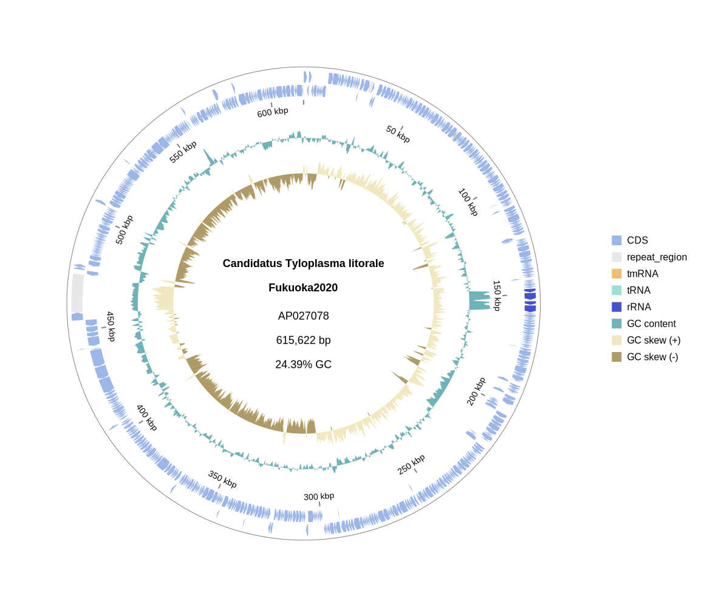
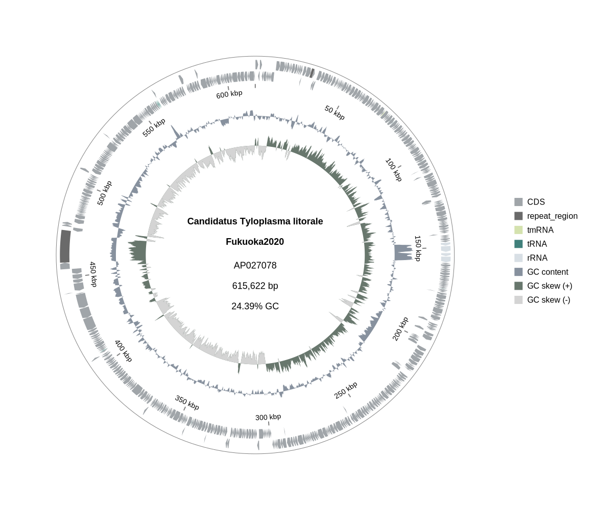

# Color palette examples

`gbdraw` ships with a total of 55 color palettes. Choose a palette with **`-p/--palette <name>`** or override individual colours via TSV files.

## default

Expand to see the color codes

| feature type | color code |
| ------ | ------- |
| CDS | #89d1fa |
| rRNA | #71ee7d |
| tRNA | #e8b441 |
| tmRNA | #ded44e |
| ncRNA | #c4fac3 |
| repeat_region | #d3d3d3 |
| misc_feature | #d3d3d3 |
| default | #d3d3d3 |
| skew_high | #6dded3 |
| skew_low | #ad72e3 |
| gc_content | #a1a1a1 |
| pairwise_match | #d3d3d3 |
| pairwise_match_min | #FFE7E7 |
| pairwise_match_max | #FF7272 |

### Circular mode

### Linear mode

## mint

Expand to see the color codes

| feature type | color code |
| ------ | ------- |
| CDS | #9cd9cf |
| rRNA | #febf77 |
| tRNA | #e8b441 |
| tmRNA | #e1cdff |
| ncRNA | #c4fac3 |
| repeat_region | #d3d3d3 |
| misc_feature | #d3d3d3 |
| default | #d3d3d3 |
| skew_high | #80b1d3 |
| skew_low | #c7dfef |
| gc_content | #a1a1a1 |
| pairwise_match | #d3d3d3 |
| pairwise_match_min | #e0f2f1 |
| pairwise_match_max | #6ca5ce |

### Circular mode

### Linear mode

## orange

Expand to see the color codes

| feature type | color code |
| ------ | ------- |
| CDS | #fba651 |
| rRNA | #2b80b9 |
| tRNA | #9cd9cf |
| tmRNA | #dabcff |
| ncRNA | #c4fac3 |
| repeat_region | #d3d3d3 |
| misc_feature | #d3d3d3 |
| default | #d3d3d3 |
| skew_high | #87b5d6 |
| skew_low | #cbe1f1 |
| gc_content | #a1a1a1 |
| pairwise_match | #d3d3d3 |
| pairwise_match_min | #e0f2f1 |
| pairwise_match_max | #6ca5ce |

### Circular mode

### Linear mode

## soil

Expand to see the color codes

| feature type | color code |
| ------ | ------- |
| CDS | #c6a76c |
| rRNA | #5cbc93 |
| tRNA | #b2d1eb |
| tmRNA | #e1cdff |
| ncRNA | #c4fac3 |
| repeat_region | #d3d3d3 |
| misc_feature | #d3d3d3 |
| default | #d3d3d3 |
| skew_high | #80b1d3 |
| skew_low | #c9e0f0 |
| gc_content | #a1a1a1 |
| pairwise_match | #d3d3d3 |
| pairwise_match_min | #f1ebe6 |
| pairwise_match_max | #9c9288 |

### Circular mode

### Linear mode

## spring

Expand to see the color codes

| feature type | color code |
| ------ | ------- |
| CDS | #dabcff |
| rRNA | #80b1d3 |
| tRNA | #9cd9cf |
| tmRNA | #fba651 |
| ncRNA | #c4fac3 |
| repeat_region | #d3d3d3 |
| misc_feature | #d3d3d3 |
| default | #d3d3d3 |
| skew_high | #8dd3c7 |
| skew_low | #d1ebe6 |
| gc_content | #a1a1a1 |
| pairwise_match | #d3d3d3 |
| pairwise_match_min | #e0ebfc |
| pairwise_match_max | #82acd3 |

### Circular mode

### Linear mode

## ajisai

Expand to see the color codes

| feature type | color code |
| ------ | ------- |
| CDS | #84b9ec |
| rRNA | #7cecd5 |
| tRNA | #ddce76 |
| tmRNA | #e6ed99 |
| repeat_region | #d3d3d3 |
| misc_feature | #d3d3d3 |
| default | #d3d3d3 |
| skew_high | #f6a8f1 |
| skew_low | #bd96df |
| gc_content | #8daf38 |
| pairwise_match | #cfdcf0 |
| pairwise_match_min | #f0f8e7 |
| pairwise_match_max | #86c293 |

### Circular mode

### Linear mode

## tropical

## alpine_retreat

Expand to see the color codes

| feature type | color code |
| ------ | ------- |
| CDS | #2b4865 |
| rRNA | #bad4f5 |
| tRNA | #bac7e8 |
| tmRNA | #91bced |
| repeat_region | #f0f4f8 |
| misc_feature | #f0f4f8 |
| default | #f0f4f8 |
| skew_high | #1d3557 |
| skew_low | #a8dadc |
| gc_content | #457b9d |
| pairwise_match | #f4a261 |
| pairwise_match_min | #fdf0e9 |
| pairwise_match_max | #e9967a |

### Circular mode

### Linear mode

## arctic

Expand to see the color codes

| feature type | color code |
| ------ | ------- |
| CDS | #5a5a66 |
| rRNA | #accbe1 |
| tRNA | #4d8c57 |
| tmRNA | #d1f5c7 |
| repeat_region | #d3d3d3 |
| misc_feature | #d3d3d3 |
| default | #d3d3d3 |
| skew_high | #2d3e50 |
| skew_low | #a0b9d0 |
| gc_content | #3d7199 |
| pairwise_match | #b2c4d6 |
| pairwise_match_min | #eaf0f5 |
| pairwise_match_max | #b2c4d6 |

### Circular mode

### Linear mode

## arctic_dawn

Expand to see the color codes

| feature type | color code |
| ------ | ------- |
| CDS | #bdd4e7 |
| rRNA | #89a1c3 |
| tRNA | #5e7bb0 |
| tmRNA | #e5ecf5 |
| repeat_region | #d3d3d3 |
| misc_feature | #d3d3d3 |
| default | #d3d3d3 |
| skew_high | #3c5379 |
| skew_low | #a1b8d6 |
| gc_content | #738aae |
| pairwise_match | #dce1eb |
| pairwise_match_min | #ffede3 |
| pairwise_match_max | #f0a980 |

### Circular mode

### Linear mode

## autumn

Expand to see the color codes

| feature type | color code |
| ------ | ------- |
| CDS | #f2994a |
| rRNA | #56ccf2 |
| tRNA | #bb6bd9 |
| tmRNA | #fcdafa |
| repeat_region | #d3d3d3 |
| misc_feature | #d3d3d3 |
| default | #d3d3d3 |
| skew_high | #333333 |
| skew_low | #828282 |
| gc_content | #27ae60 |
| pairwise_match | #f2c94c |
| pairwise_match_min | #e0fbff |
| pairwise_match_max | #7ac0db |

### Circular mode

### Linear mode

## autumn_harvest

Expand to see the color codes

| feature type | color code |
| ------ | ------- |
| CDS | #8b4513 |
| rRNA | #ffac1c |
| tRNA | #ffa07a |
| tmRNA | #f0e68c |
| repeat_region | #d3d3d3 |
| misc_feature | #d3d3d3 |
| default | #d3d3d3 |
| skew_high | #a0522d |
| skew_low | #deb887 |
| gc_content | #cd853f |
| pairwise_match | #e9967a |
| pairwise_match_min | #ebf5df |
| pairwise_match_max | #e2b85c |

### Circular mode

### Linear mode

## berry_field

Expand to see the color codes

| feature type | color code |
| ------ | ------- |
| CDS | #6b2d5c |
| rRNA | #d892e2 |
| tRNA | #b65775 |
| tmRNA | #edbcd7 |
| ncRNA | #ccecf8 |
| repeat_region | #d3d3d3 |
| misc_feature | #d3d3d3 |
| default | #d3d3d3 |
| skew_high | #331832 |
| skew_low | #966b9d |
| gc_content | #503b31 |
| pairwise_match | #c4dbc7 |
| pairwise_match_min | #e8fced |
| pairwise_match_max | #93b98f |

### Circular mode

### Linear mode

## citrine_verdure

Expand to see the color codes

| feature type | color code |
| ------ | ------- |
| CDS | #94df5f |
| rRNA | #f8b305 |
| tRNA | #5caceb |
| tmRNA | #f39bf2 |
| repeat_region | #f0f8e7 |
| misc_feature | #f0f8e7 |
| default | #f0f8e7 |
| skew_high | #394a2f |
| skew_low | #a5b893 |
| gc_content | #afd73f |
| pairwise_match | #b9cc90 |
| pairwise_match_min | #eaf0f5 |
| pairwise_match_max | #b2c4d6 |

### Circular mode

### Linear mode

## citrus_grove

Expand to see the color codes

| feature type | color code |
| ------ | ------- |
| CDS | #ffc13b |
| rRNA | #ff6b35 |
| tRNA | #77cf11 |
| tmRNA | #afde79 |
| repeat_region | #e0e0e0 |
| misc_feature | #e0e0e0 |
| default | #e0e0e0 |
| skew_high | #324a1f |
| skew_low | #d3e4cd |
| gc_content | #a3be8c |
| pairwise_match | #ebf5df |
| pairwise_match_min | #dfffe4 |
| pairwise_match_max | #88af84 |

### Circular mode

### Linear mode

## deep_saturates

Expand to see the color codes

| feature type | color code |
| ------ | ------- |
| CDS | #2f67a0 |
| rRNA | #d70000 |
| tRNA | #6cdb6c |
| tmRNA | #4b0082 |
| repeat_region | #afafaf |
| misc_feature | #afafaf |
| default | #afafaf |
| skew_high | #e0d951 |
| skew_low | #7675cb |
| gc_content | #5ba277 |
| pairwise_match | #afafaf |
| pairwise_match_min | #FFE7E7 |
| pairwise_match_max | #FF7272 |

### Circular mode

### Linear mode

## desert_mirage

Expand to see the color codes

| feature type | color code |
| ------ | ------- |
| CDS | #e3ac9d |
| rRNA | #ab8c7c |
| tRNA | #d7a87f |
| tmRNA | #ede0d4 |
| repeat_region | #c0c0c0 |
| misc_feature | #c0c0c0 |
| default | #c0c0c0 |
| skew_high | #a77e65 |
| skew_low | #cec2b2 |
| gc_content | #b39887 |
| pairwise_match | #f4e3d7 |
| pairwise_match_min | #e0f2f1 |
| pairwise_match_max | #6ca5ce |

### Circular mode

### Linear mode

## dune

Expand to see the color codes

| feature type | color code |
| ------ | ------- |
| CDS | #daac6e |
| rRNA | #b26521 |
| tRNA | #70be00 |
| tmRNA | #afd17d |
| repeat_region | #d3d3d3 |
| misc_feature | #d3d3d3 |
| default | #d3d3d3 |
| skew_high | #b0adb3 |
| skew_low | #6c6357 |
| gc_content | #99c7da |
| pairwise_match | #cfdcf0 |
| pairwise_match_min | #cfdcf0 |
| pairwise_match_max | #99c7da |

### Circular mode

### Linear mode

## earth

Expand to see the color codes

| feature type | color code |
| ------ | ------- |
| CDS | #785e2f |
| rRNA | #e0c58b |
| tRNA | #b8b159 |
| tmRNA | #ebe59b |
| repeat_region | #eaeaea |
| misc_feature | #eaeaea |
| default | #eaeaea |
| skew_high | #56433d |
| skew_low | #a79b82 |
| gc_content | #5d663d |
| pairwise_match | #dcd7a0 |
| pairwise_match_min | #eaeaea |
| pairwise_match_max | #dcd7a0 |

### Circular mode

### Linear mode

## earth_and_clay

Expand to see the color codes

| feature type | color code |
| ------ | ------- |
| CDS | #b87333 |
| rRNA | #654321 |
| tRNA | #8a7967 |
| tmRNA | #c19a6b |
| repeat_region | #c5bcb3 |
| misc_feature | #c5bcb3 |
| default | #c5bcb3 |
| skew_high | #734a12 |
| skew_low | #d2b48c |
| gc_content | #a0522d |
| pairwise_match | #e3dac9 |
| pairwise_match_min | #eef3fa |
| pairwise_match_max | #a4bace |

### Circular mode

### Linear mode

## earthtones

Expand to see the color codes

| feature type | color code |
| ------ | ------- |
| CDS | #8a7f8d |
| rRNA | #a9b6be |
| tRNA | #b6a19e |
| tmRNA | #c19a6b |
| repeat_region | #c9af98 |
| misc_feature | #d9cab3 |
| default | #e6e2cf |
| skew_high | #5e5a4e |
| skew_low | #776c61 |
| gc_content | #9d9280 |
| pairwise_match | #ada093 |
| pairwise_match_min | #e6e2cf |
| pairwise_match_max | #ada093 |

### Circular mode

### Linear mode

## edelweiss

Expand to see the color codes

| feature type | color code |
| ------ | ------- |
| CDS | #d5ebe1 |
| rRNA | #eae954 |
| tRNA | #8bb68b |
| tmRNA | #ae7233 |
| repeat_region | #eaebed |
| misc_feature | #eaebed |
| default | #eaebed |
| skew_high | #6e7f6e |
| skew_low | #b2c1b2 |
| gc_content | #c9d1c8 |
| pairwise_match | #f1f3f1 |
| pairwise_match_min | #f1f3f1 |
| pairwise_match_max | #8bb68b |

### Circular mode

### Linear mode

## emerald_twilight

Expand to see the color codes

| feature type | color code |
| ------ | ------- |
| CDS | #147517 |
| rRNA | #2beda5 |
| tRNA | #2d6a4f |
| tmRNA | #a0e1c0 |
| repeat_region | #e0f2e9 |
| misc_feature | #e0f2e9 |
| default | #e0f2e9 |
| skew_high | #022d01 |
| skew_low | #88a09e |
| gc_content | #3f9f76 |
| pairwise_match | #a5c9a1 |
| pairwise_match_min | #f5f4e1 |
| pairwise_match_max | #d2d394 |

### Circular mode

### Linear mode

## forest

Expand to see the color codes

| feature type | color code |
| ------ | ------- |
| CDS | #609d4b |
| rRNA | #ffb132 |
| tRNA | #baab55 |
| tmRNA | #ebdd8c |
| repeat_region | #d3d3d3 |
| misc_feature | #d3d3d3 |
| default | #d3d3d3 |
| skew_high | #97b8e9 |
| skew_low | #6d5435 |
| gc_content | #ad7557 |
| pairwise_match | #cfdcf0 |
| pairwise_match_min | #cfdcf0 |
| pairwise_match_max | #97b8e9 |

### Circular mode

### Linear mode

## forest_canopy

Expand to see the color codes

| feature type | color code |
| ------ | ------- |
| CDS | #a3be8c |
| rRNA | #88c0d0 |
| tRNA | #edbc58 |
| tmRNA | #e18dd7 |
| repeat_region | #e5e5e5 |
| misc_feature | #e5e5e5 |
| default | #e5e5e5 |
| skew_high | #4c566a |
| skew_low | #a1a8a4 |
| gc_content | #70a2df |
| pairwise_match | #d8dee9 |
| pairwise_match_min | #d8dee9 |
| pairwise_match_max | #88c0d0 |

### Circular mode

### Linear mode

## forest_morning

Expand to see the color codes

| feature type | color code |
| ------ | ------- |
| CDS | #48a787 |
| rRNA | #eee8a5 |
| tRNA | #e47460 |
| tmRNA | #f4e4d7 |
| repeat_region | #f0f0f0 |
| misc_feature | #f0f0f0 |
| default | #f0f0f0 |
| skew_high | #f4c63f |
| skew_low | #e9940b |
| gc_content | #5ea3d6 |
| pairwise_match | #a5bfa1 |
| pairwise_match_min | #f0f0f0 |
| pairwise_match_max | #a5bfa1 |

### Circular mode

### Linear mode

## fugaku

Expand to see the color codes

| feature type | color code |
| ------ | ------- |
| CDS | #5f91d3 |
| rRNA | #cddbe5 |
| tRNA | #6593a6 |
| tmRNA | #a7d2e4 |
| repeat_region | #e4e4e4 |
| misc_feature | #e4e4e4 |
| default | #e4e4e4 |
| skew_high | #6ca2d8 |
| skew_low | #b0ced7 |
| gc_content | #a9d4ee |
| pairwise_match | #a1b9d1 |
| pairwise_match_min | #e4e4e4 |
| pairwise_match_max | #a1b9d1 |

### Circular mode

### Linear mode

## galaxy

Expand to see the color codes

| feature type | color code |
| ------ | ------- |
| CDS | #44506e |
| rRNA | #adbccc |
| tRNA | #6b7b8b |
| tmRNA | #abc0d5 |
| repeat_region | #f0f0f0 |
| misc_feature | #f0f0f0 |
| default | #f0f0f0 |
| skew_high | #2a3132 |
| skew_low | #90b1bb |
| gc_content | #9baeb8 |
| pairwise_match | #c2c2d6 |
| pairwise_match_min | #f0f0f0 |
| pairwise_match_max | #c2c2d6 |

### Circular mode

### Linear mode

## hearbal_garden

Expand to see the color codes

| feature type | color code |
| ------ | ------- |
| CDS | #addc7f |
| rRNA | #acb1e4 |
| tRNA | #e6c03a |
| tmRNA | #ec7de1 |
| repeat_region | #dce1de |
| misc_feature | #dce1de |
| default | #dce1de |
| skew_high | #daad62 |
| skew_low | #88a989 |
| gc_content | #cf99c0 |
| pairwise_match | #cde0c9 |
| pairwise_match_min | #fff2fc |
| pairwise_match_max | #eb95ce |

### Circular mode

### Linear mode

## kuroshio

Expand to see the color codes

| feature type | color code |
| ------ | ------- |
| CDS | #30609f |
| rRNA | #99d984 |
| tRNA | #e8b31d |
| tmRNA | #bd5b80 |
| repeat_region | #d3d3d3 |
| misc_feature | #d3d3d3 |
| default | #d3d3d3 |
| skew_high | #aadee9 |
| skew_low | #6c98bc |
| gc_content | #8fadd1 |
| pairwise_match | #bedde8 |
| pairwise_match_min | #e8f9ff |
| pairwise_match_max | #5a83b9 |

### Circular mode

### Linear mode

## lavender_fields

Expand to see the color codes

| feature type | color code |
| ------ | ------- |
| CDS | #9892ed |
| rRNA | #f1d15b |
| tRNA | #56c268 |
| tmRNA | #ba4ab4 |
| repeat_region | #d8d8d8 |
| misc_feature | #d8d8d8 |
| default | #d8d8d8 |
| skew_high | #a4d8a7 |
| skew_low | #5b9e60 |
| gc_content | #7daa76 |
| pairwise_match | #ba55d3 |
| pairwise_match_min | #f7f0ff |
| pairwise_match_max | #d8ade2 |

### Circular mode

### Linear mode

## majestic_sunrise

## marine

## matcha_whispers

## metallic_sheen

## metropolitan_blues

## misty_mountains

## oceanic_voyage

## orchid

## pbt

## pine_reflection

## psyche

## royal_gala

## sakura

## savannah

## seaside

## soft_pastels

## sunset

## sunset_desert

## tropical_sunset

## urban

## loess

## vintage_postcard

## volcano

## zen

